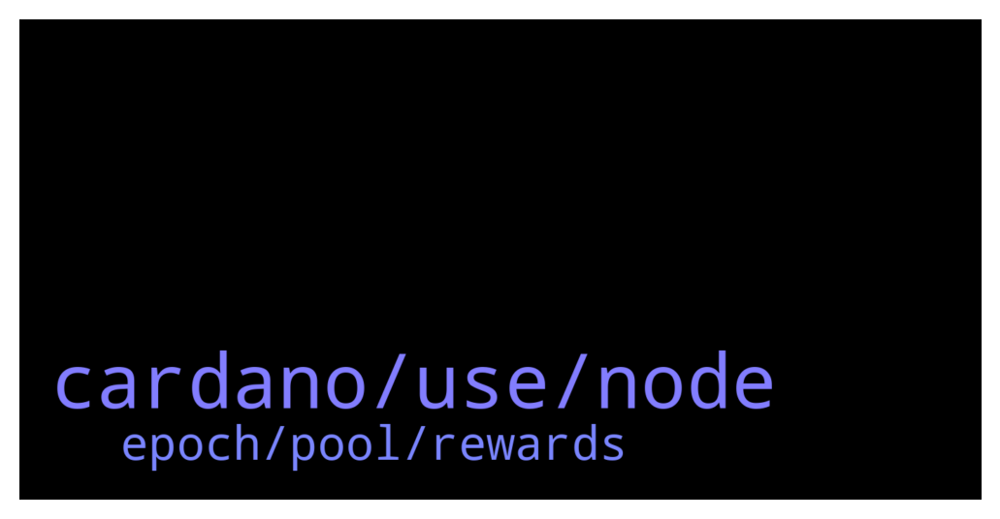

# **@Cardano**
 ## Analysis for **2021-12-17** - **2021-12-18**.

---

## 📊 **Basic Stats**

**n_messages_sent**: 124

---

---

## 🔝 **Top keywords and related messages**

1. **cardano, use, node**

    @iiLap --- *Why would it be? It is a full-node wallet, means it needs exactly the same spec/requirements as a full cardano-node needs. Even, behind the scene a full cardano-node is running.* **--->** [TG Discussion](https://t.me/Cardano/759920)

    @Bsdklund --- *Just think guys thats a not good indicator ... Only 10% wallet holding 94% of ada lol .. just think if they sell it then where we see the ada ? Just think ... Ada tweet that we hit 2 million wallets then why only 6 % ada Holding 90% wallet thats mean 1.8 million wallets just holding 6% lf ada mean 2 billon ada and other 31 billon token just only 10% mean 0.2 millon wallets .. wow .. thats very creepy and we think about this* **--->** [TG Discussion](https://t.me/Cardano/759766)

    @rightsof1791 --- *Gm all. Stumbled into a scam cardano group somehow and finally completed the verification here. Jeeez hahaha* **--->** [TG Discussion](https://t.me/Cardano/760115)

    @Z26z26 --- *Wtf!! That’s awful  I get *use other login method * on my iOS Yoroi wallet and can’t log in  It seems like a bug for the app and that’s a big issue for cardano community* **--->** [TG Discussion](https://t.me/Cardano/759963)

    @Lgbeano --- *He wrote about his experience at his week long silence retreat* **--->** [TG Discussion](https://t.me/Cardano/760138)

    @jaypatelEarthling --- *Vipasana ? I will read that blog later on I guess 😁* **--->** [TG Discussion](https://t.me/Cardano/760140)

2. **epoch, pool, rewards**

    @srinivas2121 --- *Small question need suggestions...if I stake Ada coins in a pool where staking more than 60Millions..Ada..what are the disadvantages...ex: pool A  staking 18millions 1 month returns 4.8% , pool B staking more than 60millions 1 month returns 5%....both pools having same parameters..no difference.  Which will give more Ada....if user stake thier Ada coins .. pool A or pool B..* **--->** [TG Discussion](https://t.me/Cardano/760074)

    @oOOEricOOo --- *if you delegate tokens before an epoch ends, rewards will be calculated starting from next one epoch right?* **--->** [TG Discussion](https://t.me/Cardano/759965)

    @Kardel The Sniper --- *What is catalyst voting registration? New here* **--->** [TG Discussion](https://t.me/Cardano/760035)

    @Headelf --- *Thank you? Different stake pools are good?  Need to register each?* **--->** [TG Discussion](https://t.me/Cardano/760211)

    @glitch04 --- *depends on the lottery selection and uptime at that point* **--->** [TG Discussion](https://t.me/Cardano/760075)

    @VMG --- *After the change of epoch the rewards are calculated. After the change of the next epoch the rewards for delegation are added to the rewards wallet of your wallet. It's not necessary to remove the rewards each time they are awarded, they are automatically delegated* **--->** [TG Discussion](https://t.me/Cardano/760007)

