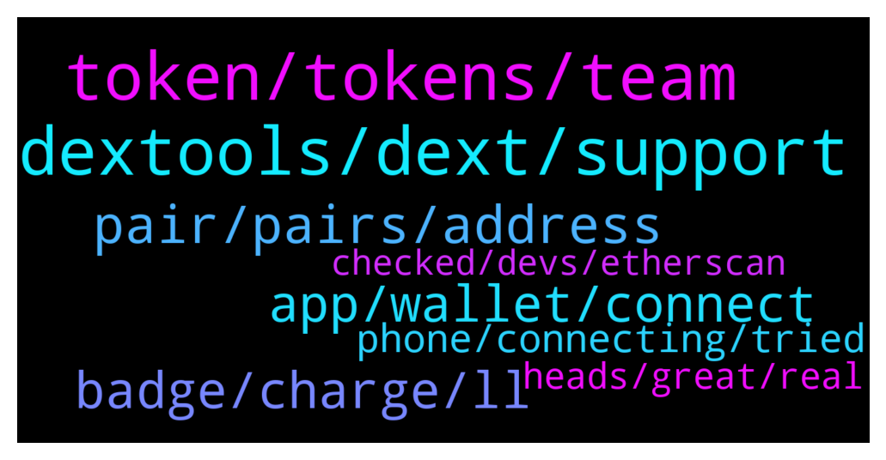

# **@DEXToolsCommunity**
 ## Analysis for **2021-12-16** - **2021-12-18**.

---

## 📊 **Basic Stats**

**n_messages_sent**: 219

---

---

## 🔝 **Top keywords and related messages**

1. **dextools, dext, support**

    @napascual --- *This is DEXT support. That should be asked on the private Dext Force chat* **--->** [TG Discussion](https://t.me/DEXToolsCommunity/313810)

    @stanes --- *If you are talking about bridging your DEXT, you can by using Anyswap: https://anyswap.exchange/#/bridge We don't have a bridge integrated on Dextools.* **--->** [TG Discussion](https://t.me/DEXToolsCommunity/313344)

    @nachivacrypto --- *Hi, can I ask where does dextools obtain token information from , eg. website, socials etc? Is it something that is submitted to dextools or just referenced from another source? Thanks.* **--->** [TG Discussion](https://t.me/DEXToolsCommunity/314080)

    @CoinDudeBro --- *one of my friends accidentally sent ether to the DEXT address trying to trade on dextools* **--->** [TG Discussion](https://t.me/DEXToolsCommunity/314396)

    @napascual --- *This is Dext support, feel free to ask on https://t.me/DEXTtraderslounge* **--->** [TG Discussion](https://t.me/DEXToolsCommunity/313617)

    @Nekker7 --- *hello, i made a trade on dextools, wbnb-qbit, but looks like the tokens are still on the way, is it always a huge delay before i get them?* **--->** [TG Discussion](https://t.me/DEXToolsCommunity/314555)

2. **token, tokens, team**

    @huseyincelikorg --- *please remove my token dexpage   " Team of this token has sold at least 2.032 BNB. Be aware of this token!" alert remove, please   https://www.dextools.io/app/bsc/pair-explorer/0x0fc72d759e875c619e7af9b20495c6894d194332  mytoken contract adress : bsc on 0xd35c64b94939ff214c1af79b6966f79a9c57e5c7* **--->** [TG Discussion](https://t.me/DEXToolsCommunity/313518)

    @nate102 --- *Maybe an automatic honeypot check after idk 5 minutes after trades on a token have happened would be a good idea for this? There’s no reason a coin should be honeypot or have high 99% tax if trades have occurred on the token already* **--->** [TG Discussion](https://t.me/DEXToolsCommunity/313914)

    @jimmyvee --- *I was a member, and then there was a mini-scandal where they changed some rules about the group, and they said we were allowed to sell our 100K DEXT and still retain our allocations.  So, I'm in the position of not being able to communicate with the team, yet I am due my tokens. Do you have an email address or other way I can contact Frederic?:  He does not respond to DM's on TG. Thanks.* **--->** [TG Discussion](https://t.me/DEXToolsCommunity/313813)

    @jimmyvee --- *@stanes - I don't see any other way to contact you so I'm reaching out here.  I participated in the April 2021 raise for $BUMP Bumper Finance. @frederic will not respond to DM's on TG.  I am due my tokens from that deal.  Can you please let me know when we'll receive the tokens, and/or who I should contact regarding this matter.  Thanks.* **--->** [TG Discussion](https://t.me/DEXToolsCommunity/313816)

    @JswapFinanceShona --- *Hello sir, what funds do I need to submit to show the token information on the platform page* **--->** [TG Discussion](https://t.me/DEXToolsCommunity/313499)

    @CryptoSadt --- *Hi we also do not see our new token listed... may I have info about?* **--->** [TG Discussion](https://t.me/DEXToolsCommunity/313480)

3. **pair, pairs, address**

    @VitalFox87 --- *https://www.dextools.io/app/bsc/pair-explorer/0x86213ec713bc32dccac12413a49aaf1419faaf4f   could you please check why this pair isn't working?* **--->** [TG Discussion](https://t.me/DEXToolsCommunity/314346)

    @sertezx --- *Ftm pairs not shows real price* **--->** [TG Discussion](https://t.me/DEXToolsCommunity/313614)

    @stanes --- *DEXT PANCAKESWAP PAIR Chart and trade: https://www.dextools.io/app/pancakeswap/pair-explorer/0x4b729d5d871057f3a9c424792729217cde72410d Contract: 0xe91a8d2c584ca93c7405f15c22cdfe53c29896e3* **--->** [TG Discussion](https://t.me/DEXToolsCommunity/313626)

    @MegaTed --- *Is there a pair problem again?* **--->** [TG Discussion](https://t.me/DEXToolsCommunity/313330)

    @pro_at_all --- *Not showing trades on time or bug is there* **--->** [TG Discussion](https://t.me/DEXToolsCommunity/314335)

    @x93139313 --- *hello is there an API to check prices of pairs?* **--->** [TG Discussion](https://t.me/DEXToolsCommunity/314446)

4. **app, wallet, connect**

    @napascual --- *Mobile websockets are not the most stable connections on Trust wallet. They still need to improve a lot (even for Metamask). One trick is to wait on your trust wallet connect screen (instead of going back to the app) and wait until the app sends the Verification (sign) request to your app. For some reason, if you go back to the app the websocket sometimes stops sending data.* **--->** [TG Discussion](https://t.me/DEXToolsCommunity/314306)

    @JoeyDieleman --- *You can but within the TrustWallet app on you mobile, so if you have the app on mobile in the Dapp browser of the app itself.* **--->** [TG Discussion](https://t.me/DEXToolsCommunity/314301)

    @bastardganpunk --- *i dont think you can connect trustwallet on phone* **--->** [TG Discussion](https://t.me/DEXToolsCommunity/314288)

    @DonatoGzman --- *my holding tokens are on trustwallet* **--->** [TG Discussion](https://t.me/DEXToolsCommunity/314286)

    @ty_flush --- *Have tried that option as well. Funny I am the owner of the group :|* **--->** [TG Discussion](https://t.me/DEXToolsCommunity/313784)

    @PG100272 --- *Not showing my token balance on connecting wallet* **--->** [TG Discussion](https://t.me/DEXToolsCommunity/314601)

5. **badge, charge, ll**

    @napascual --- *That's not Frederic tag btw, it's @FredericDEXT. But he has tons of Dms so don't wait for him to respond immediately* **--->** [TG Discussion](https://t.me/DEXToolsCommunity/313819)

    @stanes --- *I hope he can see your badge 😅* **--->** [TG Discussion](https://t.me/DEXToolsCommunity/314270)

    @DonatoGzman --- *No badge just an angry bear* **--->** [TG Discussion](https://t.me/DEXToolsCommunity/314263)

    @bastardganpunk --- *😬 which address did he sent it to? I don’t know if there’s a possibility to send it back, but can try to request it* **--->** [TG Discussion](https://t.me/DEXToolsCommunity/314400)

    @hmk18990 --- *he's a little bit busy and also you need to take time-zones into account but he'll respond soon* **--->** [TG Discussion](https://t.me/DEXToolsCommunity/314383)

    @hmk18990 --- *For the news, advertisements, sponsorships please DM @guillermorodriguez78 he's the only in charge (and he'll never DM you first)* **--->** [TG Discussion](https://t.me/DEXToolsCommunity/314381)

6. **phone, connecting, tried**

    @DonatoGzman --- *so my phone doees not receive the notification to sing the trasnsaction* **--->** [TG Discussion](https://t.me/DEXToolsCommunity/314277)

    @DonatoGzman --- *any way i try connecting to the system and it does not allow me anymore* **--->** [TG Discussion](https://t.me/DEXToolsCommunity/314274)

    @stanes --- *Strange... Can you remove it and try again?* **--->** [TG Discussion](https://t.me/DEXToolsCommunity/313783)

    @VitalFox87 --- *And now it's not showing any data again* **--->** [TG Discussion](https://t.me/DEXToolsCommunity/314391)

    @DonatoGzman --- *yup not working  re powered up the phone* **--->** [TG Discussion](https://t.me/DEXToolsCommunity/314297)

    @bastardganpunk --- *i’m not sure why its suddenly lagging. if after a restart it still persists, you may talk to a dev.* **--->** [TG Discussion](https://t.me/DEXToolsCommunity/314292)

7. **heads, great, real**

    @ty_flush --- *I'll be here should you find anything ;)* **--->** [TG Discussion](https://t.me/DEXToolsCommunity/313794)

    @Simon --- *Thank you for this by the way, noticed it earlier today.  Great stuff* **--->** [TG Discussion](https://t.me/DEXToolsCommunity/313905)

    @CryptoSadt --- *ohh, yes. Sorry. Thank you for your help.* **--->** [TG Discussion](https://t.me/DEXToolsCommunity/313528)

    @stanes --- *There is nothing more to add.* **--->** [TG Discussion](https://t.me/DEXToolsCommunity/313527)

    @CryptoSadt --- *Great, really appreciate your help guys* **--->** [TG Discussion](https://t.me/DEXToolsCommunity/313515)

    @JswapFinanceShona --- *yes sir thank you for the heads up.* **--->** [TG Discussion](https://t.me/DEXToolsCommunity/313505)

