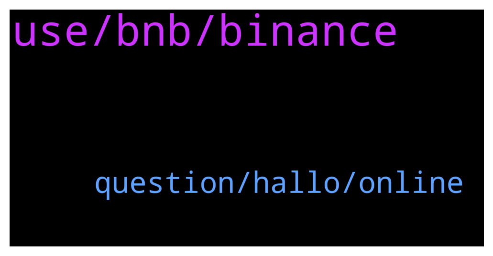

# **@Fantom_English**
 ## Analysis for **2021-12-17** - **2021-12-18**.

---

## 📊 **Basic Stats**

**n_messages_sent**: 139

---

---

## 🔝 **Top keywords and related messages**

1. **use, bnb, binance**

    @TaschaWolf --- *They don't have technical issues. Kucoin is having the same problem all the time too. Problem is lying with the team. When are they going to solve liquidity for mainnet tokens? It's been months and still the same thing. It's really tedious for someone wanting to buy ftm from cex to use in dapps etc.* **--->** [TG Discussion](https://t.me/Fantom_English/612857)

    @Janevietani --- *Helpful tip:   if you want a cheaper alternative than bridging ftm and paying eth gas From binance,crypto.com or kucoin, get BNB and withdraw as BNB BEP20, then use https://spookyswap.finance/bridge To bridge BNB BEP20 to BNB Fantom Then use spookyswap to swap BNB Fantom to FTM  You will need ftm gas for transaction. Use the faucet https://www.mentasuave01-tools.com/* **--->** [TG Discussion](https://t.me/Fantom_English/612630)

    @first_irfan --- *If ftm has their own binance cloud. Is it will fix this suspend thing?* **--->** [TG Discussion](https://t.me/Fantom_English/612473)

    @Samir --- *Thanks, how to sell for fiat? Is that also possible?* **--->** [TG Discussion](https://t.me/Fantom_English/612659)

    @Monti1991 --- *Hello guys, how are you ? Is withdrawing ftm from binance to fantom network metamask suspended ?  And what can I do to withdraw it from binance exchange 😁* **--->** [TG Discussion](https://t.me/Fantom_English/612626)

    @Janevietani --- *but Binance are working to solve this issues* **--->** [TG Discussion](https://t.me/Fantom_English/612478)

2. **question, hallo, online**

    @P --- *Hey guys  Is there any devs online please?* **--->** [TG Discussion](https://t.me/Fantom_English/612587)

    @Boriehunk --- *Hallo can any one help me swap* **--->** [TG Discussion](https://t.me/Fantom_English/613112)

    @vesqm --- *well maybe it helps to ask the question here, if it's a good question it will get noticed.* **--->** [TG Discussion](https://t.me/Fantom_English/612590)

    @Okasian --- *good to see you alive, i came to check if you were alive or not. thats good.* **--->** [TG Discussion](https://t.me/Fantom_English/612976)

    @Oogiinnn --- *whats the risk of staking on tomb* **--->** [TG Discussion](https://t.me/Fantom_English/612530)

    @koun_44 --- *Hello everybody Is anyone staking on tomb ?* **--->** [TG Discussion](https://t.me/Fantom_English/612502)

