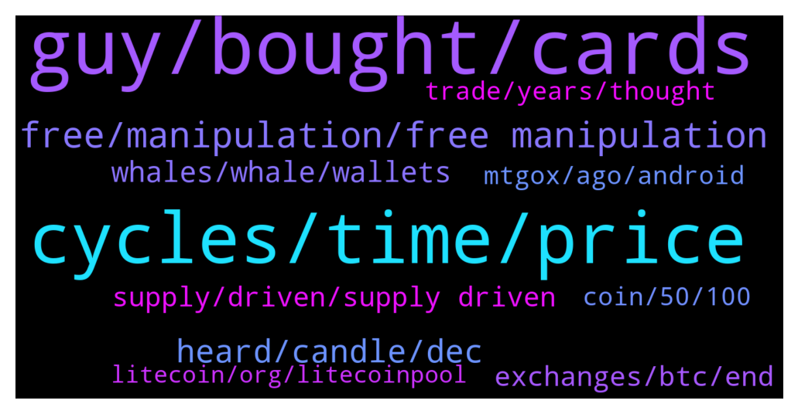

# **@Litecoin**
 ## Analysis for **2021-12-17** - **2021-12-18**.

---

## 📊 **Basic Stats**

**n_messages_sent**: 357

---

---

## 🔝 **Top keywords and related messages**

1. **guy, bought, cards**

    @AlessandroOrlando31 --- *I'm Davide the guy you and Felipe banned two years ago with no reason😭* **--->** [TG Discussion](https://t.me/Litecoin/2031993)

    @Augusto --- *I dont understand what this guy means* **--->** [TG Discussion](https://t.me/Litecoin/2031197)

    @CryptoSmecta --- *i think i bought him steam cards again this year xd* **--->** [TG Discussion](https://t.me/Litecoin/2031470)

    @Augusto --- *I dont think he is talking about usdt* **--->** [TG Discussion](https://t.me/Litecoin/2031201)

    @casualness121 --- *I bought from you a Schifano* **--->** [TG Discussion](https://t.me/Litecoin/2032188)

    @TonyNakamoto --- *well he do'dn't sell'dl'd all at top tbf* **--->** [TG Discussion](https://t.me/Litecoin/2031540)

2. **cycles, time, price**

    @ck42069 --- *And in march we get rate increase lower tapering* **--->** [TG Discussion](https://t.me/Litecoin/2031253)

    @jrx486 --- *A person who can do such things would rather sell otc for a few percentages taken at 64k.* **--->** [TG Discussion](https://t.me/Litecoin/2032016)

    @jericho2411 --- *i alo sold 10% at somepoint* **--->** [TG Discussion](https://t.me/Litecoin/2031826)

    @BillyRoc --- *It's accumulation time for longs and scared time for noobies getting wrecked by the same daily fud by some here.   I'm picking my prices in staggered bids. I'm happy whichever way it goes. :)  All I need is an insult or a crying frog to go along with the market-wide dip to motivate me into doubling my bids. :)   Omnilite, Flare, Mweb, and more are coming to LTC:)* **--->** [TG Discussion](https://t.me/Litecoin/2031342)

    @TonyNakamoto --- *despite the 94% drop after Cycle 1* **--->** [TG Discussion](https://t.me/Litecoin/2031796)

    @TonyNakamoto --- *and then u have 2 combine Cycles 1 and 2 to say they're all 4-yr cycles* **--->** [TG Discussion](https://t.me/Litecoin/2031795)

3. **free, manipulation, free manipulation**

    @ck42069 --- *If a single person or a group of people can be this influential on the price and bring the price wherever they want then what is the point in participating in this market* **--->** [TG Discussion](https://t.me/Litecoin/2032017)

    @RabbitL0v3r --- *The market is indeed manipulated by a few people* **--->** [TG Discussion](https://t.me/Litecoin/2031961)

    @RabbitL0v3r --- *Thinking the free market as free of manipulation is kinda meh ser* **--->** [TG Discussion](https://t.me/Litecoin/2031974)

    @finitemaz --- *I never said that, I only said the claim that a handful of people control the entire market is dumb.  I also believed that at a time too* **--->** [TG Discussion](https://t.me/Litecoin/2031980)

    @RabbitL0v3r --- *And you need some shib to push people into defi, bored ape to push people into nft Always need some people that make it to create fomo* **--->** [TG Discussion](https://t.me/Litecoin/2032043)

    @RabbitL0v3r --- *Or they can group together and manipulate the market at their advantage* **--->** [TG Discussion](https://t.me/Litecoin/2032053)

4. **heard, candle, dec**

    @ck42069 --- *A massive upper candle wick from 400 alll the way to 140* **--->** [TG Discussion](https://t.me/Litecoin/2031717)

    @ck42069 --- *Now we are in december and they are calling for january february march* **--->** [TG Discussion](https://t.me/Litecoin/2031787)

    @ck42069 --- *Thr move should have happened in 2021* **--->** [TG Discussion](https://t.me/Litecoin/2031741)

    @ck42069 --- *This will happen in Q1 of 2022 bro enjoy your rally that wont happen* **--->** [TG Discussion](https://t.me/Litecoin/2031751)

    @AlessandroOrlando31 --- *Those Kids have a great future* **--->** [TG Discussion](https://t.me/Litecoin/2032148)

    @TonyNakamoto --- *i've heard "nxt year" but haven't heard which quarter* **--->** [TG Discussion](https://t.me/Litecoin/2031837)

5. **whales, whale, wallets**

    @finitemaz --- *Is your claim that the top whales control more of the market as time goes by?* **--->** [TG Discussion](https://t.me/Litecoin/2031925)

    @RabbitL0v3r --- *Whales can work together and with the exchange too* **--->** [TG Discussion](https://t.me/Litecoin/2031966)

    @CoinLoin --- *Is under 10 ltc considered a whale? Asking for a friend…* **--->** [TG Discussion](https://t.me/Litecoin/2031952)

    @finitemaz --- *I’d argue this is not class warfare. There’s no opposing groups socially or economically. The incentive structure is aligned that whales scalp degenerate traders but are on the same side as the shrimp who believe in bitcoin* **--->** [TG Discussion](https://t.me/Litecoin/2032075)

    @RabbitL0v3r --- *A whale can split on multitude wallet making onchain data bullish regarding smoll fish accumulation and stuff, but shrimps cannot accumulate tons of btc in a single wallet* **--->** [TG Discussion](https://t.me/Litecoin/2031947)

    @TonyNakamoto --- *Whales r distributing their coims over time according to the onchain analysts* **--->** [TG Discussion](https://t.me/Litecoin/2032190)

6. **supply, driven, supply driven**

    @TonyNakamoto --- *r don't get how price can B estimated by supply alone* **--->** [TG Discussion](https://t.me/Litecoin/2031769)

    @ck42069 --- *A true supply driven market moves independent of the open interest rates* **--->** [TG Discussion](https://t.me/Litecoin/2032037)

    @ck42069 --- *Its not just the supply but the increase of demand over time* **--->** [TG Discussion](https://t.me/Litecoin/2031771)

    @ck42069 --- *Look mate of this is truly a cyclical supply based market it should not give a fuck about the Open Interest.* **--->** [TG Discussion](https://t.me/Litecoin/2031765)

    @ck42069 --- *If thats a supply driven market why is the price bot going up* **--->** [TG Discussion](https://t.me/Litecoin/2031721)

    @ck42069 --- *This aint a supply driven market* **--->** [TG Discussion](https://t.me/Litecoin/2031720)

7. **exchanges, btc, end**

    @finitemaz --- *if one person dumped the entire btc price from $64k to $30k, and wanted to buy back immediately, the order book would be wiped and they'd be paying much more than $64k at the end of their order.  This is pointless to discuss in such a simple way.  If their goal is to extract value from panic sellers at the bottom so they end up with a net positive, then they will do that until it's not profitable.  The market works that way which is why most of you should not be trading.* **--->** [TG Discussion](https://t.me/Litecoin/2032013)

    @ck42069 --- *And how about those that claim “BTC has decoupled from the major indexes and the stock market”* **--->** [TG Discussion](https://t.me/Litecoin/2031730)

    @finitemaz --- *if top exchanges were single persons, sure.* **--->** [TG Discussion](https://t.me/Litecoin/2031964)

    @finitemaz --- *what do you think it would be if every ltc trader on exchanges withdrew to their own wallets?* **--->** [TG Discussion](https://t.me/Litecoin/2031973)

    @finitemaz --- *do you agree there are a handful of exchanges that equate to something like 90% of the entire market trading volume?* **--->** [TG Discussion](https://t.me/Litecoin/2031950)

    @finitemaz --- *if you think they do that, do you continue to trade?  Do you claim the same manipulation when we pump 30% in a day? or is that organic* **--->** [TG Discussion](https://t.me/Litecoin/2032069)

8. **coin, 50, 100**

    @RabbitL0v3r --- *You can accumulate both If you sell 1 coin for 100$, its now 50, you can or buy 2 coin, or 1.5coin and have 25$ left* **--->** [TG Discussion](https://t.me/Litecoin/2032001)

    @finitemaz --- *sold 1 coin and dumped the order book by 50%, and assume you can buy multiple coins without pumping price back and beyond $100* **--->** [TG Discussion](https://t.me/Litecoin/2032005)

    @RabbitL0v3r --- *Of course, it creates fomo I would glad give away a lambo if i can cash out x10 afterward* **--->** [TG Discussion](https://t.me/Litecoin/2032073)

    @finitemaz --- *the goal of acquiring more usd on exchange?* **--->** [TG Discussion](https://t.me/Litecoin/2031999)

    @finitemaz --- *Less btc equivalent maybe. But no, not less whatever you call money* **--->** [TG Discussion](https://t.me/Litecoin/2032078)

    @RabbitL0v3r --- *Or buy your coin back at 50 and have 50 left or just go out with the 100* **--->** [TG Discussion](https://t.me/Litecoin/2032003)

9. **trade, years, thought**

    @finitemaz --- *Stop trading if you believe that. Seriously, I’ve lost more than I’m willing to admit dumping the bottom years ago* **--->** [TG Discussion](https://t.me/Litecoin/2032076)

    @BennyBennyBlanco --- *Mining won’t be worth it from 2-6 years from now* **--->** [TG Discussion](https://t.me/Litecoin/2031318)

    @RabbitL0v3r --- *Im such a bad trader and I lost my life saving ;3* **--->** [TG Discussion](https://t.me/Litecoin/2032114)

    @finitemaz --- *I only entertained your comments because I actually thought I remembered you from years ago.  But now I see that you are either a troll or your logic and strategy when it comes to trading is much much worse than I thought. Or both.* **--->** [TG Discussion](https://t.me/Litecoin/2032095)

    @RabbitL0v3r --- *If you think I have such """bad""" trades then you're wrong* **--->** [TG Discussion](https://t.me/Litecoin/2032091)

    @RabbitL0v3r --- *Sometime no trade is best trade* **--->** [TG Discussion](https://t.me/Litecoin/2031412)

10. **mtgox, ago, android**

    @BasharSikdar --- *Can start mining ltc using Android smartphone* **--->** [TG Discussion](https://t.me/Litecoin/2031559)

    @Bigbulz --- *Top 3.5k address of ltc hold approx 80% of current circulation supply. Such a decentralization we need* **--->** [TG Discussion](https://t.me/Litecoin/2031971)

    @ck42069 --- *Mtgox will release a percentage of the betc supply to its owners from 8 years ago* **--->** [TG Discussion](https://t.me/Litecoin/2031744)

    @AlessandroOrlando31 --- *I made the best prevision of ltc price btw,and people here can confirm that* **--->** [TG Discussion](https://t.me/Litecoin/2031998)

    @Bigbulz --- *Yeah i am mining 100 ltc per day using my android mobile* **--->** [TG Discussion](https://t.me/Litecoin/2031563)

    @shahabszd --- *I will add 70 more ltc if it goes to 130$* **--->** [TG Discussion](https://t.me/Litecoin/2031454)

