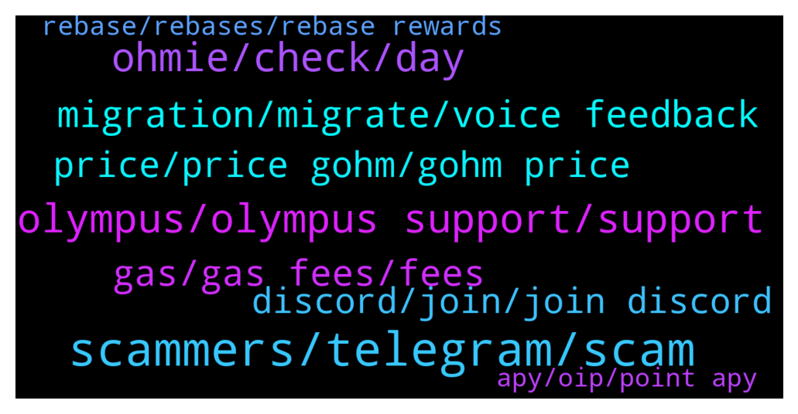

# **@OlympusTG**
 ## Analysis for **2021-12-17** - **2021-12-18**.

---

## 📊 **Basic Stats**

**n_messages_sent**: 1572

---

---

## 🔝 **Top keywords and related messages**

1. **scammers, telegram, scam**

    @Yo --- *No for sur I ve been hacked I watched on etherscan* **--->** [TG Discussion](https://t.me/OlympusTG/126064)

    @S --- *I also know the address of the hacker you can see the transactions* **--->** [TG Discussion](https://t.me/OlympusTG/127717)

    @gwyd1982 --- *wtf is this address doing with his OHM? https://etherscan.io/address/0xc69aba66e17be8c72442a4571351146fb145a985* **--->** [TG Discussion](https://t.me/OlympusTG/126665)

    @RefundSupport --- *don’t fall for dms please they will scam u* **--->** [TG Discussion](https://t.me/OlympusTG/127482)

    @Jimmy --- *im in 15 different telegram groups and it's always the same lol* **--->** [TG Discussion](https://t.me/OlympusTG/125845)

    @Rob --- *Chatbot scam: thought i was talking to Olympus help* **--->** [TG Discussion](https://t.me/OlympusTG/124982)

2. **olympus, olympus support, support**

    @syberk1d --- *I agree, things just don’t add up, I think Olympus have used an opportunity to reduce our reward yield percentage and covered it up by blaming it’s the migration* **--->** [TG Discussion](https://t.me/OlympusTG/124928)

    @Legendofthecrypt --- *Olympus has fallen….🤣🤣🤣  I swear people are running fast from this project. 🤣🤣🤣  ETH gas issues makes this project really unusable* **--->** [TG Discussion](https://t.me/OlympusTG/126561)

    @Poopoo (never dm first) --- *yes, rari fuse Olympus Pool Party* **--->** [TG Discussion](https://t.me/OlympusTG/125194)

    @david_np --- *What are the future plan for Olympus?* **--->** [TG Discussion](https://t.me/OlympusTG/127687)

    @noof_zx --- *Does the olympus dao has liquidity pools ?* **--->** [TG Discussion](https://t.me/OlympusTG/124905)

    @Orion_Percival --- *hey, can i buy olympus on any Cex?* **--->** [TG Discussion](https://t.me/OlympusTG/127484)

3. **ohmie, check, day**

    @bike4peace --- *just because I hang out with you and you want me to make babies so our kids can play together and transfer gOHM* **--->** [TG Discussion](https://t.me/OlympusTG/125394)

    @cdp279 --- *Ok ser we get it thank you* **--->** [TG Discussion](https://t.me/OlympusTG/125054)

    @ocelotquick --- *You’re really intelligent, where did you go to school?* **--->** [TG Discussion](https://t.me/OlympusTG/124933)

    @pacificnorriswest --- *@bike4peace how are you so cool and fresh bro?* **--->** [TG Discussion](https://t.me/OlympusTG/125063)

    @Yuska_kha --- *https://youtu.be/eGIw6vwhPFw   This guy explains it all, watch it veryy helpful* **--->** [TG Discussion](https://t.me/OlympusTG/125522)

    @G --- *Oh really you know what day is best bro & time* **--->** [TG Discussion](https://t.me/OlympusTG/125661)

4. **migration, migrate, voice feedback**

    @Andr3w_1 --- *The migration is causing some glitches I think. A lot going on in the background that is causing some confusion all around* **--->** [TG Discussion](https://t.me/OlympusTG/126628)

    @Liam --- *kk, so sounds like I will need to migrate eventually anyway* **--->** [TG Discussion](https://t.me/OlympusTG/126395)

    @DD0820 --- *yea this migration doesn’t seem smooth* **--->** [TG Discussion](https://t.me/OlympusTG/127195)

    @theMagicUnicorn --- *i personally dont really understand the confusion, it takes time to migrate, they are doing a drastic overhaul, and going as fast as they can, also the v2 migration is basically all set, you can migrate now.* **--->** [TG Discussion](https://t.me/OlympusTG/125351)

    @Ap0l1o --- *You are, you are just not seeing them during the migration* **--->** [TG Discussion](https://t.me/OlympusTG/126258)

    @Poopoo (never dm first) --- *migration only when improvement is needed, no one can tell you the answer, the external environment is always changing and new tech coming up, the protocol needs to respond to changes* **--->** [TG Discussion](https://t.me/OlympusTG/127588)

5. **gas, gas fees, fees**

    @Poopoo (never dm first) --- *use https://etherscan.io/gastracker to check gas, do the migration when gas is low, someone has done it below $30* **--->** [TG Discussion](https://t.me/OlympusTG/125660)

    @Ninja --- *The apy is not the problem..the problem it is on eth chain...nobody wants to pay 300$ in gas* **--->** [TG Discussion](https://t.me/OlympusTG/126541)

    @BROHMZ --- *Yeah but u can wait for when gas fees are lower there is no pressure to do it asap* **--->** [TG Discussion](https://t.me/OlympusTG/126397)

    @Poopoo (never dm first) --- *gas issue, check your transaction gas and compare to live gas* **--->** [TG Discussion](https://t.me/OlympusTG/125962)

    @timon_k --- *Gas fees are low also now haha.* **--->** [TG Discussion](https://t.me/OlympusTG/125967)

    @deadhead5116 --- *Idk this project is different people have massive bags in this that make gas fees negligible* **--->** [TG Discussion](https://t.me/OlympusTG/126498)

6. **price, price gohm, gohm price**

    @lookmovie --- *yesterday as a test i bought: 0.402613 gOHM  7430 USD  at that time.  1 gOHM value at the time = $18,957.02  currently, my gOHM value is - 7126 USD  (304$ less since i bought) and current 1 gOHM price - 18,444.29 (500$ less since i bought)   1 gOHM price dropped at 2.7% but my gOHM value dropped at - 4.1%  1. how is this possible? 2. how can i see amount of rewards that were made since yesterday when i bought it?* **--->** [TG Discussion](https://t.me/OlympusTG/125480)

    @Michael --- *Yep, given the massive fall of value that is $40 too much. I don't want to wrap gOHM anyway - just want to keep sOHM as is (or have sOHM v2 whatever the state of affairs is)* **--->** [TG Discussion](https://t.me/OlympusTG/125972)

    @MrMann89 --- *If price of Gohm matches price of ohm then at the minute if you want to utilise your money your best to unwrap it back to Sohm to benefit more as it’s better in price and vice versa if ohm was at a better price* **--->** [TG Discussion](https://t.me/OlympusTG/127060)

    @darkmatta --- *Or wait… how tf is gOHM price calculated lol I’m clueless but I wanna buy some* **--->** [TG Discussion](https://t.me/OlympusTG/125420)

    @bvybitcoin --- *you dont, the index makes sure youre value goes up if the price of ohm stays the same or goed up too* **--->** [TG Discussion](https://t.me/OlympusTG/127462)

    @MrMann89 --- *So once complete it will be the same price as Sohm* **--->** [TG Discussion](https://t.me/OlympusTG/125548)

7. **discord, join, join discord**

    @Poopoo (never dm first) --- *weird, pretty sure it went up for me, should be the same for everyone, maybe join the Discord and ask there* **--->** [TG Discussion](https://t.me/OlympusTG/126467)

    @FinnyBoi --- *Why OHM discord is so empty?* **--->** [TG Discussion](https://t.me/OlympusTG/125604)

    @James --- *Anyone having trouble joining the discord channel?  When I try adding it, I see the invite but it just refreshes the app and doesn't have me join.   I'm using this invite link: https://discord.gg/olympusdao* **--->** [TG Discussion](https://t.me/OlympusTG/125156)

    @XB_888 --- *Do a check on youtube, there are some comprehensive videos on how to get Matic, send to polygon network and swap for Klima....best to join their Discord to get more info.* **--->** [TG Discussion](https://t.me/OlympusTG/125538)

    @Poopoo (never dm first) --- *Join the Discord guys if you haven't* **--->** [TG Discussion](https://t.me/OlympusTG/125951)

    @Poopoo (never dm first) --- *Join the Discord if any of you haven't* **--->** [TG Discussion](https://t.me/OlympusTG/126887)

8. **rebase, rebases, rebase rewards**

    @GSG_AP --- *Question regarding rebase, is every rebasing happening every 8 hrs without delay?  If so, the rebase moments should always be at the same times of the day but it seems it changes everyday* **--->** [TG Discussion](https://t.me/OlympusTG/125190)

    @Goal --- *I know, I mean an 8 hour period just finished. I am still waiting for the rebase rewards.  Yeah I am already on sohm v2* **--->** [TG Discussion](https://t.me/OlympusTG/126177)

    @bangjingjing --- *Hello, Is v1 still get rebase reward ?* **--->** [TG Discussion](https://t.me/OlympusTG/125107)

    @Talal107 --- *Hi guys,  Is it normal to miss rebase rewards? I had 11.12 sohm on Dec 14 and today I have just 11.19 sohm. Will I be compensated for the missing rewards?* **--->** [TG Discussion](https://t.me/OlympusTG/126610)

    @Ap0l1o --- *there is rebase, only it may not be shown yet* **--->** [TG Discussion](https://t.me/OlympusTG/126109)

    @Goal --- *Hi guys, how long does it take for the rebase rewards to show up ?* **--->** [TG Discussion](https://t.me/OlympusTG/126175)

