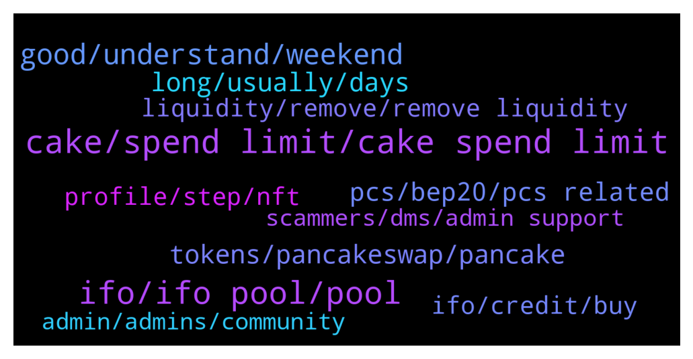

# **@PancakeSwap**
 ## Analysis for **2021-12-17** - **2021-12-18**.

---

## 📊 **Basic Stats**

**n_messages_sent**: 1127

---

---

## 🔝 **Top keywords and related messages**

1. **cake, spend limit, cake spend limit**

    @CryptoKel --- *I'm trying to stake. I already have cake* **--->** [TG Discussion](https://t.me/PancakeSwap/2197694)

    @Ceddi200 --- *You use the cake you staked* **--->** [TG Discussion](https://t.me/PancakeSwap/2200743)

    @jpcaid --- *When do you think cake will moon ?* **--->** [TG Discussion](https://t.me/PancakeSwap/2200856)

    @Ben --- *You need to commit your cake when it goes live.  Make sure you enable those in advance too.  Anything else, I'm still trying to get answers on* **--->** [TG Discussion](https://t.me/PancakeSwap/2196377)

    @nnothing2 --- *try auto cake. it's the best 👍👍* **--->** [TG Discussion](https://t.me/PancakeSwap/2195941)

    @Martin --- *My cakes are gone. Can any support help this?* **--->** [TG Discussion](https://t.me/PancakeSwap/2202703)

2. **ifo, ifo pool, pool**

    @H3y_Rio --- *I stack 10 cake in cake ifo pool So mine average pool balance is 1.67cake till now...  If new ifo come how is gonna deducted from my cake balance* **--->** [TG Discussion](https://t.me/PancakeSwap/2202091)

    @raghuramv --- *For IFO .. if we unstake cake now.. max cake entry for staking in IFO will remain same or we will lose it.* **--->** [TG Discussion](https://t.me/PancakeSwap/2196362)

    @Aliraza9692 --- *You can unstake them from ifo stake pool at ifo time,admin correct me if I am wrong* **--->** [TG Discussion](https://t.me/PancakeSwap/2195304)

    @Bhabesh98 --- *U can unstake from the ifo pool after sale start.. As u have 30mins time to contribute.. You can unstake and use the same cake in ifo and stake back again unused cake for next ifo* **--->** [TG Discussion](https://t.me/PancakeSwap/2196461)

    @HAITIENLK --- *21/12, if your ifo balance is 1.67 cake, you can withdraw cake from pool IFO and submit 1.67 to join IFO sale.* **--->** [TG Discussion](https://t.me/PancakeSwap/2202093)

    @ahedron --- *Why are two auto pools needed now, especially since the conditions in the ifo pool are more favorable: instead of three days later, you can withdraw cake without a penalty just one?* **--->** [TG Discussion](https://t.me/PancakeSwap/2195254)

3. **good, understand, weekend**

    @Carolxiee88788 --- *What I can do now ？？pls help* **--->** [TG Discussion](https://t.me/PancakeSwap/2201611)

    @Milad --- *Ok noob me but how is nobody was telling me before? Lol 🤣* **--->** [TG Discussion](https://t.me/PancakeSwap/2195399)

    @Sercio --- *Ok thank you very much my friend* **--->** [TG Discussion](https://t.me/PancakeSwap/2201779)

    @CakeCompounder --- *Hello @SalmanSRion   Please try now 👍🏽* **--->** [TG Discussion](https://t.me/PancakeSwap/2196981)

    @ctellyc --- *😭😭😭 bcause sad, sad can cry?🤔* **--->** [TG Discussion](https://t.me/PancakeSwap/2201495)

    @eddy51342001 --- *Sorry Catu, long day at work.. thanks 🙏🏻* **--->** [TG Discussion](https://t.me/PancakeSwap/2195169)

4. **long, usually, days**

    @Greg --- *Still pending any idea what is wrong* **--->** [TG Discussion](https://t.me/PancakeSwap/2198883)

    @Greg --- *I cleaned up and started again but still pending. What is the average waiting time* **--->** [TG Discussion](https://t.me/PancakeSwap/2198713)

    @Crypto_Kip --- *Probably just wait a bit usually just a timing thing on pcs* **--->** [TG Discussion](https://t.me/PancakeSwap/2195627)

    @BigHenry31 --- *So there is nothing that can be done? We just keep hitting confirm and watch nothing happen? We have tried everything we can think of but are out of ideas* **--->** [TG Discussion](https://t.me/PancakeSwap/2195534)

    @JFNSRT --- *how long can it take? I waited several minutes* **--->** [TG Discussion](https://t.me/PancakeSwap/2196218)

    @LazyDizard --- *The mods can reset it, if its paused* **--->** [TG Discussion](https://t.me/PancakeSwap/2199690)

5. **tokens, pancakeswap, pancake**

    @Milad --- *Does pancakeswap have bug? Why cant i trade my tokens? It simply doesn't find it and i cant add it* **--->** [TG Discussion](https://t.me/PancakeSwap/2195242)

    @Joshua --- *Im trying to figure out how to make my token tradeable and add liquidity to it but when I input the address nothing comes up. it is built on the solana block chain* **--->** [TG Discussion](https://t.me/PancakeSwap/2195544)

    @Milad --- *Is there really no one that can solve this issue? Why am i not able to swap my tokens on pancakeswap? And why it cant find my tokens??* **--->** [TG Discussion](https://t.me/PancakeSwap/2195311)

    @ArcDev --- *I know that, how to add staking feature to our token pair ? Is there form or something to do to enable it ?* **--->** [TG Discussion](https://t.me/PancakeSwap/2202056)

    @sejutex --- *Hi please can anyone help me? I have clean ocean in my Trust Wallet. However when I try to sale the Clean Token in Pancakeswap after adding the contract it will show my coins as zero. Does anyone know why this???* **--->** [TG Discussion](https://t.me/PancakeSwap/2201651)

    @jacksonkou --- *it was stuck when i try to set my user name on pancake swap, any reason?* **--->** [TG Discussion](https://t.me/PancakeSwap/2202836)

6. **pcs, bep20, pcs related**

    @TomorrowlandForLife --- *I'm sorry but is not like that.  If there would be a problem with PCS, eveyone would have problems to remove liquidity and you're the only one with that problem* **--->** [TG Discussion](https://t.me/PancakeSwap/2195467)

    @TomorrowlandForLife --- *I'm sorry but there is nothing PCS can do about this because the issue comes from the contract even though you say is not* **--->** [TG Discussion](https://t.me/PancakeSwap/2195479)

    @thewinnerdogedev --- *Mate i tested the contract but its not allowing its pcs issue i also seen many cases in this group too* **--->** [TG Discussion](https://t.me/PancakeSwap/2202441)

    @Ben --- *Fair is the best, good job PCS!  I've seen way too many other sales that are just a disaster* **--->** [TG Discussion](https://t.me/PancakeSwap/2202040)

    @TomorrowlandForLife --- *Then you should know this is not related to PCS but with the contract you inetracted with sir The txn is ok and success. If the problem is the price you paid is probably the slippage you've used* **--->** [TG Discussion](https://t.me/PancakeSwap/2195196)

    @TomorrowlandForLife --- *Your tokens should be BEP20 in order to operate on PCS* **--->** [TG Discussion](https://t.me/PancakeSwap/2195245)

7. **profile, step, nft**

    @V --- *Need help. I geht this Message when completing Profile I wont answer Any scammmer DM me thx 😄* **--->** [TG Discussion](https://t.me/PancakeSwap/2201781)

    @fitzkie --- *Help Please. Troubleshoot has nothing.  I am trying to set up a profile.  First step worked, got the Collectible.  STEP 2 does NOT work.  Step 2 is Set Profile Picture.  Says to choose collectible, so I choose the NFT I bought and paid for.  and then the enable button becomes clickable? (turns blue/green)   I then click enable and nothing happens.  How to complete step 2?* **--->** [TG Discussion](https://t.me/PancakeSwap/2199557)

    @CasquinhaCripto --- *SUUUP guys, good morning! i am trying to set up my profile? but is not connecting with my MetaMask anyone has the same issue and can help??* **--->** [TG Discussion](https://t.me/PancakeSwap/2198041)

    @fitzkie --- *Hai or Ceddi or Luuku..     I am still trying to set up a profile.  First step worked, got the NFT Collectible.  STEP 2 does NOT work.  Step 2 is Set Profile Picture.  Says to choose collectible, so I choose the NFT that I purchased.  the NFT loads, so not the issues.  The NFT Highlights and the enable button looks like it becomes clickable? (turns blue/green)   I then click enable and the button changes color, but nothing happens.  How to complete step 2?  I Have done this on a PC / Windows / Chrome Metamask. I used other browsers. I cleared the cacje.  I have done this with the Trust Wallet on IOS, got same issue, so then I deleted the Trust Wallet and installed SafePal on IOS, does the same thing. All get stuck at the same spot.   The only issue I can image is the fact that  I bought another non Profile NFT.   NO DM's please, i mean get a real job* **--->** [TG Discussion](https://t.me/PancakeSwap/2203151)

    @denysbe --- *kept trying, chose a different name and nothing changed* **--->** [TG Discussion](https://t.me/PancakeSwap/2201514)

    @majesticman123 --- *cant seem to get passed setting the name for my profile!! slightly annoying* **--->** [TG Discussion](https://t.me/PancakeSwap/2195152)

8. **liquidity, remove, remove liquidity**

    @Nirsick --- *Hello, I want to remove liquidity from my own coin to get my bnbs back, but when I press on remove and then confirm nothing happens. How can I do it?* **--->** [TG Discussion](https://t.me/PancakeSwap/2195658)

    @Tobal --- *Hi, I added liquidity to a pool for revenue coin yesterday and now I can’t find it, and when I search for it it says that I don’t have a liquidity or pool active, help!* **--->** [TG Discussion](https://t.me/PancakeSwap/2199310)

    @water_spirit --- *Hi, I need some help.  I've tried to withdraw some APENFT and BETA from farms, but still didn't receive them to my trust wallet.  What can I do?* **--->** [TG Discussion](https://t.me/PancakeSwap/2196183)

    @radio82 --- *trying to remove liquidity, but "confirm" button not work at all* **--->** [TG Discussion](https://t.me/PancakeSwap/2198017)

    @CryptoJack2018 --- *-------------------------------------- |Unstake your LP tokens| --------------------------------------  Then do this to get your tokens from liquidity pool.  > Menu  > trade  > liquidity  > choose the liquidity > remove > max  > approve > confirm  If your liquidity not seen > import it  > choose TOKEN 1 and TOKEN 2 > BACK button  > click on liquidity shown  > remove > max  > approve > confirm* **--->** [TG Discussion](https://t.me/PancakeSwap/2195672)

    @Shiraz --- *The question is if I am the first liquidity provider in pancake that means tha token is new on pancake because I created the token so the question is if this happen than how can I calculate the price of token on pancake the price is mentioned 1 bnb = _token but what's the formula behind it* **--->** [TG Discussion](https://t.me/PancakeSwap/2195502)

9. **ifo, credit, buy**

    @HAITIENLK --- *you stake , you have ticket, other don't stake, they don't have ifo ticket/credit to join IFO* **--->** [TG Discussion](https://t.me/PancakeSwap/2197693)

    @HAITIENLK --- *you get ifo ticket/credit to join when IFO is lived on 21/12.* **--->** [TG Discussion](https://t.me/PancakeSwap/2197382)

    @Aliraza9692 --- *Hello how I can participate in ifo* **--->** [TG Discussion](https://t.me/PancakeSwap/2195301)

    @QV_zz --- *If you have no ifo credits, no participation* **--->** [TG Discussion](https://t.me/PancakeSwap/2202148)

    @ch9211 --- *The IFO credits that you get from Cake pool to buy new projects launches, are these tokens that you buy from IFO allocations always vested for a certain period of time, or you can sell them whenever you want?.* **--->** [TG Discussion](https://t.me/PancakeSwap/2201541)

    @fangke --- *May I ask whether I can participate in IFO now? Did you make it?* **--->** [TG Discussion](https://t.me/PancakeSwap/2202496)

10. **admin, admins, community**

    @BigHenry31 --- *Because there is none. I'm trying to get a legit admin to dm me back* **--->** [TG Discussion](https://t.me/PancakeSwap/2195253)

    @X --- *Didnt get a Massage, i wrote to ppls witch got on right side of there nickname the role admin* **--->** [TG Discussion](https://t.me/PancakeSwap/2203052)

    @BaapKnaap --- *The admin told me to contact you guys cuz they could do nothing aboht it* **--->** [TG Discussion](https://t.me/PancakeSwap/2195176)

    @borodonne --- *Hello, how to text admins , where is the lost ?* **--->** [TG Discussion](https://t.me/PancakeSwap/2195455)

    @koko0 --- *Who is in charge here, I have a good marketing offer for you and thank you for your time* **--->** [TG Discussion](https://t.me/PancakeSwap/2203173)

    @Deedee99999 --- *Why are so many admins calling me, stop it, it's extremely annoying and completely unprofessional, if I need help, I will ask!* **--->** [TG Discussion](https://t.me/PancakeSwap/2196070)

