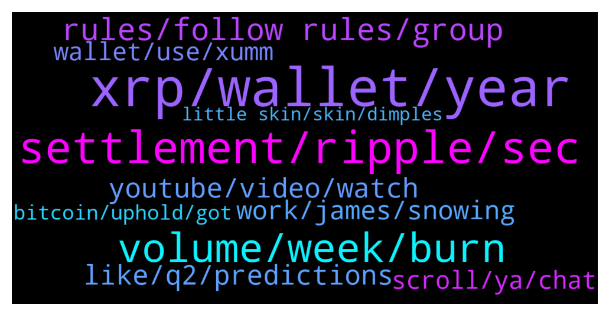

# **@Ripple**
 ## Analysis for **2021-12-17** - **2021-12-18**.

---

## 📊 **Basic Stats**

**n_messages_sent**: 315

---

---

## 🔝 **Top keywords and related messages**

1. **xrp, wallet, year**

    @marianmp --- *Can anyone remember how much it took for Xrp to reach from 10s of cents to almost 4 dollars ....??? I'm curios how agresive was the pump* **--->** [TG Discussion](https://t.me/Ripple/3023554)

    @ghost_angel00 --- *U think xrp will pump before 2022 ?* **--->** [TG Discussion](https://t.me/Ripple/3024572)

    @marianmp --- *People sold their house ,cars and so on.....to buy xrp 😂* **--->** [TG Discussion](https://t.me/Ripple/3023575)

    @megahitte --- *Dont look at the charts just know that xrp will be 10 dollars before new years* **--->** [TG Discussion](https://t.me/Ripple/3023945)

    @Sam --- *I’m assuming majority of XRP holders do 😂* **--->** [TG Discussion](https://t.me/Ripple/3023458)

    @marianmp --- *Some big people say starting next year XRP will fly ....* **--->** [TG Discussion](https://t.me/Ripple/3023466)

2. **settlement, ripple, sec**

    @erik_sz91 --- *What are you talking about? Brad Garlinghouse declared months ago they WON'T settle. They will win.* **--->** [TG Discussion](https://t.me/Ripple/3023350)

    @erik_sz91 --- *If the SEC is like ".... Ok.... Your evidence is great... Just gimme a couple of bucks and end this" (being a "couple of bucks" maybe 500k or so)  maybe they will settle. But ripple won't have a multi millonaire loss just for settle* **--->** [TG Discussion](https://t.me/Ripple/3023375)

    @marianmp --- *Welll my question is....can we without wining the trial against SEC?* **--->** [TG Discussion](https://t.me/Ripple/3023558)

    @Zabourmouk --- *Well now, Ripple is a WEF Partner. https://t.me/Q_Anon8/22993* **--->** [TG Discussion](https://t.me/Ripple/3023772)

    @erik_sz91 --- *Let me translate that into more easy language to see if I understand correctly. Settlement would be like Ripple saying "ok, this may be or not a security.... Take this money SEC, and don't bother me again"   and wining would be "Hey SEC, F*ck you, the judge said xrp is not a security, so I owe you nothing" and then xrp going to the moon* **--->** [TG Discussion](https://t.me/Ripple/3023361)

    @Jake_ripple_XRP --- *SETTLEMENT.... If the Ripple/XRP vs. SEC case comes to a settlement, it could possibly cost Ripple a huge sum... maybe the requirement of divesting some of their XRP... but this would be fantastic for all parties... if at the end of the day XRP is considered a non-security and gains regulatory clarity from the SEC.... Is there another crypto out there that has regulatory clarity?...... Right.... So, big money and financial institutions will get into XRP unrestrained... This will be OUR DAY... and Ripple's remaining XRP stash will increase in value by billions!! Win, win, win... in every way.... IMO* **--->** [TG Discussion](https://t.me/Ripple/3023502)

3. **volume, week, burn**

    @Letum9 --- *You saw the coin marketcap glitch but are telling me to go and check liquidity stats on the same or similar places yet know they were manipulated a few day ago. FAIL.* **--->** [TG Discussion](https://t.me/Ripple/3023614)

    @Letum9 --- *I want to see who will say how many coins were sold between 3-3.84$ XRP. Let's calculate the volume, what is it pls* **--->** [TG Discussion](https://t.me/Ripple/3023587)

    @ShaLtran --- *Want to check the daily burn? Check https://rippleitin.nz/ XRPL métrics - XRPL ledger fees* **--->** [TG Discussion](https://t.me/Ripple/3024340)

    @Letum9 --- *0.003500 burn rate for most transactions. Damn* **--->** [TG Discussion](https://t.me/Ripple/3024273)

    @laugavlagar --- *Daily yes and actually pays each week. For example you can see what’s been earned each day and what’s due each week. So you get paid each week but accumulates daily sort of thing* **--->** [TG Discussion](https://t.me/Ripple/3024123)

    @JesusJames --- *many bought higher than that yes* **--->** [TG Discussion](https://t.me/Ripple/3023570)

4. **rules, follow rules, group**

    @laugavlagar --- *So you’re saying not allowed to make friends within the group 🤣* **--->** [TG Discussion](https://t.me/Ripple/3024131)

    @JesusJames --- *read the rules of the group you are not supposed to dm members* **--->** [TG Discussion](https://t.me/Ripple/3024129)

    @JesusJames --- *it is the rules of the group that you require proof read them or do not say those things without proof* **--->** [TG Discussion](https://t.me/Ripple/3023953)

    @JesusJames --- *if nobody is answering you they either dont know or dont care go look it up and then maybe tell the group about your results* **--->** [TG Discussion](https://t.me/Ripple/3023598)

    @JesusJames --- *excatly you dont have proof so do not say them* **--->** [TG Discussion](https://t.me/Ripple/3023960)

    @JesusJames --- *you took her fishing pole away now he will never learn to fish* **--->** [TG Discussion](https://t.me/Ripple/3024053)

5. **youtube, video, watch**

    @laugavlagar --- *I’ve reported many times but nada gets done about it by YouTube* **--->** [TG Discussion](https://t.me/Ripple/3023373)

    @specialpatrolgroup --- *That happens everyday. Report it to YouTube and see what happens.* **--->** [TG Discussion](https://t.me/Ripple/3023882)

    @laugavlagar --- *Does anyone watch YouTube for news updates? Call it lazy but 4 years in, it’s my news channel now lol! Reason I ask is because the scam live ripple is become more frequent where I’m seeing 3 the same bullshit with brads face over everything and when watching it’s got the send 5k + and receive double back* **--->** [TG Discussion](https://t.me/Ripple/3023369)

    @GULUacityinUganda --- *the website in the video, do not give out any xrp details to them* **--->** [TG Discussion](https://t.me/Ripple/3024198)

    @Eesmer_06 --- *please watch the video. and check the site* **--->** [TG Discussion](https://t.me/Ripple/3023656)

    @laugavlagar --- *Apparently 16k +people are watching it* **--->** [TG Discussion](https://t.me/Ripple/3023376)

6. **like, q2, predictions**

    @Sam --- *And when will this court case be over, I was advised at the beginning of the year that it’ll end in August* **--->** [TG Discussion](https://t.me/Ripple/3023453)

    @ZapKoala --- *Does anyone know any dates for when it’s coming it was q2 but seems maybe it was q2 2022* **--->** [TG Discussion](https://t.me/Ripple/3024310)

    @JesusJames --- *not interested in it at all sounds like a scam* **--->** [TG Discussion](https://t.me/Ripple/3023651)

    @JustNNM --- *This meeting was scheduled from Feb so its not like its new info. Its part of discovery proceedings.* **--->** [TG Discussion](https://t.me/Ripple/3023358)

    @CyrptocuErgin --- *Hey guys what is the predictions for 12 dec just before snapshot day? Will it go up for one or 2 days and than down again?* **--->** [TG Discussion](https://t.me/Ripple/3023871)

    @JesusJames --- *haven't heard anything probably waiting for case to end ask in their chat too* **--->** [TG Discussion](https://t.me/Ripple/3024314)

7. **work, james, snowing**

    @Letum9 --- *I'll stop with the sarcasm though, I think I'm going overboard sometimes with it 😂 my bad..* **--->** [TG Discussion](https://t.me/Ripple/3023667)

    @JesusJames --- *okay ill tell them all later then when you're asleep* **--->** [TG Discussion](https://t.me/Ripple/3023520)

    @ShaLtran --- *Sorry i was bored, not much work today* **--->** [TG Discussion](https://t.me/Ripple/3024058)

    @SamSakamoto --- *Hey James, how you been today?* **--->** [TG Discussion](https://t.me/Ripple/3024144)

    @Wan_Rizal --- *I'm OK, Just Relax, Smoke 1st* **--->** [TG Discussion](https://t.me/Ripple/3024330)

    @BennyBennyBlanco --- *Even better picture with the eyes closed it’s snowing, than when u wake up o damn it’s not snowing got to go to work 😂* **--->** [TG Discussion](https://t.me/Ripple/3023898)

8. **wallet, use, xumm**

    @Steve_Uilaoghaire --- *If you have a nano ledger , trust line via XRP toolkit Otherwise XUMM wallet trustline  Easy* **--->** [TG Discussion](https://t.me/Ripple/3024464)

    @Steve_Uilaoghaire --- *I am done with uphold, thanks. All is on a nano ledger now* **--->** [TG Discussion](https://t.me/Ripple/3023448)

    @laugavlagar --- *Used Wirex for over 3 years and is really good. Can use x-accounts to get 12-16% on Fiat currencies and 6-10% on selected crypto without having to own Wirex tokens. I use it everyday with the card highly recommend as just released new whitepaper* **--->** [TG Discussion](https://t.me/Ripple/3023816)

    @Welanga1 --- *Does anyone use Wirex? Or what can you recommend? Thx* **--->** [TG Discussion](https://t.me/Ripple/3023414)

    @Tinkabellagal --- *This is only information I have atm until @FlareNetwork  https://twitter.com/hammertoe/status/1437906378639695872?s=21* **--->** [TG Discussion](https://t.me/Ripple/3024385)

    @fhgccbbc --- *Good day, please I got the songbird on my xumm it’s only showing the airdrop was successful but there is no sgb in the XUMM wallet* **--->** [TG Discussion](https://t.me/Ripple/3024570)

9. **scroll, ya, chat**

    @Eesmer_06 --- *I was thinking just like you. I've been holding it there for a year* **--->** [TG Discussion](https://t.me/Ripple/3023645)

    @JesusJames --- *better to keel it in here bro* **--->** [TG Discussion](https://t.me/Ripple/3023677)

    @JesusJames --- *so its been 2 months since you looked lol* **--->** [TG Discussion](https://t.me/Ripple/3023594)

    @JesusJames --- *dont pm us talk here in the chat* **--->** [TG Discussion](https://t.me/Ripple/3024490)

    @JesusJames --- *umm ya its fixed now think what you want ...* **--->** [TG Discussion](https://t.me/Ripple/3023615)

    @JesusJames --- *that is for another chat room @xrpofftopic* **--->** [TG Discussion](https://t.me/Ripple/3023533)

10. **bitcoin, uphold, got**

    @Steve_Uilaoghaire --- *In the U S, only place I could find to but x r p is Uphold. I applied to be part of Upholds referral program. I got five people to buy $500 or more each Which qualified me for $10 in Bitcoin  They cheated me out of it, said denied, but never got a reason. That in itself makes me worry about uphold* **--->** [TG Discussion](https://t.me/Ripple/3023436)

    @TraderRicky10 --- *Stay away from this company voskcoins. I lost most of my coins worth of $97k. I started with a thousand dollars. At first They let you withdrawal with no problem. That was where they got me and i used my tokens with the idea to buy them back within a month. Years ago i wanted to mine bitcoin at home. I was following Vosk Drew on youtube and stumble upon his own site. Be careful out there guys. Even a great YouTuber can be a scammer* **--->** [TG Discussion](https://t.me/Ripple/3023686)

    @Tinkabellagal --- *⁠US Financial Stability Oversight Council identifies stablecoins and cryptos as threats to financial system   "The Council recommends that state and federal regulators review available regulations and tools that could be applied to digital assets," says the FSOC.  https://ct.com/a6rl* **--->** [TG Discussion](https://t.me/Ripple/3024158)

    @Top_of_mind --- *Japan's SBI Group announced the launch of its crypto fund, offering Japanese investors exposure to Bitcoin, XRP, Ether, Bitcoin Cash, Litecoin, Chainlink, and Polkadot.* **--->** [TG Discussion](https://t.me/Ripple/3024442)

    @Steve_Uilaoghaire --- *Yes, lots of scams. Old adage- if it founds too good to be true, it is. Take your crypto off of exchanges and put in a personal wallet or ledger device. Use every security feature the wallet has available. Protect yourselves* **--->** [TG Discussion](https://t.me/Ripple/3024182)

    @Jake_ripple_XRP --- *FROM UPHOLD NEWSLETTER:.... Millennial millionaires were surveyed by CNBC in conjunction with high-net-worth research firm Spectrem Group. Not shockingly, more than 50% of them have at least 50% of their wealth in crypto. About one-third of respondents invest three-fourths of their wealth in crypto, according to the survey. And some 48% of respondents say they plan to add to their holdings over the next year.* **--->** [TG Discussion](https://t.me/Ripple/3024016)

