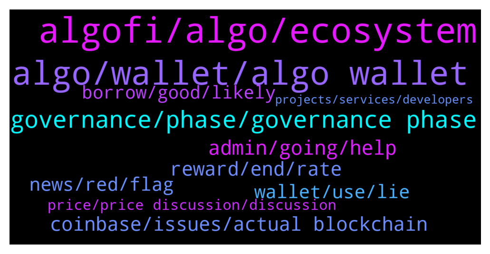

# **@algorand**
 ## Analysis for **2021-12-17** - **2021-12-18**.

---

## 📊 **Basic Stats**

**n_messages_sent**: 279

---

---

## 🔝 **Top keywords and related messages**

1. **algofi, algo, ecosystem**

    @NightAlgorand --- *Algofi is now LIVE on Algorand!  With this launch, Algofi brings another core protocol to the Algorand DeFi ecosystem, enabling anyone to earn interest, access leverage and borrow against their digital assets on Algofi's simple-to-use platform.  Read more: https://www.prnewswire.com/news-releases/liquidity-protocol-algofi-launches-on-algorand-offering-a-lending-market-stablecoin-and-liquidity-incentives-301447563.html* **--->** [TG Discussion](https://t.me/algorand/323132)

    @Acmecondor --- *Algorand is one of a kind* **--->** [TG Discussion](https://t.me/algorand/323107)

    @hackman31 --- *Esiste un gruppo Italiano di Algorand?* **--->** [TG Discussion](https://t.me/algorand/323507)

    @MackDenver --- *Algofi is now LIVE on Algorand!  With this launch, Algofi brings another core protocol to the Algorand DeFi ecosystem, enabling anyone to earn interest, access leverage and borrow against their digital assets on Algofi's simple-to-use platform.  Read more: https://www.prnewswire.com/news-releases/liquidity-protocol-algofi-launches-on-algorand-offering-a-lending-market-stablecoin-and-liquidity-incentives-301447563.html* **--->** [TG Discussion](https://t.me/algorand/323431)

    @KKM --- *So many algo support contact me.How's nice* **--->** [TG Discussion](https://t.me/algorand/323537)

    @debibeau --- *Is Algorand experiencing problems in the ecosystem ?* **--->** [TG Discussion](https://t.me/algorand/322894)

2. **algo, wallet, algo wallet**

    @Orlandoterzo --- *Okay, but i need to select a Network? (like ERC20 /BEP20) or it's automatic just clicking Algo and paste my address?  (sorry for the  stupid question, but it would be one of the my first transaction to Algorand Wallet)* **--->** [TG Discussion](https://t.me/algorand/323523)

    @MackDenver --- *Metamask does not support ALGO right now. You can download the official wallet from below  https://algorandwallet.com/* **--->** [TG Discussion](https://t.me/algorand/323517)

    @Orlandoterzo --- *Sorry, probably i wrote wrong. What i was meaning was how can i transfer my Algos from Binance to Algo wallet..😬* **--->** [TG Discussion](https://t.me/algorand/323520)

    @MackDenver --- *You can stake ALGO just by holding them in your wallet* **--->** [TG Discussion](https://t.me/algorand/322839)

    @AlgorandReport --- *Unable to sync with Yieldly with Algorand Wallet - ongoing issue...???* **--->** [TG Discussion](https://t.me/algorand/322665)

    @Orlandoterzo --- *Sorry guys i need your help to transfer my algo from Binance to Algo wallet. I've seen the tutorial on the website, but they show how to do it with coinbase. Probably it's the same, but with metamask you must choice the network( ERC20/BEP20 ecc) and it will appear trough the options, instead i  can't search the "Algo Wallet"... Could anyone help me pls?* **--->** [TG Discussion](https://t.me/algorand/323513)

3. **governance, phase, governance phase**

    @zacharias1 --- *How many ALGO do I need to allocate to participate effectively in governance* **--->** [TG Discussion](https://t.me/algorand/322572)

    @bC311 --- *How do I use the algorandwallet to stake for governance?* **--->** [TG Discussion](https://t.me/algorand/323031)

    @BBeniek --- *Does anyone know what will be approximately the APY for coming government period?* **--->** [TG Discussion](https://t.me/algorand/322556)

    @Patdogbaby --- *What are we voting on next ?* **--->** [TG Discussion](https://t.me/algorand/322738)

    @pkn11425 --- *Governance period #2 is coming to town… 🎅🎶🎶* **--->** [TG Discussion](https://t.me/algorand/322557)

    @Kamil --- *I agree. Maybe I should do governance* **--->** [TG Discussion](https://t.me/algorand/323087)

4. **admin, going, help**

    @asirshahid --- *Rosa N. Coleman if you need help, just ask here* **--->** [TG Discussion](https://t.me/algorand/323071)

    @jumpfetus --- *lol ffs, you can pick out any 24 h period from the past where one is going up and the other is going down and make any sort of conclusion* **--->** [TG Discussion](https://t.me/algorand/322982)

    @MackDenver --- *Hello R, you can always check the latest APY here: https://algoexplorer.io/rewards-calculator* **--->** [TG Discussion](https://t.me/algorand/323439)

    @MackDenver --- *You can speak with @patrick_crypto about it, he is one of the admins there* **--->** [TG Discussion](https://t.me/algorand/323519)

    @Iamwayp --- *Admin can DM you, but they won't DM you first* **--->** [TG Discussion](https://t.me/algorand/323197)

    @asirshahid --- *That DM you asking for advice* **--->** [TG Discussion](https://t.me/algorand/323074)

5. **reward, end, rate**

    @zentaurion --- *Is it really 0.81% APY now?* **--->** [TG Discussion](https://t.me/algorand/322680)

    @SankaLover --- *Guys what happened to the reward %??* **--->** [TG Discussion](https://t.me/algorand/323435)

    @Genexsus --- *Is 0.8% the reward rate now?* **--->** [TG Discussion](https://t.me/algorand/323171)

    @SankaLover --- *A couple of days ago i was getting around 5% on exodus, now it’s down to roughly 2%??* **--->** [TG Discussion](https://t.me/algorand/323436)

    @patrick_crypto --- **Annual* percentage rate.. Participation rewards end end of February…. thus… 0 from then on..* **--->** [TG Discussion](https://t.me/algorand/322684)

    @Leugim_21 --- *Like.. someone told me and so on, wrong expectation but in the end it was true at some point.* **--->** [TG Discussion](https://t.me/algorand/323118)

6. **coinbase, issues, actual blockchain**

    @MackDenver --- *Hello Meta, it is up to coinbase to resume and process the transactions accordingly. A few other people have also reported similar issues. For now, all you can do now is wait for them to fix everything.* **--->** [TG Discussion](https://t.me/algorand/322764)

    @metazeero --- *Hi- anyone else having issues with Coinbase Algo transfer ? Been there on pending since late last night* **--->** [TG Discussion](https://t.me/algorand/322754)

    @CryptoXCam --- *Anyone else Algo stuck On coinbase pending transfer?* **--->** [TG Discussion](https://t.me/algorand/322646)

    @Leugim_21 --- *to avoid problems with Coinbase, we should start using Moonpay/Tinyman feature, here some details on supported countries https://support.moonpay.com/hc/en-gb/articles/360009279877-What-are-your-supported-countries-states-and-territories-* **--->** [TG Discussion](https://t.me/algorand/322842)

    @Shk_Life_project --- *so now, i've recieved message that its a testnet testing, is it true?* **--->** [TG Discussion](https://t.me/algorand/322820)

    @midgetwhale --- *Hello I was kicked from the price chat group because I probably did not answer shieldy in time. Any way to add me back?* **--->** [TG Discussion](https://t.me/algorand/323518)

7. **wallet, use, lie**

    @MackDenver --- *Try with MyAlgo wallet for now* **--->** [TG Discussion](https://t.me/algorand/323532)

    @karunjoby --- *When I try to sent planets to other wallet it's showing error message* **--->** [TG Discussion](https://t.me/algorand/323471)

    @CryptoXCam --- *Need help new computer wallet not connected saying wrong phrase I have I written down and pictures so I know it’s right* **--->** [TG Discussion](https://t.me/algorand/323443)

    @Leugim_21 --- *But, also check wallet support https://www.moonpay.com/buy/algo* **--->** [TG Discussion](https://t.me/algorand/322847)

    @hope999999999 --- *Lie. You are using phone to chat. Why do you have to use computer while you could use phone wallet?* **--->** [TG Discussion](https://t.me/algorand/323462)

    @KKM --- *I can't transfer between my wallet* **--->** [TG Discussion](https://t.me/algorand/323527)

8. **news, red, flag**

    @BBeniek --- *It was such a huge endorsement but ... nowhere no one was writing about it* **--->** [TG Discussion](https://t.me/algorand/323023)

    @BBeniek --- *Silvio's performance on the stage in Miami was for me a huge red flag* **--->** [TG Discussion](https://t.me/algorand/323017)

    @BBeniek --- *Did you guys seen that anywhere in the news?* **--->** [TG Discussion](https://t.me/algorand/323021)

    @BBeniek --- *Do you know why they had a red flag?* **--->** [TG Discussion](https://t.me/algorand/322955)

    @Aniela --- *great news, where did you read that?* **--->** [TG Discussion](https://t.me/algorand/322909)

    @BBeniek --- *And he even showed him his ass* **--->** [TG Discussion](https://t.me/algorand/322958)

9. **borrow, good, likely**

    @RalphCraig --- *Deposit crypto as collateral. Borrow against it. If the value of your collateral drops too much and you exceed your borrow ratio you will get liquidated. Stay below your borrow ratio and it’s a good way to borrow with a low interest rate. Good luck.* **--->** [TG Discussion](https://t.me/algorand/323573)

    @CryptoXCam --- *This right here could possible be the end of crypto for me for a good while!* **--->** [TG Discussion](https://t.me/algorand/323484)

    @CryptoXCam --- *I’m now new to crypto Just never experienced this problem when buying a new computer and trying to log onto my desktop wallet* **--->** [TG Discussion](https://t.me/algorand/323457)

    @lightbox --- *What do you even mean buy algorand without kyc, you won’t be able to buy any crypto with bank cards without kyc* **--->** [TG Discussion](https://t.me/algorand/323563)

    @jumpfetus --- *breaking news. Crypto volatility is high. More at 11..* **--->** [TG Discussion](https://t.me/algorand/323004)

    @A1981 --- *Amateurs You guys don’t know a thing about crypto I guess 🤣🤣🤣🤣* **--->** [TG Discussion](https://t.me/algorand/322975)

10. **price, price discussion, discussion**

    @MackDenver --- *Hello Mimo, please refrain from price discussion here* **--->** [TG Discussion](https://t.me/algorand/322734)

    @Patdogbaby --- *why is price not allowed ? i think the value of the project is an important topic* **--->** [TG Discussion](https://t.me/algorand/323542)

    @MackDenver --- *There is a separate group for price discussion  @algorand_price* **--->** [TG Discussion](https://t.me/algorand/323544)

    @MackDenver --- *Please refrain from price discussion here* **--->** [TG Discussion](https://t.me/algorand/323500)

    @jumpfetus --- *regardless don't take about price in this channel* **--->** [TG Discussion](https://t.me/algorand/322984)

    @Mimo --- *Where can I talk about prices* **--->** [TG Discussion](https://t.me/algorand/322735)

