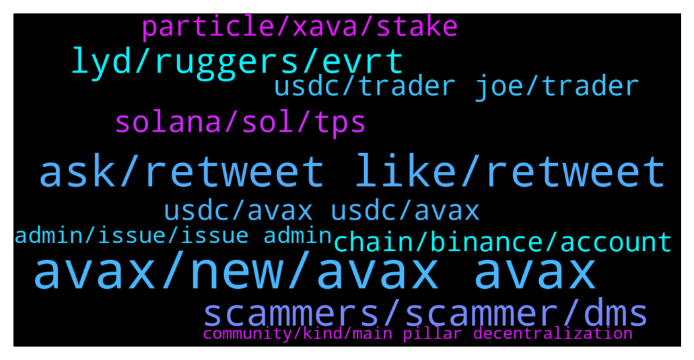

# **@avalancheavax**
 ## Analysis for **2021-12-17** - **2021-12-18**.

---

## 📊 **Basic Stats**

**n_messages_sent**: 406

---

---

## 🔝 **Top keywords and related messages**

1. **avax, new, avax avax**

    @S1001001001001 --- *Why avax growing even market is dump.* **--->** [TG Discussion](https://t.me/avalancheavax/314581)

    @hossein_barati_93 --- *Thank you. I read the news and about BitGo but I couldn't understand completely. It it an important news? What is should BitGo do with avax? Could you explain simply please?🙏🙏* **--->** [TG Discussion](https://t.me/avalancheavax/314324)

    @vampyren --- *anyhow what is going on with avax recently? not that i'm complaining but its just keeps going up :)  I know about USDC + FTX listing but is that what's driving the uptick or something else too beside that?  Still those two are huge news in itself too..* **--->** [TG Discussion](https://t.me/avalancheavax/314743)

    @85u_yhLx30 --- *I think avax is good for now, but isn't a great long term play. Look at the tokenomics of avax, like a large portion of it is alrelady off the table* **--->** [TG Discussion](https://t.me/avalancheavax/314717)

    @Oggy_Raider --- *New to Avax. Where do I start?* **--->** [TG Discussion](https://t.me/avalancheavax/314220)

    @gtkcrypto --- *Is anyone here from a developer team of games play to earn? I am intrested in talking about more details about a new game.* **--->** [TG Discussion](https://t.me/avalancheavax/314445)

2. **ask, retweet like, retweet**

    @Shiva_Lee --- *Sure or you can send it to me DM whatever you like* **--->** [TG Discussion](https://t.me/avalancheavax/314561)

    @TheSEOdude --- *I really wish if I could send stickers here 😐* **--->** [TG Discussion](https://t.me/avalancheavax/314842)

    @TheSEOdude --- *Ask that in there : https://t.me/avalaunch_app* **--->** [TG Discussion](https://t.me/avalancheavax/314871)

    @emcs1974 --- *🔥 Only ✅ Retweet, No 🚫 Like.  https://twitter.com/Cointelegraph/status/1471200943047733250?t=XB3kPtlgqpT661a6FulZVg&s=09* **--->** [TG Discussion](https://t.me/avalancheavax/314347)

    @Oggy_Raider --- *Cheer 👍 Do you have a link to the official YouTube channel?* **--->** [TG Discussion](https://t.me/avalancheavax/314228)

    @emcs1974 --- *🔥 Only ✅ Retweet, No 🚫 Like.  https://twitter.com/Cointelegraph/status/1471200943047733250?t=XB3kPtlgqpT661a6FulZVg&s=09  🔥 GO GO GO 🙋‍♂* **--->** [TG Discussion](https://t.me/avalancheavax/314880)

3. **scammers, scammer, dms**

    @Ellie_Larsson --- *Admitted yes there are scammers everywhere and we are sorry he feel into the wrong hands but you don’t have to call everyone scammers real and legit ones exist ok here* **--->** [TG Discussion](https://t.me/avalancheavax/314642)

    @frysport --- *So many scammers privately contacting me* **--->** [TG Discussion](https://t.me/avalancheavax/314896)

    @dc_sky --- *Wow this place is full of scammers. Worst I've experienced anyplace. My phone is blowing up with calls and scammy DMs. Hey scammers give it a rest. A friend of mine committed suicide after a scammer stole most of his portfolio. Left a wife and kids behind. You scammers are parasitical subhuman scum.* **--->** [TG Discussion](https://t.me/avalancheavax/314638)

    @dc_sky --- *Let me clarify.. I'm talking to the 20+ scammers that have called and DMd me in the last few minutes. I wasn't directing my comment to everyone else, assuming there are others on here who aren't scammers. That said, the only responses to my request for help have been super scammy, so if there are legitimate, helpful, and ethical folks on here I just haven't encountered them yet.* **--->** [TG Discussion](https://t.me/avalancheavax/314644)

    @Plato the Enlightener (👁,👁) --- *Every big coin channel is full of scammers try them! If your post on any channel starts with a question then if you have PM-ing enabled for non friends then expect at least 10 scammers offerring you a helping hand to steal your coins anywhere anytime* **--->** [TG Discussion](https://t.me/avalancheavax/314910)

    @SeqAnto --- *Anyone who writes to you privately does not want to help you but wants to steal your coins* **--->** [TG Discussion](https://t.me/avalancheavax/315013)

4. **lyd, ruggers, evrt**

    @brta13k --- *Just remembering that i never cursed him, i just said the obvious: he was being annoying to those who sought to help beginners.* **--->** [TG Discussion](https://t.me/avalancheavax/314268)

    @Johnstonekina --- *You suspect it to be a rug pull?* **--->** [TG Discussion](https://t.me/avalancheavax/314447)

    @Yoopez --- *Lyd team is pushing ruggers as Polarbear on EVRT and took their 200k cut on the IFO. Don’t care at all for the current rug cause they are slow ruggers as well. Just look how they manage : EVRT, Avao with inside trading & the strange TVL decreasing from 25M to 13M and dumped their lyd during the Maxi IFO. Avoid these slow ruggers* **--->** [TG Discussion](https://t.me/avalancheavax/314422)

    @Yoopez --- *The guy didn’t know how to do real options bro, it was a fucking joke. Just a cashgrab from lyd. These guys are doing IFO without any research on the team lmao. They just want their 200k$ cut* **--->** [TG Discussion](https://t.me/avalancheavax/314493)

    @metad3pt --- *right idk how much LYD had to do with  it aside frrom hosting his IFO, but  the polar bear dude is def a shit head and skammed all his investors.* **--->** [TG Discussion](https://t.me/avalancheavax/314502)

    @Yoopez --- *As I see how is managed EVRT, 80% chance it’s him. Shame on lydia who hace pushed him* **--->** [TG Discussion](https://t.me/avalancheavax/314499)

5. **solana, sol, tps**

    @Zaneflynt1 --- *"$SOL network claims to have a potential capacity of 50,000 TPS, though at present the Solana Beach dashboard shows much lower numbers." "The majority of transactions are voting "transactions".  "Overall, this means Solana shows 2000 TPS in their explorer, but 1680 TPS are consensus votes and not real transactions" "Only 300 TPS are real transactions." "Basically, $sol is artificially pumping their numbers."   Check rekt dot news "SPOTLIGHT ON SOLANA" for more.* **--->** [TG Discussion](https://t.me/avalancheavax/314815)

    @ramziakram --- *since solana counting consensus vote a part of transaction unlike other chain whereby consensus vote not included and in Solana most of transaction are consensus vote* **--->** [TG Discussion](https://t.me/avalancheavax/314739)

    @ramziakram --- *but sol have problem   1) network down for one time 2) recently got ddos attack with slow the transaction* **--->** [TG Discussion](https://t.me/avalancheavax/314737)

    @aco1731 --- *we need first to flip solana* **--->** [TG Discussion](https://t.me/avalancheavax/314923)

    @Zaneflynt1 --- *It’s quite frequent the network slow to a crawl actually, that’s my experience with SOL* **--->** [TG Discussion](https://t.me/avalancheavax/314744)

    @vampyren --- *Plus SOL is centralized, i dont care the number they show as node, it takes a kick ass hardware + they take down and restart the network just like a kill switch...* **--->** [TG Discussion](https://t.me/avalancheavax/314742)

6. **usdc, avax usdc, avax**

    @aco1731 --- *Usdc.e is controlled by what entity?* **--->** [TG Discussion](https://t.me/avalancheavax/314366)

    @ramziakram --- *yes by opening circle account and deposit fiat there in exchange for usdc on avax* **--->** [TG Discussion](https://t.me/avalancheavax/314387)

    @aco1731 --- *theres no sense to have USDC native if its controlled to the same entity. i though USDC.e was controlled by AVAX team* **--->** [TG Discussion](https://t.me/avalancheavax/314383)

    @ramziakram --- *for me,better if they support avax usdc version* **--->** [TG Discussion](https://t.me/avalancheavax/314398)

    @ramziakram --- *bring more liquidity directly to avax. people can save cost also since no need to bring usdc from Ethereum anymore* **--->** [TG Discussion](https://t.me/avalancheavax/314395)

    @ramziakram --- *yup.benqi is lending platform on avax chain* **--->** [TG Discussion](https://t.me/avalancheavax/314225)

7. **usdc, trader joe, trader**

    @metad3pt --- *I think the issue right now is there is plenty of USDC.e because of the Avalanche bridge, and  that's not going to change. But until USDC is up on Curve, or someone with a lot of native USDC adds liquidity somewhere, AUSD, Pangolin, Embr, Curve, there's a shortage of "native"/circle issued usdc* **--->** [TG Discussion](https://t.me/avalancheavax/314478)

    @ramziakram --- *in traderjoe got usdc.e and usdc pair. do not the pair still have high slippage due to low liquidity for now* **--->** [TG Discussion](https://t.me/avalancheavax/314954)

    @Nicolas_A --- *There aren’t that much newly minted USDC so the rates aren’t 1:1 at the moment. I would recommend waiting before switching* **--->** [TG Discussion](https://t.me/avalancheavax/314362)

    @BCM_BEN --- *anyone see some usdc pools? not usdc.e* **--->** [TG Discussion](https://t.me/avalancheavax/314950)

    @aco1731 --- *How incentivize that boring liquidity. What the difference from usdc.e to usdc native?* **--->** [TG Discussion](https://t.me/avalancheavax/314365)

    @Manubalaban --- *I want to deposit in the farm usdc/usdce in trader joe, but if i want to swap usdce to usdc si so huge the slipeage there* **--->** [TG Discussion](https://t.me/avalancheavax/314439)

8. **particle, xava, stake**

    @NZjared --- *Anyone else pumped about Particle releasing a $12.9m Banksy as an NFT on the Avalanche chain?!* **--->** [TG Discussion](https://t.me/avalancheavax/314300)

    @Chrisaustria --- *Thanks mate ,  Ok so if I stake for example 50 xava is allocation guaranteed?* **--->** [TG Discussion](https://t.me/avalancheavax/314508)

    @donnysuga --- *is the lower fee for delegations better than higher fees?* **--->** [TG Discussion](https://t.me/avalancheavax/314177)

    @aco1731 --- *With DeFi i hope let it below 1% just for day payments* **--->** [TG Discussion](https://t.me/avalancheavax/315063)

    @aco1731 --- *I don't let more than 10% in exchanges especially American ones* **--->** [TG Discussion](https://t.me/avalancheavax/315062)

    @W --- *or if it is on the c-chain you can stake it on yieldyak, currently the APY is at just around 13%* **--->** [TG Discussion](https://t.me/avalancheavax/314980)

9. **chain, binance, account**

    @beamsontoast --- *Is anyone able to answer this - I sent Avax from Hoo to Binance using x-chain. Now I want to send to metamask where C-chain is the only option - do I just send or do I still have to change xchain to c-chain?* **--->** [TG Discussion](https://t.me/avalancheavax/314208)

    @Rc --- *so: installed an Avax wallet and transferred 35 of Avax into it, that was successful.  I tried to cross chain it from X to C and it did not work, It said something about the UTXO. Then all my Avax had disappeared from my account, I've refreshed the balance,  but still my account is empty.. then i send more 1.09 Avax because of the fees and my account still empty* **--->** [TG Discussion](https://t.me/avalancheavax/315036)

    @Nicolas_A --- *try doing import C from X a few times. Try a different browser. Seems like there are some issues today with this* **--->** [TG Discussion](https://t.me/avalancheavax/315042)

    @beamsontoast --- *It's fine I worked it out. Sending Avax via C-chain when it was previously x-chain is fine* **--->** [TG Discussion](https://t.me/avalancheavax/314226)

    @elik7302 --- *Love subnets. Can we transfer from P to C chain?* **--->** [TG Discussion](https://t.me/avalancheavax/314246)

    @frysport --- *Hello, I recently installed an Avax wallet and transferred $200 worth of Avax into it, that was successful. I then tried to cross chain it from X to C and it did not work, It said something about the UTXO. Then all my Avax had disappeared from my account, its been over 24hours, I've tried importing manually in advanced tab, I've refreshed the balance,  I even opened it using mozilla Firefox but still my account is empty.. can anyone help please?* **--->** [TG Discussion](https://t.me/avalancheavax/314884)

10. **admin, issue, issue admin**

    @oathtobarbatos --- *I'm not an admin but, I think I could help you. What's wrong?* **--->** [TG Discussion](https://t.me/avalancheavax/314250)

    @Nicolas_A --- *What issue do you have ?* **--->** [TG Discussion](https://t.me/avalancheavax/315015)

    @brta13k --- *Yo bro, i want to file a complaint against one of the administrators of portuguese channel, how can i proceed?* **--->** [TG Discussion](https://t.me/avalancheavax/314253)

    @DuplatGerardo --- *This channel is plagued with scamers ... everytime i ask a question therés like 10 of them writing to me ...* **--->** [TG Discussion](https://t.me/avalancheavax/314900)

    @Paulo --- *Hi admin  I have a question ,the system show :Your KYC Verification is declined* **--->** [TG Discussion](https://t.me/avalancheavax/314959)

    @brta13k --- *@Nicolas_A hey bro, i just send to you a report about an admin* **--->** [TG Discussion](https://t.me/avalancheavax/314264)

