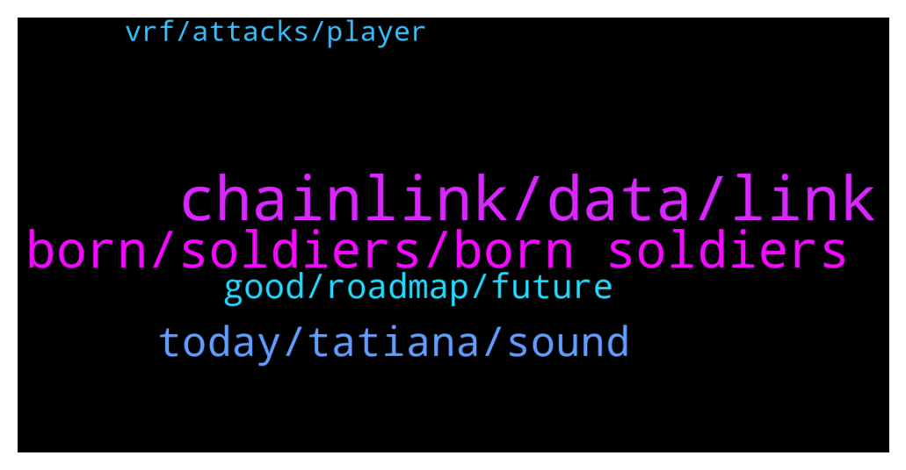

# **@chainlinkofficial**
 ## Analysis for **2021-12-17** - **2021-12-18**.

---

## 📊 **Basic Stats**

**n_messages_sent**: 109

---

---

## 🔝 **Top keywords and related messages**

1. **chainlink, data, link**

    @Curl --- *We have Dexs with synthetic margin trading because chainlink provides data feeds for crypto prices. Please consider providing data for options prices so that we can have options dexs.* **--->** [TG Discussion](https://t.me/chainlinkofficial/355820)

    @Kir2024 --- *Will u support chainlink token after chainlink 2.0. launch?* **--->** [TG Discussion](https://t.me/chainlinkofficial/356027)

    @Joypokkamol --- *Please note that there is no price or market discussion allowed. This channel is intended for focused, technical discussion of Chainlink. Please review the pinned rules. Thank you for your understanding.* **--->** [TG Discussion](https://t.me/chainlinkofficial/356026)

    @Curl --- *Well I was hopping for price feeds of options CEXs, like Deribit. Specially their quarterly and monthly products have considerable volumes.* **--->** [TG Discussion](https://t.me/chainlinkofficial/355845)

    @Min --- *Please take care of ChainLink's Korean channel.* **--->** [TG Discussion](https://t.me/chainlinkofficial/355682)

    @Sylvarantt --- *I'm not aware of any crypto options data feed currently. Data feeds are typically added on-demand if they meet certain requirements* **--->** [TG Discussion](https://t.me/chainlinkofficial/355813)

2. **born, soldiers, born soldiers**

    @De_an_369 --- *The next big project milestone is our NFT collection going on sale this weekend.  Born Soldiers NFTs will be available to purchase from our website https://bornsoldiers.io/ on Sunday 19th December from 21:00 PM UTC (16:00 ET).  The price of 1 Born Soldier NFT is 95 MATIC and you can mint a maximum of 20 per transaction.  For more info on our roadmap, you can head to the #roadmap channel in our Discord > https://discord.gg/z9ZEPHdeTd* **--->** [TG Discussion](https://t.me/chainlinkofficial/355778)

    @De_an_369 --- *The best way to get started with Born Soldiers is to join our Discord > https://discord.gg/z9ZEPHdeTd  This is where you will hear all of our project announcements first, meet our awesome community and take part in our daily giveaways. We would love to see you in there!* **--->** [TG Discussion](https://t.me/chainlinkofficial/355773)

    @FrankyD95 --- *Play to Earn game  Of course, our game Born Soldiers: Last hope is where players can earn our in-game token ShellZ ($SHZ). NFT owners can play the game to earn rewards by killing zombies and progressing through the levels. The earned token can then be traded for in-game assets or FIAT currency.* **--->** [TG Discussion](https://t.me/chainlinkofficial/355744)

    @De_an_369 --- *Franky is an avid gamer and was one of the first people globally to reach round 100 in COD: Cold War Zombies. He has a First Class degree in Electrical Engineering, and started working for a games development studio after university.  Franky is responsible for the game design of Born Soldiers: Last Hope which is already in the early stages of production and has put his heart and soul into creating an amazing whitepaper* **--->** [TG Discussion](https://t.me/chainlinkofficial/355717)

    @De_an_369 --- *Born Soldiers is a collection of 8545 hand-drawn NFTs and is the first zombie survival shooter NFT game with play-to-earn features.  In a sentence, we are COD zombies on the Polygon blockchain!* **--->** [TG Discussion](https://t.me/chainlinkofficial/355726)

    @FrankyD95 --- *Born Soldiers: Camps  Each Born Soldiers ERC-721 token holder will be airdropped a land token upon launch of Born Soldiers: Camps, which is the first P2E Zombie survival land ownership game. Players must build, upgrade and maintain their survivors camp to unlock new maps, abilities and earn Shellz. A players Camp will be the base for all aspects of the Born Soldier: Last Hope game upon launch, including the Armoury, Mess Hall and game mode/map selection.  Also, the land can be used to breed new soldiers which can be HODLed, loaned for passive income or sold to new players. Each genesis soldier will be able to train 7 survivors.* **--->** [TG Discussion](https://t.me/chainlinkofficial/355748)

3. **today, tatiana, sound**

    @nam_nguyenson --- *Thanks for the clarification @marcromeron 💪* **--->** [TG Discussion](https://t.me/chainlinkofficial/355698)

    @PolivodaTatiana --- *Thank you both for your time today! And good luck with the launch, I'll be watching 👀🤩* **--->** [TG Discussion](https://t.me/chainlinkofficial/355788)

    @PolivodaTatiana --- *wow, you two sound like a dream crew!* **--->** [TG Discussion](https://t.me/chainlinkofficial/355720)

    @FrankyD95 --- *Hey guys, thank you for having us* **--->** [TG Discussion](https://t.me/chainlinkofficial/355710)

    @De_an_369 --- *Hey Tatiana, it will be myself and my co-founder Franky D joining you for the AMA today* **--->** [TG Discussion](https://t.me/chainlinkofficial/355708)

    @marcromeron --- *Ok thank you for the heads up* **--->** [TG Discussion](https://t.me/chainlinkofficial/355683)

4. **good, roadmap, future**

    @ByelowSeligh --- *Hi guys! When will vrf be online on avalanche?* **--->** [TG Discussion](https://t.me/chainlinkofficial/355684)

    @Joypokkamol --- *There is no formal roadmap. The Whitepaper indicates future features (and some that are now live), this blogpost gives a good overview https://blog.chain.link/chainlink-2-0-lays-foundation-for-adoption-of-hybrid-smart-contracts/* **--->** [TG Discussion](https://t.me/chainlinkofficial/355802)

    @JdBaas --- *What route is the game engine taking? In terms of Unity, or maybe something else?* **--->** [TG Discussion](https://t.me/chainlinkofficial/355752)

    @Kxizizi --- *Web 3 appears to be a lot of fun. It's our future, after all, so now is a good moment to focus on it.* **--->** [TG Discussion](https://t.me/chainlinkofficial/355724)

    @marcromeron --- *No worries at all. There is a ton of new info and new developments, and we're human. I'm always asking things.* **--->** [TG Discussion](https://t.me/chainlinkofficial/355699)

    @marcromeron --- *We don't offer timelines sir. Stay tuned.* **--->** [TG Discussion](https://t.me/chainlinkofficial/355692)

5. **vrf, attacks, player**

    @PolivodaTatiana --- *Thank you, Jack. More information about VRF can be found here: https://blog.chain.link/chainlink-vrf-on-chain-verifiable-randomness/* **--->** [TG Discussion](https://t.me/chainlinkofficial/355765)

    @De_an_369 --- *Another area of the game where we will use VRF will be for the zombie attacks on Born Soldiers Camps (a player's virtual land). Players will have to invest in resources to build defences against random zombie attacks. VRF will help us to make sure that these attacks are fair and truly random for all landowners.* **--->** [TG Discussion](https://t.me/chainlinkofficial/355764)

    @De_an_369 --- *For example, we plan on using Chainlink VRF to 'hide' weapon components and loot boxes throughout the game. This will mean that every time a player starts a new game or respawns in Born Soldiers: Last Hope these in-game items will be randomly distributed throughout the map.* **--->** [TG Discussion](https://t.me/chainlinkofficial/355763)

    @marcromeron --- *VRF is on mainnet in Ethereum, BSC and Polygon.* **--->** [TG Discussion](https://t.me/chainlinkofficial/355693)

    @nam_nguyenson --- *It's already is if I'm not mistaken. Many Avalanche-based projects are using Chainlink VRF already such as Penguin Arena Game or Heroes of NFT* **--->** [TG Discussion](https://t.me/chainlinkofficial/355688)

