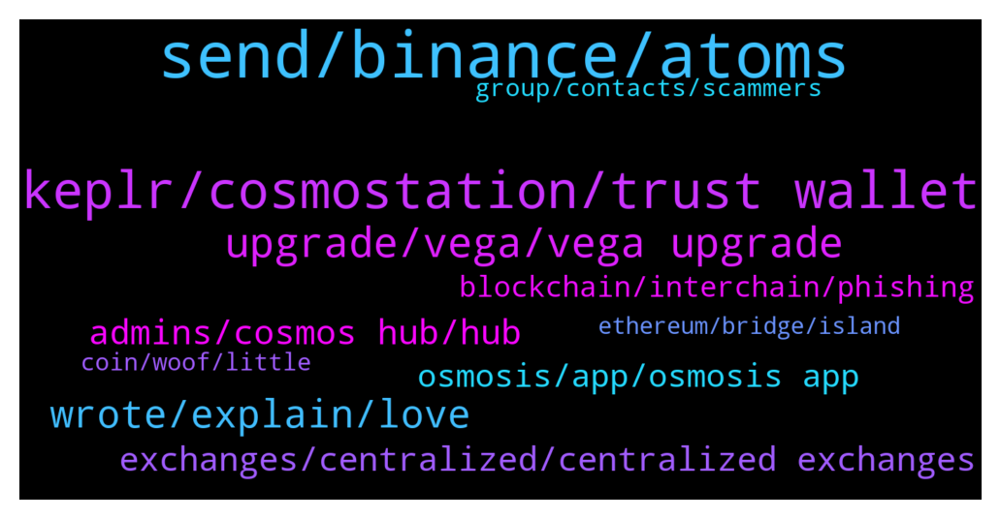

# **@cosmosproject**
 ## Analysis for **2021-12-17** - **2021-12-18**.

---

## 📊 **Basic Stats**

**n_messages_sent**: 457

---

---

## 🔝 **Top keywords and related messages**

1. **send, binance, atoms**

    @Matt_Blocks_United --- *it's the chain's native token that's required to move anything from one place to another on the Cosmos blockchain. That's how all blockchains work.... you need the native token for gas, to pay network fees for ANY transaction.  Aren't you the "Master of Coin?"* **--->** [TG Discussion](https://t.me/cosmosproject/455766)

    @Jerome --- *Hello,  Cannot purchase atom in Emeris app, any idea why?* **--->** [TG Discussion](https://t.me/cosmosproject/455655)

    @Binh_Go --- *Do you guys think atom is technically better than most of the top10 Projects?* **--->** [TG Discussion](https://t.me/cosmosproject/455895)

    @Jerome --- *Hello all, since yesterday I cannot withdraw my atom neither from coin base nor from binance, is there any issue ?* **--->** [TG Discussion](https://t.me/cosmosproject/455507)

    @MasterOfCoin90 --- *Thx for explanation ;), so you are telling that if I want to bridge LUNA with CRO, the gas fee will be on Atom?* **--->** [TG Discussion](https://t.me/cosmosproject/455771)

    @Stelio_Kontoss --- *Hello, could I know the best place to stack my atom in order to benefit from the petential airdrops of network ??    Thank you* **--->** [TG Discussion](https://t.me/cosmosproject/455529)

2. **keplr, cosmostation, trust wallet**

    @Phil --- *Hey all is exodus a good wallet for cosmos* **--->** [TG Discussion](https://t.me/cosmosproject/455326)

    @Poor --- *Cosmos network is going through a network upgrade transfers are not working... I can not send atom cosmos to trust wallet Please help me* **--->** [TG Discussion](https://t.me/cosmosproject/455590)

    @TicoJohnny --- *Yeah, no worries. I’d recommended Keplr to you as well you can get a higher reward rate and actually use Cosmos apps as well as choose your preferred validator and participate in governance.* **--->** [TG Discussion](https://t.me/cosmosproject/455348)

    @cronoscontinuum --- *Guys there is a Fake Keplr Support form going around I just spotted it  Please report this👇🏻 https://docs.google.com/forms/d/e/1FAIpQLSde0UeToz2YOB9NY0cQB6U60bpqVK2tuXEbbLwRZG9QdfmLqg/viewform* **--->** [TG Discussion](https://t.me/cosmosproject/455884)

    @Matt_Blocks_United --- *We have a video staking tutorial that shows Keplr and Cosmostation in action. I like Keplr the best. You can check out the tutorial on our blog. The video is right at the top. https://blocksunited.com/how-to-stake-cosmos-atom-tokens/ @ShaniNiazi786 too* **--->** [TG Discussion](https://t.me/cosmosproject/455710)

    @Poor --- *For transfer cosmos from trust wallet to cosmosation i need memo tag??* **--->** [TG Discussion](https://t.me/cosmosproject/455802)

3. **upgrade, vega, vega upgrade**

    @neginnsrrr --- *Hi when the atom update is over???* **--->** [TG Discussion](https://t.me/cosmosproject/455471)

    @CryptoSpace7 --- *Thats because of the vega upgrade that went live 3-4 days ago Its just that cex-es are sooo slow...* **--->** [TG Discussion](https://t.me/cosmosproject/456008)

    @hashaaamm --- *When will cosmos upgrade finish and where can we see updates* **--->** [TG Discussion](https://t.me/cosmosproject/455336)

    @Epikur --- *Wait till they will upgrade their nodes* **--->** [TG Discussion](https://t.me/cosmosproject/455511)

    @Cordtus --- *they have not caught up with the network upgrade yet* **--->** [TG Discussion](https://t.me/cosmosproject/455866)

    @TicoJohnny --- *Update is finished on the cosmos side, you can follow the announcement channel: https://t.me/Cosmos_Announcements* **--->** [TG Discussion](https://t.me/cosmosproject/455344)

4. **wrote, explain, love**

    @markzilla --- *sure. Thank u) sorry for bothering 🙏* **--->** [TG Discussion](https://t.me/cosmosproject/455615)

    @ShaniNiazi786 --- *Thanks for reply.. I understand.. 💖💖😊😊👍👍💯* **--->** [TG Discussion](https://t.me/cosmosproject/455438)

    @esclusivo555 --- *Sorry didn’t get you. Can you explain better please? 谢谢* **--->** [TG Discussion](https://t.me/cosmosproject/455096)

    @Zeuscryp --- *Like explain me like I am 5* **--->** [TG Discussion](https://t.me/cosmosproject/455742)

    @Zeuscryp --- *Can someone explain me better ?* **--->** [TG Discussion](https://t.me/cosmosproject/455739)

    @thegodfadaa --- *Hi, I’m new here. Can anyone please tell me a few things I should know. @AtomJazz, your comments will be appreciated. Thanks.* **--->** [TG Discussion](https://t.me/cosmosproject/455542)

5. **admins, cosmos hub, hub**

    @ZoltanAtom --- *Not that complicated!   Once you learn Cosmos dexs and Cosmos vision, you will never go back to others 😎* **--->** [TG Discussion](https://t.me/cosmosproject/455421)

    @bcosmos --- *thats not too true, they dont have cosmos devs* **--->** [TG Discussion](https://t.me/cosmosproject/455843)

    @Satoshi_is_dead --- *Hey how can I get in touch with a cosmos developer, this is extremely important* **--->** [TG Discussion](https://t.me/cosmosproject/456133)

    @honeylocal --- *Man I’m a quick learner but this Cosmos/Osmosis thing is tricky. Lol* **--->** [TG Discussion](https://t.me/cosmosproject/455420)

    @Zeuscryp --- *What exactly cosmos hub is doing* **--->** [TG Discussion](https://t.me/cosmosproject/455740)

    @Cordtus --- *try the cosmos website there may be a contact form. or twitter.* **--->** [TG Discussion](https://t.me/cosmosproject/456145)

6. **exchanges, centralized, centralized exchanges**

    @AtomJazz --- *This is not our fault, we have 0 connections with centralized exchanges. You should direct your questions to exchanges directly* **--->** [TG Discussion](https://t.me/cosmosproject/455571)

    @fuiser --- *well the 2 exchanges i use are not available,,,,,,,,,, zoltan can i trust u* **--->** [TG Discussion](https://t.me/cosmosproject/455463)

    @MasterOfCoin90 --- *It's not easy for each exchange to integrate new chains update to their system. But exchanges like Binance, Crypto.com and Coinbase should not have such problems since they have a world class dev team to implement such things. I expect that next week the withdrawals will be available again* **--->** [TG Discussion](https://t.me/cosmosproject/455842)

    @MasterOfCoin90 --- *Just let me remind you that you can't withdraw from any exchange yet.* **--->** [TG Discussion](https://t.me/cosmosproject/455837)

    @fuiser --- *keplr dude but the exchange deposits are suspedend* **--->** [TG Discussion](https://t.me/cosmosproject/455461)

    @fuiser --- *the exchage is not accepting it* **--->** [TG Discussion](https://t.me/cosmosproject/455456)

7. **osmosis, app, osmosis app**

    @Phil --- *Is that where the osmosis lp is?* **--->** [TG Discussion](https://t.me/cosmosproject/455330)

    @hashaaamm --- *I have used osmosis before. There deposit button always work. But this time funds are missing* **--->** [TG Discussion](https://t.me/cosmosproject/455246)

    @ZoltanAtom --- *You should join Osmosis and learn more about Osmosis;  https://t.me/osmosis_chat* **--->** [TG Discussion](https://t.me/cosmosproject/455418)

    @honeylocal --- *How do I get UST on cosmos to use Osmosis?* **--->** [TG Discussion](https://t.me/cosmosproject/455416)

    @AtomJazz --- *Ok, then you should go to app.osmosis.zone* **--->** [TG Discussion](https://t.me/cosmosproject/455112)

    @hashaaamm --- *Hi guys. I transferred my terra and ust to osmosis but nothing appears.* **--->** [TG Discussion](https://t.me/cosmosproject/455233)

8. **blockchain, interchain, phishing**

    @Cordtus --- *It's unique and useful and it has alrsady accomplished many of the things other big name blockchains with falsely inflated value are working on or have on the roadmap.* **--->** [TG Discussion](https://t.me/cosmosproject/456052)

    @bcosmos --- *they built an entire blockchain edu program for free* **--->** [TG Discussion](https://t.me/cosmosproject/455858)

    @bcosmos --- *this is tech that hasnt been around before in blockchain* **--->** [TG Discussion](https://t.me/cosmosproject/455845)

    @Cordtus --- *Yea they will for sure. It's stressful because you can't see it on the blockchain it's kind of working in the background.* **--->** [TG Discussion](https://t.me/cosmosproject/455250)

    @bcosmos --- *he has no interest in the amount of tremendous money hes making. he just wants to forward blockchain* **--->** [TG Discussion](https://t.me/cosmosproject/455856)

    @AtomJazz --- *It solves intercommunication between layer one blockchains which in hand solves scalability.* **--->** [TG Discussion](https://t.me/cosmosproject/455728)

9. **group, contacts, scammers**

    @ShaniNiazi786 --- *yeah sure... i know. Many scammers are on telegram. In fact they also contact me to download kelpr wallet😁...* **--->** [TG Discussion](https://t.me/cosmosproject/455440)

    @ragnatela29 --- *10 private message! This group is impossible* **--->** [TG Discussion](https://t.me/cosmosproject/455291)

    @kFoxx --- *FYI this guy is trying to scam people* **--->** [TG Discussion](https://t.me/cosmosproject/456196)

    @koriagi --- *Dear Cosmonauts🧑‍🚀👩‍🚀  🚨🚨🚨HOW TO STOP SCAMMERS TO ADD YOU TO THEIR GROUP🚨🚨🚨  🔘Please Click “Settings” 🔘After Click “Privacy And Security” 🔘Choose “Group&Channels”  🔘Change “WHO CAN ADD ME “ TO “My Contacts”* **--->** [TG Discussion](https://t.me/cosmosproject/456159)

    @Jae --- *shit i blocked a scammer before saying anything in return i should have written some absolutely scathing terrible things like i usually do* **--->** [TG Discussion](https://t.me/cosmosproject/455757)

    @Cordtus --- *Also go to your privacy settings here and change everything to "no one" or "contacts only" so you don't get added to scam groups* **--->** [TG Discussion](https://t.me/cosmosproject/455247)

10. **coin, woof, little**

    @Z --- *its a very low apy farm coin, basically* **--->** [TG Discussion](https://t.me/cosmosproject/455899)

    @bcosmos --- *hes not inquiring of price, just asking how to convert* **--->** [TG Discussion](https://t.me/cosmosproject/455836)

    @bcosmos --- *What is this woof coin nonsense* **--->** [TG Discussion](https://t.me/cosmosproject/455176)

    @Armond --- *Do you know where to find it? All I've ever been able to get is the seed phrase from my wallet* **--->** [TG Discussion](https://t.me/cosmosproject/455161)

    @ZoltanAtom --- *One important point is that there is no wallet support on telegram! If someone DM to you,block and report ⚠️⚠️* **--->** [TG Discussion](https://t.me/cosmosproject/455439)

    @bcosmos --- *i could validate for woof. doesnt mean i can do anything at all with the token lol* **--->** [TG Discussion](https://t.me/cosmosproject/455848)

