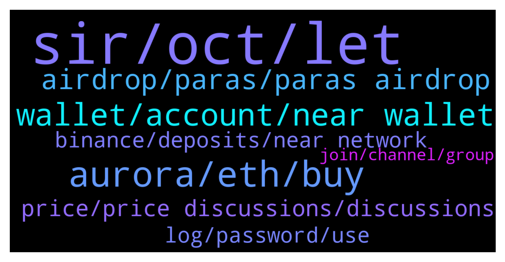

# **@cryptonear**
 ## Analysis for **2021-12-17** - **2021-12-18**.

---

## 📊 **Basic Stats**

**n_messages_sent**: 590

---

---

## 🔝 **Top keywords and related messages**

1. **sir, oct, let**

    @Vshashank --- *Hello, Any admin can confirm whether I am 5th or 6th in this quiz event? Thanks.* **--->** [TG Discussion](https://t.me/cryptonear/243153)

    @vlhai --- *TL:DR for you guys  1/ OCT/stNEAR incentivised liquidity pool on REF begins January 1st, 2022 2/ Dual Rewards: users that join the new OCT/stNEAR pool will earn farming rewards in both $REF and $META tokens 3/ Rewards for the current OCT/NEAR liquidity pool end on Dec 31st. Existing OCT/NEAR farmers that want to continue earning rewards must migrate to the new OCT/stNEAR pool* **--->** [TG Discussion](https://t.me/cryptonear/242280)

    @bailey_12 --- *Maybe with this, we can see an ATH of Near very soon like last time* **--->** [TG Discussion](https://t.me/cryptonear/244026)

    @Kripto_Raptor --- *come on... if you have other thoughts tell me 😃this is how i summarize my readings* **--->** [TG Discussion](https://t.me/cryptonear/242178)

    @web0x --- *If you don’t get it, I don’t have the time to try to convince you, sorry.* **--->** [TG Discussion](https://t.me/cryptonear/243518)

    @Platohedroboss --- *I think   this count is stole again https://explorer.mainnet.near.org/accounts/bigbank101.near* **--->** [TG Discussion](https://t.me/cryptonear/243404)

2. **aurora, eth, buy**

    @sukablyater --- *it seems to be transitioning into EVM* **--->** [TG Discussion](https://t.me/cryptonear/243285)

    @dgfg345363262 --- *How i can output aurora coin* **--->** [TG Discussion](https://t.me/cryptonear/242801)

    @rahulgoel007 --- *Aurora might be next  Who knows😉* **--->** [TG Discussion](https://t.me/cryptonear/243070)

    @why --- *so there is only Aurora Tesnet exits* **--->** [TG Discussion](https://t.me/cryptonear/244001)

    @marcNear --- *smartpad is the first Ido platform on Aurora* **--->** [TG Discussion](https://t.me/cryptonear/243893)

    @marcNear --- *yeah on Auroa but to transfer from Aurora to metamask eth mainnet you have to pay fee* **--->** [TG Discussion](https://t.me/cryptonear/243917)

3. **wallet, account, near wallet**

    @Platohedroboss --- *How can find who is behind this? The app how putting in the play store? Is it possible to find?* **--->** [TG Discussion](https://t.me/cryptonear/243375)

    @Kripto_Raptor --- *did you reach this wallet by doin a manual search on google playstore or seen it somewhere??? can you tell us where?* **--->** [TG Discussion](https://t.me/cryptonear/243360)

    @t1324op --- *Hello,  I have a couple of questions about NEAR Wallet web app.  1. Why can't I just use a password to protect my wallet? All non-custodian wallets I know have password protection. Anyone who accesses the browser can withdraw all tokens if 2FA is disabled.  2. Why can't I forget/delete my wallet in the browser?  3. Why can't I use Google authenticator for 2FA?* **--->** [TG Discussion](https://t.me/cryptonear/243419)

    @Kripto_Raptor --- *actually this browser wallet intended for personal computer/device use* **--->** [TG Discussion](https://t.me/cryptonear/243201)

    @Kripto_Raptor --- *⚠Heads up! there is a fake Near Wallet on Google Playstore. Do not download it. We don't have a mobile app only browser dApp which can only be accessed at wallet.near.org Never enter your PassPhrase/Seed into fake sites. Please help report it asap 🙏* **--->** [TG Discussion](https://t.me/cryptonear/243408)

    @israel_igboze --- *A fake NEAR Wallet on playstore* **--->** [TG Discussion](https://t.me/cryptonear/243487)

4. **airdrop, paras, paras airdrop**

    @kv9990 --- *🚨 $PARAS AIRDROP 🚨  We are pleased to announce $PARAS #airdrop to all the early adopters!  Check more info below👀 https://twitter.com/ParasHQ/status/1471850258728890369?s=20* **--->** [TG Discussion](https://t.me/cryptonear/242941)

    @bailey_12 --- *🚨 $PARAS AIRDROP 🚨  We are pleased to announce $PARAS #airdrop to all the early adopters!  Check more info below👀 https://twitter.com/ParasHQ/status/1471850258728890369?s=20* **--->** [TG Discussion](https://t.me/cryptonear/243002)

    @Digital_Ak --- *What of Airdrop because am Feel Near will the next Lamboo* **--->** [TG Discussion](https://t.me/cryptonear/243733)

    @FritzWagner --- *Can u share the link to that airdrop partner ? 🤟🙏* **--->** [TG Discussion](https://t.me/cryptonear/241979)

    @larry_lang --- *idk but paras seem to suprise everyone when it come to airdrop* **--->** [TG Discussion](https://t.me/cryptonear/243069)

    @bailey_12 --- *and then Aurora DAO decided to airdrop for people who staked their pool. :)))))* **--->** [TG Discussion](https://t.me/cryptonear/243081)

5. **price, price discussions, discussions**

    @TevinTodd2 --- *Hi all, I know this is Near telegram, but does anybody know where $META price could be looked up?* **--->** [TG Discussion](https://t.me/cryptonear/242609)

    @larry_lang --- *acutally we have a channel for price, feel free to join and share your thought: https://t.me/merchantsofnear* **--->** [TG Discussion](https://t.me/cryptonear/243047)

    @iamkemoo --- *for price talks please go to https://t.me/merchantsofnear* **--->** [TG Discussion](https://t.me/cryptonear/241931)

    @thanano46 --- *Sir You can do price related chat here  https://t.me/merchantsofnear* **--->** [TG Discussion](https://t.me/cryptonear/242087)

    @Kripto_Raptor --- *here you can check the seat price https://www.near-staking.com/* **--->** [TG Discussion](https://t.me/cryptonear/243276)

    @TheGo1denBull --- *Price discussions in this particular channel please https://t.me/merchantsofnear* **--->** [TG Discussion](https://t.me/cryptonear/243312)

6. **binance, deposits, near network**

    @bailey_12 --- *What’s wrong with devs on binance* **--->** [TG Discussion](https://t.me/cryptonear/244016)

    @thanano46 --- *It's time for me to move on from binance* **--->** [TG Discussion](https://t.me/cryptonear/243446)

    @kv9990 --- *Wait for binance to open deposits 🥲* **--->** [TG Discussion](https://t.me/cryptonear/244010)

    @kristanto_lioe --- *Anybody has any idea why lately Binance suspend either Deposit or Withdraw.. 🤔* **--->** [TG Discussion](https://t.me/cryptonear/242345)

    @stsshawn --- *Again binance suspend the near deposite* **--->** [TG Discussion](https://t.me/cryptonear/243839)

    @manorup --- *there was still the binance bridge* **--->** [TG Discussion](https://t.me/cryptonear/243388)

7. **log, password, use**

    @CriptoDC --- *I always log off from non-custodial wallets after use, and use a password to login again. I can remember passwords but not seed phrases so easily...* **--->** [TG Discussion](https://t.me/cryptonear/243194)

    @CriptoDC --- *i log out of metamask, and then use the password to login again (not the seed)* **--->** [TG Discussion](https://t.me/cryptonear/243203)

    @Kripto_Raptor --- *that way your metamask in always logged in 😁* **--->** [TG Discussion](https://t.me/cryptonear/243200)

    @Kripto_Raptor --- *so its actually not logged off* **--->** [TG Discussion](https://t.me/cryptonear/243205)

    @Kripto_Raptor --- *like every other crypto wallet you have to re enter your seed in order to log back in* **--->** [TG Discussion](https://t.me/cryptonear/243188)

    @Kripto_Raptor --- *use your PassPhrase to log back in* **--->** [TG Discussion](https://t.me/cryptonear/243184)

