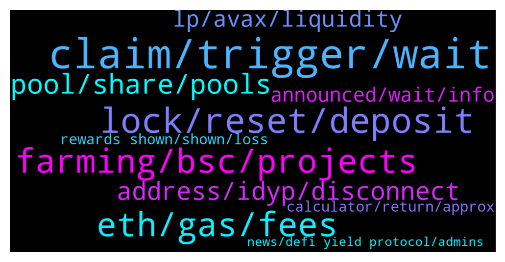

# **@dypfinance**
 ## Analysis for **2021-12-17** - **2021-12-18**.

---

## 📊 **Basic Stats**

**n_messages_sent**: 341

---

---

## 🔝 **Top keywords and related messages**

1. **claim, trigger, wait**

    @DhoniMSD516 --- *On pc/desktop hover on claim to see time for next rewards* **--->** [TG Discussion](https://t.me/dypfinance/230804)

    @Cricascar --- *the button says feel free to execute claim, but rewards are staying at 0.00* **--->** [TG Discussion](https://t.me/dypfinance/230985)

    @chunshern90 --- *When claim triggered. my rewards will be update.* **--->** [TG Discussion](https://t.me/dypfinance/230816)

    @hemanrock --- *You can see rewards only if you claim or you need to wait for someone to click claim* **--->** [TG Discussion](https://t.me/dypfinance/231003)

    @chunshern90 --- *ok. why need wait someone to trigger it?* **--->** [TG Discussion](https://t.me/dypfinance/230803)

    @thesamreynolds --- *so I clicked "claim" as my contract expired on Dec 16, but I just got sent back the WETH* **--->** [TG Discussion](https://t.me/dypfinance/230721)

2. **lock, reset, deposit**

    @DhoniMSD516 --- *Hey if you reinvest nope timer doesn't gets reset.* **--->** [TG Discussion](https://t.me/dypfinance/230786)

    @kura1214 --- *Hi. I just want to make clear if I reinvest my DYPs on staking 90 days, did the counter reset or not?* **--->** [TG Discussion](https://t.me/dypfinance/230785)

    @sb3ee --- *I have a question guys.  If i added to my 3 day stake, does that reset the timer and i can no longer unstake anything , including earlier deposits, for another 3 Days?* **--->** [TG Discussion](https://t.me/dypfinance/230708)

    @captain_protein --- *Rookie question - do investments roll over automatically? Eg, if I invest in the 3 day Eth farm, does it roll over for another 3 day period after the initial 3 day period has expired?* **--->** [TG Discussion](https://t.me/dypfinance/230697)

    @chunshern90 --- *the lock time can change to "count by number of days"?* **--->** [TG Discussion](https://t.me/dypfinance/230701)

    @sb3ee --- *The initial deposit i deposited earlier, for example, i deposit 13 day one, and compounded or added the next day, technically - my deposit had been staked for 3 days.   Just doesn’t seem like logic.* **--->** [TG Discussion](https://t.me/dypfinance/230713)

3. **eth, gas, fees**

    @Nefarpan --- *Lmao, that's too much to loose considering the ETH fees.* **--->** [TG Discussion](https://t.me/dypfinance/230775)

    @Mrcgp_0 --- *Was gunna go eth as well but the $350 gas fee put me off lol would of made it back easy with the 1million+ apy at the start but out of principle I didn't lol* **--->** [TG Discussion](https://t.me/dypfinance/231244)

    @QTMiner --- *Is it recommended to put gas limit at 1200000? MetaMask is setting that as my default, I’m wonder if I’ve been seeing inflated tx costs due to that being too high* **--->** [TG Discussion](https://t.me/dypfinance/230668)

    @hemanrock --- *When you click on wiithdraw, Please put it 600000 as Gas limit, It shows the Maximum amount to be charged but actual gas fees will be less that what is shown.* **--->** [TG Discussion](https://t.me/dypfinance/231015)

    @chunshern90 --- *It can be execute. But that require gas fee.* **--->** [TG Discussion](https://t.me/dypfinance/230805)

    @hemanrock --- *please check from here. https://dyp.finance/farmv2 but, on ETH Network gas fees will be high compared to BSC and AVAX* **--->** [TG Discussion](https://t.me/dypfinance/230469)

4. **farming, bsc, projects**

    @timdyp --- *It's just an experiment for the ''FUDDERS'' that all the time they are losing money, you know it's funny that we have at least 2500 people that are using the farming, staking, and buyback pools, BUT only a couple are losing money. So, I wanted to run this experiment and share my evolution of the 1 WETH invested in the farming pools. https://t.me/dypfinance/229910 https://t.me/dypfinance/229913* **--->** [TG Discussion](https://t.me/dypfinance/230558)

    @timdyp --- *Honestly we don't like to call other projects competitors because everything that we have done was built from scratch, I mean all the smart contracts have been developed from 0, no forks, etc like 99% of similar projects are doing.* **--->** [TG Discussion](https://t.me/dypfinance/230604)

    @Nana_Y --- *Which chain is the most profitable in the long term for farming?* **--->** [TG Discussion](https://t.me/dypfinance/230467)

    @sb3ee --- *I’m not in staking pool.   I’m in avax   Farm.* **--->** [TG Discussion](https://t.me/dypfinance/230717)

    @shinigamikami --- *My farming experience with DYP has been an awesome ride so far, I’m farming on all three chains, the rewards are simply awesome and for those of who us who got in when idyp on BSC was $4.5 you can increase your share by topping up again, I did that yesterday cause I believe soon enough iDYP on bsc side will pick up, don’t worry that your deposit value is down on bsc farming it’s only temporal, same goes for staking/buyback side on bsc(use the opportunity to top up)👌* **--->** [TG Discussion](https://t.me/dypfinance/231027)

    @notsodirty --- *Hi, are farms on bsc chain or eth chain?* **--->** [TG Discussion](https://t.me/dypfinance/230475)

5. **pool, share, pools**

    @chunshern90 --- *link for the Pool that you mention.* **--->** [TG Discussion](https://t.me/dypfinance/230837)

    @ringLeader96 --- *My share is 0.15% of ETH pool, did not claim rewards* **--->** [TG Discussion](https://t.me/dypfinance/230481)

    @Nubarv --- *So is it better to keep the rewards in pools or to withdraw it occasionally* **--->** [TG Discussion](https://t.me/dypfinance/230590)

    @DhoniMSD516 --- *The rewards you get depends on your share % of the pools* **--->** [TG Discussion](https://t.me/dypfinance/230820)

    @WatermelonNoia --- *I have invested in them, but cannot get my rewards to match up based on the APY, TVL and my share %* **--->** [TG Discussion](https://t.me/dypfinance/231101)

    @shinigamikami --- *O yes killing it indeed, what pool are you in?* **--->** [TG Discussion](https://t.me/dypfinance/231235)

6. **address, idyp, disconnect**

    @Craig --- *I just tried it. The unwanted address is not connected and the wanted one is. DYP is still connecting to the unwanted.* **--->** [TG Discussion](https://t.me/dypfinance/230977)

    @Craig --- *I switch in MM to a different address but DYP still connects me to the same one every time.* **--->** [TG Discussion](https://t.me/dypfinance/230975)

    @Craig --- *How do I change my wallet address when I open the protocol? It always connects me to the same address even when I disconnect DYP from my wallet, so I can never look at different address's.* **--->** [TG Discussion](https://t.me/dypfinance/230971)

    @Dsin420 --- *Address so I can connect my wallet. I always get it wrong.* **--->** [TG Discussion](https://t.me/dypfinance/230689)

    @error_500 --- *10x, so there isn’t a way to compare the iDYP token across all networks in the same chart view?* **--->** [TG Discussion](https://t.me/dypfinance/230861)

    @error_500 --- *Is there a place where we can see/compare the price of iDYP token (0xbd100d061e120b2c67a24453cf6368e63f1be056) across all network chains (ETH, BSC, AVAX)?* **--->** [TG Discussion](https://t.me/dypfinance/230829)

7. **lp, avax, liquidity**

    @DhoniMSD516 --- *For ERC and BSC you can check on Dextools, for AVAX you can check only on Pangolin* **--->** [TG Discussion](https://t.me/dypfinance/230830)

    @JulienRayleigh --- *Does the amount displayed in "Deposited LP" and "Deposited DYP" take into account the price variation of AVAX, ETH, DYP etc... depending on the pool obviously* **--->** [TG Discussion](https://t.me/dypfinance/230969)

    @sb3ee --- *25 LP tokens 75% avax 25% deposited   Do my LP amount fluctuate or will I withdraw same 25 LP.   Thanks.* **--->** [TG Discussion](https://t.me/dypfinance/230455)

    @iamJubi --- *DYP and it`s pair, is it wbtc pool you deposited in?WBTC if it is. check out the tutorial on how to remove liquidity on uniswap https://www.youtube.com/watch?v=1W8RoL1CPDs* **--->** [TG Discussion](https://t.me/dypfinance/230726)

    @chunshern90 --- *Is "Deposited LP" considered stable coin? or it'll huge fluctuate?* **--->** [TG Discussion](https://t.me/dypfinance/230711)

    @iamJubi --- *Hello. You need to remove liquidity on pangolin, the pair is avax-dyp. :) https://app.pangolin.exchange/#/find* **--->** [TG Discussion](https://t.me/dypfinance/231092)

8. **announced, wait, info**

    @R --- *Do we have to wait till year end for launchpad and listing news?* **--->** [TG Discussion](https://t.me/dypfinance/231038)

    @WatermelonNoia --- *Sorry if this has been brought up before. Been away from the chat for a while.* **--->** [TG Discussion](https://t.me/dypfinance/231112)

    @hemanrock --- *Kindly please wait. More info on it to be announced soon.* **--->** [TG Discussion](https://t.me/dypfinance/231039)

    @hemanrock --- *Kindly please wait. More info on it to be announced.* **--->** [TG Discussion](https://t.me/dypfinance/231025)

    @DhoniMSD516 --- *Might be, no infos on this yet :)* **--->** [TG Discussion](https://t.me/dypfinance/230872)

    @iamJubi --- *Hello. It is currently on the works.* **--->** [TG Discussion](https://t.me/dypfinance/230794)

9. **news, defi yield protocol, admins**

    @timdyp --- *The #DYP News RSS Feed has been integrated with the Crypto.com price page 👏 https://link.medium.com/cT7H8UAM3lb  👉https://twitter.com/dypfinance/status/1471806038152208392* **--->** [TG Discussion](https://t.me/dypfinance/230848)

    @iamJubi --- *The #DYP News RSS Feed has been integrated with the Crypto.com price page 👏 https://link.medium.com/cT7H8UAM3lb  👉https://twitter.com/dypfinance/status/1471806038152208392* **--->** [TG Discussion](https://t.me/dypfinance/231175)

    @timdyp --- *So, how is this beneficial for the DeFi Yield Protocol? Basically 10M users from Crypto.com will be able to get the latest updates about our project.  'In Crypto.com, we have crypto price pages for 8000+ tokens and there is news section in each pages with the RSS feed integration feature for our token partner which means DeFi Yield Protocol can share its latest update to our 10M users and the community at https://crypto.com/price/defi-yield-protocol. This news section gives our users a better insight and the latest market information of DeFi Yield Protocol.'* **--->** [TG Discussion](https://t.me/dypfinance/230852)

    @iamJubi --- *You can check all the dApp links here https://t.me/dypfinance/229271* **--->** [TG Discussion](https://t.me/dypfinance/230690)

    @DhoniMSD516 --- *Yes DYP Apps for Android and iOS are planned for Q1/2022 - Q2/2022* **--->** [TG Discussion](https://t.me/dypfinance/231170)

    @DhoniMSD516 --- *That news is not about listing, please read through it, that is news about DYP being adding to Crypto.com News feed* **--->** [TG Discussion](https://t.me/dypfinance/230903)

10. **calculator, return, approx**

    @chunshern90 --- *the calculator stated (Approx. Value Not Considering Burns)* **--->** [TG Discussion](https://t.me/dypfinance/230825)

    @timdyp --- *The problem is that both the APY and RETURN CALCULATOR are showing the Approx. Value Not Considering Burns, it is impossible for us to know how many tokens are going to be sent to To be burnt / disbursed. But like I said the team is working right now on an update that will provide 99.99% real numbers based on the last rewards distribution.* **--->** [TG Discussion](https://t.me/dypfinance/230766)

    @chunshern90 --- *So the "Return calculator" is misleading?* **--->** [TG Discussion](https://t.me/dypfinance/230823)

    @chunshern90 --- *the approx values is so far different* **--->** [TG Discussion](https://t.me/dypfinance/230827)

    @DhoniMSD516 --- *Hey consider the Burn% in the apy too, I beleive our devs worked on most accurate calculator and deployed yesterday, so you can use calculator on dApp to check the return values* **--->** [TG Discussion](https://t.me/dypfinance/231103)

    @DhoniMSD516 --- *No the return calculator shows Approx values considering Burn %, this was given clearly under calculator, we will have a updated calculator where it shows the results as accurate as possible* **--->** [TG Discussion](https://t.me/dypfinance/230824)

