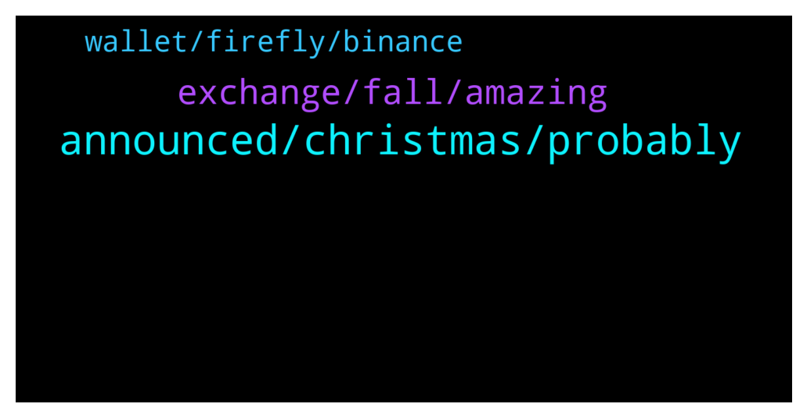

# **@iotatangle**
 ## Analysis for **2021-12-17** - **2021-12-18**.

---

## 📊 **Basic Stats**

**n_messages_sent**: 62

---

---

## 🔝 **Top keywords and related messages**

1. **announced, christmas, probably**

    @Tahmis --- *Not announced yet but all the hints suggest that it will start before christmas* **--->** [TG Discussion](https://t.me/iotatangle/299637)

    @Sailor --- *Do not ask any questions regarding to dev team's works as they always answer "SOON AND SOONEST OR SOME WEEKS,SOME MONTHS"* **--->** [TG Discussion](https://t.me/iotatangle/299541)

    @⠠⠵ Lucas! --- *Mmm, that would fit on Dom's comments too. But I think internal testing began recently, today or yesterday. No source, just rumour ;-)* **--->** [TG Discussion](https://t.me/iotatangle/299464)

    @sy-subrc --- *Wait until it’s not suspended anymore* **--->** [TG Discussion](https://t.me/iotatangle/299574)

    @FoxEFresh --- *Have they announced when the snapshot for airdrops will be or are we still waiting for “information soon” ?* **--->** [TG Discussion](https://t.me/iotatangle/299650)

    @Tahmis --- *I would guess it will work again very soon* **--->** [TG Discussion](https://t.me/iotatangle/299667)

2. **exchange, fall, amazing**

    @dawwgdizzle --- *Hello, this is the offical iota channel for the crypto currency correct?* **--->** [TG Discussion](https://t.me/iotatangle/299906)

    @Eavesdropperle --- *https://twitter.com/rob_daykin/status/1471991788193914894?s=21  Networking opportunity for projects on #SMR and #ASMB!* **--->** [TG Discussion](https://t.me/iotatangle/299706)

    @magicunikorn --- *Withdraws are suspended in some centralized exchange, is there any decentralized exchange we can buy iota?* **--->** [TG Discussion](https://t.me/iotatangle/299646)

    @sy-subrc --- *It’s not. Maybe with THEIR own node, but there’s definitely no issue with the mainnet. It’s always the same excuse, so don’t fall for that trap…* **--->** [TG Discussion](https://t.me/iotatangle/299992)

    @tstark101 --- *No this is for tech talk. Please do not fall for any scams* **--->** [TG Discussion](https://t.me/iotatangle/299913)

    @DanieleNad_DestyNic --- *I'm pretty sure iota and iotx are two different things* **--->** [TG Discussion](https://t.me/iotatangle/299644)

3. **wallet, firefly, binance**

    @mehmetkaramannn --- *I have miota but cant send them to wallet because it says suspended in binance* **--->** [TG Discussion](https://t.me/iotatangle/299594)

    @mehmetkaramannn --- *cant send iota from binance?? it says suspended so what can I do?* **--->** [TG Discussion](https://t.me/iotatangle/299573)

    @mehmetkaramannn --- *ok thanks! just holding them in firefly wallet enough for airdrops and staking?* **--->** [TG Discussion](https://t.me/iotatangle/299579)

    @nn11111 --- *hello, any news about mobile firefly wallet yet?* **--->** [TG Discussion](https://t.me/iotatangle/299472)

    @Arjan --- *Hello I’m new here, I’ve got a question: why is withdrawing iota to firefly wallet in Binance not possible? It says: network withdrawal suspended..anyone knows?* **--->** [TG Discussion](https://t.me/iotatangle/299662)

    @⠠⠵ Lucas! --- *No. You can do it in firefly* **--->** [TG Discussion](https://t.me/iotatangle/299676)

