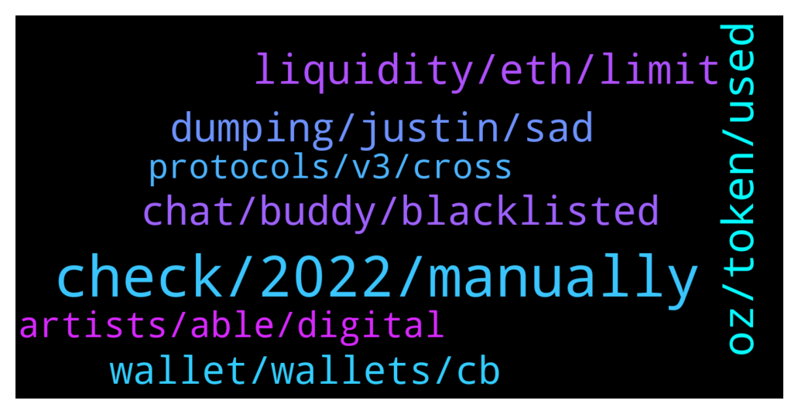

# **@lobsters_chat**
 ## Analysis for **2021-12-17** - **2021-12-18**.

---

## 📊 **Basic Stats**

**n_messages_sent**: 292

---

---

## 🔝 **Top keywords and related messages**

1. **check, 2022, manually**

    @Henry_Elder --- *if anyone has a suggestion for automating this, I'd reaaaaaaaaaaaaaaaaaaaaally appreciate it* **--->** [TG Discussion](https://t.me/lobsters_chat/308300)

    @FiveBoroughs --- *Yeah same day as breadcrumbs too* **--->** [TG Discussion](https://t.me/lobsters_chat/308174)

    @ncerovac --- *https://twitter.com/AmbireWallet/status/1471519375723167753?s=20 ambire is live now for everyone that wanna try* **--->** [TG Discussion](https://t.me/lobsters_chat/308176)

    @RaptorBob --- *No checking out now, any particular video that you would recomment watching ?* **--->** [TG Discussion](https://t.me/lobsters_chat/308258)

    @michael_p3711 --- *You got a new one for me?* **--->** [TG Discussion](https://t.me/lobsters_chat/308447)

    @Dave2Diamond --- *I've read in multiple places it can't be done . anything to reference?* **--->** [TG Discussion](https://t.me/lobsters_chat/308281)

2. **oz, token, used**

    @gas1cent --- *I assumed that the best practice, if you launch a token, is to import OZ's ERC20 and maybe tweak it a little bit, but GEAR doesn’t seem to do that. Same with UNI, although other major projects like YFI, DYDX, SHIBA all use OZ. What are the benefits of doing it from scratch? For reference: https://etherscan.io/address/0xba3335588d9403515223f109edc4eb7269a9ab5d#contracts* **--->** [TG Discussion](https://t.me/lobsters_chat/308179)

    @ChiTimesChi --- *https://apeboard.finance/ape-bridge  I can recommend using Synapse bridge, though as you can tell by my username, I am a bit biased :)* **--->** [TG Discussion](https://t.me/lobsters_chat/308408)

    @CroPurger --- *Does anyone know a list of bridges compatible with Avax, that are not Bridge . avax . network?* **--->** [TG Discussion](https://t.me/lobsters_chat/308388)

    @duckdegen --- *is etherscan down for anyone else?* **--->** [TG Discussion](https://t.me/lobsters_chat/308371)

    @matheus_gsilva95 --- *i can assure it is good, fast and reliable. Ive used celar and it is quite slow* **--->** [TG Discussion](https://t.me/lobsters_chat/308409)

    @phil_muhbags --- *I've used synapse too. Not to sound like a shill but it is a nice way to on board stables from bsc to harmony (there's very little liquidity for stables from bsc on harmony)* **--->** [TG Discussion](https://t.me/lobsters_chat/308410)

3. **liquidity, eth, limit**

    @juju1234534 --- *Wouldn’t the secondary stakers who validate the small buckets need to load the total (huge) state in order to do so? Could someone elaborate? I struggle to understand.* **--->** [TG Discussion](https://t.me/lobsters_chat/308709)

    @SamuelBrooks --- *The ETH liquidity was promptly munched and it took us some time to react. The band has now moved down but more liquidity is being called for* **--->** [TG Discussion](https://t.me/lobsters_chat/308651)

    @SamuelBrooks --- *In terms of liquidity, we understood that 25% of a public sale is typical to seed a pool. $2.2 was raised via tokensoft and so we seeded with $1m split between ETH and BUMP* **--->** [TG Discussion](https://t.me/lobsters_chat/308650)

    @StrategicReserve --- *Just FYI. Bumper partnered with Visor Finance for liquidity management on Uni V3. Visor is non-custodial, so only could ultimately advise bumper:  1) not offer that low of liquidity  2) not set a floor of concentrated liquidity at $0.75.   They went forward with those plans. It did not work out well.* **--->** [TG Discussion](https://t.me/lobsters_chat/308642)

    @Doug --- *Alpha share:   gnosis-auction.eth.link - gnosis will buy back 20k ETH worth of GNO via their auction on Monday at 0.12 ETH  Trading at 0.118 now.  Buy under 0.12, sell to gnosis via auction on Monday. 2% yield on ETH in 3 days is 10,000% APY equivalent on your ETH bags. Very deep liquidity too on 1inch.* **--->** [TG Discussion](https://t.me/lobsters_chat/308425)

    @drinkius --- *Plus some raw stats that we build the daily upon: https://t.me/lobster_watcher* **--->** [TG Discussion](https://t.me/lobsters_chat/308366)

4. **dumping, justin, sad**

    @yic_alex --- *Also they did derive it from https://github.com/Uniswap/governance/blob/master/contracts/Uni.sol so its not a complete reinvention of the wheel. Not everything has to be OZ.* **--->** [TG Discussion](https://t.me/lobsters_chat/308182)

    @RobAnon --- *Then there are the poor saps who fell for Tezos 😬* **--->** [TG Discussion](https://t.me/lobsters_chat/308516)

    @somebodyontelegram --- *Nah, they did in v3. But why use a middleman?* **--->** [TG Discussion](https://t.me/lobsters_chat/308247)

    @ivangbi --- *Seems like a random coin which maybe tries to do something, but didn’t get the right friends, and is in a sad situation? If they r real builders, this is actually sad. If they just wanted a coin, then whatevs.* **--->** [TG Discussion](https://t.me/lobsters_chat/308641)

    @sir_integra_hellsing --- *I thought it was Mark Cuban dumping Geist.* **--->** [TG Discussion](https://t.me/lobsters_chat/308681)

    @SD107 --- *I think he started farming and dumping after that in fantom and crashed couple of farm tokens really bad* **--->** [TG Discussion](https://t.me/lobsters_chat/308674)

5. **chat, buddy, blacklisted**

    @fallingdi --- *We are not gonna be blacklisted here, so we gonna talk about in everyday, buddy. No token. No volume* **--->** [TG Discussion](https://t.me/lobsters_chat/308386)

    @gas1cent --- *Genuine curiosity is the next logical step after apeing in ser, no shill* **--->** [TG Discussion](https://t.me/lobsters_chat/308191)

    @danngng --- *hey frens new here, how is this chat different to the lobsterdaokingdom chat* **--->** [TG Discussion](https://t.me/lobsters_chat/308238)

    @hugeshoe --- *Yeh but they said anyone that asks abt it, gets blacklisted. Sorry buddy* **--->** [TG Discussion](https://t.me/lobsters_chat/308385)

    @farm42 --- *https://t.me/lobsterdao/22511 actually YES, but let’s continue discussion in Kingdom chat.* **--->** [TG Discussion](https://t.me/lobsters_chat/308219)

    @farm42 --- *Try tagging them in twitter https://mobile.twitter.com/ethtective* **--->** [TG Discussion](https://t.me/lobsters_chat/308205)

6. **wallet, wallets, cb**

    @iicc1 --- *In the cb wallet, go to settings > recovery phrase and paste the twelve words in a new metamask account* **--->** [TG Discussion](https://t.me/lobsters_chat/308285)

    @xieem --- *hi all question a few days ago somebody pasted a tool to monitor wallets* **--->** [TG Discussion](https://t.me/lobsters_chat/308282)

    @iicc1 --- *You can import your Coinbase wallet seed in metamask* **--->** [TG Discussion](https://t.me/lobsters_chat/308280)

    @anonymous_007555 --- *Is there any tool to detect all wallets holding two specific tokens?* **--->** [TG Discussion](https://t.me/lobsters_chat/308335)

    @farm42 --- *Today is The Day of transaction analysis tools lol* **--->** [TG Discussion](https://t.me/lobsters_chat/308177)

    @warylow --- *I'm sorry I have nothing of merit to contribute just can't believe someone would connect their cb wallet* **--->** [TG Discussion](https://t.me/lobsters_chat/308272)

7. **artists, able, digital**

    @sir_integra_hellsing --- *I think another experience I have had is many artists see these 10k pfp series as nothing more than doodles and some of these artists who has dabbled into NFT space with their own digital works have been shunned for the newest dog/ape combo pack. So that leads to a lot of the friction.* **--->** [TG Discussion](https://t.me/lobsters_chat/308514)

    @sir_integra_hellsing --- *I think one of the main blocker is people finding it hard to wrap their head around the idea of digital ownerhsip.* **--->** [TG Discussion](https://t.me/lobsters_chat/308493)

    @suzumiyachan --- *This is also unfortunately being seen with creators/artists/etc as well. It is frustrating, but at the same time a lot of them feel frustrated by a lot of misunderstandings they are conflating with truth. Sadly, many have otherwise negative experiences with the crypto community when they try to reach in for support.* **--->** [TG Discussion](https://t.me/lobsters_chat/308487)

    @suzumiyachan --- *True, but unfortunately, when much of what they see amounts in their mind to "Someone just stole my art and made $20k from it, OpenSea refuses to take the listing down, meanwhile I am struggling to pay my bills or to sell a copy of this physical print for $20" — they do feel jilted, especially when repeated over and over.   This doesn't even touch on the "environmental impact" mindset they have ingrained and hardwired to believe that "NFTs are destroying the climate".   I think artists in general could benefit from content directed towards them explaining different things clearly, as well as some encouragement in the community to provide at least moral support towards them so these creators feel as though there's at least someone on their side, it might be beneficial.* **--->** [TG Discussion](https://t.me/lobsters_chat/308508)

    @sir_integra_hellsing --- *I honestly think music will be the bridge that will help people understand how NFTs could be usefull. The community aspect of visual NFTs will always be at odds with more 'traditional' arts.* **--->** [TG Discussion](https://t.me/lobsters_chat/308521)

    @admiralape --- *Onchain mints are wildly inefficient. They could've made most of it offchain and then make a claimable airdrop, but then the headlines and the spectacle wouldn't be so flashy.* **--->** [TG Discussion](https://t.me/lobsters_chat/308594)

