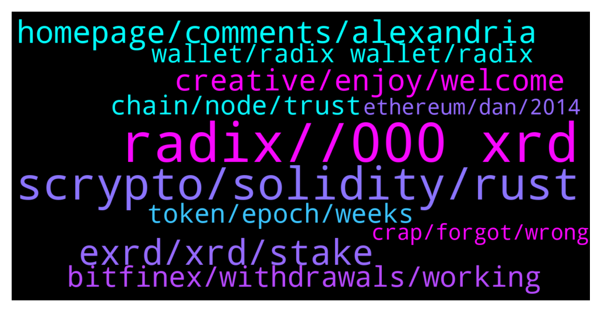

# **@radix_dlt**
 ## Analysis for **2021-12-17** - **2021-12-18**.

---

## 📊 **Basic Stats**

**n_messages_sent**: 692

---

---

## 🔝 **Top keywords and related messages**

1. **radix, , 000 xrd**

    @Alex --- *Hey guys I hope everyone is doing great! First of all I have to mention that I am a true believer of Radix and also heavily invested because I really believe in the project. The question now, why is Radix still so unknown within the Crypto Space, if the tech is so superior?* **--->** [TG Discussion](https://t.me/radix_dlt/323115)

    @fpieper --- *We have to retain our grace in conduct when representing the Radix project/community You can be proud of the project 🙏, but let's not be arrogant...  In the end, the crypto space will have to bundle forces around the best solutions to go up against the establishment Don't burn bridges by being abrasive  https://twitter.com/f_pieper/status/1471775375562878978* **--->** [TG Discussion](https://t.me/radix_dlt/322549)

    @ITProfligate --- *I think that there are two aspects to this. What is crypto which goes on to howto crypto aside from Bitcoin and Ethereum. From a high level it’s a bit tricky. But then there is what does Radix offer, which actually then, as you explore, offers insights into the high level things as you go along. So, to put it differently, there is a lot of detail about crypto - but still why?? But when you start to look at Radix a lot of thought has gone into what is coming on stream. So as you learn the details here other things make more sense. I would suggest for a software engineer they look at the resources available in various channels. I think a good place to start is here:- Russell’s Radiswap Review In this video, RDX Works CTO, Russell Harvey, compares how an automated market maker similar to Uniswap V2 would be made in Scrypto compared to Solidity. ...  https://youtu.be/Iblv3xeg4HM which is on the Push channel here:- https://t.me/RadixPush  There are also announcements on the Announcement channel for a lot of other materials. https://t.me/RadixAnnouncements  Then there are the DeFi white papers e.g. https://uploads-ssl.webflow.com/6053f7fca5bf627283b582c2/61bb693aa8d73b0d9d76cb6b_Radix%20DeFi%20White%20Paper%20v2.03%20(released).pdf This one being 35 pages.  And this one written up by Dan and others:- https://arxiv.org/abs/2008.04450 Cerberus: Minimalistic Multi-shard Byzantine-resilient Transaction Processing Jelle Hellings, Daniel P. Hughes, Joshua Primero, Mohammad Sadoghi  And the Cerberus paper: https://assets.website-files.com/6053f7fca5bf627283b582c2/608811e3f5d21f235392fee1_Cerberus-Whitepaper-v1.01.pdf Cerberus A Parallelized BFT Consensus Protocol for Radix Florian Cäsar florian@radixdlt.com Daniel P. Hughes dan@radixdlt.com Josh Primero josh@radixdlt.com Stephen J. Thornton steve@radixdlt.com  Then there is the developer channel here:-  https://t.me/RadixDevelopers Which is, as it says, with the goal of providing a place for developers and enthusiasts to chat about challenges, ideas and other dev related topics. Actually full of interesting and challenging discussion and very open to peoples’ ideas and questions.  I hope this helps.* **--->** [TG Discussion](https://t.me/radix_dlt/322440)

    @Zak --- *Apologies if this was already discussed, but I was curious if anyone on here has listened to Balaji Srinivasan’s last podcast with Tim Ferriss. The vision for crypto that Balaji lays out is compelling IMO and seems to me that Radix tech underpins the whole thing. I’d be curious to hear other listener’s thoughts. Thanks.   https://tim.blog/2021/11/15/balaji-srinivasan-2/* **--->** [TG Discussion](https://t.me/radix_dlt/323423)

    @radixmatt --- *Specifically if you're talking about smart contract developments, see our new Radix Ecosystem page! https://developers.radixdlt.com/ecosystem  This has just launched (along with the launch yesterday of Scrypto for building dApps, but expect developments to start showing up here in the near future). This is all early-access work with Scrypto, which is not yet available on the public network, but demonstrates the level of developer activity leading up to the release of Babylon when this capability does move onto the network.* **--->** [TG Discussion](https://t.me/radix_dlt/322316)

    @Alex --- *Thank you for the quick responses! And do you believe that, since the others have an advantage already market share wise, could not fix their chains, by somehow implementing the radix tech and never actually let radix take off?* **--->** [TG Discussion](https://t.me/radix_dlt/323124)

2. **scrypto, solidity, rust**

    @S --- *Is scrypto human-readable or compiled, btw?* **--->** [TG Discussion](https://t.me/radix_dlt/322630)

    @fpieper --- *You can watch or (skip through) this video - pointing out the differences between Scrypto and Solidity - it is mind blowing even if you don't understand all/much of it.  https://www.youtube.com/watch?v=Iblv3xeg4HM  TLDR: Scrypto is relatively easily readable even if you are not a developer and Solidity is kind of crazy.   Or this short intruduction to Scrypto: https://www.youtube.com/watch?v=Mu8L-BJFfQM I would say even if you don't have much prior developer experience it should be quite easy to follow what is happening in general* **--->** [TG Discussion](https://t.me/radix_dlt/322647)

    @S --- *Yes but there's always some risk associated with learning a DLT-specific language, especially in its early stages* **--->** [TG Discussion](https://t.me/radix_dlt/322593)

    @TheCodeisTheLaw --- *And that's what makes it more difficult to realize innovation in this space, it just takes more time for learning to occur. (ie new DLT architectures)* **--->** [TG Discussion](https://t.me/radix_dlt/323060)

    @S --- *e.g. do you mean solidity is mostly risky because it doesn't handle assets well?* **--->** [TG Discussion](https://t.me/radix_dlt/322623)

    @Jacob_XRD --- *There's more to #DeFi than flash loans and decentralized  exchanges.    This article explores the basics of how passive investing works, and how a $21 trillion industry could be reimagined in DeFi.   https://www.radixdlt.com/post/why-defi-is-the-future-of-passive-index-investing* **--->** [TG Discussion](https://t.me/radix_dlt/322712)

3. **exrd, xrd, stake**

    @vashqu --- *Ok thanks. And how come exrd is listed on exchanges whereas xrd is not* **--->** [TG Discussion](https://t.me/radix_dlt/323257)

    @NotBen --- *They can't. But as xrd is more widely available, exrd will become more and more de-emphasized, only used for niche applications* **--->** [TG Discussion](https://t.me/radix_dlt/322816)

    @h0ll0wstick --- *Ok then exrd will be the wxrd then* **--->** [TG Discussion](https://t.me/radix_dlt/322828)

    @MuchoZen --- *So what would be the use of exrd?* **--->** [TG Discussion](https://t.me/radix_dlt/322711)

    @MuchoZen --- *Now that is a good news. Florian does it mean exrd won't exist in the future? Everything will go back to xrd?* **--->** [TG Discussion](https://t.me/radix_dlt/322707)

    @Panther --- *hello sir. Why XRD was created. I see the IEO was only for eXRD.* **--->** [TG Discussion](https://t.me/radix_dlt/322277)

4. **homepage, comments, alexandria**

    @prookie --- *https://www.reddit.com/r/CryptoTechnology/comments/rh1m82/shifting_the_paradigm_for_dapp_development/  it tells me that there are 119 comments. but i can only see around 25 of them – anyone an idea, why?* **--->** [TG Discussion](https://t.me/radix_dlt/322342)

    @Ajdhughjgc --- *Glad to hear it will be fixed soon, Really appreciate your continuous presence and quick replies* **--->** [TG Discussion](https://t.me/radix_dlt/322317)

    @Adam_XRD --- *Ah, it's just not on the homepage any more. As we were doing the site changes for Alexandria we did a review of the homepage (as it's so long!) and found some parts are not used much or viewed.   In q1, some more things will get moved to their own pages, rather than being on the homepage based on this data as well.* **--->** [TG Discussion](https://t.me/radix_dlt/322328)

    @prookie --- *opening it in a fresh private tab does not show more comments either* **--->** [TG Discussion](https://t.me/radix_dlt/322346)

    @t_moth --- *When I found out about this it blew my mind. Completely wrong tool for the job* **--->** [TG Discussion](https://t.me/radix_dlt/322628)

    @munimit31 --- *Ok ..thanks for the update ..how about ledger x ?* **--->** [TG Discussion](https://t.me/radix_dlt/323356)

5. **creative, enjoy, welcome**

    @Blind5ight --- *Have you looked into this one? https://arxiv.org/abs/2110.10086* **--->** [TG Discussion](https://t.me/radix_dlt/322771)

    @katatatt --- *no worries, this is great thank you!* **--->** [TG Discussion](https://t.me/radix_dlt/322415)

    @Svenvestor --- *Come on give us some sugar! 😉* **--->** [TG Discussion](https://t.me/radix_dlt/323386)

    @Radstakes --- *Hi, welcome! Of course you can! check out the details here: https://www.radixdlt.com/post/alexandria-launch-creative-competition* **--->** [TG Discussion](https://t.me/radix_dlt/323477)

    @S --- *It's a very pleasant chain to use* **--->** [TG Discussion](https://t.me/radix_dlt/322852)

    @Blind5ight --- *Let us know what you want to learn more about and we can provide material for you to look into and judge for yourself* **--->** [TG Discussion](https://t.me/radix_dlt/322676)

6. **bitfinex, withdrawals, working**

    @Magal36 --- *Bitfinex is having issues with their node, expect a day or two without withdrawals* **--->** [TG Discussion](https://t.me/radix_dlt/322274)

    @Khan4486 --- *Bitfinex saving us from that whale dumping on us 🙏* **--->** [TG Discussion](https://t.me/radix_dlt/322287)

    @dadbodhot --- *I think Bitfinex are having trouble with xrd withdrawals. You can head to their telegram for more assistance.   The official Bitfinex telegram channel. https://t.me/bitfinex* **--->** [TG Discussion](https://t.me/radix_dlt/322462)

    @israilito --- *Oooooh 😁, guess I have to create Bitfinex and Buy XRD first* **--->** [TG Discussion](https://t.me/radix_dlt/322980)

    @royaltlr --- *Sent XRD to Bitfinex not yesterday but day before and still hasn’t arrived. Submitted a deposit report because it’s all there on the blockchain. Was gonna sell that XRD - wtf so annoying 😤* **--->** [TG Discussion](https://t.me/radix_dlt/323088)

    @even_Phteven --- *Currently being addressed by bitfinex team* **--->** [TG Discussion](https://t.me/radix_dlt/322270)

7. **token, epoch, weeks**

    @Emmplex --- *Will there be any future burning of token?* **--->** [TG Discussion](https://t.me/radix_dlt/323174)

    @Twoez1911 --- *Fair enough. That makes sense. If you put it that way I finally understand what the reason behind this decision is. Cause I was thinking other tokens very often have a single token indicator that is spread around multiple networks being pegged to the initial token, but then again yea these have a very big risk of sending your money to the wrong chain.* **--->** [TG Discussion](https://t.me/radix_dlt/322733)

    @coathanger1 --- *can anyone help me with doing faster drops for my token project? i've been doing them manually* **--->** [TG Discussion](https://t.me/radix_dlt/323375)

    @Blind5ight --- *Coingecko is correct, CMC is lagging* **--->** [TG Discussion](https://t.me/radix_dlt/322683)

    @vashqu --- *And could you explain me the point of having an Eric20 token for a layer1?* **--->** [TG Discussion](https://t.me/radix_dlt/323255)

    @yr12345678 --- *Probably better to just google that if you have no specific coins in mind... For bitcoin you could use this for example: https://bitinfocharts.com/top-100-richest-bitcoin-addresses.html.* **--->** [TG Discussion](https://t.me/radix_dlt/323405)

8. **chain, node, trust**

    @NotBen --- *why wouldn't one network be able to support the world's uses? the only people advocating for a truly multi-chain future are the people with technology that can't scale* **--->** [TG Discussion](https://t.me/radix_dlt/322891)

    @S --- *i.e. how the NEAR paper describes it: all the new nodes that spin up for the first time will have no information to tell which chain was created first, and will choose the longer chain produced by an attacker. To avoid it, they need to somehow learn off-chain about the canonical chain, effectively forcing them to identify someone whom they trust in the network.* **--->** [TG Discussion](https://t.me/radix_dlt/322776)

    @Gumbree --- *Never going to happen in decentralized network. Brainlets will get scammed eitherway* **--->** [TG Discussion](https://t.me/radix_dlt/323111)

    @Blind5ight --- *There has been a lot of rushing in these space to get mind share, to get network effect This sacrificed the process of thinking it all through well (imo)* **--->** [TG Discussion](https://t.me/radix_dlt/322604)

    @mx471 --- *In principle, they all copy each other and try to achieve better numbers.* **--->** [TG Discussion](https://t.me/radix_dlt/323136)

    @S --- *his 'slight' change is picking a trusted node* **--->** [TG Discussion](https://t.me/radix_dlt/322775)

9. **wallet, radix wallet, radix**

    @xWrath --- *Been waiting for my deposit to clear for over 2 days now, submitted a support ticket and they said they are working on it but nothing* **--->** [TG Discussion](https://t.me/radix_dlt/323078)

    @Ben_XRD --- *Wasn't aware people were depositing without being credited. Will get on this.* **--->** [TG Discussion](https://t.me/radix_dlt/323034)

    @Ashley --- *withdrawal completed and in my radix wallet!* **--->** [TG Discussion](https://t.me/radix_dlt/322572)

    @israilito --- *Found it , I've to create a wallet first I guess* **--->** [TG Discussion](https://t.me/radix_dlt/322967)

    @mx471 --- *You get 1 XRD? Why didn't I receive an XRD? Is this only for people with a fresh wallet?* **--->** [TG Discussion](https://t.me/radix_dlt/322983)

    @munimit31 --- *Can I store Radix in hardware wallets ? And do staking ?* **--->** [TG Discussion](https://t.me/radix_dlt/323351)

10. **crap, forgot, wrong**

    @katatatt --- *oh that's different from what I read too* **--->** [TG Discussion](https://t.me/radix_dlt/323236)

    @S --- *Kek I've already been called a Fudder in this tg* **--->** [TG Discussion](https://t.me/radix_dlt/322920)

    @h0ll0wstick --- *But you could say who is using near haha 😄  (I like near i just joke)* **--->** [TG Discussion](https://t.me/radix_dlt/322844)

    @sebcrypto --- *crap. what are you telling me* **--->** [TG Discussion](https://t.me/radix_dlt/322368)

    @TheCodeisTheLaw --- *This might be the one actually* **--->** [TG Discussion](https://t.me/radix_dlt/322805)

    @keysoverseas9 --- *and not just one of your friends hehe* **--->** [TG Discussion](https://t.me/radix_dlt/322355)

