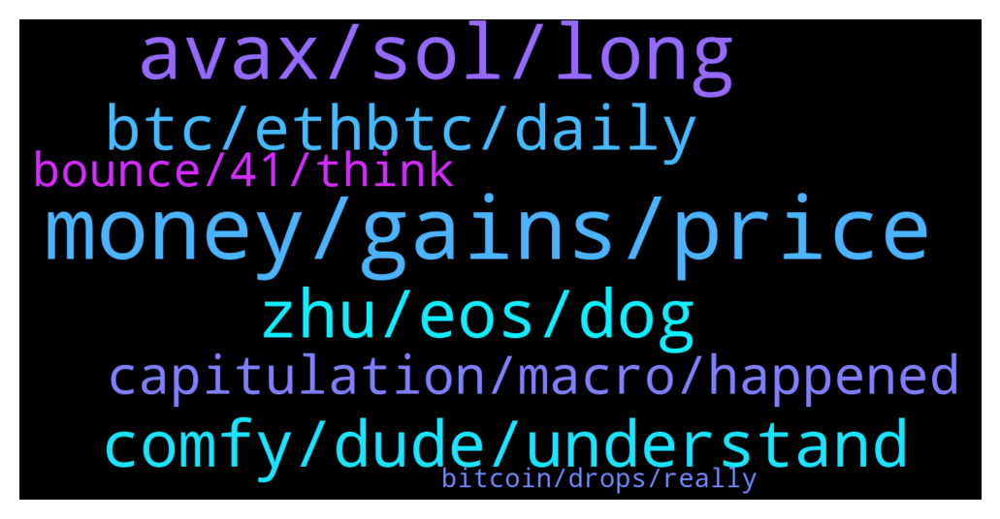

# **@shitpool**
 ## Analysis for **2021-12-17** - **2021-12-18**.

---

## 📊 **Basic Stats**

**n_messages_sent**: 357

---

---

## 🔝 **Top keywords and related messages**

1. **money, gains, price**

    @CharliePolite --- *All I’m saying is: Protect some of your gains (potentially offsetting slightly your earnings.) to avoid being put in a position of emotional decision making.* **--->** [TG Discussion](https://t.me/shitpool/709449)

    @NotTheGodfather --- *everyone thinks its going down so they chasing after stuff with good stable lending APYs* **--->** [TG Discussion](https://t.me/shitpool/709785)

    @CharliePolite --- *What does the price have to do with being optimistic. If you want us the cheerlead your bags you are better off somewhere else.  We are in a trading room, which means we look at the price and try to make educated bets as to where the price is going.* **--->** [TG Discussion](https://t.me/shitpool/709482)

    @BeAMightyKing --- *apparently there are still 2017 coins on there with almost 4 year downtrends  https://www.tradingview.com/x/eZLXxBCS/* **--->** [TG Discussion](https://t.me/shitpool/709893)

    @EmotionLotion --- *I dream that sol goes below coinmambas sell price* **--->** [TG Discussion](https://t.me/shitpool/709466)

    @CharliePolite --- *That may be the case but do you really want to be holding to $30?* **--->** [TG Discussion](https://t.me/shitpool/709458)

2. **avax, sol, long**

    @wonderwarraior --- *Volatility is part of crypto. If one has so many personal problems, they should not be involving themselves with cryptocurrency* **--->** [TG Discussion](https://t.me/shitpool/709448)

    @wonderwarraior --- *Biggest winners in crypto currency are the people who hold good coins for a long term* **--->** [TG Discussion](https://t.me/shitpool/709462)

    @MasterOfCoin90 --- *Crypto is becoming less decentralized and more manipulate in time span. Is like bigger fish gets the most and if they are not happy and want more, they also eat the small fishes too.  The crypto game is simple, you will never be a whale when there are pre-made whales since the beginning* **--->** [TG Discussion](https://t.me/shitpool/709703)

    @SupreemKai --- *a friend asked for advice on a portfolio for crypto. have advised on usual reliable long term investments -- he said he has 10% reserved for a high risk, high gain short to long term project. I'm thinking TIME, or SPELL... what would the gentlemen in this channel say?* **--->** [TG Discussion](https://t.me/shitpool/709107)

    @wonderwarraior --- *I thought you guys would be more optimistic about crypto* **--->** [TG Discussion](https://t.me/shitpool/709479)

    @wonderwarraior --- *its only a dip because of macro environment,certain categories of crypto are doing very well* **--->** [TG Discussion](https://t.me/shitpool/709439)

3. **zhu, eos, dog**

    @CharliePolite --- *I’m legitimately worried he might be retarded.* **--->** [TG Discussion](https://t.me/shitpool/709655)

    @primalfaith --- *Tai Lopez at it again 🤪* **--->** [TG Discussion](https://t.me/shitpool/709891)

    @NotTheGodfather --- *yeah but if hes a big dog nothing he posts is going to be helpful to the plebs* **--->** [TG Discussion](https://t.me/shitpool/709059)

    @NotTheGodfather --- *obviously he's going to lead the herd in the wrong direction, just like every other "influencer" on CT* **--->** [TG Discussion](https://t.me/shitpool/709060)

    @wojackdegreate --- *Lately he has been doing too much liquidity farming lol, people catching on. Mans had to limit comments. Lol* **--->** [TG Discussion](https://t.me/shitpool/709065)

    @yesbutalsono --- *wen pervy boy was back in college* **--->** [TG Discussion](https://t.me/shitpool/709151)

4. **comfy, dude, understand**

    @BeAMightyKing --- *a very select few lol, let's be real* **--->** [TG Discussion](https://t.me/shitpool/709881)

    @CharliePolite --- *Dude, just please shut the fuck up.* **--->** [TG Discussion](https://t.me/shitpool/709665)

    @Horselorde --- *Those are comfy but more than I care to spend lol* **--->** [TG Discussion](https://t.me/shitpool/709149)

    @wojackdegreate --- *We all learned the hard lessons here 😂* **--->** [TG Discussion](https://t.me/shitpool/709379)

    @goldencatpat --- *some people need confirmation they're losers* **--->** [TG Discussion](https://t.me/shitpool/709136)

    @Rjknew --- *Bro why are you fooling yourself* **--->** [TG Discussion](https://t.me/shitpool/709820)

5. **btc, ethbtc, daily**

    @grammi --- *Probably 50% of whatever btc I have remaining. The rest will just collect dust forever* **--->** [TG Discussion](https://t.me/shitpool/709227)

    @AsianFever --- *found anything decent vs btc? how about that ONE?* **--->** [TG Discussion](https://t.me/shitpool/709892)

    @grammi --- *Ppl are also not appreciating that btc can make new ath and still get flipped. Meaning both can still go up, one just up much less* **--->** [TG Discussion](https://t.me/shitpool/709233)

    @UltraInstinctJose --- *Damn. YFI going to 100k before BTC* **--->** [TG Discussion](https://t.me/shitpool/709293)

    @sumtemm --- *Yeah wouldnt say its everyone in here but the generation that hates btc likely already started* **--->** [TG Discussion](https://t.me/shitpool/709077)

    @sumtemm --- *doesnt mean btc cant run anymore* **--->** [TG Discussion](https://t.me/shitpool/709079)

6. **capitulation, macro, happened**

    @kimpatt --- *no , people already capitulated in liquidation candle on 3rd* **--->** [TG Discussion](https://t.me/shitpool/709155)

    @kimpatt --- *well, imagination works both ways lol ... we can go up too but only confirmation can tell where we lead to* **--->** [TG Discussion](https://t.me/shitpool/709178)

    @sumtemm --- *imagine the capitulation if we went lower tho* **--->** [TG Discussion](https://t.me/shitpool/709157)

    @wojackdegreate --- *At the very best we have one more leg up, and that is very debatable if it even happens at this point.* **--->** [TG Discussion](https://t.me/shitpool/709339)

    @Xuvinator --- *Augusto say some bearish things we need to go up!* **--->** [TG Discussion](https://t.me/shitpool/709106)

    @wojackdegreate --- *Yep. Also if we bounce and recover there will be more opportunities to be had.* **--->** [TG Discussion](https://t.me/shitpool/709581)

7. **bounce, 41, think**

    @CharliePolite --- *If I’d make a bet I’d bet we go to 41 and bounce and then back to 53 eventually and then 30-25 to rekt evweyone* **--->** [TG Discussion](https://t.me/shitpool/709509)

    @EmotionLotion --- *i don't think we go lower than 41 here* **--->** [TG Discussion](https://t.me/shitpool/709540)

    @yesbutalsono --- *I think the time bottom is in* **--->** [TG Discussion](https://t.me/shitpool/709037)

    @EmotionLotion --- *as for 24, i think its possible* **--->** [TG Discussion](https://t.me/shitpool/709542)

    @wojackdegreate --- *Agreed, slight chance here. 41-44 is good. All the big buy walls are down at 40keks* **--->** [TG Discussion](https://t.me/shitpool/709572)

    @wojackdegreate --- *Yea 38k maybe, who knows. I'm not gonna ape in right away.* **--->** [TG Discussion](https://t.me/shitpool/709109)

