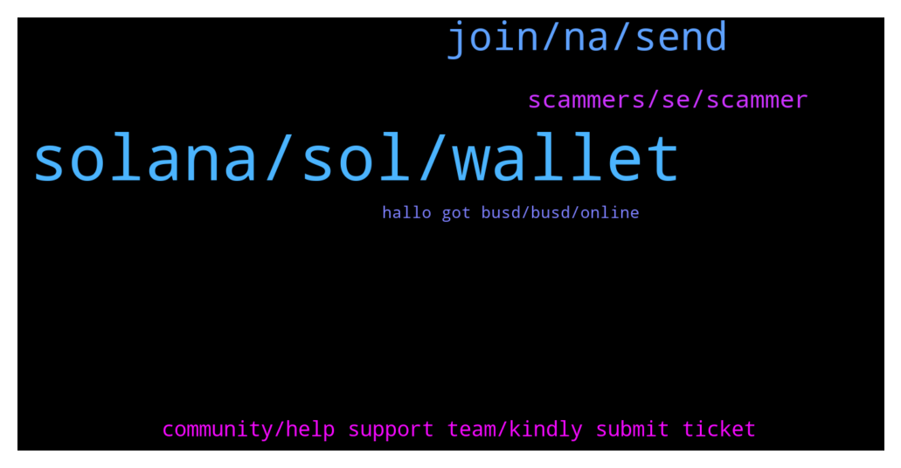

# **@solana**
 ## Analysis for **2021-12-17** - **2021-12-18**.

---

## 📊 **Basic Stats**

**n_messages_sent**: 327

---

---

## 🔝 **Top keywords and related messages**

1. **solana, sol, wallet**

    @Darmak1 --- *Hello I am on call with someone from administrator of solana is this true call?* **--->** [TG Discussion](https://t.me/solana/870882)

    @Michael_katchenCEO --- *How can I swap minerum bsc ?* **--->** [TG Discussion](https://t.me/solana/870845)

    @nakamoto58 --- *Can i mine solana as bitcoin?* **--->** [TG Discussion](https://t.me/solana/872194)

    @cryptolover1987 --- *Hello !!  Try this👇🏻👇🏻 Yield farming/ lending/borrowing platforms :  1️⃣ Oxygen  It is a DeFi Prime Brokerage Protocol built for the future to support 100s of millions of people. It can help you, as a holder of digital assets, generate liquidity, earn yield, borrow assets to go short, get trading leverage against portfolio of assets.   🔗https://www.oxygen.org/  2️⃣Solaris  It is a Lending/Borrowing protocol that brings Flashloans to Solana blockchain (inspired by Aave and Compound)  🔗https://solana.com/ecosystem/solaris  3️⃣ Orca  you can provide liquidity to a trading pool to earn trading fees.  🔗https://www.orca.so/pools  4️⃣ Raydium  🔗 https://raydium.io/farms/  5️⃣ Jet protocol  Jet Protocol is a borrowing and lending protocol built on the Solana blockchain.  🔗 https://www.jetprotocol.io  6️⃣ Solfarm SolFarm is the first yield aggregation platform built on Solana with auto-compounding vault strategies.  🔗 https://solfarm.io  7️⃣ Solend Soled is an algorithmic, decentralized protocol for lending and borrowing.   🔗 https://solend.fi* **--->** [TG Discussion](https://t.me/solana/871356)

    @cryptolover1987 --- *Hello!  Mining is not possible.Solana is a Proof-of-Stake (PoS) network with delegations. So you can stake and earn!  Staking options are:👇🏻👇🏻  https://t.me/solana/758519* **--->** [TG Discussion](https://t.me/solana/872210)

    @cryptolover1987 --- *You should check these defi projects   https://solana.com/ecosystem?categories=defi* **--->** [TG Discussion](https://t.me/solana/871546)

2. **join, na, send**

    @KING OF THE SNOT --- *don't need help just saying hello to everyone* **--->** [TG Discussion](https://t.me/solana/871468)

    @mahib45 --- *Hello  Please write your question here! ❤* **--->** [TG Discussion](https://t.me/solana/871715)

    @Abi... --- *Heyyy.... Nicole. How are you doing today? Can I send you a private message ?* **--->** [TG Discussion](https://t.me/solana/871043)

    @Dbdbdna --- *Wish you all the best in your life❤🤣🤣🤣🤣🤣* **--->** [TG Discussion](https://t.me/solana/871800)

    @ghanemfeki --- *So cam you answer me for my question* **--->** [TG Discussion](https://t.me/solana/871714)

    @cryptolover1987 --- *Please give me link in PM* **--->** [TG Discussion](https://t.me/solana/872223)

3. **scammers, se, scammer**

    @Consultwithtee --- *Please family stay away from these scammers. I called them out and they kicked me out😂🤷🏾‍♀️. Idc I hope someone out of those 33,000 saw my msg before I was booted. You don’t do that to ppl that’s wrong.  I hope everyone has a beautiful day!!! ❤️❤️❤️❤️❤️* **--->** [TG Discussion](https://t.me/solana/870571)

    @DesktopCommando --- *5x Customer Support - 8 x Admins - 2 x Help desk - 3 x Tech support - 7 x Moderators - Need to clean the scammers from the members section* **--->** [TG Discussion](https://t.me/solana/870764)

    @LEW15 --- *Too many scammers its unreal  someone lost 15k cpl weeks back* **--->** [TG Discussion](https://t.me/solana/872253)

    @nakamoto58 --- *There are a lot of scammers, and I trolled two of them* **--->** [TG Discussion](https://t.me/solana/872224)

    @MarcBMW --- *Your going to get pm from every scammer in here  Do not respond to the PM they're thieves* **--->** [TG Discussion](https://t.me/solana/871247)

    @zarkathus --- *No way to be true. Just another scammers sh#* **--->** [TG Discussion](https://t.me/solana/870752)

4. **community, help support team, kindly submit ticket**

    @mahib45 --- *Please forward your question to their community!* **--->** [TG Discussion](https://t.me/solana/872276)

    @mahib45 --- *Kindly submit a ticket for help from their support team!  https://help.phantom.app/hc/en-us/requests/new* **--->** [TG Discussion](https://t.me/solana/871305)

    @cryptolover1987 --- *Kindly submit a ticket for help from their support team!  https://help.phantom.app/hc/en-us/requests/new* **--->** [TG Discussion](https://t.me/solana/871224)

    @aliccced --- *$NORD is a good fit for you because the community is incredibly responsive.* **--->** [TG Discussion](https://t.me/solana/871290)

    @Dbdbdna --- *I have nice message for them* **--->** [TG Discussion](https://t.me/solana/870886)

    @nakamoto58 --- *Can u send link to their community?* **--->** [TG Discussion](https://t.me/solana/872277)

5. **hallo got busd, busd, online**

    @Minitw --- *Hallo i got busd i want to swap it is support or admin online* **--->** [TG Discussion](https://t.me/solana/871245)

    @SamundraSen --- *I want to talk with admin* **--->** [TG Discussion](https://t.me/solana/870659)

    @kayrules --- *careful my friend. admin wont normally pm anybody first.* **--->** [TG Discussion](https://t.me/solana/870888)

    @Larry --- *Admin will not Dm, I got Dm from support team too* **--->** [TG Discussion](https://t.me/solana/870859)

    @Mars --- *Hallo i got busd i want to swap it is support or admin online* **--->** [TG Discussion](https://t.me/solana/870843)

