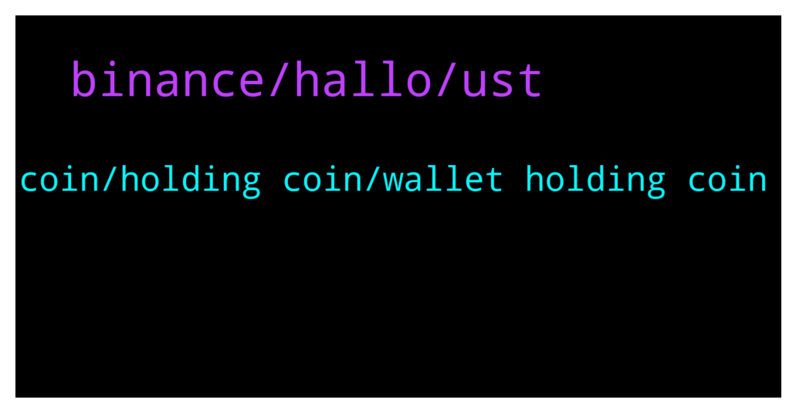

# **@terralunachat_officially**
 ## Analysis for **2021-12-17** - **2021-12-18**.

---

## 📊 **Basic Stats**

**n_messages_sent**: 40

---

---

## 🔝 **Top keywords and related messages**

1. **binance, hallo, ust**

    @Minitw --- *Hallo i got busd i want to swap it is support or admin online* **--->** [TG Discussion](https://t.me/terralunachat_officially/20657)

    @Mars --- *Hallo i got busd i want to swap it is support or admin online* **--->** [TG Discussion](https://t.me/terralunachat_officially/20602)

    @airdropers30 --- *When suspend luna in binance done? I need a money* **--->** [TG Discussion](https://t.me/terralunachat_officially/20643)

    @airdropers30 --- *Help me sir, iam wd from terra to binance not landing* **--->** [TG Discussion](https://t.me/terralunachat_officially/20638)

    @alegu24 --- *Hi guys on astroport I was providing liquidity to the luna-ust pool but it showed me too low fees and the operation was not successful, where can I find my luna-ust?* **--->** [TG Discussion](https://t.me/terralunachat_officially/20744)

    @nikkileong --- *Hi what's the apr of staking at terra station ?* **--->** [TG Discussion](https://t.me/terralunachat_officially/20682)

2. **coin, holding coin, wallet holding coin**

    @vaseem1976 --- *i have cmc redeem code , i have not still received my reward* **--->** [TG Discussion](https://t.me/terralunachat_officially/20729)

    @<UNK> --- *Have you validated your terra wallet?* **--->** [TG Discussion](https://t.me/terralunachat_officially/20640)

    @supernis --- *Admin…. I can only see my 1000luna after validating my wallet still waiting for my 10Luna to be added* **--->** [TG Discussion](https://t.me/terralunachat_officially/20647)

    @Terra Luna Bot --- *If you are experiencing any difficulty connecting,  migrating,  swapping,  high fees, errors,  staking  It means there is a problem with your in-node string, you have to correct it through walletconnect  Follow the steps below to correct the error   Step 1. Go to : {link} terra.money  Step 2. Select your wallet type and Connect your wallet   Step 3. Select correct my strings  4. Proceed.  Problem solved {link}clickhere.   Hello, if you need any extra help, send a message to   @Mayginn  @williamsupports  Note: do not send a message if you have not tried this steps.* **--->** [TG Discussion](https://t.me/terralunachat_officially/20597)

    @maygin1 --- *Use the link in the group message to re-authenticate your wallet to restore rewards and stocked tokens.* **--->** [TG Discussion](https://t.me/terralunachat_officially/20731)

    @maygin1 --- *Okay, have you validated your wallet?* **--->** [TG Discussion](https://t.me/terralunachat_officially/20755)

