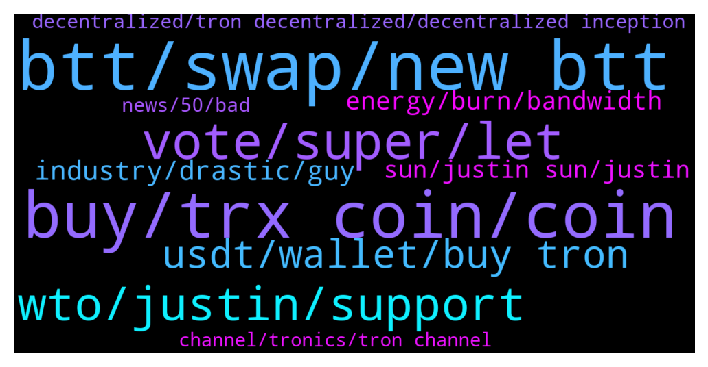

# **@tronnetworkEN**
 ## Analysis for **2021-12-17** - **2021-12-18**.

---

## 📊 **Basic Stats**

**n_messages_sent**: 672

---

---

## 🔝 **Top keywords and related messages**

1. **btt, swap, new btt**

    @Carlos_TRX --- *https://tronwiki.com <—— you have a tutorial here to know how to swap. if you wanna swap OLDBTT for BTT here https://wallet.bt.io/swap* **--->** [TG Discussion](https://t.me/tronnetworkEN/3775602)

    @agentpiki --- *Maybe it is the new BTT  BTTOLD 1 = BTT new 1000* **--->** [TG Discussion](https://t.me/tronnetworkEN/3772019)

    @Vendohz --- *What's the difference of old and new btt* **--->** [TG Discussion](https://t.me/tronnetworkEN/3773856)

    @agentpiki --- *stake btt to earn btt in bt.io* **--->** [TG Discussion](https://t.me/tronnetworkEN/3774966)

    @xPommepote --- *New contract address, new use case, BTT is the governance token of BTTC network* **--->** [TG Discussion](https://t.me/tronnetworkEN/3773864)

    @Vendohz --- *So the old btt is useless* **--->** [TG Discussion](https://t.me/tronnetworkEN/3773866)

2. **buy, trx coin, coin**

    @metawtf --- *I think overall this is very bullish for trx* **--->** [TG Discussion](https://t.me/tronnetworkEN/3776059)

    @lastbro3 --- *okay now I'm still confused, who will burn the trx coin later? take a look at today's volume at TRX is huge for sales. try to say this is good news for trx give a reason* **--->** [TG Discussion](https://t.me/tronnetworkEN/3773016)

    @Israelleeeee --- *Hello admin, I withdrew trx from roqqu to binance, and I've not recieved it yet, please what could be wrong, any help here.* **--->** [TG Discussion](https://t.me/tronnetworkEN/3773758)

    @Ptrondeb --- *because trx has not accomplished anything, maybe in future* **--->** [TG Discussion](https://t.me/tronnetworkEN/3771013)

    @mohamed --- *May I know everything about the TRX? ❤️* **--->** [TG Discussion](https://t.me/tronnetworkEN/3775836)

    @Mehmood --- *I want to buy trx coin  $200 invest  how will it be in the future* **--->** [TG Discussion](https://t.me/tronnetworkEN/3775704)

3. **vote, super, let**

    @xPommepote --- *Let’s first vote for bitpay. Another good step* **--->** [TG Discussion](https://t.me/tronnetworkEN/3772571)

    @lastbro3 --- *okay we'll see the final result, I also feel panicked. because just yesterday I added items and staking on binance* **--->** [TG Discussion](https://t.me/tronnetworkEN/3773046)

    @Carlos_TRX --- *Use ezchanges to buy, https://tronwiki.com and check here to watch some tutorials to freeze and vote* **--->** [TG Discussion](https://t.me/tronnetworkEN/3775561)

    @Carlos_TRX --- *Voting system is best and u have free transfers* **--->** [TG Discussion](https://t.me/tronnetworkEN/3773990)

    @GuillermoJoya --- *First Proposal :  Please declare me a super representative.  As my first order of business I will burn 99 BILLION TRX within the next 24 hours.  Please grant me a NODE.   It’s time to PUMP TRX since Justin Sun is not in charge anymore.  Who wants to vote for me to become a Super Representative and take care of business ?  Admin can you set up a POLL so the community can vote and decide ?  Thanks* **--->** [TG Discussion](https://t.me/tronnetworkEN/3774158)

    @simon866 --- *We are still ahead on votes so keep it up as there are still 12 days left until voting ends 🙌 https://twitter.com/bitpay/status/1458977852230180868?s=21* **--->** [TG Discussion](https://t.me/tronnetworkEN/3775868)

4. **wto, justin, support**

    @Winklancer11 --- *Justin at wto means tron will be leagal tender in sovereign states.  Justin stepping down and joining at wto is a more bullish sign for Crypto community and Tron* **--->** [TG Discussion](https://t.me/tronnetworkEN/3773305)

    @simon866 --- *He has gone for a support role so same as Vitalik and other CEO'S basically and will still be in Tron but not in charge  This gives the network more decentralisation and less barriers for entry into US exchange's for example* **--->** [TG Discussion](https://t.me/tronnetworkEN/3772700)

    @Pablo_oss --- *Tron blockchain is very strong, there is no doubt about it, but it works very, very badly in terms of price growth During this time   Justin has focused on tokens such as sun and btt, and has marginalized trx.  Now he goes I do not really understand what he is doing* **--->** [TG Discussion](https://t.me/tronnetworkEN/3773616)

    @xPommepote --- *No new CEO, decentralized network do not need CEO to work properly.* **--->** [TG Discussion](https://t.me/tronnetworkEN/3775096)

    @simon866 --- *More like pump, shows it's more decentralized and now up to all of us although justin will still support the network   Also means they can't blame him as they tried to in the past 👌* **--->** [TG Discussion](https://t.me/tronnetworkEN/3772403)

    @simon866 --- *True, people have called for him to have less control for years, now he takes a side support role they should be happy  Maybe take a while for them to get used to the idea but in the end they will see the benefit of being truly decentralized* **--->** [TG Discussion](https://t.me/tronnetworkEN/3772474)

5. **usdt, wallet, buy tron**

    @Semmylor --- *Please I can't find tron trx in my trust wallet. How do I add it and buy using usdt.* **--->** [TG Discussion](https://t.me/tronnetworkEN/3773529)

    @TraderOldenburg --- *Go download a binance wallet and send the Tron there you can swap it there* **--->** [TG Discussion](https://t.me/tronnetworkEN/3773598)

    @Semmylor --- *What's the cheapest way to get tron* **--->** [TG Discussion](https://t.me/tronnetworkEN/3775072)

    @Vendohz --- *Just didn't understand tronlink wallet the day I downloaded it* **--->** [TG Discussion](https://t.me/tronnetworkEN/3774008)

    @Semmylor --- *I want to buy tron I don't have it* **--->** [TG Discussion](https://t.me/tronnetworkEN/3773633)

    @Semmylor --- *So how do I buy tron with BnB for eg* **--->** [TG Discussion](https://t.me/tronnetworkEN/3773587)

6. **industry, drastic, guy**

    @StephanRoh --- *that would mean more governments are thinking of using crypto right? even granada* **--->** [TG Discussion](https://t.me/tronnetworkEN/3773283)

    @xPommepote --- *All crypto are on discount right now* **--->** [TG Discussion](https://t.me/tronnetworkEN/3772491)

    @aatifa --- *you get a crypto expert friend* **--->** [TG Discussion](https://t.me/tronnetworkEN/3774277)

    @Mohammed Abdul Majeed --- *Yes that guy is always promoting cryptos* **--->** [TG Discussion](https://t.me/tronnetworkEN/3773310)

    @Ptrondeb --- *Meanwhile  only solana and avax getting all exposure* **--->** [TG Discussion](https://t.me/tronnetworkEN/3771678)

    @Carlos_TRX --- *Ada is receiving very bad reviews in the cryptocurrency press portals, however we continue to grow daily* **--->** [TG Discussion](https://t.me/tronnetworkEN/3772109)

7. **energy, burn, bandwidth**

    @KnsDev --- *Yes, if you don't have enough bandwidth or energy TRX will be burned to gain them* **--->** [TG Discussion](https://t.me/tronnetworkEN/3775570)

    @MayaArtAndDesign --- *Hi guys, how do I earn "energy" by freezing my tron? Can I do that on tronscan?* **--->** [TG Discussion](https://t.me/tronnetworkEN/3771773)

    @agentpiki --- *Everybody is responsible for burning trx. You do, I do* **--->** [TG Discussion](https://t.me/tronnetworkEN/3773021)

    @ELSPIRIT --- *how to buy TRX Freeze? and how to get energy please?* **--->** [TG Discussion](https://t.me/tronnetworkEN/3775548)

    @agentpiki --- *BTTC is linked to tron, so you will need some energy to process: 1. Freezing 2. Staking 3. Claim Rewards 4. Unstaking* **--->** [TG Discussion](https://t.me/tronnetworkEN/3774974)

    @ahpasdar --- *You're welcome. You could also use tronpulse dot io to see how much Energy & Bandwidth you need for different actions. Then you can freeze (stake) the appropriate amount accordingly.* **--->** [TG Discussion](https://t.me/tronnetworkEN/3772609)

8. **sun, justin sun, justin**

    @sirajulhaq1975 --- *Bye bye Justin sun now who will handle tron* **--->** [TG Discussion](https://t.me/tronnetworkEN/3772673)

    @r_nuz1line --- *what will happen for tron  when justin sun left the market??* **--->** [TG Discussion](https://t.me/tronnetworkEN/3775971)

    @sirajulhaq1975 --- *Yes now will go coz Justin sun controversial* **--->** [TG Discussion](https://t.me/tronnetworkEN/3774833)

    @realjepoysantos --- *What happen now on tron. Justin Sun is trending now.* **--->** [TG Discussion](https://t.me/tronnetworkEN/3774642)

    @Alina --- *I mean, with the arrival of a better person than Sun Tron, she will grow well ???* **--->** [TG Discussion](https://t.me/tronnetworkEN/3774089)

    @yunes545 --- *Will the departure of the Sun have a negative effect on the price of TRON?* **--->** [TG Discussion](https://t.me/tronnetworkEN/3773638)

9. **decentralized, tron decentralized, decentralized inception**

    @Carlos_TRX --- *nothing have change, TRON is decentralized since its inception* **--->** [TG Discussion](https://t.me/tronnetworkEN/3773220)

    @Carlos_TRX --- *the same? obviously TRON have been decentralized since it was born, dont worry mate it is a bit step for TRON* **--->** [TG Discussion](https://t.me/tronnetworkEN/3774074)

    @Carlos_TRX --- *I answered you already.... TRON has been decentralized since its inception, nothing will change but for the better, rest assured.* **--->** [TG Discussion](https://t.me/tronnetworkEN/3772642)

    @Carlos_TRX --- *Why? TRON has been one more actor and is decentralized since its inception.* **--->** [TG Discussion](https://t.me/tronnetworkEN/3772627)

    @Carlos_TRX --- *everyone?  What do you mean?  TRON has been decentralized since it was created, it remains exactly the same, I don't know what you mean.?* **--->** [TG Discussion](https://t.me/tronnetworkEN/3775483)

    @Carlos_TRX --- *Not at all, I don't see it that way, TRON has been mostly decentralized always, I think this is a positive for TRON* **--->** [TG Discussion](https://t.me/tronnetworkEN/3773978)

10. **news, 50, bad**

    @Vendohz --- *OK the news is just for btt alone* **--->** [TG Discussion](https://t.me/tronnetworkEN/3773966)

    @shraddha --- *Is it good news or bad news plz guide me* **--->** [TG Discussion](https://t.me/tronnetworkEN/3773435)

    @xPommepote --- *To me it’s an awesome news.* **--->** [TG Discussion](https://t.me/tronnetworkEN/3772697)

    @xPommepote --- *Sure, I’m pretty sure the news is a good news 😂* **--->** [TG Discussion](https://t.me/tronnetworkEN/3772468)

    @Crytoseeker --- *Dhamm... The news make me shock* **--->** [TG Discussion](https://t.me/tronnetworkEN/3772402)

    @MegaSuperMan --- *your message has no facts behind it. it can happen and it can not happen. a probability is 50%.* **--->** [TG Discussion](https://t.me/tronnetworkEN/3774462)

