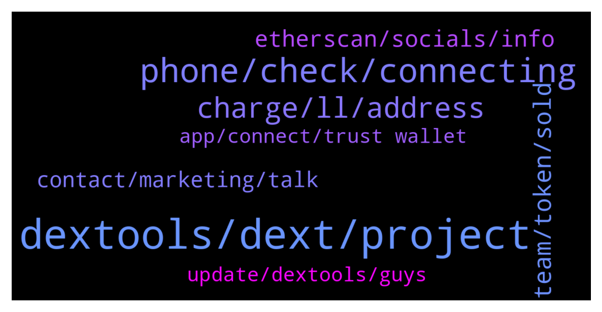

# **@DEXToolsCommunity**
 ## Analysis for **2021-12-17** - **2021-12-19**.

---

## 📊 **Basic Stats**

**n_messages_sent**: 224

---

---

## 🔝 **Top keywords and related messages**

1. **dextools, dext, project**

    @nachivacrypto --- *Hi, can I ask where does dextools obtain token information from , eg. website, socials etc? Is it something that is submitted to dextools or just referenced from another source? Thanks.* **--->** [TG Discussion](https://t.me/DEXToolsCommunity/314080)

    @MaxPeterson --- *Thank you DEXTools community for introducing MetaBrands to us. Amazing project. Confident of success particularly in the long term for holders of NFT relics.* **--->** [TG Discussion](https://t.me/DEXToolsCommunity/314741)

    @R3XSupport --- *How do we know before coin is listed on dextool???* **--->** [TG Discussion](https://t.me/DEXToolsCommunity/314746)

    @Ezza7295 --- *My BSC token has 9k LP, how do I get it listed on Dextools?* **--->** [TG Discussion](https://t.me/DEXToolsCommunity/314872)

    @napascual --- *This is DEXT support. That should be asked on the private Dext Force chat* **--->** [TG Discussion](https://t.me/DEXToolsCommunity/313810)

    @vugarovich --- *Hi. I was wondering if there is any way to filter newly listed coins based on their Dext Score. Any help would be appreciated. Thanks.* **--->** [TG Discussion](https://t.me/DEXToolsCommunity/314546)

2. **phone, check, connecting**

    @DGman1 --- *any way i try connecting to the system and it does not allow me anymore* **--->** [TG Discussion](https://t.me/DEXToolsCommunity/314274)

    @victus5 --- *Yes bro they haven't updated it we applied* **--->** [TG Discussion](https://t.me/DEXToolsCommunity/314846)

    @DGman1 --- *so my phone doees not receive the notification to sing the trasnsaction* **--->** [TG Discussion](https://t.me/DEXToolsCommunity/314277)

    @DGman1 --- *yup not working  re powered up the phone* **--->** [TG Discussion](https://t.me/DEXToolsCommunity/314297)

    @VitalFox87 --- *And now it's not showing any data again* **--->** [TG Discussion](https://t.me/DEXToolsCommunity/314391)

    @kaspargalactic --- *It went back to the old number again. Please check dm if possilble* **--->** [TG Discussion](https://t.me/DEXToolsCommunity/314375)

3. **charge, ll, address**

    @bastardganpunk --- *😬 which address did he sent it to? I don’t know if there’s a possibility to send it back, but can try to request it* **--->** [TG Discussion](https://t.me/DEXToolsCommunity/314400)

    @scottcrypto11 --- *We have sent many message to Tommy and he is just not answering us... now what do we do* **--->** [TG Discussion](https://t.me/DEXToolsCommunity/314864)

    @napascual --- *That's not Frederic tag btw, it's @FredericDEXT. But he has tons of Dms so don't wait for him to respond immediately* **--->** [TG Discussion](https://t.me/DEXToolsCommunity/313819)

    @stanes --- *I hope he can see your badge 😅* **--->** [TG Discussion](https://t.me/DEXToolsCommunity/314270)

    @DGman1 --- *how do you find a person that works here??* **--->** [TG Discussion](https://t.me/DEXToolsCommunity/314252)

    @stanes --- *mmmh... could you try @TMCTG ? He is also involved in the Ventures part, he should be able to keep you in touch.* **--->** [TG Discussion](https://t.me/DEXToolsCommunity/314865)

4. **team, token, sold**

    @M O W E R --- *does that mean whatever we have to pay attention to the token ??* **--->** [TG Discussion](https://t.me/DEXToolsCommunity/314416)

    @Drcrypto --- *it says the team sold but they did not, this was just an early LP provider* **--->** [TG Discussion](https://t.me/DEXToolsCommunity/313880)

    @jimmyvee --- *I was a member, and then there was a mini-scandal where they changed some rules about the group, and they said we were allowed to sell our 100K DEXT and still retain our allocations.  So, I'm in the position of not being able to communicate with the team, yet I am due my tokens. Do you have an email address or other way I can contact Frederic?:  He does not respond to DM's on TG. Thanks.* **--->** [TG Discussion](https://t.me/DEXToolsCommunity/313813)

    @roni20212 --- *Can i swap this token busd to mongoose* **--->** [TG Discussion](https://t.me/DEXToolsCommunity/314797)

    @gumbercules --- *Usually a bad sign that the team is selling their tokens on you* **--->** [TG Discussion](https://t.me/DEXToolsCommunity/314417)

    @M O W E R --- *Team of this token has sold at least 10.88 BNB. Be aware of this token!* **--->** [TG Discussion](https://t.me/DEXToolsCommunity/314415)

5. **etherscan, socials, info**

    @stanes --- *I can't see your socials on Etherscan...* **--->** [TG Discussion](https://t.me/DEXToolsCommunity/314845)

    @stanes --- *Hi, we currently pull social info from: - BscScan - EtherScan - CoinGecko* **--->** [TG Discussion](https://t.me/DEXToolsCommunity/314081)

    @napascual --- *You're right, just checked. We get that info from different APIs like etherscan. Sometimes they fail identifying it* **--->** [TG Discussion](https://t.me/DEXToolsCommunity/313891)

    @stanes --- *About social Information for your token, please update etherscan.io or bscscan.com or coingecko.com  We pull info from there.* **--->** [TG Discussion](https://t.me/DEXToolsCommunity/314839)

    @Drcrypto --- *u can see on the etherscan* **--->** [TG Discussion](https://t.me/DEXToolsCommunity/313889)

    @stanes --- *This is why I asked "For how long the socials are showing on Etherscan?"... if they are not there we can't update ourselves 😉* **--->** [TG Discussion](https://t.me/DEXToolsCommunity/314848)

6. **contact, marketing, talk**

    @momcha1728 --- *I want promotion, who do I contact?* **--->** [TG Discussion](https://t.me/DEXToolsCommunity/314757)

    @thewiseone100 --- *who do i talk to about a proposal* **--->** [TG Discussion](https://t.me/DEXToolsCommunity/314378)

    @thewiseone100 --- *who can i talk about sponsorship or possbile collab* **--->** [TG Discussion](https://t.me/DEXToolsCommunity/314095)

    @thewiseone100 --- *Who can i talk to about marketing* **--->** [TG Discussion](https://t.me/DEXToolsCommunity/314094)

    @Cryptoquaantt --- *Whom shall i contact regarding an interesting marketing proposal* **--->** [TG Discussion](https://t.me/DEXToolsCommunity/313771)

    @A9jiushen --- *Hello, who to contact for business cooperation?* **--->** [TG Discussion](https://t.me/DEXToolsCommunity/314109)

7. **app, connect, trust wallet**

    @napascual --- *Mobile websockets are not the most stable connections on Trust wallet. They still need to improve a lot (even for Metamask). One trick is to wait on your trust wallet connect screen (instead of going back to the app) and wait until the app sends the Verification (sign) request to your app. For some reason, if you go back to the app the websocket sometimes stops sending data.* **--->** [TG Discussion](https://t.me/DEXToolsCommunity/314306)

    @bastardganpunk --- *i dont think you can connect trustwallet on phone* **--->** [TG Discussion](https://t.me/DEXToolsCommunity/314288)

    @DGman1 --- *my holding tokens are on trustwallet* **--->** [TG Discussion](https://t.me/DEXToolsCommunity/314286)

    @JoeyDieleman --- *You can but within the TrustWallet app on you mobile, so if you have the app on mobile in the Dapp browser of the app itself.* **--->** [TG Discussion](https://t.me/DEXToolsCommunity/314301)

    @bastardganpunk --- *he can’t connect trust wallet to dextools on phone* **--->** [TG Discussion](https://t.me/DEXToolsCommunity/314303)

    @DGman1 --- *my wallet does not connect is there anyne that can help* **--->** [TG Discussion](https://t.me/DEXToolsCommunity/313897)

