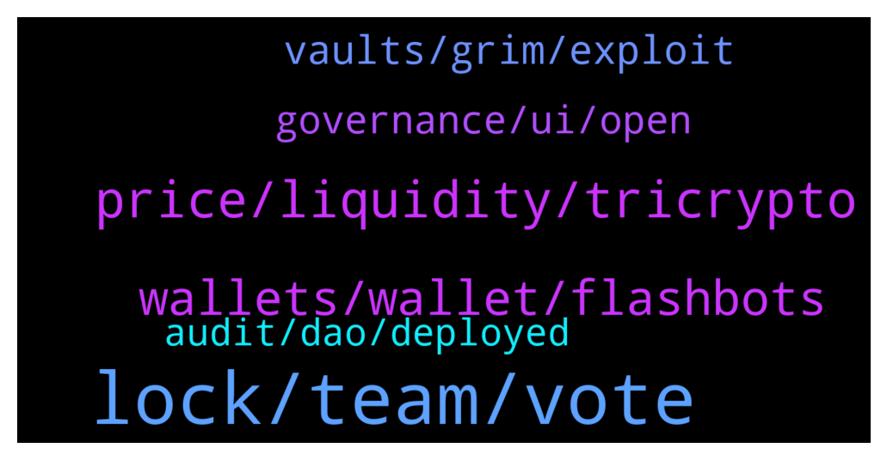

# **@lobsters_chat**
 ## Analysis for **2021-12-18** - **2021-12-19**.

---

## 📊 **Basic Stats**

**n_messages_sent**: 226

---

---

## 🔝 **Top keywords and related messages**

1. **lock, team, vote**

    @michaelams --- *So you mean they waited on purpose with the NFTs to get extra ETH out? Sick* **--->** [TG Discussion](https://t.me/lobsters_chat/308919)

    @ivangbi --- *Scammy af imho, by the sound of it. “hey u supported early and took risk, but fk u!”* **--->** [TG Discussion](https://t.me/lobsters_chat/308722)

    @Swader --- *It's just a familiarity issue where being exposed to something as divine (Coca Cola heals cancer, ads on TV and web) vs something infernal (NFTs are the root of all evil) you just get that sown into you. And normies did. The only way out is to produce normie friendly apps and more education. The way out is NOT letting Adidas and Nike mint 10k collections with 10% royalties on eth for 0.1 eth in gas cost alone, and preach "accessibility" on Twitter, but to actually do something meaningful (to these people) with NFTs.* **--->** [TG Discussion](https://t.me/lobsters_chat/308562)

    @ld206 --- *Unless they burned the admin key. For the lock on the chain. Lol* **--->** [TG Discussion](https://t.me/lobsters_chat/308724)

    @ivangbi --- *“Why is a shitcoin up” guys cmon this is a straight path ot a ban. How is this a convo.* **--->** [TG Discussion](https://t.me/lobsters_chat/308684)

    @JiePanCapital --- *emmm,I delete it.I just think yfi should make ppl know there are different...* **--->** [TG Discussion](https://t.me/lobsters_chat/308686)

2. **price, liquidity, tricrypto**

    @bout3fiddy --- *Generalised formula is:  n_tokens * virtual_price * mul(individual_coin_pool_prices) ** (1/n_tokens)* **--->** [TG Discussion](https://t.me/lobsters_chat/308862)

    @jh_onchain --- *as for the virtual price, is it invariant / supply? im using the numbers from the evt_addliquidity. for other pools they have the invariant and supply. but not for the tricrypto. how should i go about doing it? really appreciate for your help!* **--->** [TG Discussion](https://t.me/lobsters_chat/308865)

    @jh_onchain --- *im trying to get to create a dashboard in dune. so what i usually do for other other pools is to take the invariant / token_supply from the evt_addliquidity . but for this tricrypto the invariant column isnt there, so i was wondering how can i go about doing this.* **--->** [TG Discussion](https://t.me/lobsters_chat/308872)

    @bout3fiddy --- *virtual price is calculated by solving the invariant. you can just query it on chain, or use the subgraph i offer (currently only for tricrypto)* **--->** [TG Discussion](https://t.me/lobsters_chat/308866)

    @bout3fiddy --- *heres the lp oracle contract for tricrypto. you can just call that and you need not calculate anything: 0xE8b2989276E2Ca8FDEA2268E3551b2b4B2418950* **--->** [TG Discussion](https://t.me/lobsters_chat/308874)

    @juju1234534 --- *Wouldn’t the secondary stakers who validate the small buckets need to load the total (huge) state in order to do so? Could someone elaborate? I struggle to understand.* **--->** [TG Discussion](https://t.me/lobsters_chat/308709)

3. **wallets, wallet, flashbots**

    @michaelams --- *He can't access his wallet now, but will do it once he can. Needs ETH in there first too, haha* **--->** [TG Discussion](https://t.me/lobsters_chat/308908)

    @farm42 --- *https://twitter.com/k3mmio/status/1472315936166219777?s=21 some details about the hack* **--->** [TG Discussion](https://t.me/lobsters_chat/308784)

    @michaelams --- *Hey everyone, my best friend just got hacked today. Woke up and his ETH was gone (but somehow NFTs were left in there). https://etherscan.io/address/0xe5cc73cbcf5a40079db885c9b0ad99b61f283c82   Last transaction is from the scammer. Collected ETH from a couple of wallets in a few minutes and then sent it to FixedFloat, which I guess is to convert to fiat. https://etherscan.io/address/0x8b352cc89fdb6aa97563514fea28e4f5e7c4de12  If anyone could help out to figure out what happened, where the vulnerability/leak was, I would appreciate it a lot(!).* **--->** [TG Discussion](https://t.me/lobsters_chat/308898)

    @freshaspect --- *Were the other wallets his too? (ie. shared the same key in Metamask)* **--->** [TG Discussion](https://t.me/lobsters_chat/308901)

    @ld206 --- *Nah the hacker likely has an automated tool to steal eth and tokens but didn’t bother with NFTs cause they either don’t know about them or don’t care* **--->** [TG Discussion](https://t.me/lobsters_chat/308921)

    @freshaspect --- *@michaelams is this a new wallet on the macbook or could it have been installed on another machine in the past? bear in mind that once you know a key you can steal whatever you like whenever you like so in theory they could have waited* **--->** [TG Discussion](https://t.me/lobsters_chat/308936)

4. **vaults, grim, exploit**

    @freshaspect --- *He has moved all the NFTs to safety right?* **--->** [TG Discussion](https://t.me/lobsters_chat/308904)

    @hosermage --- *2 of my 3 scholars in another game were impacted* **--->** [TG Discussion](https://t.me/lobsters_chat/308854)

    @Nikar00 --- *Working on fix and re-deploy of 400 vaults and next steps* **--->** [TG Discussion](https://t.me/lobsters_chat/308824)

    @phil_muhbags --- *Supposedly there was a 12 hour window from grim knew to the time of the exploit.* **--->** [TG Discussion](https://t.me/lobsters_chat/308817)

    @phil_muhbags --- *I think what happened was (after reading about this more on Twitter) was there was a vault on bsc for charge defi. They got exploited and I think they forked grim. They then let grim know* **--->** [TG Discussion](https://t.me/lobsters_chat/308814)

    @warylow --- *Spiritswap re: grim vaults emptying rn* **--->** [TG Discussion](https://t.me/lobsters_chat/308742)

5. **governance, ui, open**

    @elprogressive --- *Might be the low key ThetaNuts folks deploying an Algo call/put writing platform (among other cross-chains) https://twitter.com/thetanuts/status/1471515019628015618?s=21* **--->** [TG Discussion](https://t.me/lobsters_chat/308566)

    @tatai_007 --- *Anyone knows a good website design/development agency that accepts crypto? Budget isn't an issue. Main requirement is they have to give me html/css/js files, I want to integrate it with my existing backend.  So wordpress or any other services like webflow is out.* **--->** [TG Discussion](https://t.me/lobsters_chat/308764)

    @Steve58f --- *Tally integrate on-chain governance mainly the compound modul. The compound modul is used mainly by blue chip project like aave, uniswap, snx.    Snapshot is offchain governance. 99% of the project have offchain goverance. In bsc for example only venus have onchain governance. All the other projects have offchain governance* **--->** [TG Discussion](https://t.me/lobsters_chat/308763)

    @zhongfu --- *as opposed to adding #code to the end?* **--->** [TG Discussion](https://t.me/lobsters_chat/308839)

    @tatai_007 --- *So for ENS, is it just an NFT with the name in the metadata and other services just started supporting the name everywhere* **--->** [TG Discussion](https://t.me/lobsters_chat/308846)

    @sir_integra_hellsing --- *Is there a good doc on how snapshot works? One thing I am a bit confused about Snapshot is how do they ensure that the Voting data hasn't been tampered with if it's off chain?* **--->** [TG Discussion](https://t.me/lobsters_chat/308766)

6. **audit, dao, deployed**

    @river0x --- *Yeah code was audited aug 25, maybe reentrancyguard was modified/ retired in space between now and then?* **--->** [TG Discussion](https://t.me/lobsters_chat/308801)

    @coine_r --- *Doesn't the audit literally link to the contract?* **--->** [TG Discussion](https://t.me/lobsters_chat/308802)

    @SpikeSpiege1 --- *I wonder if there was any type of SAFT? DAO votes doesn't override contract. Although most SAFTS have 50 clauses that equate to "you won't get your tokens". The risk you run with long vesting ones.* **--->** [TG Discussion](https://t.me/lobsters_chat/308752)

    @eth2enthusiast --- *Demonstrated how defi isn’t a zero sum game. The proliferation of swap protocols prolly helped them in the long term* **--->** [TG Discussion](https://t.me/lobsters_chat/308546)

    @coine_r --- *But even if it wasn't, it's strange the auditor didn't tell them to slap nonReentrant on there* **--->** [TG Discussion](https://t.me/lobsters_chat/308812)

    @eth2enthusiast --- *Stumbled on them via tweet by code4rena, didn’t realize audit firms could be marketers. But here we are* **--->** [TG Discussion](https://t.me/lobsters_chat/308540)

