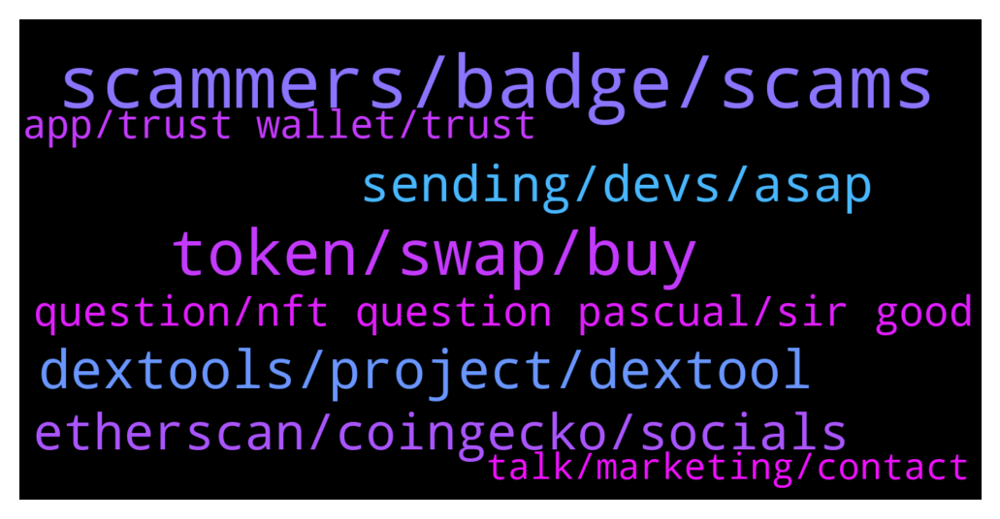

# **@DEXToolsCommunity**
 ## Analysis for **2021-12-18** - **2021-12-20**.

---

## 📊 **Basic Stats**

**n_messages_sent**: 246

---

---

## 🔝 **Top keywords and related messages**

1. **scammers, badge, scams**

    @stanes --- *I hope he can see your badge 😅* **--->** [TG Discussion](https://t.me/DEXToolsCommunity/314270)

    @kaspargalactic --- *can you please check my DM* **--->** [TG Discussion](https://t.me/DEXToolsCommunity/314427)

    @nate102 --- *Sure but in my opinion from what I see 90% of the scams are just high tax or honeypot. Other ones automatically blacklist anyone that buys etc* **--->** [TG Discussion](https://t.me/DEXToolsCommunity/313916)

    @DGman1 --- *No badge just an angry bear* **--->** [TG Discussion](https://t.me/DEXToolsCommunity/314263)

    @napascual --- *That's a different check actually, there are a ton of possible scams, not only honeypots* **--->** [TG Discussion](https://t.me/DEXToolsCommunity/313915)

    @DGman1 --- *how do you find a person that works here??* **--->** [TG Discussion](https://t.me/DEXToolsCommunity/314252)

2. **token, swap, buy**

    @roni20212 --- *Can i swap this token busd to mongoose* **--->** [TG Discussion](https://t.me/DEXToolsCommunity/314797)

    @napascual --- *You have a swap history on the wallet info. You could filter by Token symbol. It's a Standard plan feature* **--->** [TG Discussion](https://t.me/DEXToolsCommunity/315082)

    @roni20212 --- *No i want buy 50 busd to mongoose* **--->** [TG Discussion](https://t.me/DEXToolsCommunity/314799)

    @nate102 --- *Maybe an automatic honeypot check after idk 5 minutes after trades on a token have happened would be a good idea for this? There’s no reason a coin should be honeypot or have high 99% tax if trades have occurred on the token already* **--->** [TG Discussion](https://t.me/DEXToolsCommunity/313914)

    @roni20212 --- *Dextool  token buy fee how $  If i swap eth to other token then how $ transaction fee* **--->** [TG Discussion](https://t.me/DEXToolsCommunity/314790)

    @M O W E R --- *does that mean whatever we have to pay attention to the token ??* **--->** [TG Discussion](https://t.me/DEXToolsCommunity/314416)

3. **dextools, project, dextool**

    @ChantalLang --- *Hi, I have a question about your roadmap, please. I have read the 2021 roadmap on Dextools website. Congratulation for all the work and the tools you realized in 2021, and for the partnership with Coinmarketcap ! My question is :  —> Will Dextools provide Limit orders functionality for other chains (besides Ethereum) in 2022 ? is this somewhere in the timeline ? Many thanks in advance for your answer and kindest regards from Switzerland, Chantal 🙏😊* **--->** [TG Discussion](https://t.me/DEXToolsCommunity/315039)

    @Godahavefaithh --- *Are there any Admins that can assist me with a Dextools Venture presale allocation allotment that I haven't received* **--->** [TG Discussion](https://t.me/DEXToolsCommunity/315011)

    @MaxPeterson --- *Thank you DEXTools community for introducing MetaBrands to us. Amazing project. Confident of success particularly in the long term for holders of NFT relics.* **--->** [TG Discussion](https://t.me/DEXToolsCommunity/314741)

    @nachivacrypto --- *Hi, can I ask where does dextools obtain token information from , eg. website, socials etc? Is it something that is submitted to dextools or just referenced from another source? Thanks.* **--->** [TG Discussion](https://t.me/DEXToolsCommunity/314080)

    @napascual --- *What exactly do you mean by "Dextools bot"?* **--->** [TG Discussion](https://t.me/DEXToolsCommunity/315348)

    @ED_tgrm --- *hello. admins, some days ago i saw velox banner on dextools. is it your project and i can trust them as much as i trust you? or it's an independent project?* **--->** [TG Discussion](https://t.me/DEXToolsCommunity/314909)

4. **etherscan, coingecko, socials**

    @stanes --- *I can't see your socials on Etherscan...* **--->** [TG Discussion](https://t.me/DEXToolsCommunity/314845)

    @stanes --- *Hi, we currently pull social info from: - BscScan - EtherScan - CoinGecko* **--->** [TG Discussion](https://t.me/DEXToolsCommunity/314081)

    @napascual --- *You're right, just checked. We get that info from different APIs like etherscan. Sometimes they fail identifying it* **--->** [TG Discussion](https://t.me/DEXToolsCommunity/313891)

    @Drcrypto --- *u can see on the etherscan* **--->** [TG Discussion](https://t.me/DEXToolsCommunity/313889)

    @stanes --- *About social Information for your token, please update etherscan.io or bscscan.com or coingecko.com  We pull info from there.* **--->** [TG Discussion](https://t.me/DEXToolsCommunity/314839)

    @CryptoTamilann --- *We updated recently like 2 days before on coingecko* **--->** [TG Discussion](https://t.me/DEXToolsCommunity/314781)

5. **sending, devs, asap**

    @stanes --- *The issue has been forwarded to the devs. They will check and fix it asap.  Thanks for reporting 🙏* **--->** [TG Discussion](https://t.me/DEXToolsCommunity/315101)

    @FreePatriot76 --- *What is the ETA on getting it fixed?* **--->** [TG Discussion](https://t.me/DEXToolsCommunity/315210)

    @victus5 --- *Yes bro they haven't updated it we applied* **--->** [TG Discussion](https://t.me/DEXToolsCommunity/314846)

    @VitalFox87 --- *And now it's not showing any data again* **--->** [TG Discussion](https://t.me/DEXToolsCommunity/314391)

    @kaspargalactic --- *It went back to the old number again. Please check dm if possilble* **--->** [TG Discussion](https://t.me/DEXToolsCommunity/314375)

    @napascual --- *It was loading it's history, should be displaying info already* **--->** [TG Discussion](https://t.me/DEXToolsCommunity/314347)

6. **question, nft question pascual, sir good**

    @HenryMatambo --- *Please help guys, it's a cool NFT* **--->** [TG Discussion](https://t.me/DEXToolsCommunity/315272)

    @BinaryByron --- *Have done already, thank you :)* **--->** [TG Discussion](https://t.me/DEXToolsCommunity/315035)

    @Cryptolover2002 --- *Good respond to a dirty mouth lol* **--->** [TG Discussion](https://t.me/DEXToolsCommunity/314981)

    @stanes --- *Thank you for your support 🙏* **--->** [TG Discussion](https://t.me/DEXToolsCommunity/314742)

    @bastardganpunk --- *oh, thats another question 😄 but thanks for your heads up @DonatoGzman 😄* **--->** [TG Discussion](https://t.me/DEXToolsCommunity/314273)

    @Simon --- *Thank you for this by the way, noticed it earlier today.  Great stuff* **--->** [TG Discussion](https://t.me/DEXToolsCommunity/313905)

7. **app, trust wallet, trust**

    @napascual --- *Mobile websockets are not the most stable connections on Trust wallet. They still need to improve a lot (even for Metamask). One trick is to wait on your trust wallet connect screen (instead of going back to the app) and wait until the app sends the Verification (sign) request to your app. For some reason, if you go back to the app the websocket sometimes stops sending data.* **--->** [TG Discussion](https://t.me/DEXToolsCommunity/314306)

    @JoeyDieleman --- *You can but within the TrustWallet app on you mobile, so if you have the app on mobile in the Dapp browser of the app itself.* **--->** [TG Discussion](https://t.me/DEXToolsCommunity/314301)

    @bastardganpunk --- *i dont think you can connect trustwallet on phone* **--->** [TG Discussion](https://t.me/DEXToolsCommunity/314288)

    @DGman1 --- *my holding tokens are on trustwallet* **--->** [TG Discussion](https://t.me/DEXToolsCommunity/314286)

    @CoinDudeBro --- *one of my friends accidentally sent ether to the DEXT address trying to trade on dextools* **--->** [TG Discussion](https://t.me/DEXToolsCommunity/314396)

    @HenryMatambo --- *Please guys just stay in Trust Wallet and Metamask and the most common ones, please stay safe* **--->** [TG Discussion](https://t.me/DEXToolsCommunity/315314)

