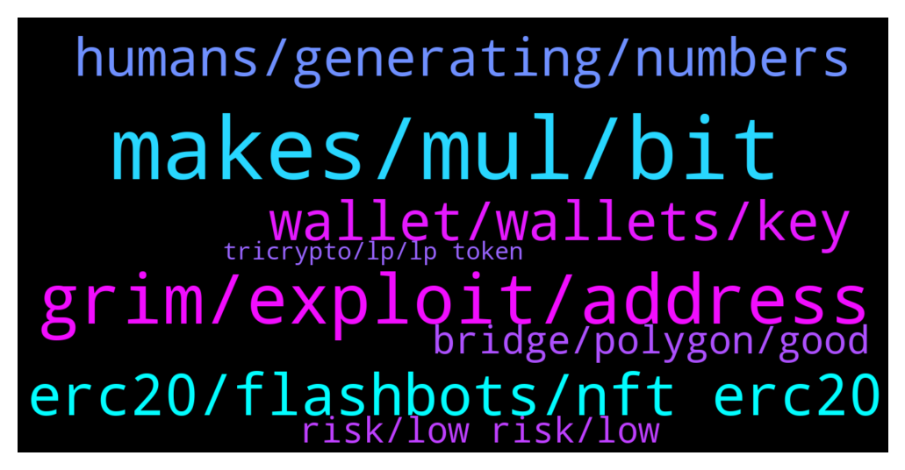

# **@lobsters_chat**
 ## Analysis for **2021-12-19** - **2021-12-20**.

---

## 📊 **Basic Stats**

**n_messages_sent**: 283

---

---

## 🔝 **Top keywords and related messages**

1. **makes, mul, bit**

    @farm42 --- *I included all info here Sir: https://github.com/OffcierCia/Crypto-OpSec-SelfGuard-RoadMap  check out :  - https://www.ledger.com/academy/security/hack-wifi  - https://github.com/drduh/macOS-Security-and-Privacy-Guide  - https://github.com/jlopp/physical-bitcoin-attacks/blob/master/README.md* **--->** [TG Discussion](https://t.me/lobsters_chat/309094)

    @xk. --- *Finematics for a very quick, high quality, mildly technical overview* **--->** [TG Discussion](https://t.me/lobsters_chat/309079)

    @michaelams --- *This makes sense to me. But still...* **--->** [TG Discussion](https://t.me/lobsters_chat/308928)

    @memberNo14 --- *i bought Lobster NFTs today. WGMI* **--->** [TG Discussion](https://t.me/lobsters_chat/309194)

    @PeterMm --- *Good question, which someone smarter then me will answer you* **--->** [TG Discussion](https://t.me/lobsters_chat/309155)

    @michaelams --- *so that makes it strange, right?* **--->** [TG Discussion](https://t.me/lobsters_chat/308906)

2. **grim, exploit, address**

    @ivangbi --- *Scammy af imho, by the sound of it. “hey u supported early and took risk, but fk u!”* **--->** [TG Discussion](https://t.me/lobsters_chat/308722)

    @phil_muhbags --- *It does look like a reentrancy attack on the depositFor method(): https://bscscan.com/address/0xc0fa0deeadd86dc621b11827024c9b0dcd1e37b8#code  This vault is a clear fork of beefy, with a few things changed. Note that while beefy's function is deposit(uint256 _amount), their function here takes 2 more parameters: function depositFor(address token, uint256 _amount,  address user). The exploiter passed in parameters that were unexpected:   json "input": {    "token":"0x1efa88baf64097b53a2c46e00fa6944dbebb9298"   "_amount":"1884725493462004904771"   "user":"0x1efa88baf64097b53a2c46e00fa6944dbebb9298" } https://dashboard.tenderly.co/tx/bsc/0x2ad875a3fcbbc3b04942c4ef03191493b6a40ff56d49080ec6799388c3d635a2/debugger?trace=0.2.1.0   Note that the token and user are the same address, and the 0x1efa address is the exploit contract address. With the exploit contract being the  token address, the vault contract calls transferFrom() on exploit contract, which is where the exploit contract is able to execute arbitrary malicious code, and like <@!289086271110905866> guessed, launches a reentrancy attack to reenter the deposit function and mint extra shares over and over again. Not sure why the token address was allowed to be passed in.* **--->** [TG Discussion](https://t.me/lobsters_chat/308745)

    @Georgeraven --- *I struggle to understand the grim finance hack maybe I am missing something specific about their protocol* **--->** [TG Discussion](https://t.me/lobsters_chat/309021)

    @Nikar00 --- *Info from exploiter addresses on Grim Finance* **--->** [TG Discussion](https://t.me/lobsters_chat/309040)

    @tufuntu --- *if we keep all in ledger, then all safe?* **--->** [TG Discussion](https://t.me/lobsters_chat/309114)

    @warylow --- *Spiritswap re: grim vaults emptying rn* **--->** [TG Discussion](https://t.me/lobsters_chat/308742)

3. **erc20, flashbots, nft erc20**

    @farm42 --- *https://twitter.com/k3mmio/status/1472315936166219777?s=21 some details about the hack* **--->** [TG Discussion](https://t.me/lobsters_chat/308784)

    @ld206 --- *Nah the hacker likely has an automated tool to steal eth and tokens but didn’t bother with NFTs cause they either don’t know about them or don’t care* **--->** [TG Discussion](https://t.me/lobsters_chat/308921)

    @ld206 --- *The eth might be sweeped by hackers the moment he puts it in. Look into flashbots for getting the NFTs out… maybe cia officer has a link* **--->** [TG Discussion](https://t.me/lobsters_chat/308916)

    @DefoNotAlfred --- *sudoswap is working on some sort of AMM which will be dramatic improvement over any other existing solutions + owen is a great guy* **--->** [TG Discussion](https://t.me/lobsters_chat/308956)

    @farm42 --- *Some info about hack for ya:  https://t.me/lobsters_chat/308784  https://t.me/lobsters_chat/308745* **--->** [TG Discussion](https://t.me/lobsters_chat/309023)

    @johan_ct --- *hi guys, does anyone know any tg bot that will kick spamming bots out ?* **--->** [TG Discussion](https://t.me/lobsters_chat/308881)

4. **wallet, wallets, key**

    @KombainMashina --- *Hi everybody. Sometimes I heard a «stories» that says about money stealing from wallets via metamask-signs. I mean, you sign something on site and every assets from any network possibly be stealed without any additional actions by holder. Is this truth? Is there a proof of concept?* **--->** [TG Discussion](https://t.me/lobsters_chat/309121)

    @michaelams --- *He can't access his wallet now, but will do it once he can. Needs ETH in there first too, haha* **--->** [TG Discussion](https://t.me/lobsters_chat/308908)

    @freshaspect --- *@michaelams is this a new wallet on the macbook or could it have been installed on another machine in the past? bear in mind that once you know a key you can steal whatever you like whenever you like so in theory they could have waited* **--->** [TG Discussion](https://t.me/lobsters_chat/308936)

    @freshaspect --- *Were the other wallets his too? (ie. shared the same key in Metamask)* **--->** [TG Discussion](https://t.me/lobsters_chat/308901)

    @Ruben --- *There are hardware wallets that allow you to edit specific symbols of the private key if you don't trust their entropy generation (https://medium.com/ngrave/beyond-mnemonic-phrases-the-path-to-the-ngrave-perfect-key-66ccaf540554)* **--->** [TG Discussion](https://t.me/lobsters_chat/309098)

    @michaelams --- *That's definitely a possibility, thanks for that angle. I only found one wallet that had 1 mutual NFT which is pretty well-known and clearly not a scam. One other (of many) NFT(s) that the wallet held was a project he was in the Discord in, but never connected his wallet or anything. Other wallets had zero NFTs. Weird that those wallets all 'sent' the ETH in the same minute.   Weird thing is that the NFTs were left in the wallet, only ETH was sent.* **--->** [TG Discussion](https://t.me/lobsters_chat/308902)

5. **humans, generating, numbers**

    @drinkius --- *This is more of a philosophical statement, generally if you try to come up with something random - it’s usable for most cases, our neural network is too complex to think that the outcome can easily be predicted* **--->** [TG Discussion](https://t.me/lobsters_chat/309089)

    @ld206 --- *This is not safe at all. Humans cannot generate randomness* **--->** [TG Discussion](https://t.me/lobsters_chat/309087)

    @ld206 --- *Humans are bad at randomness. You can do what you want, of course. But if you’re publicly giving advice to lots of new folks, do not give them the advice to randomly generate words or numbers in their head* **--->** [TG Discussion](https://t.me/lobsters_chat/309106)

    @ld206 --- *Previously the post was talking about generating bits, though. And if you did a study with 10k humans generating 24 6 digit numbers, the distribution of numbers you would get would still be nowhere even remotely close to random* **--->** [TG Discussion](https://t.me/lobsters_chat/309104)

    @ld206 --- *You can’t give the advice “think of random strings” to people, though. The distributions of what keys people would write down with that method would be a tiny tiny little subset of the keyspace and easy to brute force.* **--->** [TG Discussion](https://t.me/lobsters_chat/309095)

    @yic_alex --- *It's not philosophical at all. There's a lot of evidence suggesting that humans are not a good source for entropy. It has to do with us favouring patterns.* **--->** [TG Discussion](https://t.me/lobsters_chat/309092)

6. **bridge, polygon, good**

    @vPEPO --- *Polygon we already have a solution: https://docs.polygon.technology/docs/develop/l1-l2-communication/fx-portal/* **--->** [TG Discussion](https://t.me/lobsters_chat/309179)

    @vPEPO --- *probably worth researching it anyways, it might have less overhead* **--->** [TG Discussion](https://t.me/lobsters_chat/309180)

    @vPEPO --- *we need a bridge that supports cross-domain messaging (right now, only L2s and Polygon have such thing)* **--->** [TG Discussion](https://t.me/lobsters_chat/309172)

    @drinkius --- *Still fully analog, better compared to involving computer of any sort and leaving a trail* **--->** [TG Discussion](https://t.me/lobsters_chat/309107)

    @zariat_5D --- *i forwarded this to NFT Avenue in case someone there knows. could be useful for otehrs as well* **--->** [TG Discussion](https://t.me/lobsters_chat/309064)

    @pussinboots --- *the secret monero bridge has a very nice affordance where it lets you pick a gateway by ping* **--->** [TG Discussion](https://t.me/lobsters_chat/309059)

7. **risk, low risk, low**

    @sneg55 --- *I don't think low risk investors even touched defi.* **--->** [TG Discussion](https://t.me/lobsters_chat/308970)

    @JellyF --- *I dont think low-risk investors touch crypto at all, they have gov bonds, quasi-govs, munies, etc, etc. Quite a lot of low-risk shit, that dont hack/rug/exploit and pump/dump tens/hundreds/thousands %% in less than a year. Unless our ideas of "low-risk" differ fundamentally. 😂* **--->** [TG Discussion](https://t.me/lobsters_chat/308974)

    @sir_integra_hellsing --- *I don't think low risk investors even touch crypto outside BTC and ETH* **--->** [TG Discussion](https://t.me/lobsters_chat/308972)

    @river0x --- *Potentially liquidity leaving defi if interest rates go up, many low risk investors will choose safer tradfi bank products* **--->** [TG Discussion](https://t.me/lobsters_chat/308968)

    @sir_integra_hellsing --- *I was going to say that at first. But I got approached by a few relatives who doesn't even care about stocks wanting to buy BTC. It's anecdotal data but it has changed my perspective a bit.* **--->** [TG Discussion](https://t.me/lobsters_chat/308975)

    @yic_alex --- *That's because you're by definition not a low risk investor if you do. At least not if you consider the whole spectrum. The residual smart contract risk alone disqualifies DeFi for really risk averse people. Not sure how the insurance products look these days.* **--->** [TG Discussion](https://t.me/lobsters_chat/308973)

