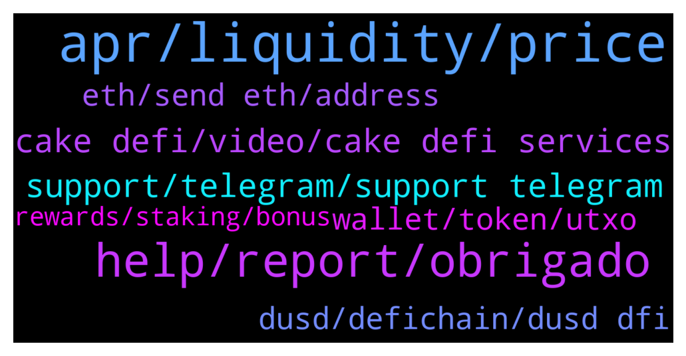

# **@CakeDeFi_EN**
 ## Analysis for **2021-12-20** - **2021-12-21**.

---

## 📊 **Basic Stats**

**n_messages_sent**: 212

---

---

## 🔝 **Top keywords and related messages**

1. **apr, liquidity, price**

    @TheGibsonChan --- *Can anyone explain why when I remove my assets from liquidity mining it's lower than the amount I put in? Thanks!* **--->** [TG Discussion](https://t.me/CakeDeFi_EN/155155)

    @Teo L. T. --- *Continue this question. Let’s say if DFI price increase and it’s worth USD1500. The APR calculation will base on USD2500 or maintain USD2000? Or I need to top up the USDT to make both side balanced.* **--->** [TG Discussion](https://t.me/CakeDeFi_EN/155550)

    @enalettin --- *Yes but wasn't it possible to tie it it's original price at the beginning and move it's price according to stock movement* **--->** [TG Discussion](https://t.me/CakeDeFi_EN/155135)

    @enalettin --- *Guys how to takes advantage of arbitrage for stock pairs? i feel as if all of you printing money and i am left behind 😂😂* **--->** [TG Discussion](https://t.me/CakeDeFi_EN/155621)

    @umcand --- *Are liquidity mining APRs affected by the price of dfi?* **--->** [TG Discussion](https://t.me/CakeDeFi_EN/155147)

    @enalettin --- *Why Tesla and other stock prices not reflecting the real stock prices anyone knows? Tesla in reality 932$ but with DFi it costs 395 DFi which is more 1300 $* **--->** [TG Discussion](https://t.me/CakeDeFi_EN/155128)

2. **help, report, obrigado**

    @fabio2873 --- *Alguém está conseguindo tirar as moedas para comprar a nova moeda?* **--->** [TG Discussion](https://t.me/CakeDeFi_EN/155623)

    @mtvblackdad --- *Okay! Do you guys reply to support emails on the weekend ?* **--->** [TG Discussion](https://t.me/CakeDeFi_EN/154978)

    @Kassius84 --- *Which details are you looking for?* **--->** [TG Discussion](https://t.me/CakeDeFi_EN/155477)

    @Kassius84 --- *Maybe this will help you 👍 https://blog.cakedefi.com/decentralized-assets/* **--->** [TG Discussion](https://t.me/CakeDeFi_EN/155631)

    @iamout2 --- *https://blog.cakedefi.com/decentralized-assets/  Found this don’t know if can help you* **--->** [TG Discussion](https://t.me/CakeDeFi_EN/155366)

    @justintew --- *Aight I see, thank you so much!* **--->** [TG Discussion](https://t.me/CakeDeFi_EN/155482)

3. **cake defi, video, cake defi services**

    @Bettie10no --- *Hello, please can someone help introduce me to cake Defi. Am just new to it* **--->** [TG Discussion](https://t.me/CakeDeFi_EN/155044)

    @moneydelics --- *Hey, Bakers! I made a quick and easy tutorial for beginners on how to calculate and plan Cake DeFi earnings using the calculator on Cake home page 💸  https://m.youtube.com/watch?v=DnH176R8aKc&feature=youtu.be* **--->** [TG Discussion](https://t.me/CakeDeFi_EN/155038)

    @James --- *Very informative! You should do a video how to get dfi out of cake since that's what I was hesitant about when I first learned about cake/dfi and there are very few videos out there on there.* **--->** [TG Discussion](https://t.me/CakeDeFi_EN/155054)

    @moneydelics --- *If you like video content, I create YouTube video review and tutorial about Cake DeFi and I have a playlist about it:  What is Cake DeFi?  https://www.youtube.com/playlist?list=PLleJzcLaifSqFHO-2QihxEh26Mwq5TAag* **--->** [TG Discussion](https://t.me/CakeDeFi_EN/155050)

    @riserspec24 --- *For anyone who are new here. You can watch this video on how to reinvest and compound your earnings in Cake Defi.   https://youtu.be/dVsrAeZOUXM* **--->** [TG Discussion](https://t.me/CakeDeFi_EN/155618)

    @JonD26 --- *Do you think Cake-defi is actual defi?* **--->** [TG Discussion](https://t.me/CakeDeFi_EN/155402)

4. **support, telegram, support telegram**

    @mtvblackdad --- *I don’t have access to my 2FA* **--->** [TG Discussion](https://t.me/CakeDeFi_EN/154965)

    @mtvblackdad --- *Do you guys ever DM someone personally?* **--->** [TG Discussion](https://t.me/CakeDeFi_EN/154956)

    @UK_3D_Yorkshire --- *Anyone who DMs you and asks for your private keys or sends you a link to a website to "verify your wallet" is a scammer and needs banning 🙂* **--->** [TG Discussion](https://t.me/CakeDeFi_EN/154959)

    @Michael_Schredl --- *The support can reset your 2FA at any time. Or can use an app like Authy and create a backup* **--->** [TG Discussion](https://t.me/CakeDeFi_EN/155664)

    @DmgBautista --- *Thats strange, if its not the first time you have made a deposit and already had an ERC-20 address, that should not happen. The best way is to write support a ticket so they may check what happened and solve the issue that may have arised. And beware of scammers, there is no official support on telegram. DM's are to be considered as scam attempts, no mod will ever DM you and there is no official support on telegram 🙂* **--->** [TG Discussion](https://t.me/CakeDeFi_EN/155723)

    @DmgBautista --- *If someone is DM you, its a scammer, just block and report. As Michael said, there is no official support on telegram. Please refer to the community guidelines before starting to interact with the platform. In them you can easily read, that no mod will ever DM you, its against the rules to DM other users and there is no official support on telegram. Same as always! Any DM, must be considered a scam. Plain and simple* **--->** [TG Discussion](https://t.me/CakeDeFi_EN/155712)

5. **dusd, defichain, dusd dfi**

    @James --- *About 90% dfi and 10% dusd* **--->** [TG Discussion](https://t.me/CakeDeFi_EN/155035)

    @kirkburni --- *Hi! Just a simple question asking for straight advice. With all this crazyness os the DUSD price lowering to 1$, which seems that it will happen, should I remove my LM of DUSD/DFI the sooner possible? I also have some DTSLA/DUSD, but much less, so doesn't worry me much. But the big Cake so to say is in DUSD/DFI. 🙏* **--->** [TG Discussion](https://t.me/CakeDeFi_EN/154972)

    @justintew --- *How much DFI I got back etc.* **--->** [TG Discussion](https://t.me/CakeDeFi_EN/155479)

    @Ward_andHome --- *Is DUSD Defichain's pegged intermediary to aid with trade expenses, read: lower costs?* **--->** [TG Discussion](https://t.me/CakeDeFi_EN/155390)

    @mikelfilko --- *Ohh but splitting half of BTC to DFI is not a bad idea right? Seeing that most of the time they move in tandem.* **--->** [TG Discussion](https://t.me/CakeDeFi_EN/155387)

    @scsl_jc --- *Change half of dfi to dbtc?* **--->** [TG Discussion](https://t.me/CakeDeFi_EN/155695)

6. **eth, send eth, address**

    @George --- *is the deposit of DOGE currently not working?* **--->** [TG Discussion](https://t.me/CakeDeFi_EN/155068)

    @satoricrypto --- *so, as far as I understand, you pay once for the creation of the eth address. not for every erc020 token like the usd's* **--->** [TG Discussion](https://t.me/CakeDeFi_EN/155442)

    @Kassius84 --- *The setup of an Ethereum smart contract address is quite expensive* **--->** [TG Discussion](https://t.me/CakeDeFi_EN/155437)

    @satoricrypto --- *Hello. Could someone please explain why there is a 130$ when I first setup an ETH address? Thank you.* **--->** [TG Discussion](https://t.me/CakeDeFi_EN/155436)

    @enalettin --- *i was planning to send eth to defi light wallet only way seems so but then the cost is high i see no way to send eth to dfi wallet* **--->** [TG Discussion](https://t.me/CakeDeFi_EN/155098)

    @satoricrypto --- *when you select deposit of any eth asset it will promp you with a checker box* **--->** [TG Discussion](https://t.me/CakeDeFi_EN/155446)

7. **wallet, token, utxo**

    @zforelle --- *So today I learned that DFI exists in 2 forms - UTXO and Token forms . Can I send either to cake address or only the UTXO form can be sent ?* **--->** [TG Discussion](https://t.me/CakeDeFi_EN/155418)

    @zforelle --- *I have the option to convert it before transfer . But it also gives the option to transfer token. I guess I can test these with small transactions 🙌* **--->** [TG Discussion](https://t.me/CakeDeFi_EN/155425)

    @Kassius84 --- *Okay the DFX wallet is a fork of the DeFiChain light Wallet and I guess it works technically the same way 😃* **--->** [TG Discussion](https://t.me/CakeDeFi_EN/155424)

    @zforelle --- *I’m using the DFX wallet .* **--->** [TG Discussion](https://t.me/CakeDeFi_EN/155422)

    @TwoDsireCrypto --- *More like 99% DFI 1 % other token* **--->** [TG Discussion](https://t.me/CakeDeFi_EN/155039)

    @zforelle --- *I had to convert my utxo to token form to do loans and stuff thou* **--->** [TG Discussion](https://t.me/CakeDeFi_EN/155426)

