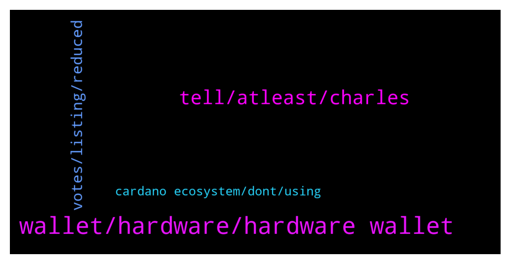

# **@Cardano**
 ## Analysis for **2021-12-20** - **2021-12-21**.

---

## 📊 **Basic Stats**

**n_messages_sent**: 88

---

---

## 🔝 **Top keywords and related messages**

1. **wallet, hardware, hardware wallet**

    @StammeRama --- *Does a hardware wallet basically store your encrypted seed phrase? I am ashamed to say I am still not 100% on how it works. Also, it would surely protect from things like keyloggers, right? Since nothing has to be manually typed to complete a transaction or access a wallet, presumably.* **--->** [TG Discussion](https://t.me/Cardano/760972)

    @apex_pool_spo --- *you use a 24 words seed phrase to generate the keys. the keys are stored in the wallet, never leaving it. to do transactions, you connect the hardware wallet to the wallet (Daedalus, Yoroi, ccvault.io, typhonwallet.io, nami or whatever you want to use) and you will have to confirm the transactions with the hardware wallet. you will never type the recovery seed on a computer. the hardware wallet also has a pin to lock it.* **--->** [TG Discussion](https://t.me/Cardano/760975)

    @StammeRama --- *I thought about buying a HW wallet before, quite a number of times actually, but what always stopped me is doubt on the hardware authenticity. What if scammers sell me a fake Ledger with spyware etc. on it... would you say that is an irrational fear to have? Is there a way to verify these things reliably?* **--->** [TG Discussion](https://t.me/Cardano/760989)

    @haevaristo --- *a keylogger by itself wont do much .. but if someone managed to install a keylogger on your machine, chances are .. they are able to do more than just that .. in which case it doesnt matter much having a hardware wallet* **--->** [TG Discussion](https://t.me/Cardano/760977)

    @apex_pool_spo --- *and for ledger, the software on your computer also checks the authenticity, but I guess you need to be sure the computer is clean.* **--->** [TG Discussion](https://t.me/Cardano/760995)

    @haevaristo --- *so you could have 2 hardware wallets on different locations and use either depending on where you are ?* **--->** [TG Discussion](https://t.me/Cardano/760990)

2. **tell, atleast, charles**

    @djmmts --- *I recall it was approaching 30 maybe* **--->** [TG Discussion](https://t.me/Cardano/761073)

    @Dmsy2 --- *Can i expect in this month or next year atleast tell me that* **--->** [TG Discussion](https://t.me/Cardano/760767)

    @glitch04 --- *There has not been any date announced so I can't tell you one* **--->** [TG Discussion](https://t.me/Cardano/760766)

    @Dmsy2 --- *Atleast u can give me a hint* **--->** [TG Discussion](https://t.me/Cardano/760771)

    @glitch04 --- *I don't know the answer or I would tell you* **--->** [TG Discussion](https://t.me/Cardano/760768)

    @yutazzz --- *12 / 18-Charles' AMA powered up by a week of mountain meditation 🎉-Hydra / Partial delegation / Proxy key / Medical field and Cardano / Gaming and Cardano / Anyone (even if they have visual or hearing abnormalities) dApps 🔥 I made an article 🔥 Read it!  https://forum.cardano.org/t/12-18-1-ama-hydra-cardano-cardano-dapps/89423* **--->** [TG Discussion](https://t.me/Cardano/760723)

3. **votes, listing, reduced**

    @jaypatelEarthling --- *I think votes have reduced probably due to Charle's dissatisfaction with their listing Shibainu* **--->** [TG Discussion](https://t.me/Cardano/760775)

    @ExInfernis --- *I think we can do better. Just a reminder to help with the voting 😉* **--->** [TG Discussion](https://t.me/Cardano/760773)

    @glitch04 --- *That maybe true but they were listing it not from the poll but from Amc theaters CEO asking for it to be included on the app..  either way doesn't look like we beat the bots at this rate 😂* **--->** [TG Discussion](https://t.me/Cardano/760777)

    @ExInfernis --- *tron is leading with around 26000 votes. So if half of the group here votes at least once we will be with similar percents* **--->** [TG Discussion](https://t.me/Cardano/760781)

    @jaypatelEarthling --- *Well we can all create 3-6 Gmail id and vote multiple times 😜* **--->** [TG Discussion](https://t.me/Cardano/760779)

    @jaypatelEarthling --- *Agreed but people following reddit and twitter don't understand that and avoid polling further and we got reduced weightage 😂* **--->** [TG Discussion](https://t.me/Cardano/760778)

4. **cardano ecosystem, dont, using**

    @ExInfernis --- *Can someone explain please how exactly are used the altcoins of the cardano ecosystem for example. Because I see a lot ot projects developed using cardano ecosystem, but they have their own coins/tokens. So, in this case are they continue to use ada for blockchain operations or they are using only their new tokens. And what is the need to have different token when some new system is created on the cardano blockchain. Not sure that I formulated clearly my question 😉* **--->** [TG Discussion](https://t.me/Cardano/760941)

    @ExInfernis --- *What is the difference between three dex that are on cardano exosystem. I dont want to name them, because maybe this reply will be deleted. And I was asking because I really dont have so much deep knowledge about crypto. I wanted to know how to choose which of the three to use for example* **--->** [TG Discussion](https://t.me/Cardano/760642)

    @atc1235 --- *Guys what do you think about people that says Cardano isn't good because it doesn't attract "institutional investors"? Is this that important? Why? Or why not?* **--->** [TG Discussion](https://t.me/Cardano/761055)

    @Sydney --- *Hey everyone, I am new to Haskell and Plutus, learning more everyday, and am looking for a project to help work on. Please let me know if anyone would be interested in getting my help. Thanks* **--->** [TG Discussion](https://t.me/Cardano/761022)

    @ExInfernis --- *I read that cardano is live on Flexa, but I don't see this in the cardano announcements. So it is not so important?* **--->** [TG Discussion](https://t.me/Cardano/760760)

