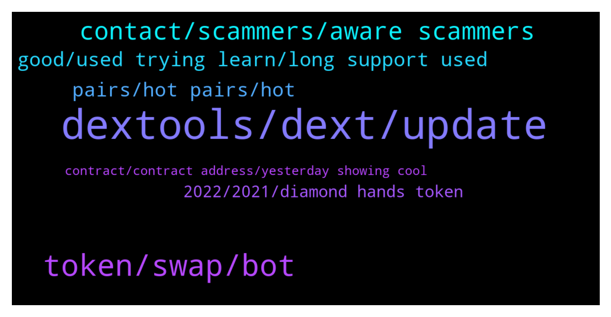

# **@DEXToolsCommunity**
 ## Analysis for **2021-12-19** - **2021-12-21**.

---

## 📊 **Basic Stats**

**n_messages_sent**: 237

---

---

## 🔝 **Top keywords and related messages**

1. **dextools, dext, update**

    @MonkeySuit --- *so in my opinion, dext token is a good buy/hold, I think there are big things coming for the platform, if you hold 100k you can get into the VIP group and participate in venture deals.  Other than that I would get into metaverse or p2e focused tokens early.* **--->** [TG Discussion](https://t.me/DEXToolsCommunity/315780)

    @唐老哥在囤币 --- *Guys,is there an app for IOS？* **--->** [TG Discussion](https://t.me/DEXToolsCommunity/315065)

    @Freddy R --- *Question DEX execute some validation for new tokens pairs ? Like rugs or fake contracts, etc?* **--->** [TG Discussion](https://t.me/DEXToolsCommunity/314944)

    @FredericDEXT --- *All people receive at same time, if you have a specific issue let us know* **--->** [TG Discussion](https://t.me/DEXToolsCommunity/315016)

    @MaxPeterson --- *Thank you DEXTools community for introducing MetaBrands to us. Amazing project. Confident of success particularly in the long term for holders of NFT relics.* **--->** [TG Discussion](https://t.me/DEXToolsCommunity/314741)

    @victus5 --- *Yes bro they haven't updated it we applied* **--->** [TG Discussion](https://t.me/DEXToolsCommunity/314846)

2. **token, swap, bot**

    @roni20212 --- *Can i swap this token busd to mongoose* **--->** [TG Discussion](https://t.me/DEXToolsCommunity/314797)

    @roni20212 --- *Dextool  token buy fee how $  If i swap eth to other token then how $ transaction fee* **--->** [TG Discussion](https://t.me/DEXToolsCommunity/314790)

    @izysteps --- *I have probelm selling my $MetaV. I want switch it to BUSD ot BNB. I got the spending approved yesterday but can not swap. It always complain about the slippage even when I set it to 20%.* **--->** [TG Discussion](https://t.me/DEXToolsCommunity/315704)

    @HenryMatambo --- *Can someone please help me to sell my NFT* **--->** [TG Discussion](https://t.me/DEXToolsCommunity/315258)

    @M O W E R --- *does that mean whatever we have to pay attention to the token ??* **--->** [TG Discussion](https://t.me/DEXToolsCommunity/314416)

    @Vallcha --- *Hello there, question for all community. We do see one token can be sold by the Dextool bot. But we can’t sell it by ourself. Can anybody help us with this? 0xd58f55b2c7b64afed8d21c5e852bcccae721e376* **--->** [TG Discussion](https://t.me/DEXToolsCommunity/315330)

3. **contact, scammers, aware scammers**

    @napascual --- *Marketing to @guillermorodriguez78. Be aware of scammers, remember he'll never dm first* **--->** [TG Discussion](https://t.me/DEXToolsCommunity/315630)

    @(⊙o⊙) --- *This guy is a high-level liar, be careful everyone!* **--->** [TG Discussion](https://t.me/DEXToolsCommunity/315462)

    @bastardganpunk --- *😬 which address did he sent it to? I don’t know if there’s a possibility to send it back, but can try to request it* **--->** [TG Discussion](https://t.me/DEXToolsCommunity/314400)

    @Graves330 --- *Who should I contact for business cooperation?* **--->** [TG Discussion](https://t.me/DEXToolsCommunity/315525)

    @scottcrypto11 --- *We have sent many message to Tommy and he is just not answering us... now what do we do* **--->** [TG Discussion](https://t.me/DEXToolsCommunity/314864)

    @kaspargalactic --- *can you please check my DM* **--->** [TG Discussion](https://t.me/DEXToolsCommunity/314427)

4. **good, used trying learn, long support used**

    @stanes --- *You haven't been frontrunned so doesn't matter 😉* **--->** [TG Discussion](https://t.me/DEXToolsCommunity/315517)

    @HenryMatambo --- *Please help guys, it's a cool NFT* **--->** [TG Discussion](https://t.me/DEXToolsCommunity/315272)

    @BinaryByron --- *Have done already, thank you :)* **--->** [TG Discussion](https://t.me/DEXToolsCommunity/315035)

    @Cryptolover2002 --- *Good respond to a dirty mouth lol* **--->** [TG Discussion](https://t.me/DEXToolsCommunity/314981)

    @stanes --- *Thank you for your support 🙏* **--->** [TG Discussion](https://t.me/DEXToolsCommunity/314742)

    @ChantalLang --- *Many thanks Pascual for your answer 🙏😊* **--->** [TG Discussion](https://t.me/DEXToolsCommunity/315046)

5. **pairs, hot pairs, hot**

    @VitalFox87 --- *https://www.dextools.io/app/bsc/pair-explorer/0x86213ec713bc32dccac12413a49aaf1419faaf4f   could you please check why this pair isn't working?* **--->** [TG Discussion](https://t.me/DEXToolsCommunity/314346)

    @FredericDEXT --- *Hot Pairs depends on a custom algorithm which is undisclosed, so please don't ask about it  We don't accept payments for trending / hot pairs, you can pay scammers for this but it won't work!* **--->** [TG Discussion](https://t.me/DEXToolsCommunity/315652)

    @x93139313 --- *hello is there an API to check prices of pairs?* **--->** [TG Discussion](https://t.me/DEXToolsCommunity/314446)

    @stanes --- *We don't list coins, we index pairs from exchanges.* **--->** [TG Discussion](https://t.me/DEXToolsCommunity/314747)

    @napascual --- *Not to us 😅.  Hot Pairs depends on a custom algorithm which is undisclosed, so please don't ask about it  We don't accept payments for trending / hot pairs, you can pay scammers for this but it won't work!* **--->** [TG Discussion](https://t.me/DEXToolsCommunity/315396)

    @napascual --- *In Live New Pairs page you could check the pool variation in real time to see if they rugpulled (-90% or lower is usually a rug pull) On the Pair Explorer (pair details page) you have the DEXTScore, Community Trust and contract verification* **--->** [TG Discussion](https://t.me/DEXToolsCommunity/314945)

6. **2022, 2021, diamond hands token**

    @lex_44 --- *So let me ask you this So wicht  coin Will be for next 2022 ? Any advise* **--->** [TG Discussion](https://t.me/DEXToolsCommunity/315777)

    @ChantalLang --- *Hi, I have a question about your roadmap, please. I have read the 2021 roadmap on Dextools website. Congratulation for all the work and the tools you realized in 2021, and for the partnership with Coinmarketcap ! My question is :  —> Will Dextools provide Limit orders functionality for other chains (besides Ethereum) in 2022 ? is this somewhere in the timeline ? Many thanks in advance for your answer and kindest regards from Switzerland, Chantal 🙏😊* **--->** [TG Discussion](https://t.me/DEXToolsCommunity/315039)

    @lex_44 --- *so what would it be for 2022* **--->** [TG Discussion](https://t.me/DEXToolsCommunity/315770)

    @E --- *The future of cryptocurrency is promising* **--->** [TG Discussion](https://t.me/DEXToolsCommunity/315745)

    @lex_44 --- *Dext sir is the next coin gor 2022?* **--->** [TG Discussion](https://t.me/DEXToolsCommunity/315774)

    @lex_44 --- *So wisht Will be the next Diamond Hands token for 2022?* **--->** [TG Discussion](https://t.me/DEXToolsCommunity/315764)

7. **contract, contract address, yesterday showing cool**

    @trojantechltd --- *Hello admin,   https://www.dextools.io/app/bsc/pair-explorer/0x11bafd3915e226048bb3b4bab14dd1802ca8a74d  This contract is having same issues as yesterday.. it’s showing up as “no name “* **--->** [TG Discussion](https://t.me/DEXToolsCommunity/315787)

    @ngl_ee --- *but if i psated the contract it shows up* **--->** [TG Discussion](https://t.me/DEXToolsCommunity/315642)

    @X_Piotr --- *Hi Guys, Can i ask if the ERC20 contract will be visible under new pair after adding a LP even if the contract has been deployd 2 weeks ago?* **--->** [TG Discussion](https://t.me/DEXToolsCommunity/315425)

    @stanes --- *Should be indexed already... what is the contract address?* **--->** [TG Discussion](https://t.me/DEXToolsCommunity/314889)

    @stanes --- *Ok, what is the contract address?* **--->** [TG Discussion](https://t.me/DEXToolsCommunity/314785)

    @gumbercules --- *Cool, looks like the right address. Did you make sure you approved the correct address to spend? Have enough BNB for gas? Logged into the right Metamask address to trade?* **--->** [TG Discussion](https://t.me/DEXToolsCommunity/315715)

