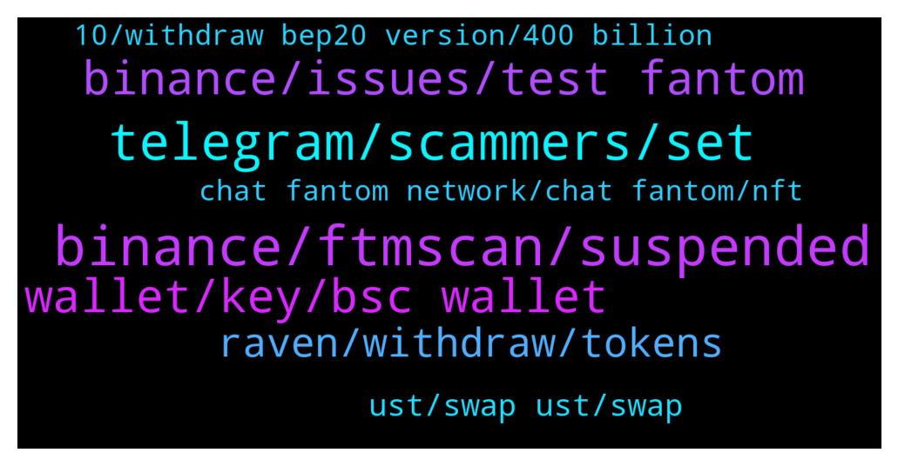

# **@Fantom_English**
 ## Analysis for **2021-12-20** - **2021-12-21**.

---

## 📊 **Basic Stats**

**n_messages_sent**: 176

---

---

## 🔝 **Top keywords and related messages**

1. **binance, ftmscan, suspended**

    @Fares --- *Thx but i Hodl. No need to withdraw.  F asked how buy some ftm, told him how I do...* **--->** [TG Discussion](https://t.me/Fantom_English/614367)

    @Rokam11 --- *What does this mean?  please use ftmscan to interact with the masterchef* **--->** [TG Discussion](https://t.me/Fantom_English/613770)

    @warp9 --- *Hello in Binance, Kucoin, Bkex FTM network is suspended.* **--->** [TG Discussion](https://t.me/Fantom_English/613932)

    @northamericas --- *I’ve been checking all day, on binance when I withdraw FTM and select network it says Fantom suspended* **--->** [TG Discussion](https://t.me/Fantom_English/613843)

    @ExPwr --- *Binance suspended FTM withdrawals claiming "network congestion"* **--->** [TG Discussion](https://t.me/Fantom_English/613987)

    @f6t6g6 --- *its about Binance Ex vol not network* **--->** [TG Discussion](https://t.me/Fantom_English/614005)

2. **telegram, scammers, set**

    @pajamasfreak --- *⬢ How to secure your #Telegram account? Use all of the tips below to stay safe from scammers and impersonators.  1️⃣ Change the default Privacy Settings of your account ≡ ➔⚙️ Settings ➔ Privacy and Security a) Phone number ➔ Set to »My Contacts« b) Calls ➔ Set to »My Contacts« c) Groups ➔ Set to »My Contacts« d) Security ➔ Two-Step Verification e) Advanced ➔ Set »Delete my account if away for« to »1 year«  2️⃣ Set unique username and profile bio ≡ ➔⚙️ Settings ➔ Edit profile a) Username b) Bio* **--->** [TG Discussion](https://t.me/Fantom_English/613810)

    @Janevietani --- *try ask it on spookyswap telegram . becareful with scammer. official admin will never dm user first* **--->** [TG Discussion](https://t.me/Fantom_English/613760)

    @pajamasfreak --- *Admin never dm first, all of them are scammers* **--->** [TG Discussion](https://t.me/Fantom_English/613807)

    @ExPwr --- *They are not regulated anywhere, right? They can do whatever they want?* **--->** [TG Discussion](https://t.me/Fantom_English/614008)

    @Charlie --- *are their people in telegram that ring and exchange encryption keys, people have been calling me* **--->** [TG Discussion](https://t.me/Fantom_English/613806)

    @nilsix --- *@admin , please pin a post about a fake @Johnnyfantom going around spreading fake links* **--->** [TG Discussion](https://t.me/Fantom_English/614020)

3. **binance, issues, test fantom**

    @Abhi1781 --- *When Binance will provide staking on Fantom @admin* **--->** [TG Discussion](https://t.me/Fantom_English/614482)

    @DrichPlacer --- *Hi🙂 can i ask a favor ,may i share my art (NFT) in this group🙂* **--->** [TG Discussion](https://t.me/Fantom_English/613912)

    @Hardiharhar123 --- *do we have a dapp like tulip in solana? leveraged yield farming* **--->** [TG Discussion](https://t.me/Fantom_English/614403)

    @slickrick6 --- *You’re issue is with binance not fantom* **--->** [TG Discussion](https://t.me/Fantom_English/614236)

    @Minesk1 --- *hello. Does fantom have any plan to implement zk rollup?* **--->** [TG Discussion](https://t.me/Fantom_English/614369)

    @slickrick6 --- *Only binance can answer that question* **--->** [TG Discussion](https://t.me/Fantom_English/614484)

4. **wallet, key, bsc wallet**

    @DY --- *I'm seeing one wallet instead of 2* **--->** [TG Discussion](https://t.me/Fantom_English/614068)

    @DY --- *Please you guys should help me. I have two wallet account in my fantom wallet but I am only seeing one now* **--->** [TG Discussion](https://t.me/Fantom_English/614062)

    @northamericas --- *Already have. Wondering if people are using the foundation Wallet; minting?* **--->** [TG Discussion](https://t.me/Fantom_English/613857)

    @phatnguyen120892 --- *Thanks, i use my bsc wallet address to create fantom wallet, is it ok* **--->** [TG Discussion](https://t.me/Fantom_English/614350)

    @phatnguyen120892 --- *Do we have fantom app wallet on ios, like 1inch ?* **--->** [TG Discussion](https://t.me/Fantom_English/614343)

    @Janevietani --- *connecting a wallet to website, no related to network* **--->** [TG Discussion](https://t.me/Fantom_English/614001)

5. **raven, withdraw, tokens**

    @Janevietani --- *i have no knowledge about Raven. could it be you stake LPs token on Raven website before they close down ?* **--->** [TG Discussion](https://t.me/Fantom_English/613766)

    @Rokam11 --- *This is the problem, can’t import, the option for Raven is not coming up any more* **--->** [TG Discussion](https://t.me/Fantom_English/613758)

    @pajamasfreak --- *Technical issue and lack of liquidity* **--->** [TG Discussion](https://t.me/Fantom_English/614378)

    @Rokam11 --- *Can anybody help with how to withdraw funds from FTM- Raven lp pool please?* **--->** [TG Discussion](https://t.me/Fantom_English/613751)

    @Charlie --- *Please help as I only got a bot at Multichain support. I tried to bridge in spirit swap fusdt on fantom chain to avax on avalanche chain. And yes i did click on both the approve and bridge token buttons! All my fusdt has gone in the transaction, but no funds have bridged to avax. I did the transaction 4 hrs ago: 0xbe0e1d03987e6ece15ccc1432b3e940099a716bdeba70945bdceaa67f1a267c6* **--->** [TG Discussion](https://t.me/Fantom_English/613896)

    @Rokam11 --- *We're sorry to announce but due to continued down pressure of the raven and scare token, dotcom twitter fud campaign and continued fud by both investors and non investors in the group and the vault issues, Raven will continue as is until it hits its supply of 160k tokens. we will not be making another layer.   We will not be developing the ScareCrow Finance project any further. The websites will be live until all tokens have been distributed as rewards.   If you need to use the contracts to withdraw at a later date, please use ftmscan to interact with the masterchef and withdraw your funds. Instructions to do so can be found through research online.* **--->** [TG Discussion](https://t.me/Fantom_English/613769)

6. **ust, swap ust, swap**

    @slickrick6 --- *you can bridge it with https://anyswap.exchange/#/bridge then later you can swap UST on https://app.beets.fi/#/trade* **--->** [TG Discussion](https://t.me/Fantom_English/614452)

    @Pat --- *hi how can i swap ust(terra) on fantom?* **--->** [TG Discussion](https://t.me/Fantom_English/614450)

    @DEGENerAPE1 --- *Frens, can UST (terra) be bridged to FTM?, if so, where can it then be swapped?* **--->** [TG Discussion](https://t.me/Fantom_English/614118)

    @Janevietani --- *you can bridge it with https://anyswap.exchange/#/bridge then later you can swap UST on https://app.beets.fi/#/trade* **--->** [TG Discussion](https://t.me/Fantom_English/614119)

    @bC311 --- *come on now....its gonna go :) haha theyre using the chain :)* **--->** [TG Discussion](https://t.me/Fantom_English/613925)

    @Janevietani --- *Which bridge do you use before?* **--->** [TG Discussion](https://t.me/Fantom_English/614320)

7. **chat fantom network, chat fantom, nft**

    @pajamasfreak --- *Take a look at info above* **--->** [TG Discussion](https://t.me/Fantom_English/613796)

    @pajamasfreak --- *https://bootstraps.ultimatenodes.io/ from one of our validators or official https://docs.fantom.foundation/staking/run-a-read-only-node/snapshot-download. You can look up on our documentation or ask at chat.fantom.network* **--->** [TG Discussion](https://t.me/Fantom_English/614274)

    @J --- *He is asking if there is a chinese group.* **--->** [TG Discussion](https://t.me/Fantom_English/614359)

    @عبدو --- *Whom should I contact for AMA proposal* **--->** [TG Discussion](https://t.me/Fantom_English/614087)

    @Janevietani --- *make sure you are using rpc setting that i just sent* **--->** [TG Discussion](https://t.me/Fantom_English/614004)

    @pajamasfreak --- *Please no, we do have nft channel in chat.fantom.network under #nft* **--->** [TG Discussion](https://t.me/Fantom_English/613918)

8. **10, withdraw bep20 version, 400 billion**

    @Disfunkd86 --- *100x is 400 billion I mean… yeah if your goal is a 10 year plan* **--->** [TG Discussion](https://t.me/Fantom_English/614467)

    @pajamasfreak --- *Too early to say since only few start to implement* **--->** [TG Discussion](https://t.me/Fantom_English/614370)

    @pajamasfreak --- *Until it is announced, everything is rumors* **--->** [TG Discussion](https://t.me/Fantom_English/613887)

    @pajamasfreak --- *it will last for a while* **--->** [TG Discussion](https://t.me/Fantom_English/613814)

    @AnthonyACNolasco --- *Do you know when it will be available?* **--->** [TG Discussion](https://t.me/Fantom_English/614379)

    @Hellomeme123 --- *And if not any time soon, is it just as simple to withdraw the BEP20 version and bridge across with spooky?* **--->** [TG Discussion](https://t.me/Fantom_English/614109)

