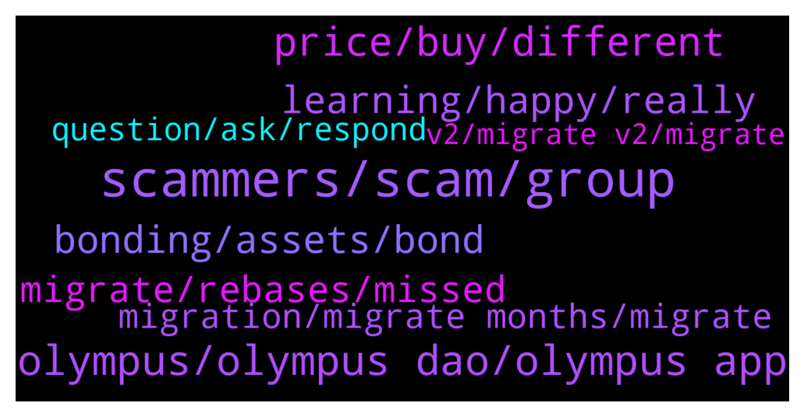

# **@OlympusTG**
 ## Analysis for **2021-12-20** - **2021-12-21**.

---

## 📊 **Basic Stats**

**n_messages_sent**: 1172

---

---

## 🔝 **Top keywords and related messages**

1. **scammers, scam, group**

    @SMNFT7 --- *These scammers have been making so much money, I chexk the address of scammed ohmies and damn, these mf be getting bags! F for lost ohmies* **--->** [TG Discussion](https://t.me/OlympusTG/129209)

    @ClickonDefi1 --- *Imagine all of the scammers reading our conversation patiently* **--->** [TG Discussion](https://t.me/OlympusTG/129430)

    @r21001 --- *that's a lot of scammers in my private , ahhaha* **--->** [TG Discussion](https://t.me/OlympusTG/129199)

    @Poopoo (never dm first & don't dm me) --- *yea you're right, best to change your privacy settings to only contacts can add you to group, otherwise any scammers can add you to any group, also please report the group* **--->** [TG Discussion](https://t.me/OlympusTG/131329)

    @Poopoo (never dm first & don't dm me) --- *there have been a lot of scammers here asking people to dm them, not sure if you're one of them* **--->** [TG Discussion](https://t.me/OlympusTG/129841)

    @K. --- *I got like 20 scammers messaging me saying their helpdesk support from this group lol* **--->** [TG Discussion](https://t.me/OlympusTG/130534)

2. **olympus, olympus dao, olympus app**

    @Ap0l1o --- *Never respond to any DM’s claiming to be Olympus support, they are 100% scam!* **--->** [TG Discussion](https://t.me/OlympusTG/130076)

    @Dtt --- *Im only asking cause I saw a lot of people in the comments sections under Olympus vids calling it a ponzi and printing tokens out of thin air* **--->** [TG Discussion](https://t.me/OlympusTG/129761)

    @zhil_li --- *Hey, admins, I would love to know the total charges for a project who want to launch its IDO on Olympus PRO. Could anyone please tell me?* **--->** [TG Discussion](https://t.me/OlympusTG/129973)

    @Hun --- *Yeah , you should change you dp. Also, on the Olympus APP* **--->** [TG Discussion](https://t.me/OlympusTG/129824)

    @emilydru --- *ios debank.com the right app to use?* **--->** [TG Discussion](https://t.me/OlympusTG/129623)

    @Poopoo (never dm first & don't dm me) --- *no one has the answer, Olympus is the first one adopting this mechanism in the industry, the supply will increase as long as the protocol is expanding* **--->** [TG Discussion](https://t.me/OlympusTG/129539)

3. **price, buy, different**

    @A3C10A7FFF97E216C437E8E305F881B7 --- *I wish the price was down so I can buy more ohms* **--->** [TG Discussion](https://t.me/OlympusTG/129909)

    @Ammaraljhni --- *I bought ohm with high price now I am down on my investment also now with gas fees I can buy one ohm with it* **--->** [TG Discussion](https://t.me/OlympusTG/130687)

    @Dtt --- *So the price of 1 Ohm can never drop below 1 Dai?* **--->** [TG Discussion](https://t.me/OlympusTG/129716)

    @Dtt --- *What happens if I buy let’s say 10 Ohm for $4K and the price of 1 Ohm drops to $40? Wouldn’t I lose a lot of money despite the high Apy? I mean the price volatility makes it pretty risky* **--->** [TG Discussion](https://t.me/OlympusTG/129725)

    @RockyT31 --- *$94,000 is ohm from poor victims* **--->** [TG Discussion](https://t.me/OlympusTG/129620)

    @hunkarperk --- *Oo price is started to increase👍* **--->** [TG Discussion](https://t.me/OlympusTG/129805)

4. **bonding, assets, bond**

    @Poopoo (never dm first & don't dm me) --- *from bonding, the bonder provides LP token to the protocol* **--->** [TG Discussion](https://t.me/OlympusTG/129665)

    @Poopoo (never dm first & don't dm me) --- *yes let's say a bonder pays 400 DAI to mint 1 OHM through bonding, the protocol only need to make sure that 1 DAI doesn't get used, the protocol can use 399 to either mint 399 more OHM, or partially used to mint OHM then use the rest for yield generating activities* **--->** [TG Discussion](https://t.me/OlympusTG/129708)

    @Poopoo (never dm first & don't dm me) --- *there was probably some bootstrapping event at the beginning, then yes, bonding to get assets, and assets in the treasury generates more assets as well, and partnership with other protocols and they provided the Olympus with some equity* **--->** [TG Discussion](https://t.me/OlympusTG/129513)

    @Poopoo (never dm first & don't dm me) --- *LP tokens so yes fees, and treasury strategy down the line too, so that the treasury can make more from the assets we have* **--->** [TG Discussion](https://t.me/OlympusTG/129516)

    @Poopoo (never dm first & don't dm me) --- *but because of the bonding mechanism, new tokens are issued to the bonders, and the bonders dilute the stakers, but they bring in more assets to the protocol, so there needs to be a balance* **--->** [TG Discussion](https://t.me/OlympusTG/129535)

    @Poopoo (never dm first & don't dm me) --- *would be only a portion of it, at the moment some assets are just sitting there doing nothing, so the protocol will need to work out a strategy for the treasury asset* **--->** [TG Discussion](https://t.me/OlympusTG/129560)

5. **learning, happy, really**

    @shogunfx1 --- *Man, I'm gonna have to notes from you, been doing it the wrong way this whole time* **--->** [TG Discussion](https://t.me/OlympusTG/129743)

    @Da4ni11 --- *Now are you satisfied ? 🤣* **--->** [TG Discussion](https://t.me/OlympusTG/129834)

    @Poopoo (never dm first & don't dm me) --- *it should include your missed rebases dear, just in the form of gOHM* **--->** [TG Discussion](https://t.me/OlympusTG/131261)

    @Poopoo (never dm first & don't dm me) --- *I can't survive here if I have to type out the same answer 1000 times a day* **--->** [TG Discussion](https://t.me/OlympusTG/129742)

    @don0bb --- *I’ve dyord bro dw bout that so what’s your point then* **--->** [TG Discussion](https://t.me/OlympusTG/131377)

    @ln_guy --- *So you "accuse"' other with things you yourself are doing (self promotion). :)* **--->** [TG Discussion](https://t.me/OlympusTG/129956)

6. **migrate, rebases, missed**

    @Poopoo (never dm first & don't dm me) --- *correct, you need to migrate, see pinned message. If you migrate your missed rebase will be given back to you* **--->** [TG Discussion](https://t.me/OlympusTG/129396)

    @SMNFT7 --- *Yes, you will get those rebases back when you migrate, so you have not lost any, just see pinned messages and get you some gOHM* **--->** [TG Discussion](https://t.me/OlympusTG/130830)

    @cdp279 --- *when you migrate you'll get all rebases that you missed* **--->** [TG Discussion](https://t.me/OlympusTG/130336)

    @Poopoo (never dm first & don't dm me) --- *correct, when you migrate it will be givne back to you, the missed rebases* **--->** [TG Discussion](https://t.me/OlympusTG/130479)

    @Poopoo (never dm first & don't dm me) --- *you can migrate now, see pinned message, missed rebase will be given to you after the migration* **--->** [TG Discussion](https://t.me/OlympusTG/130994)

    @shogunfx1 --- *Yep that's right, your rebases have not been reflected just yet, so you'll need to wait! Unfortunately.* **--->** [TG Discussion](https://t.me/OlympusTG/129450)

7. **migration, migrate months, migrate**

    @jrobertshaw --- *What is the migration date? thanks* **--->** [TG Discussion](https://t.me/OlympusTG/130993)

    @SMNFT7 --- *Btw anyone here knows on which stage of migration we are currently at?* **--->** [TG Discussion](https://t.me/OlympusTG/129475)

    @GoldenFuture7 --- *I’ll wait couple of days -thanks. May be it’s due to the migration…thanks* **--->** [TG Discussion](https://t.me/OlympusTG/129283)

    @Anthonyanderson23 --- *It is true, I have 3 sohm, I was confused by the immigration thing ..* **--->** [TG Discussion](https://t.me/OlympusTG/130651)

    @Max --- *Yes, it looks like the train is finally leaving the station 🚉* **--->** [TG Discussion](https://t.me/OlympusTG/129806)

    @Narivana --- *So its only approval of migration* **--->** [TG Discussion](https://t.me/OlympusTG/129404)

8. **question, ask, respond**

    @Poopoo (never dm first & don't dm me) --- *if you want dm me the forum link, but don't respond if I reply in dm okay* **--->** [TG Discussion](https://t.me/OlympusTG/129586)

    @Hun --- *You can DM me if you need specific questions answered.* **--->** [TG Discussion](https://t.me/OlympusTG/129836)

    @Poopoo (never dm first & don't dm me) --- *don't respond to dm dear, use this https://dune.xyz/0xrusowsky/Olympus-Wallet-History* **--->** [TG Discussion](https://t.me/OlympusTG/129197)

    @Niels --- *is there someone who can help me with my questions?* **--->** [TG Discussion](https://t.me/OlympusTG/129992)

    @Poopoo (never dm first & don't dm me) --- *no ser, no dm, answer questions here* **--->** [TG Discussion](https://t.me/OlympusTG/129837)

    @Ravish83 --- *OlympusTG Moderator: Hello How can we be of assistance.  Do you have any issues ?  Ravan Ahmadov: Hello yes  OlympusTG Moderator: Okay kindly let us know the issues so we can rectify it  Ravan Ahmadov: Can your wife suck my dick?  😂  Or you mother* **--->** [TG Discussion](https://t.me/OlympusTG/131330)

