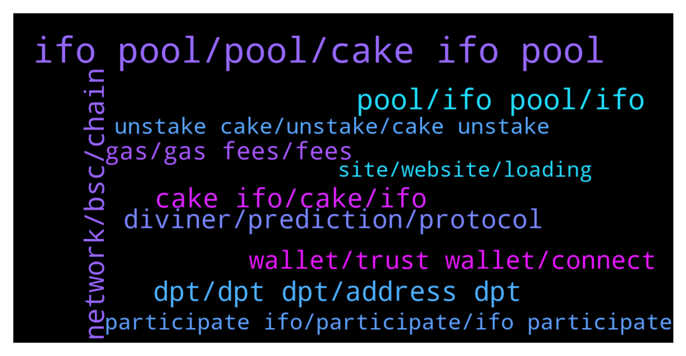

# **@PancakeSwap**
 ## Analysis for **2021-12-20** - **2021-12-21**.

---

## 📊 **Basic Stats**

**n_messages_sent**: 2840

---

---

## 🔝 **Top keywords and related messages**

1. **ifo pool, pool, cake ifo pool**

    @thesneed --- *so we have to leave cake seperate also not dump it all in the ifo pool? didnt know that thanks* **--->** [TG Discussion](https://t.me/PancakeSwap/2212629)

    @Rezahashemihamid --- *Now can claim my cake of ifo pool?* **--->** [TG Discussion](https://t.me/PancakeSwap/2209438)

    @nikunjkk --- *currently i staked my cake in ifo pool for participate in ifo should i unstake cake from ifo pool and restake in actual ifo pool ??* **--->** [TG Discussion](https://t.me/PancakeSwap/2209008)

    @Rush_lover --- *u dont need to unstake if u have enough other coins in your wallet to pay the IFO.* **--->** [TG Discussion](https://t.me/PancakeSwap/2209102)

    @Ceddi200 --- *Which ever method. If you have enough cake you don’t need to.  You can unstake from the IFO pool and commit to basic or unlimited* **--->** [TG Discussion](https://t.me/PancakeSwap/2209336)

    @Dom --- *Can someone explain to me how it will work tomorrow at IFO?  As soon as the IFO starts, I have to remove all my cakes from the IFO pool and then I can enter the amount of how many DPT tokens I want to buy?* **--->** [TG Discussion](https://t.me/PancakeSwap/2208552)

2. **pool, ifo pool, ifo**

    @lmcf1990 --- *So whats the point of ifo pool??? If we have to unstake to join ifo, normal pool works the same..dont make sense* **--->** [TG Discussion](https://t.me/PancakeSwap/2212106)

    @amtkmr0 --- *Can someone please explain things regarding ifo and pool. Like the avg. pool balance that we have right now, we will be able to get ifo of the same amount(or its a lottery system). I am trying for the first time.* **--->** [TG Discussion](https://t.me/PancakeSwap/2206722)

    @ajj2882 --- *Next ifo we will truly see if the pool works.  This pool idea was thrown in a week ago no time For loyalty.  But for the next ifo the pool is already counting towards it.  So we will see who is loyal staying staked in there at a large amount for proper allocation.* **--->** [TG Discussion](https://t.me/PancakeSwap/2212215)

    @lilload --- *i can't buy if i didn't stake in ifo pool?* **--->** [TG Discussion](https://t.me/PancakeSwap/2209692)

    @Ceddi200 --- *You did not unstake from the IFO pool, if you successfully unstake from the IFO pool you will then need to commit to basic or unlimited sales* **--->** [TG Discussion](https://t.me/PancakeSwap/2212082)

    @rpoole69 --- *You can un-stake now from IFO pool* **--->** [TG Discussion](https://t.me/PancakeSwap/2210273)

3. **dpt, dpt dpt, address dpt**

    @V_W3_Designer --- *can someone tell me how much will be the price of DPT in unlimited plan? I meant 0.025$ + fee... how to caculate it?* **--->** [TG Discussion](https://t.me/PancakeSwap/2206836)

    @rpoole69 --- *wtf, why is my dpt to receive decreasing for both basic and Unlimited! did the Basic 8.14332247557003 and now shows DPT of 132.3747792, Unlimited 38.892533245656495 cake  and shows 38.13684 DPT! WTH!* **--->** [TG Discussion](https://t.me/PancakeSwap/2210707)

    @Marselinho --- *What is happening with DPT? I ifoed for a 20x at least* **--->** [TG Discussion](https://t.me/PancakeSwap/2212786)

    @erbseyer --- *Hahaha, i bought cake at $13+ to join IFO. Now its $12.10. I also spent more than $5 in swapping, staking and unstaking fees. Now my claimed DPT can only be sold for $2.72 less swap fees of more than $1. Then there's a problem with emission. I hope mgt team will squeeze their smart brains or this business is doomed.* **--->** [TG Discussion](https://t.me/PancakeSwap/2212132)

    @moranmerber1982 --- *why is the amount of dpt change every second?* **--->** [TG Discussion](https://t.me/PancakeSwap/2210765)

    @LocusFocus --- *the participation fee does not look like a lot here, but as I mentioned in the previous message. I'm wondering why there is such a big difference in the prices for the older IFOs. I wouldn't want to get DPT at $0.025 only to pay $2 fee on it 😅* **--->** [TG Discussion](https://t.me/PancakeSwap/2209475)

4. **network, bsc, chain**

    @brainRekt --- *Really sorry for the experience 🥶. We all are rooting for a faster network.. Though its secure, scaling needs improvement that BSC team is doin. we might see improvement soon.* **--->** [TG Discussion](https://t.me/PancakeSwap/2212339)

    @brainRekt --- *its perfectly fine, just some delays with the network as we are flooded. More on Queue. DEcentralizatiton have its pros and cons, yet BSC is still the best there is currently* **--->** [TG Discussion](https://t.me/PancakeSwap/2211550)

    @brainRekt --- *Devs are sorting out the best possible actions for these problems, and yep we are constantly watching for BSC too, its just that usercount is too great and that we must consider for the next events, all your concerns are noted and thanks for feedbacks. we aim to a better service. really sorry for the downsides🥶* **--->** [TG Discussion](https://t.me/PancakeSwap/2212638)

    @brainRekt --- *there might be a hundred thousand accounts accessing PCS and clogging BSC, Pls bear in mind that even though BSC is the fastest network currently (without sacrificing security) , it still have some limitations.* **--->** [TG Discussion](https://t.me/PancakeSwap/2211963)

    @brainRekt --- *Noted your opinions, We will be adding more updates/ patches for a better user exp, but the main concern  is the network, we can just be patient and Hodl as the team is busy finding solutions for a faster network.* **--->** [TG Discussion](https://t.me/PancakeSwap/2212206)

    @brainRekt --- *we are collecting precious data specially network stress/  clog data. BSC team are aware of the situation and scaling update is on the way. we might see improvements in the coming weeks/ months* **--->** [TG Discussion](https://t.me/PancakeSwap/2211686)

5. **cake ifo, cake, ifo**

    @Meme --- *Meaning we have to unstake ifo cake before the event start and stake the cake in ifo when the event start?  Is this how we should do?* **--->** [TG Discussion](https://t.me/PancakeSwap/2209070)

    @Antazarro --- *Yes. You should unstake your cakes beforehand, and not at the time of IFO, in order to prevent situations like this.* **--->** [TG Discussion](https://t.me/PancakeSwap/2210988)

    @ALB7C --- *Unstake from IFO and wait for sale to open and commit your cake! EASY* **--->** [TG Discussion](https://t.me/PancakeSwap/2209649)

    @h_sh0709 --- *Am worried  about My 450 cakes staked in ifo , the site isn't working,  I hope my cake tokens are safe after 4-5 time unstaking and cancelling..* **--->** [TG Discussion](https://t.me/PancakeSwap/2212315)

    @siege11 --- *can we unstake cake before the IFO starts, and still can commit the earned cake* **--->** [TG Discussion](https://t.me/PancakeSwap/2209227)

    @GeshyG --- *Do you have to unstake cake before committing in todays IFO* **--->** [TG Discussion](https://t.me/PancakeSwap/2209636)

6. **diviner, prediction, protocol**

    @KIEMDANG --- *In addition to the lossless prediction market, Diviner Protocol will also bring up all kinds of mini play2earn games, such as crash, superleverage, bull or bear, treasure boxes, spin, lottery, etc to enhance the user's addictiveness, and meet their diversified requirements. Also, the games can make our project much better playable.* **--->** [TG Discussion](https://t.me/PancakeSwap/2207421)

    @Sa_kib_7 --- *Hello Sir   🔰🔰 What are the features of Mini Games and what can we earn by playing Mini Games ?* **--->** [TG Discussion](https://t.me/PancakeSwap/2207781)

    @RakibBNP46 --- *What innovations does Diviner Protocol offer in DeFi and how Do Diviner protocol changing the new DeFi ecosystem and what are the plans for the next few years?* **--->** [TG Discussion](https://t.me/PancakeSwap/2207515)

    @TubaBykstn6 --- *I read that "Diviner NFT has rich and unique features like stealing", but could you really explain these features to us in more detail? and above all this characteristic of "theft"? Will we be vulnerable to any theft of collectibles?* **--->** [TG Discussion](https://t.me/PancakeSwap/2207892)

    @KIEMDANG --- *In a word, Diviner Protocol not only removes the penalties for those who lost in the predictions but also provides users with a diversified play2earn gaming ecosystem. Can read more details here as well: https://medium.com/@Diviner_Protocol/diviner-protocol-refine-the-prediction-market-with-gamefi-b6c17c5e14f2* **--->** [TG Discussion](https://t.me/PancakeSwap/2207434)

    @marjerlinB --- *Will Diviner Protocol really be an NFT game that will be comprised of a metaverse in which NFTs can be traded? If so, can we buy or sell DIVINER NFTs in big marketplaces like BINANCE in the future?* **--->** [TG Discussion](https://t.me/PancakeSwap/2207953)

7. **wallet, trust wallet, connect**

    @jpcaid --- *Try with a new wallet address* **--->** [TG Discussion](https://t.me/PancakeSwap/2206793)

    @Luukku1 --- *When you click "connect" on the top right corner, you choose "wallet connect"* **--->** [TG Discussion](https://t.me/PancakeSwap/2213206)

    @Tobal --- *There is no button that says connect wallet…. Sorry I’m really new at this* **--->** [TG Discussion](https://t.me/PancakeSwap/2213201)

    @Mikemaglue --- *It processes very very well on dapps tab in trust wallet... I always had problems on web page b4* **--->** [TG Discussion](https://t.me/PancakeSwap/2210957)

    @SARGANA1010 --- *No error pending transactions when i try through meta mask Through Trust wallet error underpriced.* **--->** [TG Discussion](https://t.me/PancakeSwap/2212994)

    @KOIN24 --- *but I used bsc chrome wallet* **--->** [TG Discussion](https://t.me/PancakeSwap/2210208)

8. **gas, gas fees, fees**

    @Ceddi200 --- *Bro what you should know and which is not new. When a transactions is failed gas fees are still charged. Also make sure you don’t swap bad coins.* **--->** [TG Discussion](https://t.me/PancakeSwap/2213041)

    @Luukku1 --- *Seems to be the gas fee.* **--->** [TG Discussion](https://t.me/PancakeSwap/2213268)

    @Bogdan --- *It seems that i spend more on gas fees* **--->** [TG Discussion](https://t.me/PancakeSwap/2212501)

    @nikunjkk --- *what is normal gas fee ?* **--->** [TG Discussion](https://t.me/PancakeSwap/2209145)

    @Flower9999999999 --- *I hope his gas fees and slippage was less than $12,600 prize fund!  I personally thought the prize fund was lame this time because it was $200K for the Easter trading competition and now it’s only $120K combined* **--->** [TG Discussion](https://t.me/PancakeSwap/2208634)

    @brainRekt --- *Dont sell Nfts below the average total spent gas.* **--->** [TG Discussion](https://t.me/PancakeSwap/2208709)

9. **participate ifo, participate, ifo participate**

    @nikunjkk --- *if i unstake now can i able to participate in ifo ?* **--->** [TG Discussion](https://t.me/PancakeSwap/2209067)

    @Cryptonian8 --- *why team can'tdo the auto commit like apeswap doing in their ifo?* **--->** [TG Discussion](https://t.me/PancakeSwap/2211838)

    @iamtheKREATOR --- *What i need to do for perticipate in IFO* **--->** [TG Discussion](https://t.me/PancakeSwap/2208043)

    @Cryptonian8 --- *auto commit similar in apeswap ifo is better than manually commit. i hope pancakeswap team will do that in next ifo* **--->** [TG Discussion](https://t.me/PancakeSwap/2212208)

    @Luukku1 --- *Then you didn't participate in the IFO* **--->** [TG Discussion](https://t.me/PancakeSwap/2213081)

    @ionpoweruzb --- *STUPID IFO, 3 times now cannot participate because of BSC FAILURE 😞* **--->** [TG Discussion](https://t.me/PancakeSwap/2211634)

10. **unstake cake, unstake, cake unstake**

    @Moderndirector --- *there is no withdraw button i cant withdraw my cake* **--->** [TG Discussion](https://t.me/PancakeSwap/2211072)

    @francis_sg --- *No pude ni siquiera casar mis cakes en Stake, la red quedó con transacciones pendientes por más que la acelere nunca funcionó, muchas gracias* **--->** [TG Discussion](https://t.me/PancakeSwap/2211639)

    @HAITIENLK --- *withdraw cake? you can unstake whenever you want* **--->** [TG Discussion](https://t.me/PancakeSwap/2209440)

    @Jpades --- *Realy frustrating, trying to unstake cake for 1.5hour and doenst work, and then when ifo is finished my cake unstakes, had to pay 1.59dollar for nothing, dont care about the dollar but why the ... did nothing work?, normaly every day i can use cake and on the one moment it crashes* **--->** [TG Discussion](https://t.me/PancakeSwap/2211860)

    @ssagis --- *Thank you, i think i m late to this. İt wont get me a good amount to participate if i stake cake now. Missed that one* **--->** [TG Discussion](https://t.me/PancakeSwap/2209327)

    @Praiseworthy --- *I couldn't stake cake, why? I pay many failed TX.* **--->** [TG Discussion](https://t.me/PancakeSwap/2208072)

