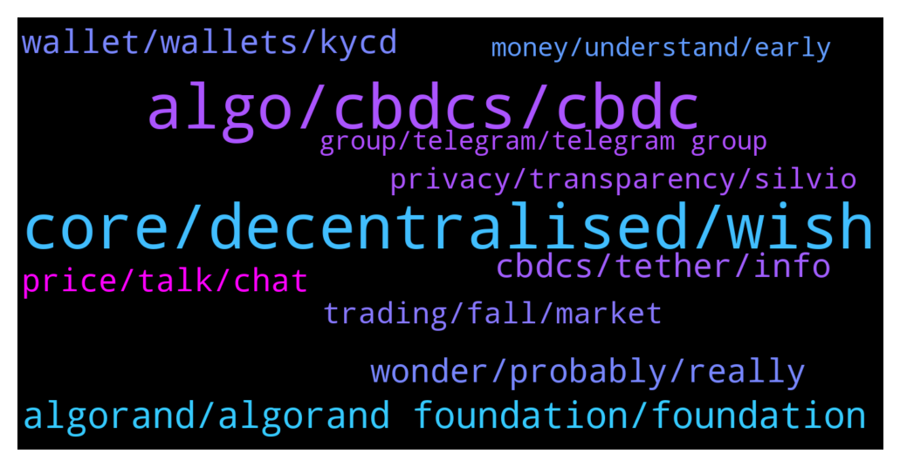

# **@algorand**
 ## Analysis for **2021-12-20** - **2021-12-21**.

---

## 📊 **Basic Stats**

**n_messages_sent**: 356

---

---

## 🔝 **Top keywords and related messages**

1. **core, decentralised, wish**

    @mioumitsou --- *Im talking about the core technology* **--->** [TG Discussion](https://t.me/algorand/324147)

    @Tiny_Philosopher_784 --- *Me? No, not paid.   It's just the cycle. Crypto is starting to move into nyse cyclicals.   I'm sure nobody sees it, because zoom out doesnt compute. Only if you claim to be stupid, because only dumb ones think there is no historical data to look at. History never repeats itself. Humans arent creatures of habit... they never repeat the same actions ever. When you think people wont do the same things, they never do.* **--->** [TG Discussion](https://t.me/algorand/324110)

    @mioumitsou --- *Would preffer crack down on tether and a trully decentralised crypto as a medium of exchange* **--->** [TG Discussion](https://t.me/algorand/324133)

    @luiz422 --- *Hello guys, I'm a moderator in a good Arab community with more than 30k members interested in crypto If you are interested in doing an AMA or creating an Arabic support, please let me know* **--->** [TG Discussion](https://t.me/algorand/324381)

    @BO881N --- *But if you want to start crypto means you’re ready for the risk to gain or loose* **--->** [TG Discussion](https://t.me/algorand/323883)

    @MackDenver --- *What makes you think it's centralized? We are built as a decentralized network from its very core* **--->** [TG Discussion](https://t.me/algorand/324038)

2. **algo, cbdcs, cbdc**

    @Arham74 --- *please any body explain algo project use case* **--->** [TG Discussion](https://t.me/algorand/323913)

    @junjie9021 --- *Hello, does algo have a public main network node？* **--->** [TG Discussion](https://t.me/algorand/323915)

    @MuratArkan --- *Where is algo supports? İ cant sene now.* **--->** [TG Discussion](https://t.me/algorand/323983)

    @Nakibruce --- *Woth cbdcs algo has the liquidity whoch pushes everything else to gravitate around it and be compatible woth it* **--->** [TG Discussion](https://t.me/algorand/324188)

    @mioumitsou --- *So algo will be the "toll station" between markets* **--->** [TG Discussion](https://t.me/algorand/324202)

    @mioumitsou --- *How will the value or usabillity of algo be coupled to the cbdc?* **--->** [TG Discussion](https://t.me/algorand/324182)

3. **algorand, algorand foundation, foundation**

    @wassimss --- *I heard that most of supply is controlled by the algorand foundation* **--->** [TG Discussion](https://t.me/algorand/324040)

    @mxi --- *Guys I'm new here. Is algorand's main technology already deployed or are there any essential functions developing not released yet ? Where can i read about this ?* **--->** [TG Discussion](https://t.me/algorand/323854)

    @angelo9007 --- *You can find about Algorand more in our website https://algorand.foundation/* **--->** [TG Discussion](https://t.me/algorand/323911)

    @KAPIBAYSIDE --- *What makes algorand better than cardano?* **--->** [TG Discussion](https://t.me/algorand/324300)

    @angelo9007 --- *You can refer to https://developer.algorand.org/docs/run-a-node/setup/types/ to check the types of Algorand node* **--->** [TG Discussion](https://t.me/algorand/323916)

    @mcmaxims --- *Chances are it goes mostly to Algorand. You can do your own research and compare tech and ecosystem. Hit me up if you think I am wrong.* **--->** [TG Discussion](https://t.me/algorand/324312)

4. **wonder, probably, really**

    @Sanchayan_bhunia --- *I don't understand how such a big news didn't hit the mainstream media!* **--->** [TG Discussion](https://t.me/algorand/324472)

    @NightAlgorand --- *😂 To be fair, yes. Would have gotten much more but probably wouldn't work that well on guys :/* **--->** [TG Discussion](https://t.me/algorand/323853)

    @mioumitsou --- *Think ill be going down that route* **--->** [TG Discussion](https://t.me/algorand/324230)

    @Charlotte_Harris288 --- *Yeah it really would be a nightmare* **--->** [TG Discussion](https://t.me/algorand/323953)

    @Marthastave --- *I think it’s really keeping you updated..* **--->** [TG Discussion](https://t.me/algorand/323847)

    @Chocoim --- *17 dapps r coming he said* **--->** [TG Discussion](https://t.me/algorand/323934)

5. **wallet, wallets, kycd**

    @mioumitsou --- *That is f'ed up, meaning if i use 100 cbdcs to buy 100 worth of doge then my wallet will be automatically pinned to my credinentials through the cbdc tracking software* **--->** [TG Discussion](https://t.me/algorand/324208)

    @Nakibruce --- *Btc whos whale rop walleta control over 90% of all of it and where the more money you have to run minibg equipment the more say you have?* **--->** [TG Discussion](https://t.me/algorand/324142)

    @Tiny_Philosopher_784 --- *Nope. But I pay attention to news on problems with wallets* **--->** [TG Discussion](https://t.me/algorand/323844)

    @Nigel --- *Hey guys just bought a bag of algorand* **--->** [TG Discussion](https://t.me/algorand/323946)

    @Nakibruce --- *They already do if you have any kycd wallets that have at any time sent to any of your other walleta* **--->** [TG Discussion](https://t.me/algorand/324225)

    @Nakibruce --- *I jad 2 kycd wallets on different exchanges out of about 20 wallets tax time gove traced wvwrything i had and knew* **--->** [TG Discussion](https://t.me/algorand/324222)

6. **cbdcs, tether, info**

    @mioumitsou --- *I wont be able not to usecbdcs once ready.* **--->** [TG Discussion](https://t.me/algorand/324093)

    @mioumitsou --- *Fine ok monero then, the point is that btc is open to the public domain. But cbdcs are not. We shouldnt be supporting this as a comunity* **--->** [TG Discussion](https://t.me/algorand/324165)

    @mioumitsou --- *That is distopian, a future no one wants. Cbdcs will provide big data on an atomic level of our society. Each and every one of us will be tracked through our economic afairs. Its mind boglling how the crypto comunity supports such a thing. This is wrong* **--->** [TG Discussion](https://t.me/algorand/324106)

    @mioumitsou --- *Bruce, the idea of cbdcs doesnt raise the hair on your arms?* **--->** [TG Discussion](https://t.me/algorand/324171)

    @mioumitsou --- *But cbdcs are more than crypto, they will know the precise amount of money on you at any given time* **--->** [TG Discussion](https://t.me/algorand/324223)

    @MackDenver --- *We have been in discussions with 15 countries to assist them on launching CBDC. We will release more information about it in the coming days.* **--->** [TG Discussion](https://t.me/algorand/324064)

7. **price, talk, chat**

    @angelo9007 --- *Please refer to https://t.me/algorand_price for price and anything related* **--->** [TG Discussion](https://t.me/algorand/323929)

    @MackDenver --- *As I said above, it is not a price discussion chat. You can talk about price on the mentioned group.* **--->** [TG Discussion](https://t.me/algorand/323996)

    @MackDenver --- *We don't talk about price here. There is a separate group for price discussion  @algorand_price* **--->** [TG Discussion](https://t.me/algorand/323992)

    @MackDenver --- *Gentle reminder to take price chat to https://t.me/algorand_price* **--->** [TG Discussion](https://t.me/algorand/324007)

    @Djeran --- *The price discussion group is private  Do we need invite* **--->** [TG Discussion](https://t.me/algorand/324357)

    @mioumitsou --- *That is not an argument to my question, that is very vague* **--->** [TG Discussion](https://t.me/algorand/324077)

8. **trading, fall, market**

    @Alma --- *This round of diving many copycat coins can no longer fluctuate. Although you have lost, now you need to change your trading strategies, the market still has to fall, even if you stop We haven't seen the bottom yet. You can reduce your exposure appropriately* **--->** [TG Discussion](https://t.me/algorand/324499)

    @Alma --- *The market still has room to fall and has not yet bottomed out. You can reduce your position appropriately to reduce risk* **--->** [TG Discussion](https://t.me/algorand/323896)

    @MackDenver --- *You should join the trading chat: @algorand_price* **--->** [TG Discussion](https://t.me/algorand/324500)

    @Commissioner Gordon --- *If the crypto market is down then we should be buying correct?* **--->** [TG Discussion](https://t.me/algorand/323891)

    @Tiny_Philosopher_784 --- *Uh, yeah... great work, Nostradamous. The market could do two other things: go up or go sideways* **--->** [TG Discussion](https://t.me/algorand/323920)

    @Alma --- *Thank you for your approval. Now it is time to change the trading strategy. Instead of blindly following the trend of investment, it is better to stop losses in time, recover losses, trade in both directions, hedge risks, and maximize profits* **--->** [TG Discussion](https://t.me/algorand/323882)

9. **privacy, transparency, silvio**

    @mioumitsou --- *And transparency, anonymity, security You forgot to add those characteristics* **--->** [TG Discussion](https://t.me/algorand/324083)

    @hope999999999 --- *If they allow privacy, gov wont support them.* **--->** [TG Discussion](https://t.me/algorand/324400)

    @LogicalLadder --- *Is there any link to videos or posts by Silvio about privacy in crypto and applications of ZK* **--->** [TG Discussion](https://t.me/algorand/324408)

    @LogicalLadder --- *And to everyone else it's private* **--->** [TG Discussion](https://t.me/algorand/324405)

    @Nakibruce --- *Silvio invented zero knowleege proofs and many privacy features there will be privacy* **--->** [TG Discussion](https://t.me/algorand/324401)

    @Nakibruce --- *Not all privacy coins and mixers can avoid it* **--->** [TG Discussion](https://t.me/algorand/324164)

10. **money, understand, early**

    @Nakibruce --- *You already cant get around it if you ever cash out* **--->** [TG Discussion](https://t.me/algorand/324094)

    @mioumitsou --- *Listen i do understand that some of you are in it for the money.. Get in early and cash out at the peak. I do understand but you also need to understand the consiquences of your actions* **--->** [TG Discussion](https://t.me/algorand/324120)

    @Nakibruce --- *Yeh you can hide it usong monero but then how do you cash out* **--->** [TG Discussion](https://t.me/algorand/324231)

    @Nakibruce --- *But cashing out unless your moving to a third world sictator run country and oayong bribes your accountable* **--->** [TG Discussion](https://t.me/algorand/324245)

    @Nakibruce --- *All that money appearing from nowhere to use and now you literally cant prove its legit your fucked anyway* **--->** [TG Discussion](https://t.me/algorand/324232)

    @Nakibruce --- *But then those funds are basically unuseable* **--->** [TG Discussion](https://t.me/algorand/324214)

