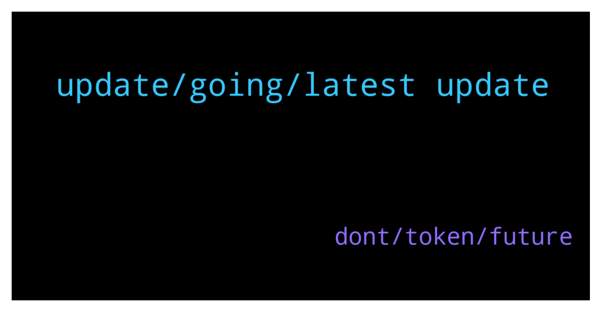

# **@ampnetapxchat**
 ## Analysis for **2021-12-16** - **2021-12-21**.

---

## 📊 **Basic Stats**

**n_messages_sent**: 31

---

---

## 🔝 **Top keywords and related messages**

1. **update, going, latest update**

    @mislavjavor --- *Hey community. I know we've been silent for a while but there was really nothing major to report.   However, we are pleased to say we have some very big news which will be released at the beginning of January.   I would love to inform you more, however we have to be respectful towards our contractual obligations.* **--->** [TG Discussion](https://t.me/ampnetapxchat/35728)

    @runex_x1 --- *Would be nice if you guys could do a pontoondao-progress update before going into the holidays. Tx* **--->** [TG Discussion](https://t.me/ampnetapxchat/35725)

    @Hoetoevallig --- *And what's actually going on now? All quiet here.* **--->** [TG Discussion](https://t.me/ampnetapxchat/35639)

    @maroraza --- *Hey @mislavjavor any update on this when you are launching this PontoonDAO? if no date any idea in which month its gonna come?* **--->** [TG Discussion](https://t.me/ampnetapxchat/35667)

    @<UNK> --- *https://t.me/ampnetapxchat/35378 This is the latest update on DAO and overall situation, next one will be after the holidays* **--->** [TG Discussion](https://t.me/ampnetapxchat/35726)

    @<UNK> --- *This is the latest update on current situation https://t.me/ampnetapxchat/35378* **--->** [TG Discussion](https://t.me/ampnetapxchat/35640)

2. **dont, token, future**

    @Krabatu --- *just please dont ask us to stake AAPX on Ethereum network 😅* **--->** [TG Discussion](https://t.me/ampnetapxchat/35630)

    @matejmz --- *Token price is only 26x away from 2021 goal set by team. 10 days remaning, let's go* **--->** [TG Discussion](https://t.me/ampnetapxchat/35763)

    @PFCBLic --- *I just hope that mechanism for providing value for aapx holders will be functional and well engineered as well. We deserve it at the end of the story.* **--->** [TG Discussion](https://t.me/ampnetapxchat/35676)

    @runex_x1 --- *I think it will stay hard on ampnet, untill it tokenizes some real world assets everybody can buy portions of :).* **--->** [TG Discussion](https://t.me/ampnetapxchat/35665)

    @LootyBooty --- *And please let the staking of presale tokens be an option. So we dont have to claim constantly in order to stske* **--->** [TG Discussion](https://t.me/ampnetapxchat/35632)

    @<UNK> --- *As a holder of AAPX, you will be rewarded regardless of future changes or introduction of new token, We'll use AAPX as a foundation for future development* **--->** [TG Discussion](https://t.me/ampnetapxchat/35699)

