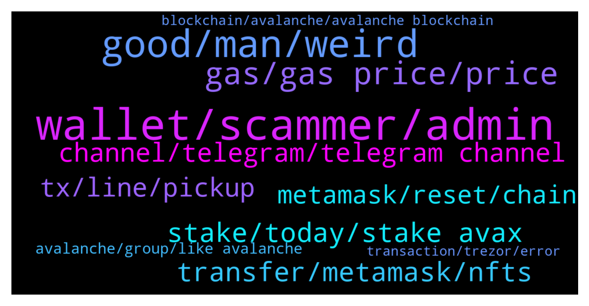

# **@avalancheavax**
 ## Analysis for **2021-12-20** - **2021-12-21**.

---

## 📊 **Basic Stats**

**n_messages_sent**: 361

---

---

## 🔝 **Top keywords and related messages**

1. **wallet, scammer, admin**

    @ramziakram --- *better don't have the money then having risk own funds  being exploited* **--->** [TG Discussion](https://t.me/avalancheavax/315979)

    @harrykit --- *some scammer use your name and your profile pic and dm me* **--->** [TG Discussion](https://t.me/avalancheavax/316254)

    @THEREALTWENTEMINING --- *sure you can.  Don't pm people, they will scam you* **--->** [TG Discussion](https://t.me/avalancheavax/316318)

    @TheSEOdude --- *The one who messaged you is a fake person. Copying the real admin.* **--->** [TG Discussion](https://t.me/avalancheavax/315690)

    @JimWelder --- *How do scams even work? Do you just ask enough people to deposit coins into your wallet?* **--->** [TG Discussion](https://t.me/avalancheavax/315515)

    @muu_0O --- *Hello admin wo I must contact to show him a promoto offers* **--->** [TG Discussion](https://t.me/avalancheavax/316297)

2. **good, man, weird**

    @Defi_Senpai --- *Wow thanks brother…. Few good people still exist* **--->** [TG Discussion](https://t.me/avalancheavax/315579)

    @eth2enthusiast --- *i think it autorenews till you exit, but im not sure, read the docs* **--->** [TG Discussion](https://t.me/avalancheavax/315904)

    @mcored --- *They told me once that it does not* **--->** [TG Discussion](https://t.me/avalancheavax/315906)

    @Aileen198801 --- *I think you look like a Korean* **--->** [TG Discussion](https://t.me/avalancheavax/316153)

    @Aileen198801 --- *What kind of person is a good person* **--->** [TG Discussion](https://t.me/avalancheavax/315580)

    @oathtobarbatos --- *Dunno... they're are sooo weird 😂* **--->** [TG Discussion](https://t.me/avalancheavax/316119)

3. **gas, gas price, price**

    @Nicolas_A --- *Can see gas price evolution here https://stats.avax.network/dashboard/c-chain-activity/* **--->** [TG Discussion](https://t.me/avalancheavax/315766)

    @Zedesss --- *whats the best Gas price for a quick transaction* **--->** [TG Discussion](https://t.me/avalancheavax/315787)

    @Nicolas_A --- *Because your gas price isn’t high enough* **--->** [TG Discussion](https://t.me/avalancheavax/315831)

    @Bebeumaf --- *You know you have paid way cheaper gas for other smart contracts... (cheaper than BSC...)  It's possible you got a spike in traffic or its the platform you're using. If you really need help you can check snowtrace and see how much traffic there is right now.* **--->** [TG Discussion](https://t.me/avalancheavax/316067)

    @Albert --- *Avalanche has probably the second highest gas fees right now after Ethereum, of course. Idk how this is gonna be the future.* **--->** [TG Discussion](https://t.me/avalancheavax/316033)

    @A --- *Has the gas gone down again then? Gas was definitely 350 for a while to get included in a block* **--->** [TG Discussion](https://t.me/avalancheavax/315785)

4. **transfer, metamask, nfts**

    @polpol99 --- *Is there some admin or person here that knows how to transfer NFTs on Avalanche from an Ethereum address. Can't do it via Metamask on desktop* **--->** [TG Discussion](https://t.me/avalancheavax/316315)

    @Nicolas_A --- *Use a marketplace to interact with your NFT such as Nftrade* **--->** [TG Discussion](https://t.me/avalancheavax/316320)

    @aleonardo83 --- *Hi, one question... a friend of mine screwed up and sent USDT from Avalanche Network in metamask to an address in Binance but from BSC Network.  Do you know if there's any way to revert the transaction to recover the funds?* **--->** [TG Discussion](https://t.me/avalancheavax/315795)

    @Nicolas_A --- *Marketplaces give you the option to transfer not just list / sell* **--->** [TG Discussion](https://t.me/avalancheavax/316330)

    @polpol99 --- *Ok, thanks. Didn't see that function on NFT Trade. But Kalao has it* **--->** [TG Discussion](https://t.me/avalancheavax/316331)

    @THEREALTWENTEMINING --- *Add the NFT to your assets, like you would with any other token* **--->** [TG Discussion](https://t.me/avalancheavax/316323)

5. **stake, today, stake avax**

    @PeppyCrypto --- *Where are people staking avax at ?* **--->** [TG Discussion](https://t.me/avalancheavax/315542)

    @metad3pt --- *Avaware Launchpad Event is Live! https://avaware.network/launchpad - Stake AVE earn EMBR. cheers.* **--->** [TG Discussion](https://t.me/avalancheavax/315526)

    @TTYW33 --- *hi! i am new. is there any preferred platform to stake avax* **--->** [TG Discussion](https://t.me/avalancheavax/316246)

    @OO491 --- *Best place to stake AVAX? Thanks in advance* **--->** [TG Discussion](https://t.me/avalancheavax/316010)

    @David --- *I am surprise Kraken took so long to list Avax!!* **--->** [TG Discussion](https://t.me/avalancheavax/316177)

    @lotus_in_mist --- *any AVAX admin DM me ?* **--->** [TG Discussion](https://t.me/avalancheavax/315666)

6. **tx, line, pickup**

    @edding3k --- *Is it smart to speed up tx or wait?* **--->** [TG Discussion](https://t.me/avalancheavax/315736)

    @Nicolas_A --- *Depends if you are in a hurry or not* **--->** [TG Discussion](https://t.me/avalancheavax/315737)

    @eth2enthusiast --- *did you get enough to do your first tx? i can pay it forward* **--->** [TG Discussion](https://t.me/avalancheavax/315886)

    @li --- *https://github.com/ava-labs/mastering-avalanche  last commits was 9 months ago* **--->** [TG Discussion](https://t.me/avalancheavax/315631)

    @algomator --- *The tx is still "waiting for confirmation" on the avax bridge.* **--->** [TG Discussion](https://t.me/avalancheavax/315924)

    @Kanedashotaro1707 --- *Yeah they can just chill, sales close tomorrow if I’m right* **--->** [TG Discussion](https://t.me/avalancheavax/315754)

7. **channel, telegram, telegram channel**

    @TheSEOdude --- *One more weird thing is , that you are not there in any other group.  You have only joined only this channel 📜.* **--->** [TG Discussion](https://t.me/avalancheavax/316123)

    @Jnofi --- *Anyone know how to join the Wonderland Telegram group?* **--->** [TG Discussion](https://t.me/avalancheavax/315821)

    @TheSEOdude --- *Lol, but not in any other ecosystem channel. As far as I am able to see.* **--->** [TG Discussion](https://t.me/avalancheavax/316128)

    @Aileen198801 --- *I’ve been in this community for almost a month. I still don’t understand what you are doing. What is this community?* **--->** [TG Discussion](https://t.me/avalancheavax/316068)

    @Taylordaman --- *ok.. cos the other channel has 55k members too..* **--->** [TG Discussion](https://t.me/avalancheavax/316106)

    @Taylordaman --- *hi there, i seee there are 2 avax official channels is that  correct ?* **--->** [TG Discussion](https://t.me/avalancheavax/316104)

8. **metamask, reset, chain**

    @bull2021 --- *Thanks. Any tutorial on how to make the MetaMask -> P Chain.   Btw I got hit up by 5 people claiming to be from AVAX support :)* **--->** [TG Discussion](https://t.me/avalancheavax/315593)

    @algomator --- *Tx is still stuck as "pending" in metamask and not showing on explorer. When I go to cancel or "speed up" it says insufficient funds even though there is plenty.* **--->** [TG Discussion](https://t.me/avalancheavax/315916)

    @polpol99 --- *https://metamask.zendesk.com/hc/en-us/articles/360058961911-How-do-I-send-receive-or-cash-out-an-NFT-   "Currently, this functionality should only be attempted in MetaMask Mobile"* **--->** [TG Discussion](https://t.me/avalancheavax/316327)

    @Nicolas_A --- *It’s like clearing the cache of your Metamask x)* **--->** [TG Discussion](https://t.me/avalancheavax/315921)

    @Nicolas_A --- *Reset Metamask : settings > advanced > reset* **--->** [TG Discussion](https://t.me/avalancheavax/315918)

    @TheSEOdude --- *reset metamask , it will clear the pending transaction.* **--->** [TG Discussion](https://t.me/avalancheavax/315804)

9. **avalanche, group, like avalanche**

    @Eagle'sEye® --- *Glad to be in group - I am on the top Avalanche admirer.* **--->** [TG Discussion](https://t.me/avalancheavax/316199)

    @aabdygaziev --- *Hello guys. Is there any limit order dapps on avalanche?* **--->** [TG Discussion](https://t.me/avalancheavax/316311)

    @algomator --- *Avalanche having issues or just me?* **--->** [TG Discussion](https://t.me/avalancheavax/315895)

    @Michael --- *Hi there! Hope you are all doing well. I was wondering if anyone knows the best  means of getting BTC (native) or BTBC onto Avalanche?* **--->** [TG Discussion](https://t.me/avalancheavax/315521)

    @Taylordaman --- *do a search for avalanche, and you will see what i meant* **--->** [TG Discussion](https://t.me/avalancheavax/316110)

    @Albert --- *The most I was charged on BSC was probably like $3. In Avalanche, if I can remember correctly, I was once charged around $14. It's just sad what Avalanche has become. I thought it's the solution after all this time. Turns out, it's not.* **--->** [TG Discussion](https://t.me/avalancheavax/316070)

10. **transaction, trezor, error**

    @M --- *Hi there, i seem to have a pretty odd probem on the avax network. Every time i try to send a transaction on my metamask with my trezor its saying error:string overflow. The weird thing is that if i  want to do a transaction on bsc network with the same trezor and adress, the transactions does go through? Any idea whats going on here? Cant send any avax or use dmart contracts now. After i fill in my trezor code it just vanishes and give transaction error fail.* **--->** [TG Discussion](https://t.me/avalancheavax/315935)

    @Bebeumaf --- *0.003 avax per transaction right now... I'm looking at snowtrace. It's  the platform you're using not the network.* **--->** [TG Discussion](https://t.me/avalancheavax/316065)

    @TheSEOdude --- *I just did a transaction with as little as 0.001 avax.* **--->** [TG Discussion](https://t.me/avalancheavax/315784)

    @Zedesss --- *FUD ?? I am a great fan of AVAX and have invested in it since it was $7 , My transaction is stuck for 30 minutes and enquiring about it  is FUD ??* **--->** [TG Discussion](https://t.me/avalancheavax/315770)

    @Bebeumaf --- *Check avax/btc price chart from the last two weeks. Now put btc between 55 to 60k. See where that takes us😁🚀* **--->** [TG Discussion](https://t.me/avalancheavax/316020)

    @adamtor --- *do we see a huge delay of AVAX on chain processing? gas fee is alreday 280 Gwei ,but didn't get posted onchain* **--->** [TG Discussion](https://t.me/avalancheavax/315740)

