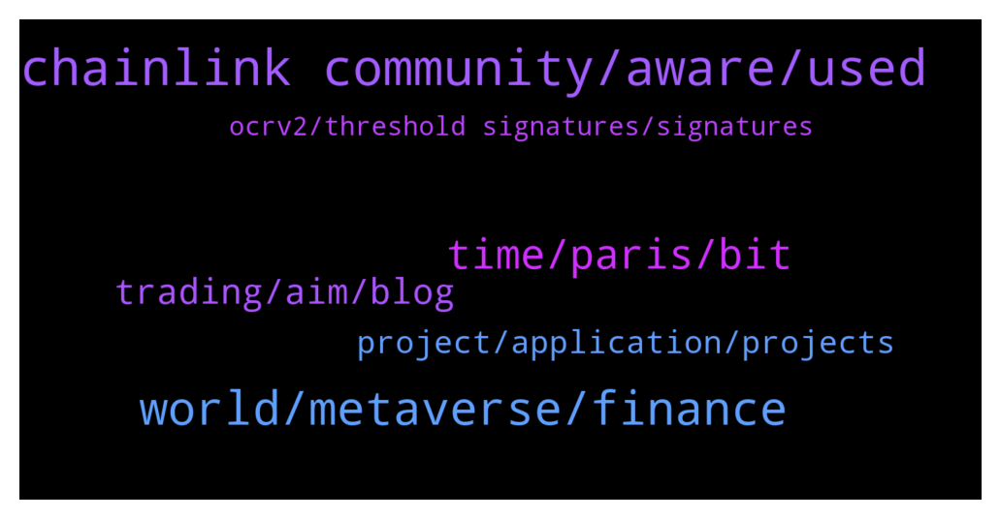

# **@chainlinkofficial**
 ## Analysis for **2021-12-20** - **2021-12-21**.

---

## 📊 **Basic Stats**

**n_messages_sent**: 137

---

---

## 🔝 **Top keywords and related messages**

1. **chainlink community, aware, used**

    @LogicalLadder --- *Is there any on chain analysis of LINK token distrubutions/whales etc* **--->** [TG Discussion](https://t.me/chainlinkofficial/356442)

    @Kryptoheini --- *Hello i have a question. There is a new coin called Megladoge and they say they have a partnership with chainlink. Can someone from the Team confirm that ? This is no shill so pls don't kick me.* **--->** [TG Discussion](https://t.me/chainlinkofficial/356471)

    @mouse_stack --- *Is there a chain link trading channel?* **--->** [TG Discussion](https://t.me/chainlinkofficial/356437)

    @AndrewB_UK --- *Just a quick question can the chainlink token be used for anything right now? Like what it's tokenomics?* **--->** [TG Discussion](https://t.me/chainlinkofficial/356473)

    @ManuelGGomes --- *Hi. When should we see stacking of LINK?* **--->** [TG Discussion](https://t.me/chainlinkofficial/356583)

    @AlUSA777 --- *I would like to know this as well, no simple information online.  What is the unlock / vesting / schedule?* **--->** [TG Discussion](https://t.me/chainlinkofficial/356444)

2. **world, metaverse, finance**

    @piyush_gup1a --- *Polytrade is building a 100% on-chain trade financing and business finance solution specifically focused on the Metaverse.. As we progressed in developing the working capital solution for SMEs, there were 2 observations: 1. The world of trade finance is not entirely ready for decentralization - it will take a lot of time for the full transition to happen. 2. There are opportunities for similar products in the metaverse as well. With a 100% on chain solution.* **--->** [TG Discussion](https://t.me/chainlinkofficial/356539)

    @albrtrmrz1 --- *how can I withdraw usd coins from meta mask?* **--->** [TG Discussion](https://t.me/chainlinkofficial/356455)

    @marcromeron --- *Arul Prakash: To understand Polytrade’s business model, watch the explainer video: https://youtu.be/daBIn6yd7WU Recent developments in the last newsletter edition: https://polytrade.finance/newsletter/oct21-vol-i.pdf Our MVP was unveiled at World Blockchain Summit, Dubai on 13 Oct. Do check out MVP demo: https://youtu.be/sW04yftWej4 $TRADE is currently listed on Kucoin, MEXC, GATE, Bitmart, uniswap, quickswap, pancakeswap.  Visit: https://polytrade.finance/why-buy-trade/ https://polytrade.finance/buy-trade-now/* **--->** [TG Discussion](https://t.me/chainlinkofficial/356530)

    @piyush_gup1a --- *Hello everyone, my name is Piyush Gupta. I am the founder & CEO of Polytrade. Its great to emeet you all today. I've been with the Trade finance industry for the last 15 years with experience in organizations like Societe Grenerale, Kitara Capital, AmiCorp and few other big names. I have setup my own trade finance business back in 2014 and since then have expanded operations to Hong Kong, Singapore, India and Dubai. Am currently based out of Dubai. At Riqueza capital we have processed invoices worth more than 500mn USD in the last few years... all of which we are confident will move to POLYTRADE. Am an Aerospace Engineering  from IIT Bombay by education.* **--->** [TG Discussion](https://t.me/chainlinkofficial/356495)

    @piyush_gup1a --- *In a 7 trillion USD trade finance industry, the unmet demand in trade finance is to the tune of $1.6 trillion. Polytrade aims to address this huge gap by harnessing the massive liquidity of the crypto world and use it to fund the working capital needs of SMEs in developing economies. We will seek funds from crypto native investors to use our platform to lend us stable coins. These stable coins are then converted to fiat or otherwise, and given to the suppliers, who then become our borrowers.* **--->** [TG Discussion](https://t.me/chainlinkofficial/356505)

    @piyush_gup1a --- *Polytrade is a crypto lending platform that connects borrowers (SMEs), their buyers, lenders and other stakeholders. In a simple example, a furniture manufacturer in Vietnam, might have a outstanding invoice against, IKEA retailer in USA. IKEA needs to pay money to the manufacturer in future after 45 days. Polytrade’s whole idea is to use liquidity from the crypto markets and fund these invoices. Which means instead of waiting for IKEA to pay after 30-45 days, now the manufacturer will request for money from Polytrade. Polytrade will collect that money from IKEA after 45 days. The discount or variance in these 2 amounts, is the margin that Polytrade will make.* **--->** [TG Discussion](https://t.me/chainlinkofficial/356506)

3. **time, paris, bit**

    @leaomanho --- *Please where’s the link to the French community?* **--->** [TG Discussion](https://t.me/chainlinkofficial/356264)

    @Joypokkamol --- *Hi everyone, please be ready in 15 minutes! https://twitter.com/marcromerona/status/1471611363906793478?s=20* **--->** [TG Discussion](https://t.me/chainlinkofficial/356268)

    @marcromeron --- *Thank you very much @piyush_gup1a and @aruLprak for all the info that you've share with us today. Thank you for your time!!* **--->** [TG Discussion](https://t.me/chainlinkofficial/356572)

    @Joypokkamol --- *Thanks for the introduction, Paris! It’s good to have you with us today.* **--->** [TG Discussion](https://t.me/chainlinkofficial/356288)

    @Paris_Ooki --- *No problem, it was my pleasure Joy! Appreciate you having us and supporting the DAO 🙂* **--->** [TG Discussion](https://t.me/chainlinkofficial/356321)

    @Joypokkamol --- *It's always a pleasure to hear from you and best of luck!* **--->** [TG Discussion](https://t.me/chainlinkofficial/356322)

4. **trading, aim, blog**

    @Paris_Ooki --- *Ooki is coming out with some very cool new features – e.g., limit orders for DEX margin trading and Permissionless Listing (margin trade any asset on Uniswap with leverage - no need to list a pair specifically). We will also expand our “Ookiverse” to other blockchains like Optimism and Arbitrum. One big update will be the Pro version, where veterans and veterans-to-be will find everything they need for trading. And a lot more of course.  Alot of it is covered in our blog here! https://blog.ooki.com/ooki-launch-stage-three-ooki-token/* **--->** [TG Discussion](https://t.me/chainlinkofficial/356315)

    @Paris_Ooki --- *By using our landing page hello.ooki.com. There is all information needed to get started, we also have a set of tutorials on youtube for the more visually orientated users! Some sort of cool eggman is teaching users 🙂   https://www.youtube.com/watch?v=E6XXvX84vVU&t=1s* **--->** [TG Discussion](https://t.me/chainlinkofficial/356312)

    @juankaramoy --- *As well as etherscan for any activity. https://etherscan.io/token/0x514910771af9ca656af840dff83e8264ecf986ca#balances* **--->** [TG Discussion](https://t.me/chainlinkofficial/356446)

    @Paris_Ooki --- *It’s for everyone! We aim to be as friendly and simple as possible, while not alienating the PRO users or veterans. We even try to teach beginners with our “Ookiversity” and give them blog articles, walkthroughs, and video tutorials.  The DAO really focused on making Ooki as friendly as possible for an 18 year old to an 80 year old 🙂* **--->** [TG Discussion](https://t.me/chainlinkofficial/356307)

    @Joypokkamol --- *I'd like to know if Ooki is just available in particular countries, or if it can be used worldwide.* **--->** [TG Discussion](https://t.me/chainlinkofficial/356309)

    @Paris_Ooki --- *The main idea behind Ooki is a true gateway to DeFi, we aim to be a place where users can perform almost all actions, they would want to do all within one app. Ultimately, we aim to compete with CEX counterparts.   Users of Ooki can trade in a fully decentralized way up to 15x leverage, lend to earn crypto, borrow against their existing crypto with solid rates and stake OOKI tokens to earn a % of all fees generated by the OOKI protocol.  Ooki is the only decentralized margin trading platform (and lending/borrowing) on Ethereum/BSC/Polygon. The DAO has been working on it since 2017/18 and it was briefly top 5 on DeFiPulse in 2020. It's completely decentralized and run by a DAO (like SushiSwap or Yearn). I should also add that token holders of OOKI share directly in the fees generated by the trading platform and can make a lot of passive income if trading volume grows (unlike DyDx and Uniswap where token holders don't get a share of fees).  Our best explainer is at   https://hello.ooki.com/* **--->** [TG Discussion](https://t.me/chainlinkofficial/356297)

5. **project, application, projects**

    @N3L61N --- *Thank you for giving me the opportunity to express myself.what are the best benefits of the project? can you point out the main strength of the project that other projects do not have? How your team tries to attract users from other projects* **--->** [TG Discussion](https://t.me/chainlinkofficial/356579)

    @Toman_Mikeyy --- *Goodevening. Who can I talk to just to confirm a Certain project* **--->** [TG Discussion](https://t.me/chainlinkofficial/356346)

    @marcromeron --- *It will be very interesting to deep-dive into your great project.* **--->** [TG Discussion](https://t.me/chainlinkofficial/356566)

    @juankaramoy --- *Hi Orca, thank you for applying. If you have submitted your application, the responsible team will review your application and move from there.* **--->** [TG Discussion](https://t.me/chainlinkofficial/356430)

    @marcromeron --- *As always, we’re interested on what makes your project special?* **--->** [TG Discussion](https://t.me/chainlinkofficial/356510)

    @marcromeron --- *Tell us about your project, how does it work?* **--->** [TG Discussion](https://t.me/chainlinkofficial/356501)

6. **ocrv2, threshold signatures, signatures**

    @BRRAAAP --- *Can anyone confirm if CCIP relies on ocrv2* **--->** [TG Discussion](https://t.me/chainlinkofficial/356394)

    @look_behindyou --- *I read it how does it respond to my question* **--->** [TG Discussion](https://t.me/chainlinkofficial/356246)

    @marcromeron --- *Hi Sagi, welcome. Please read the pinned message for rules and more info. Thank you.* **--->** [TG Discussion](https://t.me/chainlinkofficial/356243)

    @Sylvarantt --- *Also a good thread about OCR with some mentions of the differences with Threshold Signatures  https://www.smartcontractresearch.org/t/research-summary-chainlink-off-chain-reporting-protocol/230* **--->** [TG Discussion](https://t.me/chainlinkofficial/356397)

    @Sylvarantt --- *Hi Mikey, please take a look at this message in case it helps to answer your question:  https://t.me/chainlinkofficial/354673* **--->** [TG Discussion](https://t.me/chainlinkofficial/356358)

    @BRRAAAP --- *I guess this thread by Jonny answers it. Looks like ocrv2 is needed* **--->** [TG Discussion](https://t.me/chainlinkofficial/356404)

