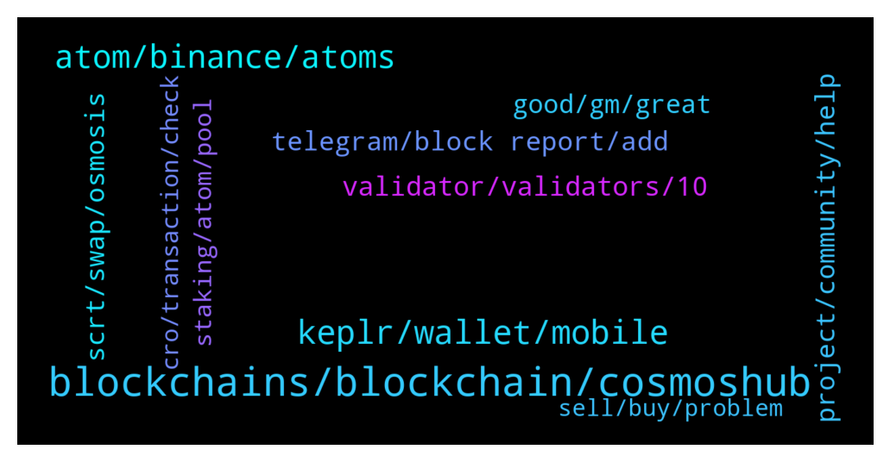

# **@cosmosproject**
 ## Analysis for **2021-12-20** - **2021-12-21**.

---

## 📊 **Basic Stats**

**n_messages_sent**: 430

---

---

## 🔝 **Top keywords and related messages**

1. **blockchains, blockchain, cosmoshub**

    @OS4UU --- *Hi all, can someone clarify me why it is Cosmos a good way of interconecting blockchains? I don't really understand the goal or the product apart from Cosmos own blockchain* **--->** [TG Discussion](https://t.me/cosmosproject/457074)

    @ZoltanAtom --- *Please Join Cosmos Discord. Devs are on there to answer such technical questions.   https://discord.gg/vcExX9T* **--->** [TG Discussion](https://t.me/cosmosproject/456922)

    @Lgranadeiro --- *Have you guys noticed that $Aioz is enabling IBC? And is now cosmos based Blockchain??* **--->** [TG Discussion](https://t.me/cosmosproject/456915)

    @michail_lee --- *lol even scammy XRP and ADA are still on the top, that's shame when compare to Cosmos 😂* **--->** [TG Discussion](https://t.me/cosmosproject/456811)

    @ZoltanAtom --- *If you look for devs and have technical questions,please join Cosmos discord.* **--->** [TG Discussion](https://t.me/cosmosproject/457470)

    @OS4UU --- *I just heard it today a partnership with Binance then i took a look on it, it seems a lot of proyects want to include the interconnection or swapping between chains, just wanna now if the alternatives are competitive with Cosmos* **--->** [TG Discussion](https://t.me/cosmosproject/457312)

2. **keplr, wallet, mobile**

    @ZoltanAtom --- *Hey there,Recommend wallets are Cosmostation and Keplr.  Both have web Wallet and mobile apps!  Here's a link: https://t.co/eSyDVJMFAD?amp=1  And a step by step guide: https://medium.com/chainapsis/how-to-use-keplr-wallet-40afc80907f6* **--->** [TG Discussion](https://t.me/cosmosproject/457438)

    @titoo1138 --- *Hi is kepl wallet also on android?* **--->** [TG Discussion](https://t.me/cosmosproject/456846)

    @ZoltanAtom --- *Cosmostation have both web and mobile wallet. It’s up to you however you like.* **--->** [TG Discussion](https://t.me/cosmosproject/457452)

    @ZoltanAtom --- *And do not forget this ; you should not use Keplr wallet for ibc transfers! Use Cosmos dexs always.* **--->** [TG Discussion](https://t.me/cosmosproject/457020)

    @AtomJazz --- *You can also just export your mnemonic code from exodus to Keplr. That's how I would have done it* **--->** [TG Discussion](https://t.me/cosmosproject/456798)

    @ZoltanAtom --- *Good morning. All useful links and tutorials are at the #3 pinned message! Recommend wallets are Keplr/Cosmostation.both have web wallet and mobile apps. For airdrops I suggest you to join community groups and keep in touch with community to lear min more about upcoming new projects!  You need Keplr wallet to claim your airdrops.   https://t.me/CosmosAirdrops  https://t.me/ATOMCosmonauts* **--->** [TG Discussion](https://t.me/cosmosproject/457420)

3. **atom, binance, atoms**

    @AtomJazz --- *Maybe it's better to transfer your ATOM in batches. Something like 1/3 every month* **--->** [TG Discussion](https://t.me/cosmosproject/457158)

    @alen_muly --- *Coinbase or okex are witdrawals of atom open? This binance suspension is total bs. Not possible for about a week.* **--->** [TG Discussion](https://t.me/cosmosproject/457319)

    @AtomJazz --- *There are no problems with transactions of ATOMs. Only incompetent exchanges have problems 😁😉* **--->** [TG Discussion](https://t.me/cosmosproject/456795)

    @typerati --- *yes thanks. Just being careful in case my atom is unbonding while shown as bonded. It's been days already the value shown is 0.01$ for 31atom.   I just checked mintscan though, my fund safe i think   thanks for answering.* **--->** [TG Discussion](https://t.me/cosmosproject/457533)

    @oOOEricOOo --- *Hi, anyonw knows why I cant withdraw ATOM from Bybit?* **--->** [TG Discussion](https://t.me/cosmosproject/456942)

    @alen_muly --- *Binance still not possible to witdraw atom. Also contacting support wouldnt do anything right?* **--->** [TG Discussion](https://t.me/cosmosproject/457276)

4. **validator, validators, 10**

    @samiarsono --- *is there a recommended number of validators i should delegate too? (e.g. minimun 4 validators)* **--->** [TG Discussion](https://t.me/cosmosproject/456982)

    @Bournifle --- *Keplr, and select validator not in top 10* **--->** [TG Discussion](https://t.me/cosmosproject/457607)

    @ZoltanAtom --- *There is no such list unfortunately! You should DYOR! As I notice you are in SG-1 validator. That’s a good start.* **--->** [TG Discussion](https://t.me/cosmosproject/456993)

    @Moh --- *Why not a validator in top 10?* **--->** [TG Discussion](https://t.me/cosmosproject/457615)

    @Mick --- *Is there an easy way to check a validator's voting record?* **--->** [TG Discussion](https://t.me/cosmosproject/456791)

    @samiarsono --- *should i delegate only to 1 validator or spread it evenly to a few different validators?* **--->** [TG Discussion](https://t.me/cosmosproject/456978)

5. **scrt, swap, osmosis**

    @ZoltanAtom --- *Firstly go to Assets and deposit “SCRT” after that you will be able to swap on Osmosis.* **--->** [TG Discussion](https://t.me/cosmosproject/456708)

    @StudentForAllMyLife --- *Any way to buy atom and send it to keplr?* **--->** [TG Discussion](https://t.me/cosmosproject/457506)

    @ZoltanAtom --- *You can get SCRT and swap your SCRT to Dvpn on Osmosis AMM ! The same way.* **--->** [TG Discussion](https://t.me/cosmosproject/457279)

    @AtomJazz --- *You can send SCRT from Binance to Keplr and swap it to ATOM on Osmosis* **--->** [TG Discussion](https://t.me/cosmosproject/457291)

    @ZoltanAtom --- *Then get SCRT OR IRIS from binance, send it to Keplr ! Connect your wallet to Osmosis and swap your Iris or SCRT to Atom.* **--->** [TG Discussion](https://t.me/cosmosproject/457519)

    @AtomJazz --- *Some bought SCRT on Binance, send it to Keplr and then swapped it back to ATOM on Osmosis* **--->** [TG Discussion](https://t.me/cosmosproject/456874)

6. **telegram, block report, add**

    @Sverrir --- *Ok I will try to send some and see what happens 🚀* **--->** [TG Discussion](https://t.me/cosmosproject/456797)

    @Rwizard --- *Ok thank you I will reach out to them* **--->** [TG Discussion](https://t.me/cosmosproject/457019)

    @ZoltanAtom --- *Hello,  1️⃣Go to wallet2 firstly and copy the dvpn address! 2️⃣Come back to wallet3 and click “send” feature ! 3️⃣copy-paste your wallet2 address and send your dvpn from wallet3 to wallet2* **--->** [TG Discussion](https://t.me/cosmosproject/456755)

    @ZoltanAtom --- *If someone dm to you, just block and report it. No wallet support on telegram. All are scammers.* **--->** [TG Discussion](https://t.me/cosmosproject/456762)

    @benjamintshi --- *yes . i post it ,* **--->** [TG Discussion](https://t.me/cosmosproject/456748)

    @cosmicmatt --- *This should be their official telegram https://t.me/citadelofficial* **--->** [TG Discussion](https://t.me/cosmosproject/456586)

7. **project, community, help**

    @Cordtus --- *Well there is a team behind the project..* **--->** [TG Discussion](https://t.me/cosmosproject/456613)

    @Ninvel --- *I like meet people in the comunities of projects I'm interesting in, It is real important for a good relatioship with the comunity and also practice my englisg in the process 😀* **--->** [TG Discussion](https://t.me/cosmosproject/457473)

    @pilussa85 --- *hey guys anyone knows how to contact people about CHIHUAHUA project ? i’ve been looking everywhere and can’t find it* **--->** [TG Discussion](https://t.me/cosmosproject/456964)

    @KellySlaterKook --- *Are there any projects the use this feature already?* **--->** [TG Discussion](https://t.me/cosmosproject/457462)

    @AtomJazz --- *This group will help you out https://t.me/CosmosAirdrops* **--->** [TG Discussion](https://t.me/cosmosproject/457092)

    @ZoltanAtom --- *Here is their community channel.   https://t.me/chihuahua_cosmos* **--->** [TG Discussion](https://t.me/cosmosproject/456965)

8. **good, gm, great**

    @Zzuko7 --- *gm guys, have a good day* **--->** [TG Discussion](https://t.me/cosmosproject/456741)

    @AtomJazz --- *Well I just gave you a solution* **--->** [TG Discussion](https://t.me/cosmosproject/456882)

    @michail_lee --- *yes brother, let's hit top 5 marketcap LFG* **--->** [TG Discussion](https://t.me/cosmosproject/456807)

    @Satoshi_is_dead --- *One of the frontend guys right?* **--->** [TG Discussion](https://t.me/cosmosproject/456639)

    @ZoltanAtom --- *Good morning Zzuko. Let’s have a great week 😎* **--->** [TG Discussion](https://t.me/cosmosproject/456742)

    @AtomJazz --- *Top 3 only a question of time 😉* **--->** [TG Discussion](https://t.me/cosmosproject/456808)

9. **staking, atom, pool**

    @ZoltanAtom --- *Completely different. Liquid staking is that you are able to use your Staked Atom at Cosmos dexs and provide liquidity to pools for example!   Let me share with you What is “Interchain Security”* **--->** [TG Discussion](https://t.me/cosmosproject/457431)

    @AtomJazz --- *Liquid staking is a new feature coming early 2022. It will enable ATOM stakeholders to be liquid at the same time so they'll be able to earn both staking rewards and participate in various defi application such as Osmosis, Umee, Shade, Kava etc* **--->** [TG Discussion](https://t.me/cosmosproject/456857)

    @ZoltanAtom --- *Liquid staking is expecting in Q1 with Theta upgrade  Interchain staking is expecting in Q2 with Rho upgrade* **--->** [TG Discussion](https://t.me/cosmosproject/457428)

    @G45788 --- *What is the  difference between liquid and Interchain staking?* **--->** [TG Discussion](https://t.me/cosmosproject/457430)

    @G45788 --- *When Interchain security and liquid staking?* **--->** [TG Discussion](https://t.me/cosmosproject/457425)

    @ebp700 --- *is staking has a risk ? Forexample danger of destroy of holding??* **--->** [TG Discussion](https://t.me/cosmosproject/456738)

10. **cro, transaction, check**

    @benjamintshi --- *can some on see this issues ? https://github.com/cosmos/cosmjs/issues/967* **--->** [TG Discussion](https://t.me/cosmosproject/456746)

    @Davinity01 --- *How can i buy Cro with cosmos network, what’s the exchange name* **--->** [TG Discussion](https://t.me/cosmosproject/456720)

    @giovadema85 --- *https://www.mintscan.io/cosmos/account/cosmos1xh7duzvazk0njjt7tfmnsj686kmwu6zn2q8v40 .... I sent to crypto.com, why the last one is failed? What I should do?* **--->** [TG Discussion](https://t.me/cosmosproject/457055)

    @Stanislav --- *Hi guys somebody have this problem from Crypto.com Defi* **--->** [TG Discussion](https://t.me/cosmosproject/457118)

    @hilay00 --- *It is asking me to connect to a leadger! Or Keystation! I have them on crypto.com* **--->** [TG Discussion](https://t.me/cosmosproject/457447)

    @giovadema85 --- *this one is the transaction for crypto.com? Is this ok? https://www.mintscan.io/cosmos/txs/46B5575D9EBBF57DE74772B45658B7671697DC3BD477AEF8A89723CE0BC56E45* **--->** [TG Discussion](https://t.me/cosmosproject/457059)

