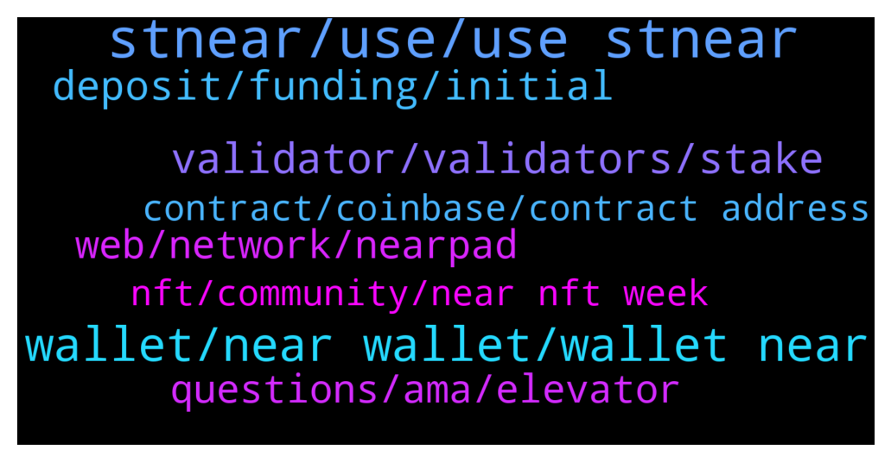

# **@cryptonear**
 ## Analysis for **2021-12-20** - **2021-12-21**.

---

## 📊 **Basic Stats**

**n_messages_sent**: 637

---

---

## 🔝 **Top keywords and related messages**

1. **stnear, use, use stnear**

    @Kripto_Raptor --- *it's non custodial brilliant staking solution* **--->** [TG Discussion](https://t.me/cryptonear/246489)

    @SebastianK33 --- *And stNEAR does not increase, but the amount of NEAR it is redeemable for increases* **--->** [TG Discussion](https://t.me/cryptonear/246468)

    @ClaudioAC --- *Our focus right now is to give stNEAR as much exposure and to reward users of it with $META* **--->** [TG Discussion](https://t.me/cryptonear/245547)

    @SebastianK33 --- *Only difference is the ability to use stNEAR in DeFi* **--->** [TG Discussion](https://t.me/cryptonear/246482)

    @ClaudioAC --- *plus you are getting a liquid token called stNEAR* **--->** [TG Discussion](https://t.me/cryptonear/245514)

    @ClaudioAC --- *but your stNEAR tokens even if they are used on other Dapps* **--->** [TG Discussion](https://t.me/cryptonear/245790)

2. **wallet, near wallet, wallet near**

    @SebastianK33 --- *Best place to buy NEAR in the US? Was looking to create a wallet and realize I need to deposit funds for a wallet to open, so want to buy and send to lock down my wallet before I make bigger purchases* **--->** [TG Discussion](https://t.me/cryptonear/245981)

    @xoox_bit --- *I can not create a wallet Do not use reffinance* **--->** [TG Discussion](https://t.me/cryptonear/245353)

    @Kripto_Raptor --- *you need a Near wallet, you can't use metamask there* **--->** [TG Discussion](https://t.me/cryptonear/245357)

    @larry_lang --- *also if it possible, could u give us more thought+ recommendations on this form so we can further improve the wallet- that would be highly appreciated @rhinohq8992  @bekzody* **--->** [TG Discussion](https://t.me/cryptonear/245242)

    @Aflatoon123 --- *It asks for near wallet when website is opened.* **--->** [TG Discussion](https://t.me/cryptonear/244898)

    @SebastianK33 --- *Near wallet can not be accessed from anywhere without seed phrase, correct? So only have to use on the computer you started on* **--->** [TG Discussion](https://t.me/cryptonear/246044)

3. **validator, validators, stake**

    @FritzWagner --- *I will recommend you to unstake and stake on an active validator yeah* **--->** [TG Discussion](https://t.me/cryptonear/245068)

    @NEARverse_xd --- *https://near-staking.com Here you can check active validators. Choose active one with lower fees.* **--->** [TG Discussion](https://t.me/cryptonear/245408)

    @kristanto_lioe --- *How can we unstake if that validator is inactive ?* **--->** [TG Discussion](https://t.me/cryptonear/245071)

    @larry_lang --- *oh about the staking validator situation* **--->** [TG Discussion](https://t.me/cryptonear/245062)

    @BrB5Min --- *Any tips or trick to choose validator?* **--->** [TG Discussion](https://t.me/cryptonear/245405)

    @JOJOUPUP --- *Dear Near Team  I am staking my $near in moonlet pool,  today it turns out it is inactive.  Does it mean the staking reward is not available from this Validator any more ?   So I should withdraw and change a validator to stake ?* **--->** [TG Discussion](https://t.me/cryptonear/245059)

4. **deposit, funding, initial**

    @rhinohq8992 --- *I also got some problem fund on Binnace. They will kindly support you, even help you fill in a form or tickket support. They will charge fee if needed, but for refund service* **--->** [TG Discussion](https://t.me/cryptonear/245265)

    @Aflatoon123 --- *Yes they will. Just ask them politely.  They charge some fees of 50 dollars approx in case of eth but they do help.  Try to ask in live chat in binance app* **--->** [TG Discussion](https://t.me/cryptonear/245258)

    @stsshawn --- *Its asking for deposit isnt it free?* **--->** [TG Discussion](https://t.me/cryptonear/245254)

    @Kripto_Raptor --- *you will be needing 0.1N initial deposit to activate your wallet, funds will be used to cover storage and transfer fees* **--->** [TG Discussion](https://t.me/cryptonear/245992)

    @Kripto_Raptor --- *chose manual initial deposit  when asked* **--->** [TG Discussion](https://t.me/cryptonear/244947)

    @Kripto_Raptor --- *then transfer to given initial funding account, only 0.1N from your exchange* **--->** [TG Discussion](https://t.me/cryptonear/244949)

5. **web, network, nearpad**

    @iforbusiness2 --- *NEAR protocl is a application platform that created to empower devs/users. NEAR protocol secure enough to manage high value assets like money or identity and performant enough to make them useful for everyday people, putting the power of the Open Web in their hands.* **--->** [TG Discussion](https://t.me/cryptonear/246176)

    @bailey_12 --- *yea, it is lagging for quite someday now. Just refresh and keep connecting and it will be fine* **--->** [TG Discussion](https://t.me/cryptonear/246216)

    @OldieCrypto --- *So Nearpad is not related to Near Protocal in any way.* **--->** [TG Discussion](https://t.me/cryptonear/246448)

    @OldieCrypto --- *Is Nearpad owned by Near protocal?* **--->** [TG Discussion](https://t.me/cryptonear/246445)

    @ClaudioAC --- *So your NEAR is helping drive adoption for new nodes coming into the network, making it more robust* **--->** [TG Discussion](https://t.me/cryptonear/245513)

    @Kripto_Raptor --- *some of us forget it but with less decentralization our network becomes more vulnerable* **--->** [TG Discussion](https://t.me/cryptonear/245511)

6. **questions, ama, elevator**

    @ClaudioAC --- *Lets get the AMA going 😎* **--->** [TG Discussion](https://t.me/cryptonear/245489)

    @larry_lang --- *Heyyyy so the winner of the AMA are @jauncasey  @Aflatoon123 @Bcevmmbitgpssfbm @cucais each would get 3 stNEAR and finnally @andreapn1709 would get 10stNEAR   👀👀 Congratulation to all of u and pls  reach out to me so i can get your address ❤️❤️* **--->** [TG Discussion](https://t.me/cryptonear/245842)

    @Aflatoon123 --- *A form is filled before ama.* **--->** [TG Discussion](https://t.me/cryptonear/246526)

    @ClaudioAC --- *All good, excited to participate in our first AMA on the NEAR tg 😄* **--->** [TG Discussion](https://t.me/cryptonear/245439)

    @frankwizard --- *I'm nt new, but I'm saying an elevator pitch to introduce others to Near  Elavtor ptich - - - > 50 words or less* **--->** [TG Discussion](https://t.me/cryptonear/246173)

    @frankwizard --- *Oh I mean, what would be your elevator pitch to someone never exposed to near protocol* **--->** [TG Discussion](https://t.me/cryptonear/246166)

7. **nft, community, near nft week**

    @henrry_p8 --- *I have long been in the NFT field; some perspective project just made its way to Adidas and Pepsi, now there are still a couple of interesting ones, I will get em. What's your question anyway? PM me* **--->** [TG Discussion](https://t.me/cryptonear/246551)

    @alfred2_w --- *Hello everyone, who is learning NFT? What are current promising projects?* **--->** [TG Discussion](https://t.me/cryptonear/246431)

    @ClaudioAC --- *so we can distribute the voting power throughout the NEAR Ecosystem* **--->** [TG Discussion](https://t.me/cryptonear/245548)

    @ClaudioAC --- *but we need to aligned with our community* **--->** [TG Discussion](https://t.me/cryptonear/245751)

    @ClaudioAC --- *We need to do a better job explaining this to our community!* **--->** [TG Discussion](https://t.me/cryptonear/245703)

    @ClaudioAC --- *that is why the ambassador program we launched is critical to our success in the coming months* **--->** [TG Discussion](https://t.me/cryptonear/245697)

