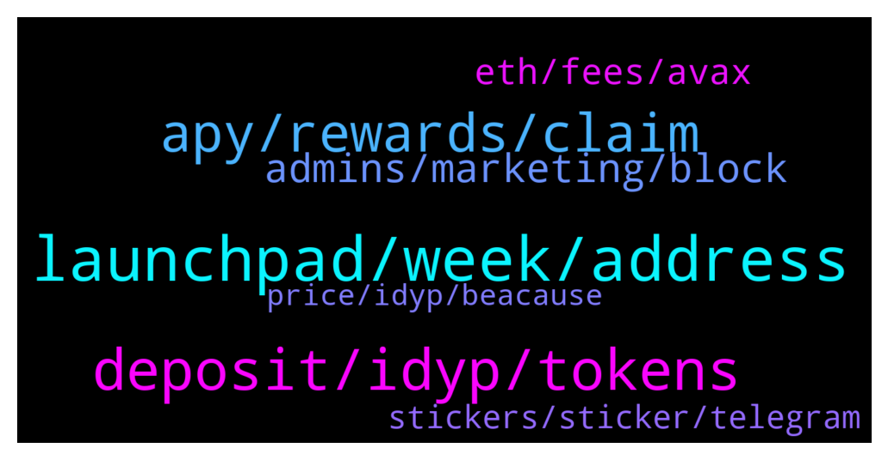

# **@dypfinance**
 ## Analysis for **2021-12-20** - **2021-12-21**.

---

## 📊 **Basic Stats**

**n_messages_sent**: 166

---

---

## 🔝 **Top keywords and related messages**

1. **launchpad, week, address**

    @Paul --- *Hey Dhoni just got a call from DYP support  on my laptop are you guys contacting members this way?* **--->** [TG Discussion](https://t.me/dypfinance/232060)

    @Kirill --- *Hello everyone. Is it true that Defi Yield has Seed strategic round this week?* **--->** [TG Discussion](https://t.me/dypfinance/231821)

    @iamJubi --- *Yes it is scheduled to be launched next.* **--->** [TG Discussion](https://t.me/dypfinance/232011)

    @DhoniMSD516 --- *Hey please email your proposal to contact@dyp.finance* **--->** [TG Discussion](https://t.me/dypfinance/232112)

    @DhoniMSD516 --- *Hey please send your proposal to contact@dyp.finance so that our corresponding team will look into this and get back* **--->** [TG Discussion](https://t.me/dypfinance/231808)

    @Paul --- *ok found that....got a tg from a Jubi Lee also asking if i was able to connect my external wallet but blocked that.* **--->** [TG Discussion](https://t.me/dypfinance/232067)

2. **deposit, idyp, tokens**

    @Skipper_IM --- *I am asking because when I try to deposit 0,1 WETH the fee is about 100 usd. And when I try to deposit 1 WETH - the fee increases to 300-350 usd.* **--->** [TG Discussion](https://t.me/dypfinance/232202)

    @DhoniMSD516 --- *The value you deposited is converted 75% to iDYP and 25% to DYP and shown in USD value, so when marketprices of these tokens go down your value go down, if marketprice increases your value increased too* **--->** [TG Discussion](https://t.me/dypfinance/231841)

    @DhoniMSD516 --- *Hey your deposit is converted 75% to WAVAX - iDYP pair this is done by smart contracts in backend after your deposit on which you will be having IL, 25% is converted to DYP on which you will not be having any IL so this way we reduced IL by 25% with improved farming mechanisms* **--->** [TG Discussion](https://t.me/dypfinance/231875)

    @Crylrik --- *is there anyway to check the usd value of what is deposited, like LP value of iDYP/WAVAX* **--->** [TG Discussion](https://t.me/dypfinance/231990)

    @DhoniMSD516 --- *YW :)  When you want to withdraw you can choose AVAX/PNG or someother tokens from drop down these will be 75% of your LP value and 25% will be DYP* **--->** [TG Discussion](https://t.me/dypfinance/231877)

    @Vaughanrg --- *Hi all is there a tax fee on slippage for pancake swap or is it 1% please* **--->** [TG Discussion](https://t.me/dypfinance/232052)

3. **apy, rewards, claim**

    @iamJubi --- *The time someone claimed was 1 hour earlier before the two days  reward, so the distributed reward was only for 1 day.   previous claim: 2 days 8 hours ago: https://etherscan.io/tx/0x1b2799eba2b219ffbccef83844e45c02b824693b0a6064e2852da9f6c9fc8894  Latest claim 9 hours ago: https://etherscan.io/tx/0x9cd8afcdf4156d880ddcb969cab380571655bb183692963201b61d8a49b53612* **--->** [TG Discussion](https://t.me/dypfinance/231793)

    @uBrown --- *I didn't get my reward Today* **--->** [TG Discussion](https://t.me/dypfinance/231933)

    @Jj --- *Staked it a loooong time ago* **--->** [TG Discussion](https://t.me/dypfinance/231753)

    @j2021000 --- *Dont try to pump giving false hopes...let it take time* **--->** [TG Discussion](https://t.me/dypfinance/232016)

    @thechesirecat --- *Hi, silly question.... can you explain why you would prefer the one with majority supply in circulation with lower APR?   Wouldn't it be that the higher the APR the better? Why would the circulating supply matter?* **--->** [TG Discussion](https://t.me/dypfinance/231915)

    @Lolera9999 --- *When i withdraw I can't receive my next rewards?* **--->** [TG Discussion](https://t.me/dypfinance/231893)

4. **admins, marketing, block**

    @I Will Be Millionnaire --- *Admins never banned me even after shitposting. I really respect this group and admins.* **--->** [TG Discussion](https://t.me/dypfinance/231845)

    @j2021000 --- *Admins...please have a look on this @iamJubi* **--->** [TG Discussion](https://t.me/dypfinance/231734)

    @cyrptoshai13 --- *Hello, I am a Marketing Consultant for a network of dedicated crypto/nft marketing pages. Who can I contact for marketing purposes??* **--->** [TG Discussion](https://t.me/dypfinance/232111)

    @DhoniMSD516 --- *There are scammers and impersonators always around* **--->** [TG Discussion](https://t.me/dypfinance/232062)

    @DhoniMSD516 --- *Hey we admins will never DM you or call you, please report and block* **--->** [TG Discussion](https://t.me/dypfinance/232061)

    @DhoniMSD516 --- *There might be impersonators always verify with usernames* **--->** [TG Discussion](https://t.me/dypfinance/231743)

5. **eth, fees, avax**

    @Paul --- *Just set up Avax chain in Mask ... just wondering before i use...are fees somewhat comparable to Bsc?* **--->** [TG Discussion](https://t.me/dypfinance/232069)

    @florin22xxl --- *Quick question, i guess ETH stake is the best because of 488 APY vs AVAX 178%?* **--->** [TG Discussion](https://t.me/dypfinance/231977)

    @Jorzico --- *I see over US500  to stack on eth lol seems that chain is for the rich* **--->** [TG Discussion](https://t.me/dypfinance/231963)

    @Pawan --- *It is. I am using ETH network.* **--->** [TG Discussion](https://t.me/dypfinance/231716)

    @DhoniMSD516 --- *No the fees will be same no matter the amount of deposit, may be the ETH GWEI pumped so are the fees you can track ETH fees movements here  https://etherscan.io/gastracker* **--->** [TG Discussion](https://t.me/dypfinance/232203)

    @DhoniMSD516 --- *Yes in AVAX fees are lesser too when compared to ETH but I think little more than BSC but still under 1-2$ and you need AVAX for Fees* **--->** [TG Discussion](https://t.me/dypfinance/232070)

6. **stickers, sticker, telegram**

    @RadiantPhoenix4 --- *No😂... for telegram.   I can't find them on the STICKERS section* **--->** [TG Discussion](https://t.me/dypfinance/232160)

    @DhoniMSD516 --- *Or if you are asking about physical stickers? 😅* **--->** [TG Discussion](https://t.me/dypfinance/232159)

    @DhoniMSD516 --- *these are 3 different sticker sets :)* **--->** [TG Discussion](https://t.me/dypfinance/232165)

    @DhoniMSD516 --- *Just click on this sticker and click add stcikers* **--->** [TG Discussion](https://t.me/dypfinance/232161)

    @DhoniMSD516 --- *You can look at that tag* **--->** [TG Discussion](https://t.me/dypfinance/231739)

    @hemanrock --- *you can click on VIEW ALL to see it* **--->** [TG Discussion](https://t.me/dypfinance/231991)

7. **price, idyp, beacause**

    @Vaughanrg --- *That's great this coin is looking very bullish over these last 7 days* **--->** [TG Discussion](https://t.me/dypfinance/232013)

    @hemanrock --- *it can be due to DYP, iDYP, WBNB price too* **--->** [TG Discussion](https://t.me/dypfinance/231681)

    @Dr Augusto --- *A lot defi most value. I think IL is beacause we price goes down? Or have another thing?* **--->** [TG Discussion](https://t.me/dypfinance/231680)

    @DhoniMSD516 --- *Hey please join https://t.me/dypprice for price discussions* **--->** [TG Discussion](https://t.me/dypfinance/232044)

    @DhoniMSD516 --- *Guys please take price discussion to https://t.me/dypprice* **--->** [TG Discussion](https://t.me/dypfinance/231865)

    @maxtorex --- *how much price idyp?its not in coinmarketcap* **--->** [TG Discussion](https://t.me/dypfinance/231842)

