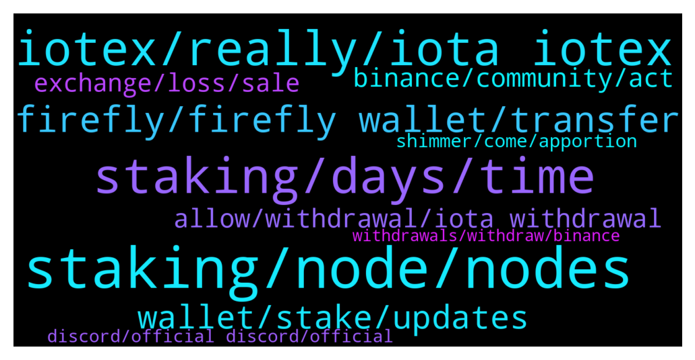

# **@iotatangle**
 ## Analysis for **2021-12-20** - **2021-12-21**.

---

## 📊 **Basic Stats**

**n_messages_sent**: 253

---

---

## 🔝 **Top keywords and related messages**

1. **staking, node, nodes**

    @Hans --- *tried manual mode through a node with participation* **--->** [TG Discussion](https://t.me/iotatangle/300434)

    @Tahmis --- *Some patience is needed as there isn't too many nodes supporting this feature yet I guess :)* **--->** [TG Discussion](https://t.me/iotatangle/300414)

    @malusdacusss --- *hey guys what do i have to do,,, is not leting me stake because of the node* **--->** [TG Discussion](https://t.me/iotatangle/300766)

    @aizensu --- *Strange that official nodes don’t accept staking yet* **--->** [TG Discussion](https://t.me/iotatangle/300759)

    @Basti --- *It means that the node you are connected to hasn't activated the staking feature yet* **--->** [TG Discussion](https://t.me/iotatangle/300538)

    @Basti --- *IOTA (@iota) Tweeted: #Hornet node operators - be sure to update your nodes to include the staking events configuration, if you want to track the fair distribution of @shimmernet and @assembly_net #staking rewards. Go here: https://t.co/R5l4yYpcwV #IOTA https://twitter.com/iota/status/1473292696022355968?s=20* **--->** [TG Discussion](https://t.me/iotatangle/300407)

2. **staking, days, time**

    @Basti --- *You are able to prestake NOW (so you don't miss the starting date by a single second :D) for 7 days and the real staking will start on 28th december* **--->** [TG Discussion](https://t.me/iotatangle/300541)

    @NOMPike --- *So I'll miss the staking deadline* **--->** [TG Discussion](https://t.me/iotatangle/300624)

    @mohsen --- *Now We can stake or after 6 days staking is possible?* **--->** [TG Discussion](https://t.me/iotatangle/300540)

    @BlueRyse --- *Or I have to stake everything at once?* **--->** [TG Discussion](https://t.me/iotatangle/300704)

    @Wiikinki --- *And also just relax, plenty of time (7 days) to get staking going* **--->** [TG Discussion](https://t.me/iotatangle/300512)

    @Basti --- *So still plenty of time for you :)* **--->** [TG Discussion](https://t.me/iotatangle/300728)

3. **iotex, really, iota iotex**

    @millenium_earl2000 --- *What is the difference between iota and iotex* **--->** [TG Discussion](https://t.me/iotatangle/300693)

    @sobroggi --- *Yeah... I really dislike their Marketing strategy, especially since they seem to talk down IOTA, just because they sound similar and people automatically think the tech might also be similar...* **--->** [TG Discussion](https://t.me/iotatangle/300621)

    @heyheynotbaaddd --- *Iotex is confusing they have so many projects* **--->** [TG Discussion](https://t.me/iotatangle/300625)

    @Basti --- *Nope. There is just a single news on Nasdaq that iotex is now traded on coinbase. But that's no news about Nasdaq investing in IOTEX* **--->** [TG Discussion](https://t.me/iotatangle/300668)

    @Hekki --- *I wouldn’t say iotx has only good Marketing they already have hood use cases in from of two devices that are already combining iot to real life devices* **--->** [TG Discussion](https://t.me/iotatangle/300745)

    @Hekki --- *Yea of course because I have iota and I like it, tell me in which devices Iota is already used , I’m very interested you sound like you know* **--->** [TG Discussion](https://t.me/iotatangle/300792)

4. **firefly, firefly wallet, transfer**

    @eduinZarc55 --- *hello guys, i just update firefly , so i have this ...is normal...?* **--->** [TG Discussion](https://t.me/iotatangle/300504)

    @Kahaku --- *Good morning ask for support. A transfer is on my Firefly. Ledger Wallet has not yet been completed. Why was the transfer not made? Ask for support  iota1qzc3p6kdun4xfa4qc4cll05pwwdpuj77fzsngwj9j89e02cwdhsewptnl2s* **--->** [TG Discussion](https://t.me/iotatangle/300256)

    @Basti --- *Open Firefly, go to Settings > Network configuration > Node selection > Manual, add "https://mainnet-node.tanglebay.com/"* **--->** [TG Discussion](https://t.me/iotatangle/300784)

    @Basti --- *Open Firefly, go to Settings > Network configuration > Node selection > Manual, add "https://mainnet-node.tanglebay.com/" and set it as primary (optionally!)* **--->** [TG Discussion](https://t.me/iotatangle/300733)

    @Julien_lesehan --- *when i press update in firefly ,it send me to  a webpage. i cant see the button for updating.thanks for the help.* **--->** [TG Discussion](https://t.me/iotatangle/300483)

    @lukswim --- *How to solve “network disconnected” in Firefly?* **--->** [TG Discussion](https://t.me/iotatangle/300732)

5. **wallet, stake, updates**

    @Canner_Team --- *if you want to do so you need to create multiple wallets. (but im not 100% sure)* **--->** [TG Discussion](https://t.me/iotatangle/300716)

    @Vadim --- *What does this mean my coins are ob my hard wallet* **--->** [TG Discussion](https://t.me/iotatangle/300468)

    @Nicolás --- *I don’t have my wallet with me and I’m out.* **--->** [TG Discussion](https://t.me/iotatangle/300725)

    @KC --- *Yes … since they rolled out first wallet and thrn had various updates … u would then have to wait for nodes to talk and thrn ur token amount would should up after a awhile* **--->** [TG Discussion](https://t.me/iotatangle/300192)

    @Osaaaa --- *how i can  chenge node, i add  funds to stake  but something is wrong* **--->** [TG Discussion](https://t.me/iotatangle/300779)

    @cryptokioskio --- *True. I prestake 6 wallets right now.* **--->** [TG Discussion](https://t.me/iotatangle/300717)

6. **allow, withdrawal, iota withdrawal**

    @millenium_earl2000 --- *Can admin talk to bitrue to allow iota withdrawal* **--->** [TG Discussion](https://t.me/iotatangle/300503)

    @Basti --- *1. Iota network is working. It's on binance that they don't allow withdrawals. 2. Hope that they allow withdrawal till the 28th and activate to get informed by SMS when it's allowed again 3. Sell and rebuy on a different exchange* **--->** [TG Discussion](https://t.me/iotatangle/300547)

    @NOMPike --- *Binance withdrawals not open for iota* **--->** [TG Discussion](https://t.me/iotatangle/300665)

    @millenium_earl2000 --- *All exchanges closed iota withdrawal . You can try bifinex .* **--->** [TG Discussion](https://t.me/iotatangle/300812)

    @millenium_earl2000 --- *Any other exchange allow iota withdrawal* **--->** [TG Discussion](https://t.me/iotatangle/300695)

    @millenium_earl2000 --- *Can iota talk to bitrue to allow withdrawal* **--->** [TG Discussion](https://t.me/iotatangle/300478)

7. **binance, community, act**

    @millenium_earl2000 --- *Feel disappointed with how things are being run . This is a shame .* **--->** [TG Discussion](https://t.me/iotatangle/300515)

    @Jacques --- *Hope binance opens up again little fckers* **--->** [TG Discussion](https://t.me/iotatangle/300398)

    @heyheynotbaaddd --- *And they have nasqad as an investor* **--->** [TG Discussion](https://t.me/iotatangle/300649)

    @NOMPike --- *So you need to go bsc to binance* **--->** [TG Discussion](https://t.me/iotatangle/300666)

    @NOMPike --- *Pray that binance sort their shit out* **--->** [TG Discussion](https://t.me/iotatangle/300658)

    @NOMPike --- *Seems like there are quite a few investors who will get screwed by this if binance doesn't get it's act together, the team need to step up and support the hodlera, you're only as strong as your community, cf Luna* **--->** [TG Discussion](https://t.me/iotatangle/300639)

8. **exchange, loss, sale**

    @Oshoosho22 --- *I loss some. Yes. But i was little bit lucky. I sold on the peak.* **--->** [TG Discussion](https://t.me/iotatangle/300581)

    @karoxthecrow --- *Hi friends any idea when the genesis nft sale starts  and how you can purchase it (iota, credit card payment etc)?* **--->** [TG Discussion](https://t.me/iotatangle/300435)

    @NOMPike --- *Best thing send to binance, convert to usdt, sent to bitfinex, buy iota and send to your wallet* **--->** [TG Discussion](https://t.me/iotatangle/300685)

    @Claudiu --- *How did you mannaged to get them off without money loss ? the price on Bittrex is lowr now becasue nobody can move the coins* **--->** [TG Discussion](https://t.me/iotatangle/300576)

    @StefanoDellaValle --- *I guess it will not. If everyone will withdraw, the price can jump at 100 usb but with very low volume and that can be a problem for the exchange* **--->** [TG Discussion](https://t.me/iotatangle/300399)

    @sy-subrc --- *Just use another exchange. The same question has been asked since weeks and nothing has changed since then.* **--->** [TG Discussion](https://t.me/iotatangle/300271)

9. **shimmer, come, apportion**

    @heyheynotbaaddd --- *So which is a better investment for long term?* **--->** [TG Discussion](https://t.me/iotatangle/300608)

    @heyheynotbaaddd --- *Both sounds like great projects to me* **--->** [TG Discussion](https://t.me/iotatangle/300647)

    @heyheynotbaaddd --- *Hmmm 🤔🤔 I will buy both actually* **--->** [TG Discussion](https://t.me/iotatangle/300643)

    @sobroggi --- *Will come with ISCP (on Shimmer) or later with Assembly, yes* **--->** [TG Discussion](https://t.me/iotatangle/300616)

    @Sardon70 --- *There are both, just look with more attention 😉* **--->** [TG Discussion](https://t.me/iotatangle/300269)

    @TBVC1 --- *Thanks. To clarify, no need to apportion iota for either one? As it is for both?* **--->** [TG Discussion](https://t.me/iotatangle/300219)

10. **discord, official discord, official**

    @Arjan --- *Can’t ask Binance, because I don’t know a e-mailadres and as far as I know, there is no chat function or anything* **--->** [TG Discussion](https://t.me/iotatangle/300268)

    @Tahmis --- *I recommend asking in official discord as the developers are there* **--->** [TG Discussion](https://t.me/iotatangle/300469)

    @Tahmis --- *Sorry but I have no idea. Maybe ask in discord* **--->** [TG Discussion](https://t.me/iotatangle/300448)

    @Tahmis --- *Please, check the pinned message. Also I would suggest going to official discord and reading announcements* **--->** [TG Discussion](https://t.me/iotatangle/300204)

    @Tahmis --- *I recommend asking for help in official discord if needed* **--->** [TG Discussion](https://t.me/iotatangle/300509)

    @Tahmis --- *Hello, You can find a separate help channel in official discord. Could you please join there?* **--->** [TG Discussion](https://t.me/iotatangle/300257)

