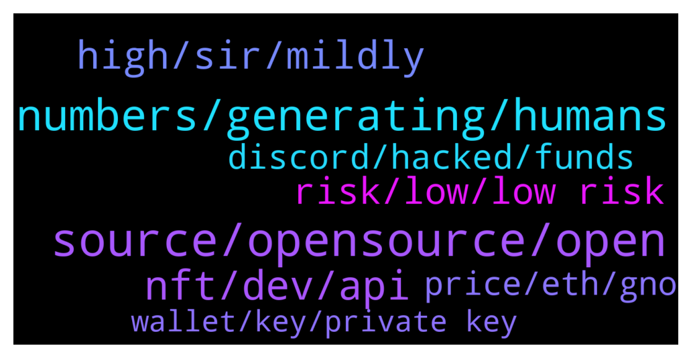

# **@lobsters_chat**
 ## Analysis for **2021-12-20** - **2021-12-21**.

---

## 📊 **Basic Stats**

**n_messages_sent**: 365

---

---

## 🔝 **Top keywords and related messages**

1. **source, opensource, open**

    @elie55 --- *Hey, want to get peoples thought on opensource. You have a split in crypto where half the tools are open and half are closed. Eg opensea could be opensource but isn’t. And uniswap is.  We’re considering open sourcing ourselves and would love to hear some of the pitfalls of taking that approach and giving away our “ip”* **--->** [TG Discussion](https://t.me/lobsters_chat/309210)

    @alekseipu --- *Interesting read. I’m also former Data Scientist and Data Engineer and worked a lot with Parquet, Apache Spark, Hadoop and etc.  So, because of that experience I can’t find any solution u suggested to decentralize such infrastructure. Why? Because such bigdata solutions are distributed (Parquet files have partitions and Spark is using cluster of machines), but they are not decentralized in any way. This is just “master->slave” architecture with centralized task manager/storage manager.  Launching a DAO without any public  MVP (which can be any: Jupyter, Public Tableau or whatever data interface) also looks a bit shady. Like, how exactly new DAO (with token I guess) is solving an issue of decentralization of bigdata infra.   “We are a Big Data company that wants to decentralize, and we want to share our experiences and discoveries along the way.” - absolutely love it! But please, more details about blockchain economy here. Why DAO? Why decentralized? How token/DAO economy will works or monetization?  DAO to DAO doesn’t explains anything here.  Thanks! Great initiative!* **--->** [TG Discussion](https://t.me/lobsters_chat/309205)

    @bout3fiddy --- *So: keep separate machine for crypto, dont download nonsense in there.* **--->** [TG Discussion](https://t.me/lobsters_chat/309091)

    @Swader --- *Solid video of Shapiro being bullish on crypto and particularly DeFi: https://www.youtube.com/watch?v=sUFsV8V2-5w* **--->** [TG Discussion](https://t.me/lobsters_chat/309489)

    @lefterisjp --- *Check out our model at rotki: https://github.com/rotki/rotki  You can always find ways to work with opensource* **--->** [TG Discussion](https://t.me/lobsters_chat/309298)

    @sneg55 --- *what about open source but without a permissive license, like Uniswap v3?  is it still aligned with crypto ethos?* **--->** [TG Discussion](https://t.me/lobsters_chat/309297)

2. **numbers, generating, humans**

    @drinkius --- *This is more of a philosophical statement, generally if you try to come up with something random - it’s usable for most cases, our neural network is too complex to think that the outcome can easily be predicted* **--->** [TG Discussion](https://t.me/lobsters_chat/309089)

    @ld206 --- *This is not safe at all. Humans cannot generate randomness* **--->** [TG Discussion](https://t.me/lobsters_chat/309087)

    @ld206 --- *Previously the post was talking about generating bits, though. And if you did a study with 10k humans generating 24 6 digit numbers, the distribution of numbers you would get would still be nowhere even remotely close to random* **--->** [TG Discussion](https://t.me/lobsters_chat/309104)

    @ld206 --- *Humans are bad at randomness. You can do what you want, of course. But if you’re publicly giving advice to lots of new folks, do not give them the advice to randomly generate words or numbers in their head* **--->** [TG Discussion](https://t.me/lobsters_chat/309106)

    @ld206 --- *You can’t give the advice “think of random strings” to people, though. The distributions of what keys people would write down with that method would be a tiny tiny little subset of the keyspace and easy to brute force.* **--->** [TG Discussion](https://t.me/lobsters_chat/309095)

    @yic_alex --- *It's not philosophical at all. There's a lot of evidence suggesting that humans are not a good source for entropy. It has to do with us favouring patterns.* **--->** [TG Discussion](https://t.me/lobsters_chat/309092)

3. **nft, dev, api**

    @elie55 --- *in our case we're not a protocol. but an nft analytics platform. similar to nansen* **--->** [TG Discussion](https://t.me/lobsters_chat/309212)

    @mostarz93 --- *Just published some words on how we are building our Data ETL here at Credmark. Hoping to be an additional source of queryable on-chain data to Dune and The Graph.  Would love any thoughts/feedback: https://blog.credmark.com/credmark-data-etl-part-iii-229bd86e4d70* **--->** [TG Discussion](https://t.me/lobsters_chat/309202)

    @DefoNotAlfred --- *sudoswap is working on some sort of AMM which will be dramatic improvement over any other existing solutions + owen is a great guy* **--->** [TG Discussion](https://t.me/lobsters_chat/308956)

    @bout3fiddy --- *This is the reason why I think orderbooks ngmi in dex space* **--->** [TG Discussion](https://t.me/lobsters_chat/309153)

    @PeterMm --- *They are not the only one DEX platforms who run AWS so I don't think so* **--->** [TG Discussion](https://t.me/lobsters_chat/309150)

    @farm42 --- *Gn! Spotted a pretty awesome strategic management research on how Uniswap became No1 DEX:  http://www.questjournals.org/jrbm/papers/vol9-issue1/2/A0901020111.pdf  Great retrospective IMO* **--->** [TG Discussion](https://t.me/lobsters_chat/309012)

4. **high, sir, mildly**

    @farm42 --- *I included all info here Sir: https://github.com/OffcierCia/Crypto-OpSec-SelfGuard-RoadMap  check out :  - https://www.ledger.com/academy/security/hack-wifi  - https://github.com/drduh/macOS-Security-and-Privacy-Guide  - https://github.com/jlopp/physical-bitcoin-attacks/blob/master/README.md* **--->** [TG Discussion](https://t.me/lobsters_chat/309094)

    @maclanewilkison --- *Congrats, impressed with how you all have handled the situation* **--->** [TG Discussion](https://t.me/lobsters_chat/309276)

    @xk. --- *Finematics for a very quick, high quality, mildly technical overview* **--->** [TG Discussion](https://t.me/lobsters_chat/309079)

    @Georgeraven --- *Thanks, this explained it wonderfully https://t.me/lobsters_chat/308745* **--->** [TG Discussion](https://t.me/lobsters_chat/309027)

    @tech_digger --- *I bet you are a shrimp, sir?* **--->** [TG Discussion](https://t.me/lobsters_chat/309198)

    @Trip --- *Oh you found it great thanks* **--->** [TG Discussion](https://t.me/lobsters_chat/309404)

5. **risk, low, low risk**

    @sneg55 --- *I don't think low risk investors even touched defi.* **--->** [TG Discussion](https://t.me/lobsters_chat/308970)

    @river0x --- *Potentially liquidity leaving defi if interest rates go up, many low risk investors will choose safer tradfi bank products* **--->** [TG Discussion](https://t.me/lobsters_chat/308968)

    @JellyF --- *I dont think low-risk investors touch crypto at all, they have gov bonds, quasi-govs, munies, etc, etc. Quite a lot of low-risk shit, that dont hack/rug/exploit and pump/dump tens/hundreds/thousands %% in less than a year. Unless our ideas of "low-risk" differ fundamentally. 😂* **--->** [TG Discussion](https://t.me/lobsters_chat/308974)

    @sir_integra_hellsing --- *I don't think low risk investors even touch crypto outside BTC and ETH* **--->** [TG Discussion](https://t.me/lobsters_chat/308972)

    @DocRods --- *Really? Why? I figured the industry would welcome the cash infusions* **--->** [TG Discussion](https://t.me/lobsters_chat/309181)

    @yic_alex --- *That's because you're by definition not a low risk investor if you do. At least not if you consider the whole spectrum. The residual smart contract risk alone disqualifies DeFi for really risk averse people. Not sure how the insurance products look these days.* **--->** [TG Discussion](https://t.me/lobsters_chat/308973)

6. **discord, hacked, funds**

    @pjsm1508 --- *monkey kingdom discord hacked 1.3M lost  https://solscan.io/account/HuiYfmAceFkmhu3yP8t3a6VMYfw3VSX2Ymqqj9M2k9ib#solTransfers* **--->** [TG Discussion](https://t.me/lobsters_chat/309568)

    @Georgeraven --- *I struggle to understand the grim finance hack maybe I am missing something specific about their protocol* **--->** [TG Discussion](https://t.me/lobsters_chat/309021)

    @anonymous_007555 --- *Fractal discord got hacked apparently lol. Some funds lost I guess* **--->** [TG Discussion](https://t.me/lobsters_chat/309565)

    @farm42 --- *Some info about hack for ya:  https://t.me/lobsters_chat/308784  https://t.me/lobsters_chat/308745* **--->** [TG Discussion](https://t.me/lobsters_chat/309023)

    @spreek --- *What is meant by a discord being hacked? Like admin accounts compromised and them posting phishing links or what?* **--->** [TG Discussion](https://t.me/lobsters_chat/309571)

    @LilMoonLamboX3 --- *knew they shoulda sold the discord lol* **--->** [TG Discussion](https://t.me/lobsters_chat/309584)

7. **price, eth, gno**

    @Irgendwassonstwas --- *What I'm not understanding yet: Min Sell Price is at 8.3, current price at 8.3333. They won't fill the 20k ETH. But why is the price not at the minimum of 8.3 then? Just trying to understand the concept what moved the price a bit up.* **--->** [TG Discussion](https://t.me/lobsters_chat/309073)

    @Doug --- *8.3333 is slightly above 0.12.  The price is guaranteed as there would need to be 20,000 ETH worth of sell orders of GNO below this price for it to drop. Given GNO circ supply, probability is effectively 0* **--->** [TG Discussion](https://t.me/lobsters_chat/309067)

    @Irgendwassonstwas --- *0.12 ETH is just the minimum price. Why would you think this price is guaranteed? In fact it's already at 8.3333 GNO/ETH which is slightly below 0.12 ETH/GNO already. Or am I getting something wrong here?* **--->** [TG Discussion](https://t.me/lobsters_chat/309066)

    @Doug --- *Yeah, if enough of the GNO supply 1) participated, and 2) did so at a price lower than 0.12  Given how little is participating now and that the auction ends in 6 hours, it's a guaranteed few % on ETH for 6 hours in my book* **--->** [TG Discussion](https://t.me/lobsters_chat/309070)

    @hosermage --- *where do you see Curve Mim for 15% on Avax?  Best I see is MIM USD Factory for 4.85 base vapy on curve.fi, which I guess isn't the same?* **--->** [TG Discussion](https://t.me/lobsters_chat/309425)

    @farm42 --- *As follows, you need to increase gas limit from 21000 to 30-40 or even 60k Gwei to deal with it:  https://ethereum.stackexchange.com/questions/1570/what-does-intrinsic-gas-too-low-mean/1694* **--->** [TG Discussion](https://t.me/lobsters_chat/309016)

