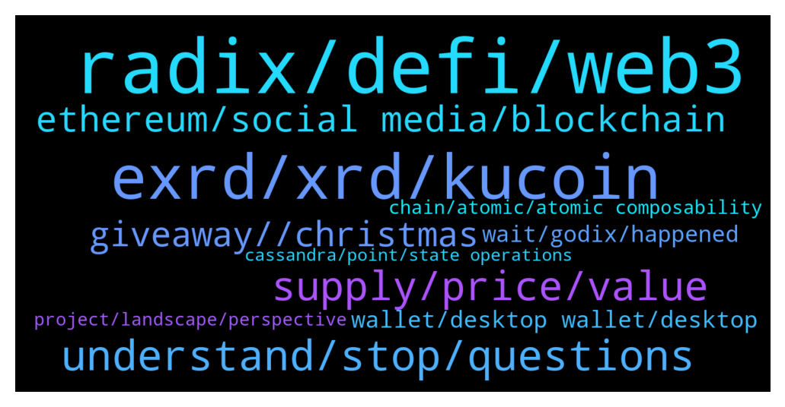

# **@radix_dlt**
 ## Analysis for **2021-12-20** - **2021-12-21**.

---

## 📊 **Basic Stats**

**n_messages_sent**: 696

---

---

## 🔝 **Top keywords and related messages**

1. **radix, defi, web3**

    @Null_v0id --- *Nice find, there’s the Staked Radix assets page: https://staking.staked.us/radix-staking* **--->** [TG Discussion](https://t.me/radix_dlt/325311)

    @yessurrrre --- *#AMA is Radix useful for web3 or will it be ? I fail to see if it is useful because you show off demos of web3 applications with radix but no marketing is made around it whatsoever* **--->** [TG Discussion](https://t.me/radix_dlt/324839)

    @Blind5ight --- *Radix utilizes the UTXO model as well But has another approach than Cardano The comparison is made here: https://www.radixdlt.com/post/how-radix-engine-is-designed-to-scale-dapps* **--->** [TG Discussion](https://t.me/radix_dlt/324807)

    @Blind5ight --- *What happes in Vegas, does not stay in Vegas! 😁  https://twitter.com/radixdlt/status/1473280428601745408?t=ZE8oGekq5s8goCWH22gi9A&s=19  👉 Follow Radix Push for inside sc👀ps:  https://t.me/joinchat/0BmQTbhjZuphZTQy 👈* **--->** [TG Discussion](https://t.me/radix_dlt/325149)

    @yessurrrre --- *yes but what I mean is that with the heavy defi marketing, we are too dependant on the defi hype and radix doesnt 'just' do defi as most of people understand it, usecases are beyond just swapping tokens on a dex so narrowing down the project as 'defi optimal' idk* **--->** [TG Discussion](https://t.me/radix_dlt/324848)

    @Jake --- *Hello! My primary investments are Radix and Elrond. I've been reading Florian's conversations with the Elrond core team, and the Elrond team kept coming back to the fact that Radix wasn't live yet. Now that it is live, has there been a follow up conversation where production is now being compared to production?* **--->** [TG Discussion](https://t.me/radix_dlt/324753)

2. **exrd, xrd, kucoin**

    @Avaunt --- *Just happened upon a Kraken press release re a staking company they bought and who do I spy in the list of assets they support or about to support. https://staked.us/?utm_source=content+announcement&utm_medium=press+release&utm_campaign=staked+acquisition+announcement%20&utm_content=content+link  Possible Kraken listing??* **--->** [TG Discussion](https://t.me/radix_dlt/325290)

    @dlyons33 --- *Reason i'm asking is because I live in the US and it's not easy for me to buy XRD , but i can buy EXRD* **--->** [TG Discussion](https://t.me/radix_dlt/325264)

    @aifretis --- *The only way to buy XRD is on bitfinex?* **--->** [TG Discussion](https://t.me/radix_dlt/324265)

    @fpieper --- *cant they use kucoin or gate?* **--->** [TG Discussion](https://t.me/radix_dlt/325277)

    @Null_v0id --- *Can you legally buy XRD in the USA or are there any laws that prevent you holding it?* **--->** [TG Discussion](https://t.me/radix_dlt/325261)

    @Blind5ight --- *Another option not mentioned in above article = wait for Kucoin to support conversion between eXRD and XRD* **--->** [TG Discussion](https://t.me/radix_dlt/324206)

3. **understand, stop, questions**

    @jumpfetus --- *oh my god did y'all hear about this: https://www.radioshack.com/* **--->** [TG Discussion](https://t.me/radix_dlt/324949)

    @Jake --- *Sorry, I'll stop. Just doesn't add up to me how people were ok with it* **--->** [TG Discussion](https://t.me/radix_dlt/324504)

    @Jake --- *You're still wrong, but I'll stop* **--->** [TG Discussion](https://t.me/radix_dlt/324507)

    @peterkimkz --- *I just don't understand enough, I will read the infographic and comeback later* **--->** [TG Discussion](https://t.me/radix_dlt/324664)

    @lwtel --- *Just returned to pool I suppose?* **--->** [TG Discussion](https://t.me/radix_dlt/324881)

    @Jake --- *Dear lord I got the chills* **--->** [TG Discussion](https://t.me/radix_dlt/325297)

4. **supply, price, value**

    @Jake --- *Which means that there are more tokens in circulation, less scarcity* **--->** [TG Discussion](https://t.me/radix_dlt/324497)

    @Jake --- *Not sure what you mean by the terms that I agreed on, but how would the effect have been the same? It was an overnight flooding of circulating supply, which dilutes the value of each coin in circulation. I understand that the max supply is unchanged, but this is very different from a gradual mint* **--->** [TG Discussion](https://t.me/radix_dlt/324478)

    @yr12345678 --- *The supply was already owned by people. Just a few people actually dumped some, which was bought up. No new tokens were created. The value of tokens stayed practically the same. The value was therefore not diluted* **--->** [TG Discussion](https://t.me/radix_dlt/324505)

    @yr12345678 --- *Value stayed practically the same, because hardly anyone sold. Basically the mcap increased, because token price hardly changed* **--->** [TG Discussion](https://t.me/radix_dlt/324481)

    @Jake --- *Bummer! Haha Even if they hold, the value per coin is diluted overnight* **--->** [TG Discussion](https://t.me/radix_dlt/324474)

    @Jake --- *Just because price stayed the same doesn't mean that the increase supply didn't dilute the value per token. It just means that demand bought up the supply increase* **--->** [TG Discussion](https://t.me/radix_dlt/324503)

5. **ethereum, social media, blockchain**

    @danhughes --- *I'm sure for some services you'll still need kyc etc and that's fine. I'm talking about the reduction of friction to surf and do stuff. Its like a "login with Google" but it's built in and it's not Google* **--->** [TG Discussion](https://t.me/radix_dlt/324915)

    @peterkimkz --- *I compare this to ethereum or blockchain* **--->** [TG Discussion](https://t.me/radix_dlt/324613)

    @yessurrrre --- *Guys, would it be possible to add Oasis network in the list of blockchain comparisons* **--->** [TG Discussion](https://t.me/radix_dlt/324188)

    @S --- *I don't know what his plans are exactly, but a blockchain is not a facebook server. I don't see how it can be.* **--->** [TG Discussion](https://t.me/radix_dlt/324329)

    @nbrr0 --- *@fpieper do you know much about parallelchain?* **--->** [TG Discussion](https://t.me/radix_dlt/324751)

    @mx471 --- *https://forkast.news/vitalik-buterin-defi-ethereum-social-media-ethcc/  Ethereum creator Vitalik Buterin discussed the potential for Ethereum to make an impact on other sectors of society, using social media as his primary example.  Moving away from DeFi, Buterin focused on Ethereum’s potential use in decentralizing social media* **--->** [TG Discussion](https://t.me/radix_dlt/324325)

6. **giveaway, , christmas**

    @fpieper --- *🔥🤟 would be a nice end of year present* **--->** [TG Discussion](https://t.me/radix_dlt/325293)

    @TaserFace6937 --- *Congratulations to last week's winner!  🎉🏆💵   rdx1qspx6jy32jdlft28fz7mk4r4vrd9z4eacvg68w9aurxpf2p3u8qetmgvepumy  Every Friday this month another lucky RadixStake delegator will win 2,000 XRD!  👀  👉To take part in this week's giveaway:  radixstake.com/giveaway.html  Just two giveaways left this year!  💰 December 24th - 2,000 XRD 💰 December 31st - 2,000 XRD  🙏Thank you RadixStake delegators and good luck this Friday!* **--->** [TG Discussion](https://t.me/radix_dlt/325009)

    @Alfred_Dulaire --- *@DogeCube the first RADIX memecoin  Day 8 of the 12 days of Xmas RIDDLE crossword! 500 000 DogeCube to win 🚀  RULES:  ALL BOXES to use will be revealed on the 25th of December 13h UTC, the first member of the RadPack to DM us the correct exchange name listing us in January, will win this big AIRDROP present.  Any "entries" before that will be ignored 😆* **--->** [TG Discussion](https://t.me/radix_dlt/324712)

    @BeLikeWater00 --- *Christmas 🎅 Airdrop confirmed🔥🚀 i will be doing a Christmas giveaway to close out the year for the RAD FAM 🦧🦧⚡️🍀🍀 https://twitter.com/belikewater00/status/1472658382578458631?s=21* **--->** [TG Discussion](https://t.me/radix_dlt/324174)

    @BeLikeWater00 --- *Hey Guys so I did  2 giveaways back to back last week. It was my first time doing so and I want to support the $Radix fam. with small accounts (preferably 5K ⬇️ ) and new comers. Will be doing a Christmas giveaway airdrop  as well 😎🤝 https://twitter.com/belikewater00/status/1472649907391680523?s=21* **--->** [TG Discussion](https://t.me/radix_dlt/324166)

    @MassieFur --- *We are going to giveaway XRD!!!!!* **--->** [TG Discussion](https://t.me/radix_dlt/324532)

7. **wallet, desktop wallet, desktop**

    @Magal36 --- *Update the wallet and try this : https://t.me/radix_dlt/325119* **--->** [TG Discussion](https://t.me/radix_dlt/325128)

    @Magal36 --- *Yeah, seems we are having communication problems. Which phone wallet are you talking about? There's the official desktop only wallet and two mobile community projects (which I am not on the loop on progress)* **--->** [TG Discussion](https://t.me/radix_dlt/324901)

    @Magal36 --- *But it's not a full feature wallet yet, right?* **--->** [TG Discussion](https://t.me/radix_dlt/324903)

    @Renetheuns --- *Question: Can you upgrade the wallet version or does it require uninstall etc?* **--->** [TG Discussion](https://t.me/radix_dlt/324855)

    @iphonecliniq --- *How do I get the rdx desktop wallet? And how much is 1950rdx currently?* **--->** [TG Discussion](https://t.me/radix_dlt/324197)

    @anilsahbaz98 --- *:D :D Np bro , but im not scammer you know . Now I switched to computer and now I use google translate. At least we can get along better. An application where I can follow the wallet we use on the computer.* **--->** [TG Discussion](https://t.me/radix_dlt/324909)

8. **wait, godix, happened**

    @Trunghee3871 --- *Only in December or still continue after sir?* **--->** [TG Discussion](https://t.me/radix_dlt/325011)

    @eMulah --- *Hah, thanks Godix. We are somehow always way ahead of the others ha.* **--->** [TG Discussion](https://t.me/radix_dlt/324230)

    @TheCodeisTheLaw --- *Like fpieper said, it's just a matter of time really* **--->** [TG Discussion](https://t.me/radix_dlt/324872)

    @sebcrypto --- *2023, damn. I'll just have to wait. Hopefully the SEC doesn't shutdown everything until then 🤷‍♂️* **--->** [TG Discussion](https://t.me/radix_dlt/324446)

    @sebcrypto --- *Look, a few guys started sneezing and we had a 35% correction. Imagine when something real hard happens. tomorrow morning Russia deciding that Ukraine now belongs to them is more probable than us reaching 2017 ATH.* **--->** [TG Discussion](https://t.me/radix_dlt/324468)

    @Peter (HAM) --- *Stopping makes sense as all this happened months ago.* **--->** [TG Discussion](https://t.me/radix_dlt/324510)

9. **chain, atomic, atomic composability**

    @sebcrypto --- *But, just so I understand, since the idea is to propagate atomicity across defi modules, potentially from other chains, that means the other chain also needs to be able to merge within this new atomic sequence of chain calls* **--->** [TG Discussion](https://t.me/radix_dlt/324416)

    @Blind5ight --- *It's not possible to get performant atomicity across ledgers  These guys do it for example for a specific use case But latency++: https://twitter.com/ConnextNetwork/status/1388039183361576961?s=20* **--->** [TG Discussion](https://t.me/radix_dlt/324422)

    @Magal36 --- *Pow is better than PoS = false claim* **--->** [TG Discussion](https://t.me/radix_dlt/324648)

    @Magal36 --- *no, Dan has mentioned that under certain circunstances that threshold can be brought to 33% in PoW as well* **--->** [TG Discussion](https://t.me/radix_dlt/324602)

    @Blind5ight --- *Terra is unsharded and has atomic composability by default because of that* **--->** [TG Discussion](https://t.me/radix_dlt/324428)

    @sebcrypto --- *so, atomic composability gives an edge on its own, within the chain. Since cross chain modularity, better pick the right chain* **--->** [TG Discussion](https://t.me/radix_dlt/324424)

10. **project, landscape, perspective**

    @Blind5ight --- *Follow @Ben_XRD to keep up to date on the fundamentals of crypto in general: https://twitter.com/bfargher/status/1473314412366761988?s=20  L3 😅 https://medium.com/starkware/fractal-scaling-from-l2-to-l3-7fe238ecfb4f* **--->** [TG Discussion](https://t.me/radix_dlt/325304)

    @mx471 --- *Strong. Are other crypto projects present there as well?* **--->** [TG Discussion](https://t.me/radix_dlt/325135)

    @MattToTheMoon --- *China is going to steal the tech and use it to build their digital currency but will spend billions on developing additional use cases, then they will allow crypto back into the country 🤣🤣* **--->** [TG Discussion](https://t.me/radix_dlt/324844)

    @peterkimkz --- *But how can they be "100x secure"??* **--->** [TG Discussion](https://t.me/radix_dlt/324622)

    @RadixMonk --- *Some of the rumours that float around crypto circles amirite? 😂* **--->** [TG Discussion](https://t.me/radix_dlt/324993)

    @sebcrypto --- *thank goodness politicians also are into crypto. That's a guarantee they won't cut the ties yet :D* **--->** [TG Discussion](https://t.me/radix_dlt/324541)

