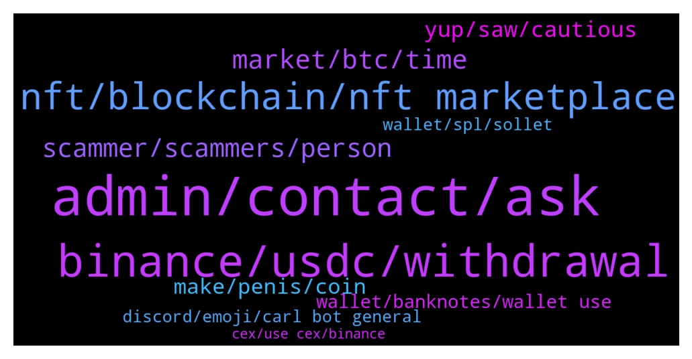

# **@solana**
 ## Analysis for **2021-12-20** - **2021-12-21**.

---

## 📊 **Basic Stats**

**n_messages_sent**: 393

---

---

## 🔝 **Top keywords and related messages**

1. **admin, contact, ask**

    @cryptolover1987 --- *Ok please kindly reach out to https://t.me/wormholecrypto for better assistance on this  Thanks* **--->** [TG Discussion](https://t.me/solana/873969)

    @mahib45 --- *Hello 👋  You may apply https://solana.com/collective* **--->** [TG Discussion](https://t.me/solana/875491)

    @Doreen --- *No but why do you ask* **--->** [TG Discussion](https://t.me/solana/873524)

    @Ral_87 --- *Whoever dm you , don't answer , DM the admin for help if you don't find it here* **--->** [TG Discussion](https://t.me/solana/873940)

    @Tele --- *it's always some variation of "i'll help you but i need your seed"* **--->** [TG Discussion](https://t.me/solana/874168)

    @mahib45 --- *Hello 👋  Mate how are you doing? ❤* **--->** [TG Discussion](https://t.me/solana/874832)

2. **binance, usdc, withdrawal**

    @rakib3287 --- *i withdraw sol chain network 2 hour ago it's still processiing block chain not confirmation. i don't understand waht happen.* **--->** [TG Discussion](https://t.me/solana/874589)

    @zet07 --- *Literally 10 scammers wrote me, what a shit. I just want to get Solana from erc to sol without 1 sol minimum withdrawal like coinbase or binance with 0.3 does* **--->** [TG Discussion](https://t.me/solana/873879)

    @Thum Chee Hang --- *Please how can I swap my Solana to Bnb or eth , please* **--->** [TG Discussion](https://t.me/solana/874636)

    @RealPrinceOla --- *Stake/Unstake takes several epoch to warm up or to cool down (aprox. 2-3 days). You can read more about it here:  🔗https://docs.solana.com/staking/stake-accounts  You can use the   🔗 https://solanabeach.io/ explorer for monitoring the Epoch  After that you will able to withdraw your fund.* **--->** [TG Discussion](https://t.me/solana/873789)

    @mahib45 --- *You can unwrap your WSOL by using this👇🏻  1️⃣ Step Finance  🔗 https://app.step.finance/#/exchange    2️⃣ Bonfida 🔗https://bots.bonfida.com/#/wrapper  WSOL is a wrapped SOL that is wrapped by FTX to allow SOL trading on Serum originally.* **--->** [TG Discussion](https://t.me/solana/874773)

    @Leeonzo --- *Hello guys, i have requested a solana transfer via binance to my phantom wallet. Ive been waiting over 2 hours and its still in processing. What is the Problem? Canr help.* **--->** [TG Discussion](https://t.me/solana/874719)

3. **nft, blockchain, nft marketplace**

    @Trisakti1222 --- *we have a problem in solana ecosystem, why our token is missing from the list of solana ecosyatem sir?* **--->** [TG Discussion](https://t.me/solana/873997)

    @Ekene --- *But can Solana be mined or is there mining for Solana* **--->** [TG Discussion](https://t.me/solana/873982)

    @mahib45 --- *Hello 👋  There are no issues with #Solana blockchain!* **--->** [TG Discussion](https://t.me/solana/874770)

    @Z --- *DM me if you you have legit information, NFTs on ETH you can get passive income. Looking for the same on Solana* **--->** [TG Discussion](https://t.me/solana/873649)

    @Haileyberri --- *Will solana give out Christmas bonus??* **--->** [TG Discussion](https://t.me/solana/874419)

    @mahib45 --- *Hello 👋  You can  explore the run-through of core innovations around Solana.  https://medium.com/solana-labs/7-innovations-that-make-solana-the-first-web-scale-blockchain-ddc50b1defda* **--->** [TG Discussion](https://t.me/solana/875022)

4. **market, btc, time**

    @Abzz1986 --- *This dip is not even worse then last week and we still in the October prices ....so why the panic in the market 😂😂* **--->** [TG Discussion](https://t.me/solana/874370)

    @c55ntra --- *The whole market is down at the minute so around now would be best, just have to have the patience for it to go up afterwards* **--->** [TG Discussion](https://t.me/solana/874346)

    @Tony --- *Is it good time to buy* **--->** [TG Discussion](https://t.me/solana/875072)

    @. --- *What is the best time to invest. With this december slump. Or after?* **--->** [TG Discussion](https://t.me/solana/874335)

    @Mia --- *Today the market has turned around, so happy.😘* **--->** [TG Discussion](https://t.me/solana/875025)

    @Gracy --- *Market is so boaring now days for trading* **--->** [TG Discussion](https://t.me/solana/873629)

5. **scammer, scammers, person**

    @swissclive --- *Same thing.  Every time you ask a question of any kind, scammers pop up in my Telegram asking "Please explain the problem with your wallet."    I get the impression these are real people sitting in a sweaty internet cafe somewhere, watching evey Telegram group they can, and then descending like vultures around a wounded animal if they see a newbie question.   However it is possible that they are bots.  How do they make so many Telegram accounts?   I thought you needed a telephone number to make an account?* **--->** [TG Discussion](https://t.me/solana/873926)

    @swissclive --- *I don't care about the scammers.  I don't waste my time.  I just auto delete them, and report.  (Not sure if that does any good).* **--->** [TG Discussion](https://t.me/solana/873930)

    @LegalizeShemp --- *There's always some simp willing to dumbly give his cash away to some man online hiding behind some random woman's pic lmao* **--->** [TG Discussion](https://t.me/solana/874061)

    @LegalizeShemp --- *No. I just wouldn't take the chance. I don't give to some anonymous person online asking for money, and you shouldn't either. As simple as that* **--->** [TG Discussion](https://t.me/solana/874069)

    @vintageme28 --- *@Yakovenk  @nagbg01  Scammers. They just contact me after I post my msg. Lol* **--->** [TG Discussion](https://t.me/solana/874157)

    @vintageme28 --- *More than 10 people want to help. After my text. Smh. Scammers* **--->** [TG Discussion](https://t.me/solana/874158)

6. **yup, saw, cautious**

    @swissclive --- *I am surprised that you are the first person ever to think of that.* **--->** [TG Discussion](https://t.me/solana/874108)

    @zet07 --- *Noooo they send you a link that was already reported because they are so fucked up and poor* **--->** [TG Discussion](https://t.me/solana/873952)

    @swissclive --- *The one thing I don’t get is what are these pretty white girls doing sitting in a Nigerian Internet café?* **--->** [TG Discussion](https://t.me/solana/874241)

    @L --- *What kind of liar are they? is it a lot?* **--->** [TG Discussion](https://t.me/solana/874167)

    @c55ntra --- *Always the chance, anyone who says they know exactly what’s going to happen is lying* **--->** [TG Discussion](https://t.me/solana/874354)

    @Darkforces --- *yeah it is same people here now scamming😂they just got evolved. it is now profession* **--->** [TG Discussion](https://t.me/solana/874274)

7. **make, penis, coin**

    @MarcBMW --- *You don't know what Coinbase is?* **--->** [TG Discussion](https://t.me/solana/873920)

    @zet07 --- *Inflation and Kredits, Trends and trades what ever I want to make my penis coin* **--->** [TG Discussion](https://t.me/solana/874107)

    @zet07 --- *Sarcasm, I get it... I look so... underfrequencial or smth, ey mam or man, I want to make my own coin called penis, that's it, no one can tell me how to get sol with my 20 usdc, how* **--->** [TG Discussion](https://t.me/solana/874109)

    @jin_n_nnnn --- *The crypto space has been lauding for a grand Santa clause rally by this weekend. Meanwhile, along with Bitcoin, many other alt-coins* **--->** [TG Discussion](https://t.me/solana/875539)

    @javier --- *I help you make a profitable investment in crypto* **--->** [TG Discussion](https://t.me/solana/874869)

    @janey961145 --- *You may not realize it yet, but some of these crypto prices are a 🎁.* **--->** [TG Discussion](https://t.me/solana/874742)

8. **wallet, banknotes, wallet use**

    @David --- *What’s the best wallet to use that you would recommend* **--->** [TG Discussion](https://t.me/solana/874769)

    @RealPrinceOla --- *You can check the activities on your wallet using the web app. https://app.step.finance/#/dashboard* **--->** [TG Discussion](https://t.me/solana/874912)

    @Ral_87 --- *If i import a current wallet to a new wallet , will amount sync if keep both open* **--->** [TG Discussion](https://t.me/solana/875538)

    @Cuckoo01 --- *It’s on trust wallet by default* **--->** [TG Discussion](https://t.me/solana/874803)

    @LegalizeShemp --- *Personally, I'd rather send 0.01 bnb to a dead wallet, never to be seen again. I'd rather buy some illiquid shitcoin that will never move again than give it to some beggar lmao* **--->** [TG Discussion](https://t.me/solana/874058)

    @mahib45 --- *Hello 👋  Which wallet are you using?* **--->** [TG Discussion](https://t.me/solana/874514)

9. **discord, emoji, carl bot general**

    @mahib45 --- *▫️Join us in the Discord for technical support from the dev team 🔗https://discord.gg/KmnARV8CT5  ✅Click on #role and select the emoji "Community " 👨‍🌾 on Carl -bot. And then go back to the general section again.  Then you will able to send message!* **--->** [TG Discussion](https://t.me/solana/875067)

    @cryptolover1987 --- *Check this : https://github.com/solana-labs/token-list  Also ▫️Join us in the Discord for technical support from the dev team 🔗https://discord.gg/KmnARV8CT5  ✅Click on #role and select the emoji "Community " 👨‍🌾 on Carl -bot. And then go back to the general section again.  Then you will able to send message!* **--->** [TG Discussion](https://t.me/solana/875032)

    @Monterrey_Rice --- *Try here in the discord fam: https://discord.gg/solana* **--->** [TG Discussion](https://t.me/solana/874462)

    @mahib45 --- *Hello! ▫️Join us in the Discord for technical support from the dev team 🔗https://discord.gg/KmnARV8CT5  ✅Click on #role and select the emoji "Community " 👨‍🌾 on Carl -bot. And then go back to the general section again.  Then you will able to send message!* **--->** [TG Discussion](https://t.me/solana/873740)

    @tonnypin --- *Alot of customers support dm me when I first join the group. Are they all legit?* **--->** [TG Discussion](https://t.me/solana/875542)

    @cryptolover1987 --- *https://github.com/solana-labs/token-list  Please wait for a while to get response on discord.* **--->** [TG Discussion](https://t.me/solana/875045)

10. **wallet, spl, sollet**

    @cryptolover1987 --- *Bridge   ❇️ Option 1 : Sollet wallet  Sollet allows you to convert ERC20 to SPL and vice versa using your MetaMask Wallet.  You can deposit ERC20 tokens and convert them to SPL tokens using the convert function of Sollet.io and Metamask (to learn how to convert ERC20 to SPL.  🔗 https://www.sollet.io  How to use: https://solpadfinance.medium.com/convert-usdt-from-erc-20-blockchain-to-solana-blockchain-4871780493af  Telegram : https://t.me/ProjectSerum  ❇️ Option 2: FTX exchange  You can use FTX to deposit tokens (ERC20, XRP, BTC etc) and withdraw from FTX to Sollet.io. FTX will automatically wrap your crypto in an SPL token to be used with the Serum DEX. Please note that to convert wrapped SPL assets back into their native chain, you can deposit into FTX and withdraw the unwrapped assets.  🔗 https://ftx.com  Telegram: https://t.me/FTX_Official  ❇️ Option 3: Wormhole  🔗 www.wormholebridge.com  🔗 https://github.com/certusone/wormhole  Telegram: https://t.me/wormholecrypto  ❇️ Option 4: Allbridge  🔗 https://app.solbridge.io/bridge  Telegram: https://t.me/allbridge_official* **--->** [TG Discussion](https://t.me/solana/875172)

    @zet07 --- *Is here a dev of spls or a admin that can help about spl tokens?* **--->** [TG Discussion](https://t.me/solana/874457)

    @mahib45 --- *List of wallets where SOL is supported.  You can store your Sol tokens in any wallet of your preference below. Make sure you save your Private key or phrase words in a safe place. And don't share your private key or phrase words with anyone.  🖥 Desktop Wallets ▪️ Solflare   • https://www.solflare.com/access-wallet?hardware  Solflare wallet guide using Nano S and X - https://docs.solana.com/wallet-guide/solflare  ▪️phantom wallet  https://phantom.app/download  ▪️Solong chrome extension - https://chrome.google.com/webstore/detail/solong/memijejgibaodndkimcclfapfladdchj  ▪️ Ledger Live   • Ledger Nano S and X      Guide - https://docs.solana.com/wallet-guide/ledger-live  https://support.ledger.com/hc/en-us/articles/360016265659/  ▪️Math wallet    • Chrome extension - https://mathwallet.org/en-us/      🌐 Web Wallets ▪️Solflare    • https://www.solflare.com/create-wallet  ▪️Sollet    • https://www.sollet.io/    ▪️Sollet extension wallet  •https://chrome.google.com/webstore/detail/sollet/fhmfendgdocmcbmfikdcogofphimnkno?hl=en  ▪️Math wallet    • Web Wallet - https://mathwallet.org/en-us/   📱Mobile Wallets ▪️Trust wallet    • Download Trust Wallet app for iOS or Android app and create or import your wallet with multi-coin wallet and press add + button and search for SOL then switch on - https://trustwallet.com/  ▪️Math wallet    • Download Mathwallet app for iOS or Android app - https://mathwallet.org/en-us/  ▪️Coin98 wallet    • Android       https://play.google.com/store/apps/details?id=coin98.crypto.finance.media  • iPhone    https://apps.apple.com/vn/app/coin98-crypto-super-app/id1483029574    https://coin98.net/  ▪️SwipeWallet    • Android       https://play.google.com/store/apps/details?id=com.swipe.wallet     • iPhone          https://apps.apple.com/app/swipe-wallet/id1476726454    https://swipe.io/  https://moonlet.io/  ▪️Exodus  iPhone: https://apps.apple.com/app/apple-store/id1414384820?pt=118366236&ct=download&mt=8  Android: https://play.google.com/store/apps/details?id=exodusmovement.exodus  ▪️Slope Finance slope.finance  iOS: https://apps.apple.com/us/app/slope-wallet/id1574624530  Android: https://play.google.com/store/apps/details?id=com.wd.wallet  Note: Sollet wallet is supporting Erc20 <-> SPL conversion. And Coin98 wallet is supporting Sol and SPL tokens.* **--->** [TG Discussion](https://t.me/solana/874771)

    @zet07 --- *Is there any dev or spl expert?* **--->** [TG Discussion](https://t.me/solana/874494)

    @cryptolover1987 --- *❇️ Option 1 : Sollet wallet  Sollet allows you to convert ERC20 to SPL and vice versa using your MetaMask Wallet.  You can deposit ERC20 tokens and convert them to SPL tokens using the convert function of Sollet.io and Metamask (to learn how to convert ERC20 to SPL.  🔗 https://www.sollet.io  How to use: https://solpadfinance.medium.com/convert-usdt-from-erc-20-blockchain-to-solana-blockchain-4871780493af  Telegram : https://t.me/ProjectSerum  ❇️ Option 2: FTX exchange  You can use FTX to deposit tokens (ERC20, XRP, BTC etc) and withdraw from FTX to Sollet.io. FTX will automatically wrap your crypto in an SPL token to be used with the Serum DEX. Please note that to convert wrapped SPL assets back into their native chain, you can deposit into FTX and withdraw the unwrapped assets.  🔗 https://ftx.com  Telegram: https://t.me/FTX_Official  ❇️ Option 3: Wormhole  🔗 www.wormholebridge.com  🔗 https://github.com/certusone/wormhole  Telegram: https://t.me/wormholecrypto  ❇️ Option 4: Allbridge  🔗 https://app.solbridge.io/bridge  Telegram: https://t.me/allbridge_official* **--->** [TG Discussion](https://t.me/solana/873924)

    @mahib45 --- *○ There are ten 🔟 options to stake your SOL token ! 📒 https://docs.solana.com/staking 1️⃣ Phantom App  https://phantom.app/blog/solana-staking-in-just-3-clicks Tutorial: https://twitter.com/stakefish/status/1428924822424363015   2️⃣ SOLFLARE  》Stake SOL token on solflare without ledger:   🎦 Video guide : https://www.youtube.com/watch?v=5Tf0os-JRcs  📝 Article guide: https://medium.com/@stakingfac/how-to-stake-on-solana-with-solflare-a-keystore-file-9f7cd5fba169  Staking SOL with Solflare Crypto-Wallet” by Víctor | melea:  https://link.medium.com/q872cfJqLab  》 Stake SOL token using solflare and ledger Nano S:  🎦 Video guide: https://www.youtube.com/watch?v=EAWJ12Y4v_M  📝 Article guide : https://medium.com/@stakingfac/how-to-stake-on-solana-with-solflare-a-ledger-nano-s-bdcc90d769c7  Website: https://solflare.com Telegram: @SolFlare_Wallet  ➖➖➖➖➖➖➖➖➖➖➖➖➖➖➖➖➖➖➖➖➖  3️⃣ ON LEDGER  》Stake SOL token using Command Line Interface (CLI) and Ledger Nano S  🎦 Video Guide : https://youtu.be/jg2WQcfAXHo  📝 Article Guide: (On ledger Nano X & S) https://link.medium.com/duLh90X9pab  📋https://docs.solana.com/cli/delegate-stake  📖  More tutorials are available :   https://stake2earn.com/how-to-stake-solana-with-ledger-nano-x.html   https://stake2earn.com/how-to-stake-solana-with-keystore-file.html ➖➖➖➖➖➖➖➖➖➖➖➖➖➖➖  4️⃣ Moonlet  https://bit.ly/2MV4muZ  5️⃣  FTX http://ftx.com/staking  6️⃣ Binance  https://www.binance.com/en/support/announcement/a5c507485f7843d8b3a3800fee3c1f84  7️⃣ Exodus https://www.exodus.com/blog/how-to-stake-solana-on-exodus/  8️⃣ Atomic wallet  https://atomicwallet.io/solana-staking 9️⃣ Kraken  https://www.kraken.com/u/funding/staking  🔟 OKex  https://www.okex.com/earn/announce* **--->** [TG Discussion](https://t.me/solana/873582)

