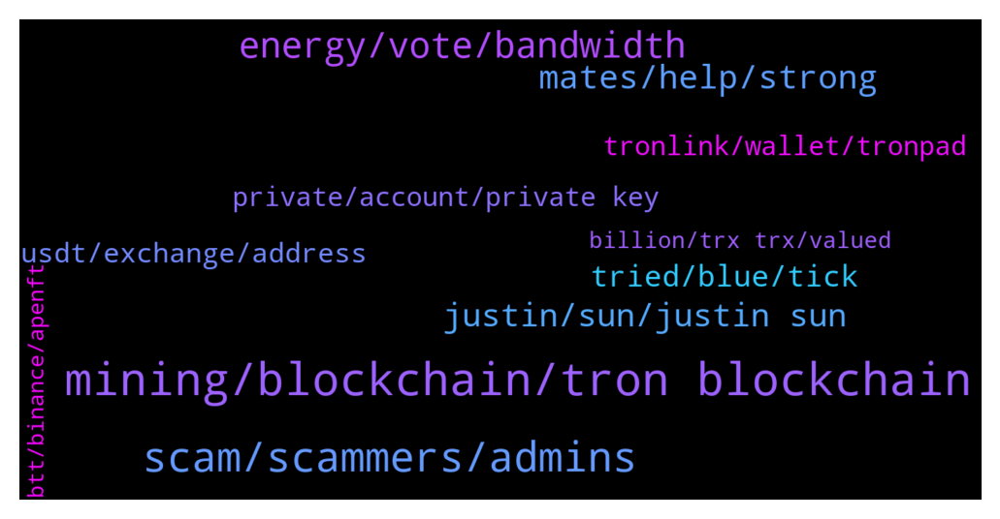

# **@tronnetworkEN**
 ## Analysis for **2021-12-20** - **2021-12-21**.

---

## 📊 **Basic Stats**

**n_messages_sent**: 580

---

---

## 🔝 **Top keywords and related messages**

1. **mining, blockchain, tron blockchain**

    @awtsw --- *by the fact that trx cant be mined* **--->** [TG Discussion](https://t.me/tronnetworkEN/3780508)

    @ZohebXYZ --- *But there are Tron mining machines in the market* **--->** [TG Discussion](https://t.me/tronnetworkEN/3780513)

    @BTCForever1 --- *What LEGIT, PAYING tron systems or investment are you using? Been scammed with tron mining.. Please share legit sites with me.* **--->** [TG Discussion](https://t.me/tronnetworkEN/3779164)

    @ZohebXYZ --- *I am saying that we invest in a website for business. Then, two months later, the website deceives and scams us. After all, what is Tron used for?* **--->** [TG Discussion](https://t.me/tronnetworkEN/3780455)

    @Phil --- *Chill out dude I'm new just to mining and I'm trying to be successful I dont want any trouble* **--->** [TG Discussion](https://t.me/tronnetworkEN/3779189)

    @Ptrondeb --- *Can anyone tell me what justine sun plqn towards tron blockchain* **--->** [TG Discussion](https://t.me/tronnetworkEN/3780230)

2. **scam, scammers, admins**

    @PyeMonster --- *This group is full of scammers. I asked a question yesterday and 10 different numbers started calling me and texted regarding my question. Stay away from these fools. Thanks* **--->** [TG Discussion](https://t.me/tronnetworkEN/3778831)

    @ZohebXYZ --- *Tell us a sign that this website is honest. So that we can earn money by investing in this website with satisfaction* **--->** [TG Discussion](https://t.me/tronnetworkEN/3780469)

    @xPommepote --- *If they promise even 0.1% daily it’s a scam* **--->** [TG Discussion](https://t.me/tronnetworkEN/3780576)

    @PiterSpain --- *That sounds like the perfect scam! 🤣* **--->** [TG Discussion](https://t.me/tronnetworkEN/3779425)

    @greg611 --- *I still wonder how many admins we have . I have received a lot of messages from persons claiming to be admins. I’m scared* **--->** [TG Discussion](https://t.me/tronnetworkEN/3780132)

    @xPommepote --- *My answer is: don’t invest in website. Just don’t. It’s a scam.* **--->** [TG Discussion](https://t.me/tronnetworkEN/3780472)

3. **energy, vote, bandwidth**

    @simon866 --- *📢 Only 9 days left for voting, Remember to vote daily for listing Tron on the Bitpay wallet, we are still ahead at 46% of all votes 😎👌  https://twitter.com/bitpay/status/1458977852230180868?s=21* **--->** [TG Discussion](https://t.me/tronnetworkEN/3782099)

    @Nick --- *Yes. It’s frozen and stuck on pending. Have to 3 days to vote and actually having it staked.* **--->** [TG Discussion](https://t.me/tronnetworkEN/3782102)

    @Robert --- *also make sure you vote so you can get bandwidth/energy. that way you don't need to spend trx for transactions* **--->** [TG Discussion](https://t.me/tronnetworkEN/3782100)

    @awtsw --- *you are voting to choose a validator* **--->** [TG Discussion](https://t.me/tronnetworkEN/3781971)

    @MilNoslen --- *Well once you unfreeze you'll have no energy again* **--->** [TG Discussion](https://t.me/tronnetworkEN/3779305)

    @MilNoslen --- *By keeping your TRX frozen for energy* **--->** [TG Discussion](https://t.me/tronnetworkEN/3779308)

4. **mates, help, strong**

    @ibbeyy --- *I can show you .. proof* **--->** [TG Discussion](https://t.me/tronnetworkEN/3780523)

    @Imeist --- *Sorry not trying to fud. I am Trying to understand whats changing right now* **--->** [TG Discussion](https://t.me/tronnetworkEN/3778347)

    @lastbro3 --- *yes already it's gone, how could you be wrong* **--->** [TG Discussion](https://t.me/tronnetworkEN/3779069)

    @ibbeyy --- *Hahah.. by looking at my face ? Your telling ?* **--->** [TG Discussion](https://t.me/tronnetworkEN/3780505)

    @TronBlockStaking --- *Yup, good to see you here.* **--->** [TG Discussion](https://t.me/tronnetworkEN/3778992)

    @agentpiki --- *See ya and have a nice day!* **--->** [TG Discussion](https://t.me/tronnetworkEN/3779355)

5. **justin, sun, justin sun**

    @K --- *What will happen to Tron after Justin Sun* **--->** [TG Discussion](https://t.me/tronnetworkEN/3778593)

    @crypto_deadpool --- *Have you guys shared the official London real full length interview with Justin Sun on here yet?  It was done recently and I must say I watched the entire 2 hours to see if I can find clues, easter eggs insights to piece together and wow must say, this was one of his best interviews... I learned so much. I highly recommend you all to watch it or at least one of you admin post the link on here. (Not the YouTube one its cut in length but from their website) In the light of recent events, if anyone wants some clarity, I implore you guys to watch the whole thing or at least halfway in. 👍 very bullish on Tron and the ecosystem longterm* **--->** [TG Discussion](https://t.me/tronnetworkEN/3778994)

    @agentpiki --- *I hope Justin Sun brought his backdrop of TRON and BTT with him to Grenada 🤑* **--->** [TG Discussion](https://t.me/tronnetworkEN/3781263)

    @PiterSpain --- *📢@justinsun1990's Open Letter on #TRON's decentralization and Justin's appointment as the Ambassador.  ✅The #TRON Foundation has settled to dissolve itself on July 25, 2021 ✅Justin Sun has accepted the appointment as Ambassador, Permanent Representative of Grenada to the @wto  https://twitter.com/Tronfoundation/status/1471802861315305473   I’m not retiring from #TRON, but rather stepping down from an active involvement to serve as leader and supporter role now that the TRON network has been truly decentralized.  I will still be engaged with the TRON community and push for further advancement of the TRON blockchain.  https://twitter.com/justinsuntron/status/1471804609987756032* **--->** [TG Discussion](https://t.me/tronnetworkEN/3779215)

    @PiterSpain --- *TRON Transactions Spike, Are Investors Cashing in on Justin Sun's Exit? https://u.today/tron-transactions-spike-are-investors-cashing-in-on-justin-suns-exit* **--->** [TG Discussion](https://t.me/tronnetworkEN/3781227)

    @otakuinla --- *Now that Justin is gone and the TRON foundation is dissolved, does anyone know who'll work on the updates to the TRON software. What about Trongrid? It processes 90% of all transactions on TRON. The foundation paid for the Trongrid infrastructure. Who's gonna pay for it now. What about tronscan? That also belonged to the Tron foundation.  So many questions, and yet all Justin said was that he is leaving, and the foundation is dissolving, without offering any details at all.* **--->** [TG Discussion](https://t.me/tronnetworkEN/3781395)

6. **tried, blue, tick**

    @Ale --- *Right, the think is I tried but wasn't working* **--->** [TG Discussion](https://t.me/tronnetworkEN/3781233)

    @TronBlockStaking --- *I only saw the YouTube version, wasn't aware it was edited down.* **--->** [TG Discussion](https://t.me/tronnetworkEN/3778999)

    @mhizric --- *Someone messaged me already 😁😁😁. I'm not a novice. I just did not see the blue tick* **--->** [TG Discussion](https://t.me/tronnetworkEN/3781449)

    @Leminiscata --- *Yes, I have it, but it shows other address and no values* **--->** [TG Discussion](https://t.me/tronnetworkEN/3780355)

    @MilNoslen --- *He’ll just use a zoom background* **--->** [TG Discussion](https://t.me/tronnetworkEN/3781264)

    @WaisAsadi --- *I supposed to send it here TWamJQQfwxrQdFDJe5Mm8axQv9fJqrC1B5* **--->** [TG Discussion](https://t.me/tronnetworkEN/3779079)

7. **usdt, exchange, address**

    @WaisAsadi --- *hi  I need help I made a wrong transaction wrong deposit address I need to contact the usdt contract developer for TronNetwork admin please its urgent* **--->** [TG Discussion](https://t.me/tronnetworkEN/3779068)

    @PeterAntony --- *I lost half my funds swapping my OSK to usdt. I removed from liquidity pool and had half in trx and half in OSK. I lost half my funds when I swapped everything into usdt* **--->** [TG Discussion](https://t.me/tronnetworkEN/3780443)

    @WaisAsadi --- *it was usdt sent to the contract address of my wallet instead of my usdt address* **--->** [TG Discussion](https://t.me/tronnetworkEN/3779074)

    @Fabs_trx --- *That’s usdt contract address. You have to contact tether* **--->** [TG Discussion](https://t.me/tronnetworkEN/3779081)

    @Fabs_trx --- *You have sent your crypto to usdt contract address?* **--->** [TG Discussion](https://t.me/tronnetworkEN/3779073)

    @GabrielKnight77 --- *Where can I store usdt trc20?* **--->** [TG Discussion](https://t.me/tronnetworkEN/3780961)

8. **tronlink, wallet, tronpad**

    @Reformatting --- *Can I please have the tronpad contract you are using?* **--->** [TG Discussion](https://t.me/tronnetworkEN/3779713)

    @Ale --- *I have already tronlink, is exactly where I need to transfer my found* **--->** [TG Discussion](https://t.me/tronnetworkEN/3781229)

    @agentpiki --- *Welcome to tron and remember to take your trx rewards. Dunno how it works in that wallet but in tronlink you have to take trx rewards manually* **--->** [TG Discussion](https://t.me/tronnetworkEN/3782125)

    @PiterSpain --- *Send to Binance and withdraw as mainnet TRX on TRON to your Tronlink.org wallet* **--->** [TG Discussion](https://t.me/tronnetworkEN/3781228)

    @callme202 --- *how to receive btc in tronlink?* **--->** [TG Discussion](https://t.me/tronnetworkEN/3778896)

    @Sarge --- *What send oldBTT to tronlink then what?* **--->** [TG Discussion](https://t.me/tronnetworkEN/3778614)

9. **private, account, private key**

    @Leminiscata --- *In smartphone its ask me for password, I don't remeber it* **--->** [TG Discussion](https://t.me/tronnetworkEN/3780391)

    @Leminiscata --- *I changed my computer and needed to recover my account with the private key, but the account is bringing another tron address, and the values are gone, I don't know what's happening* **--->** [TG Discussion](https://t.me/tronnetworkEN/3780347)

    @PiterSpain --- *Share the link in private, I'll will add it to the Whitelist* **--->** [TG Discussion](https://t.me/tronnetworkEN/3779029)

    @Leminiscata --- *Yes, I thought that, but I have another problem, I forgot the password for my wallet on smartphone i'm accessing it by biometric* **--->** [TG Discussion](https://t.me/tronnetworkEN/3780380)

    @Leminiscata --- *In my smartphone the values are ok* **--->** [TG Discussion](https://t.me/tronnetworkEN/3780359)

    @Leminiscata --- *In my smartphone account I generated the private key  with my  words and than trying restore my account at tronlink brown computer, but its restore other account with zero value in it, how is this possible ?* **--->** [TG Discussion](https://t.me/tronnetworkEN/3780651)

10. **billion, trx trx, valued**

    @ZohebXYZ --- *TRX at 0.1 when a user joins* **--->** [TG Discussion](https://t.me/tronnetworkEN/3780593)

    @FaleehahFaiza --- *TRX holders bullish soon it’s gonna favor us🥶🥶* **--->** [TG Discussion](https://t.me/tronnetworkEN/3778343)

    @Moslly --- *may, but trx makes me sad* **--->** [TG Discussion](https://t.me/tronnetworkEN/3780602)

    @nagalim --- *Is TRX going back to 5cent* **--->** [TG Discussion](https://t.me/tronnetworkEN/3779821)

    @mateojonny --- *Please group what is the future of trx* **--->** [TG Discussion](https://t.me/tronnetworkEN/3779318)

    @Ahsan --- *When TRX will enter in metaverse* **--->** [TG Discussion](https://t.me/tronnetworkEN/3779286)

