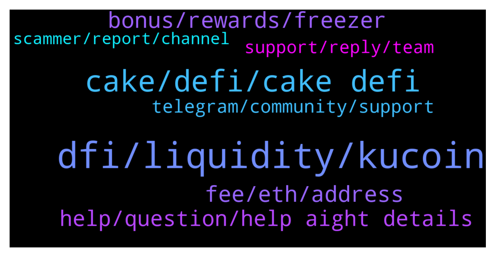

# **@CakeDeFi_EN**
 ## Analysis for **2021-12-21** - **2021-12-22**.

---

## 📊 **Basic Stats**

**n_messages_sent**: 245

---

---

## 🔝 **Top keywords and related messages**

1. **dfi, liquidity, kucoin**

    @frnklfrt --- *Question regarding impermanent loss, does that imply there is such a thing as impermanent gain?* **--->** [TG Discussion](https://t.me/CakeDeFi_EN/155839)

    @D --- *I've tried kucoin but I could not deposit dfi* **--->** [TG Discussion](https://t.me/CakeDeFi_EN/155262)

    @moneydelics --- *I think the best and maybe only option for US residents is Kucoin* **--->** [TG Discussion](https://t.me/CakeDeFi_EN/155380)

    @zforelle --- *I have the option to convert it before transfer . But it also gives the option to transfer token. I guess I can test these with small transactions 🙌* **--->** [TG Discussion](https://t.me/CakeDeFi_EN/155425)

    @Kassius84 --- *Okay the DFX wallet is a fork of the DeFiChain light Wallet and I guess it works technically the same way 😃* **--->** [TG Discussion](https://t.me/CakeDeFi_EN/155424)

    @Teo L. T. --- *Continue this question. Let’s say if DFI price increase and it’s worth USD1500. The APR calculation will base on USD2500 or maintain USD2000? Or I need to top up the USDT to make both side balanced.* **--->** [TG Discussion](https://t.me/CakeDeFi_EN/155550)

2. **cake, defi, cake defi**

    @JonD26 --- *Do you think Cake-defi is actual defi?* **--->** [TG Discussion](https://t.me/CakeDeFi_EN/155402)

    @BerndMack --- *Cake is a company, not token* **--->** [TG Discussion](https://t.me/CakeDeFi_EN/155910)

    @Kassius84 --- *You're living in the US? From my understanding, some Cake DeFi services restricted in several countries.* **--->** [TG Discussion](https://t.me/CakeDeFi_EN/155431)

    @ThereIsGoodAlways --- *Aww okay, so only in the cake defi app.* **--->** [TG Discussion](https://t.me/CakeDeFi_EN/155911)

    @BerndMack --- *you can not buy cake here, it is a company. If you mean DFI, that's a separate blockchain with a Coin, you can buy them through bittrex, latoken, hotbit, bitrue or kucoin* **--->** [TG Discussion](https://t.me/CakeDeFi_EN/155912)

    @zforelle --- *So today I learned that DFI exists in 2 forms - UTXO and Token forms . Can I send either to cake address or only the UTXO form can be sent ?* **--->** [TG Discussion](https://t.me/CakeDeFi_EN/155418)

3. **fee, eth, address**

    @Danielmkd --- *What is this fee of 130$* **--->** [TG Discussion](https://t.me/CakeDeFi_EN/155959)

    @Michael --- *And now I’m been told if I don’t click now I lose my funds???* **--->** [TG Discussion](https://t.me/CakeDeFi_EN/155661)

    @satoricrypto --- *Hello. Could someone please explain why there is a 130$ when I first setup an ETH address? Thank you.* **--->** [TG Discussion](https://t.me/CakeDeFi_EN/155436)

    @Kassius84 --- *The setup of an Ethereum smart contract address is quite expensive* **--->** [TG Discussion](https://t.me/CakeDeFi_EN/155437)

    @satoricrypto --- *well, too good for you that you skip the 130# fee :)* **--->** [TG Discussion](https://t.me/CakeDeFi_EN/155459)

    @Michael_Schredl --- *The fee is a one time fee for the creation of an ETH address* **--->** [TG Discussion](https://t.me/CakeDeFi_EN/155961)

4. **bonus, rewards, freezer**

    @Kassius84 --- *The rewards are paid directly but they are frozen/locked for 180 in staking and you will recieve additional rewards for this 6 months* **--->** [TG Discussion](https://t.me/CakeDeFi_EN/155472)

    @yelvv --- *Hi, I got an e-mail. He confirmed my account and said if I deposited $50, there'd be a $35 bonus. But I've done it before, and the DFC coin looks like it's staking right now. Can I get a reward if I do it again?* **--->** [TG Discussion](https://t.me/CakeDeFi_EN/155685)

    @hridoy_khan111 --- *Is it give instantly?  Is there any conditions?* **--->** [TG Discussion](https://t.me/CakeDeFi_EN/155411)

    @Arno --- *How many of you are in the freezer for 10 years?* **--->** [TG Discussion](https://t.me/CakeDeFi_EN/155803)

    @Kassius84 --- *Rewards from the freezer are also paid out every 12h. You can check the transaction log for "Freezer staking bonus". This is the bonus from the freezer. The normal Staking and freezer rewards can be found under "Received DFI reward from Staking (Consolidated)" Hope that helps* **--->** [TG Discussion](https://t.me/CakeDeFi_EN/155480)

    @danielklaiber --- *directly... just the bonus after 180 days* **--->** [TG Discussion](https://t.me/CakeDeFi_EN/156056)

5. **help, question, help aight details**

    @Michael --- *Where can I find the channel roles?* **--->** [TG Discussion](https://t.me/CakeDeFi_EN/155771)

    @ABIOLA SYLVESTER --- *I did already via the website* **--->** [TG Discussion](https://t.me/CakeDeFi_EN/155906)

    @repinfaust --- *Ok, sorry how do I do that?* **--->** [TG Discussion](https://t.me/CakeDeFi_EN/155699)

    @Kassius84 --- *Maybe this will help you 👍 https://blog.cakedefi.com/decentralized-assets/* **--->** [TG Discussion](https://t.me/CakeDeFi_EN/155631)

    @Kassius84 --- *Which details are you looking for?* **--->** [TG Discussion](https://t.me/CakeDeFi_EN/155477)

    @moneydelics --- *thanks for clarifying, wasn't sure... do you have a ref code?* **--->** [TG Discussion](https://t.me/CakeDeFi_EN/155367)

6. **telegram, community, support**

    @DmgBautista --- *All conversation is always held on this official chat. As per community rules, no mod will ever DM you, its against the same to DM other users and there is no official support in Telegram. Any support must always be directed to Cake by the official channels (website support for example). We do this to ensure no user gets victim of a scam, therefore, anyone getting DM, even from someone who may look a mod, will surelly be a scammer. Just block and report. If for any reason a user may need to speak directly to a mod or other user, can place such request directly in here in the community chat. After a positive feedback, can send a message. A mod will never start that conversation even when asked if can be contacted directly here, the user must establish first contact. And always here, to ensure that does not asks someone trying to impersonate a mod.   But all this can be easily avoided. Just check the community channel rules (valid for any community chat), read them thoroughly and follow them religiously. If you got a DM, just block and report, DM must be treated as a scamm attempt. Even if it looks someone exactly good looking as me 😂😂😂 No security is enough when speaking about your funds!* **--->** [TG Discussion](https://t.me/CakeDeFi_EN/155762)

    @Kevin --- *Does Daniel ever reach out to anyone in this telegram?* **--->** [TG Discussion](https://t.me/CakeDeFi_EN/155793)

    @Michael --- *Just want to double check that all conversation are in this group chat.  Someone has duplicated Michael moderator account and has pim me* **--->** [TG Discussion](https://t.me/CakeDeFi_EN/155760)

    @DmgBautista --- *Welcome to the family! Lets me give you a small head start! Please refer to the pinned messages on this channel, as they contain usefull information, as well as our vommunity guidelines!   The most important of these are the follow:  - No mods will ever DM you, under no circumstance!  - Its against the rules to DM other users!  - There is no official support in telegram!  This rules exist for your safety. Therefore, if you are DM, please consider that as a scam attempt, as scammers may try to take advantage of your currently lack of knowledge in the community or any doubts to contact you directly and steal your funds. In that evenr, just block and report, whoever it may be.  Last but not least  - Please treat everyone kind and in a respectfull manner, as you would like to be treated 🙂* **--->** [TG Discussion](https://t.me/CakeDeFi_EN/155802)

    @DmgBautista --- *Thats strange, if its not the first time you have made a deposit and already had an ERC-20 address, that should not happen. The best way is to write support a ticket so they may check what happened and solve the issue that may have arised. And beware of scammers, there is no official support on telegram. DM's are to be considered as scam attempts, no mod will ever DM you and there is no official support on telegram 🙂* **--->** [TG Discussion](https://t.me/CakeDeFi_EN/155723)

    @DmgBautista --- *If someone is DM you, its a scammer, just block and report. As Michael said, there is no official support on telegram. Please refer to the community guidelines before starting to interact with the platform. In them you can easily read, that no mod will ever DM you, its against the rules to DM other users and there is no official support on telegram. Same as always! Any DM, must be considered a scam. Plain and simple* **--->** [TG Discussion](https://t.me/CakeDeFi_EN/155712)

7. **support, reply, team**

    @ABIOLA SYLVESTER --- *And it’s yet to be attended to* **--->** [TG Discussion](https://t.me/CakeDeFi_EN/155908)

    @DmgBautista --- *Support may take up to 24h to review your email, a bit more on weekends. Please allow some time gor the team to see the issue :)* **--->** [TG Discussion](https://t.me/CakeDeFi_EN/155848)

    @Michael_Schredl --- *No, seems like a delayed mail, you can ignore it* **--->** [TG Discussion](https://t.me/CakeDeFi_EN/155686)

    @Sharonica --- *My account suspended but i dont know why* **--->** [TG Discussion](https://t.me/CakeDeFi_EN/155518)

    @DmgBautista --- *Some points are still being perfected, as some bugs may still exist in the visualization. Also, the app have Sunday as the beginning of the week. Not corresponding exactly at the moment with the time of email information, may also play a role in this. Surelly will be corrected, as the team is still checking all feedback provided* **--->** [TG Discussion](https://t.me/CakeDeFi_EN/155269)

    @BerndMack --- *Normally you will receive a reply within 24 hours. Have a little patience. It's Christmas soon, even for the support staff.* **--->** [TG Discussion](https://t.me/CakeDeFi_EN/155909)

