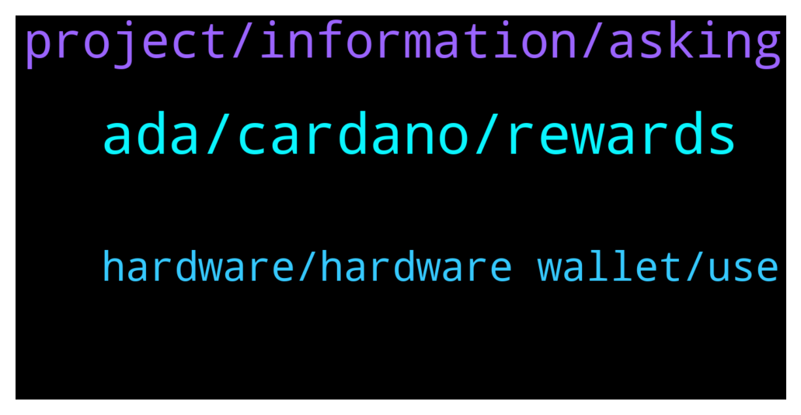

# **@Cardano**
 ## Analysis for **2021-12-21** - **2021-12-22**.

---

## 📊 **Basic Stats**

**n_messages_sent**: 99

---

---

## 🔝 **Top keywords and related messages**

1. **ada, cardano, rewards**

    @ExInfernis --- *Can someone explain please how exactly are used the altcoins of the cardano ecosystem for example. Because I see a lot ot projects developed using cardano ecosystem, but they have their own coins/tokens. So, in this case are they continue to use ada for blockchain operations or they are using only their new tokens. And what is the need to have different token when some new system is created on the cardano blockchain. Not sure that I formulated clearly my question 😉* **--->** [TG Discussion](https://t.me/Cardano/760941)

    @Fowsi88 --- *i want to add ADA contract to my NAMI wallet* **--->** [TG Discussion](https://t.me/Cardano/761443)

    @Jonas --- *Does anyone of you know how to setup a local Cardano network? I have some difficulties with the instruction given on the Cardano SL on GitHub. I am a student from Germany and writing my master thesis about Cardano. Any help is appreciated !* **--->** [TG Discussion](https://t.me/Cardano/761403)

    @glitch04 --- *You can't send wrapped ada to Nami or any other native Cardano network wallet* **--->** [TG Discussion](https://t.me/Cardano/761451)

    @apex_pool_spo --- *your sentence does not make sense. ADA is not a erc20 token to add its contract to a wallet.* **--->** [TG Discussion](https://t.me/Cardano/761447)

    @ExInfernis --- *I see some rewards (which are part of my total amount of ada in the wallet) with option withdraw, but in daedalus there is no such thing. Do I need to click Withdraw on them or it is ok not to touch this* **--->** [TG Discussion](https://t.me/Cardano/761296)

2. **project, information, asking**

    @glitch04 --- *I just replied to that and continually asking me will get you nowhere, you need to talk to that project which is misleading you on their ability to produce* **--->** [TG Discussion](https://t.me/Cardano/761449)

    @glitch04 --- *The other person that keeps asking the same question was sent here from a project that is relaying that as the reason they are " delayed " within hours 3 people asked the same question in relation to that project.  I don't have any information for you or them, if I did I would make it available.* **--->** [TG Discussion](https://t.me/Cardano/761458)

    @Iluvgermany --- *Do you have an tips how to receive that information elsewhere? I thought this would be easy to find out since it's just a project timeline* **--->** [TG Discussion](https://t.me/Cardano/761461)

    @Iluvgermany --- *Any updates regarding a rough launch date (e. g. Q1/Q2 2022) of KEVM to mainnet today? Thank you in advance.* **--->** [TG Discussion](https://t.me/Cardano/761445)

    @Dmsy2 --- *Did you get any answer bro?* **--->** [TG Discussion](https://t.me/Cardano/761157)

    @Iluvgermany --- *What project are you talking about? I am not referring to anything else but a rough launchdate of KEVM to mainnet. This is not related to anything else. So let's please focus on that. Did you receive any information regarding a launchdate after forwarding my question?* **--->** [TG Discussion](https://t.me/Cardano/761452)

3. **hardware, hardware wallet, use**

    @StammeRama --- *Does a hardware wallet basically store your encrypted seed phrase? I am ashamed to say I am still not 100% on how it works. Also, it would surely protect from things like keyloggers, right? Since nothing has to be manually typed to complete a transaction or access a wallet, presumably.* **--->** [TG Discussion](https://t.me/Cardano/760972)

    @haevaristo --- *a keylogger by itself wont do much .. but if someone managed to install a keylogger on your machine, chances are .. they are able to do more than just that .. in which case it doesnt matter much having a hardware wallet* **--->** [TG Discussion](https://t.me/Cardano/760977)

    @apex_pool_spo --- *you use a 24 words seed phrase to generate the keys. the keys are stored in the wallet, never leaving it. to do transactions, you connect the hardware wallet to the wallet (Daedalus, Yoroi, ccvault.io, typhonwallet.io, nami or whatever you want to use) and you will have to confirm the transactions with the hardware wallet. you will never type the recovery seed on a computer. the hardware wallet also has a pin to lock it.* **--->** [TG Discussion](https://t.me/Cardano/760975)

    @Zyroxa --- *its secure as long as you are using a safe and clean device.* **--->** [TG Discussion](https://t.me/Cardano/761557)

    @apex_pool_spo --- *and for ledger, the software on your computer also checks the authenticity, but I guess you need to be sure the computer is clean.* **--->** [TG Discussion](https://t.me/Cardano/760995)

    @apex_pool_spo --- *the recovery words are all the hardware wallet needs to generate the keys. you can have 2 hardware wallets (from the same company) with the same recovery words and you can use either of them to do the transactions.* **--->** [TG Discussion](https://t.me/Cardano/760987)

