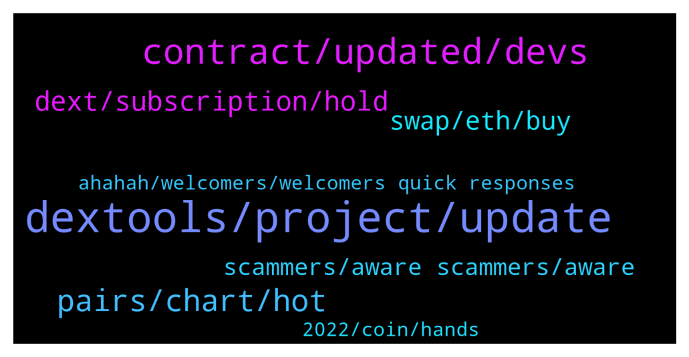

# **@DEXToolsCommunity**
 ## Analysis for **2021-12-20** - **2021-12-22**.

---

## 📊 **Basic Stats**

**n_messages_sent**: 269

---

---

## 🔝 **Top keywords and related messages**

1. **dextools, project, update**

    @Freddy R --- *Question DEX execute some validation for new tokens pairs ? Like rugs or fake contracts, etc?* **--->** [TG Discussion](https://t.me/DEXToolsCommunity/314944)

    @MaxPeterson --- *Thank you DEXTools community for introducing MetaBrands to us. Amazing project. Confident of success particularly in the long term for holders of NFT relics.* **--->** [TG Discussion](https://t.me/DEXToolsCommunity/314741)

    @ChantalLang --- *Hi, I have a question about your roadmap, please. I have read the 2021 roadmap on Dextools website. Congratulation for all the work and the tools you realized in 2021, and for the partnership with Coinmarketcap ! My question is :  —> Will Dextools provide Limit orders functionality for other chains (besides Ethereum) in 2022 ? is this somewhere in the timeline ? Many thanks in advance for your answer and kindest regards from Switzerland, Chantal 🙏😊* **--->** [TG Discussion](https://t.me/DEXToolsCommunity/315039)

    @Godahavefaithh --- *Are there any Admins that can assist me with a Dextools Venture presale allocation allotment that I haven't received* **--->** [TG Discussion](https://t.me/DEXToolsCommunity/315011)

    @ED_tgrm --- *hello. admins, some days ago i saw velox banner on dextools. is it your project and i can trust them as much as i trust you? or it's an independent project?* **--->** [TG Discussion](https://t.me/DEXToolsCommunity/314909)

    @moondriver1 --- *Hey! what do I need to list my token on DexTools?* **--->** [TG Discussion](https://t.me/DEXToolsCommunity/315836)

2. **contract, updated, devs**

    @trojantechltd --- *https://www.dextools.io/app/bsc/pair-explorer/0x11bafd3915e226048bb3b4bab14dd1802ca8a74d  Hello admin, any updates on fixing this contract ? Would be greatly appreciated* **--->** [TG Discussion](https://t.me/DEXToolsCommunity/315912)

    @stanes --- *The issue has been forwarded to the devs. They will check and fix it asap.  Thanks for reporting 🙏* **--->** [TG Discussion](https://t.me/DEXToolsCommunity/316180)

    @CryptoTamilann --- *We updated recently like 2 days before on coingecko* **--->** [TG Discussion](https://t.me/DEXToolsCommunity/314781)

    @TheMetaZeus --- *Okay, thank you. I have sent in my handles, but it is still not updated.* **--->** [TG Discussion](https://t.me/DEXToolsCommunity/316028)

    @victus5 --- *Yes bro they haven't updated it we applied* **--->** [TG Discussion](https://t.me/DEXToolsCommunity/314846)

    @trojantechltd --- *Hello, it shows up as “no name “* **--->** [TG Discussion](https://t.me/DEXToolsCommunity/315967)

3. **pairs, chart, hot**

    @Flashbang665 --- *Hi, is there any issues with charts now?, the history of this chart is gone: https://www.dextools.io/app/bsc/pair-explorer/0x486697ae24469cb1122f537924aa46e705b142aa* **--->** [TG Discussion](https://t.me/DEXToolsCommunity/316191)

    @FredericDEXT --- *Hot Pairs depends on a custom algorithm which is undisclosed, so please don't ask about it  We don't accept payments for trending / hot pairs, you can pay scammers for this but it won't work!* **--->** [TG Discussion](https://t.me/DEXToolsCommunity/315652)

    @hantick3 --- *chart for this isn't loading. BSC 0xd6bb010019c9d3ea177e6d2e9af7938c6e53da55* **--->** [TG Discussion](https://t.me/DEXToolsCommunity/316263)

    @napascual --- *Bsc pairs history has been recover* **--->** [TG Discussion](https://t.me/DEXToolsCommunity/316259)

    @napascual --- *Not to us 😅.  Hot Pairs depends on a custom algorithm which is undisclosed, so please don't ask about it  We don't accept payments for trending / hot pairs, you can pay scammers for this but it won't work!* **--->** [TG Discussion](https://t.me/DEXToolsCommunity/315396)

    @NoOneNooooo --- *Hi BSC pairs again problem not loading and change chart also hot pairs* **--->** [TG Discussion](https://t.me/DEXToolsCommunity/316183)

4. **dext, subscription, hold**

    @MonkeySuit --- *so in my opinion, dext token is a good buy/hold, I think there are big things coming for the platform, if you hold 100k you can get into the VIP group and participate in venture deals.  Other than that I would get into metaverse or p2e focused tokens early.* **--->** [TG Discussion](https://t.me/DEXToolsCommunity/315780)

    @rockytothemoon --- *Ah, okay so 216 Dex is subscription amount or 1000 dext holdings works too* **--->** [TG Discussion](https://t.me/DEXToolsCommunity/314931)

    @stanes --- *Alternatively, you can hold 1k DEXT.* **--->** [TG Discussion](https://t.me/DEXToolsCommunity/316164)

    @stanes --- *You are free to have your opinion, np.  And as I said, holding 1k DEXT is enough to get the standard plan.* **--->** [TG Discussion](https://t.me/DEXToolsCommunity/316168)

    @JoeyDieleman --- *Subscription (monthly payment) or hold 1000 DEXT in your wallet.* **--->** [TG Discussion](https://t.me/DEXToolsCommunity/314930)

    @bastardganpunk --- *So normal slippage is fine with dext (0,5%)* **--->** [TG Discussion](https://t.me/DEXToolsCommunity/314793)

5. **swap, eth, buy**

    @HenryMatambo --- *Can someone please help me to sell my NFT* **--->** [TG Discussion](https://t.me/DEXToolsCommunity/315258)

    @roni20212 --- *Dextool  token buy fee how $  If i swap eth to other token then how $ transaction fee* **--->** [TG Discussion](https://t.me/DEXToolsCommunity/314790)

    @izysteps --- *I have probelm selling my $MetaV. I want switch it to BUSD ot BNB. I got the spending approved yesterday but can not swap. It always complain about the slippage even when I set it to 20%.* **--->** [TG Discussion](https://t.me/DEXToolsCommunity/315704)

    @roni20212 --- *Can i swap this token busd to mongoose* **--->** [TG Discussion](https://t.me/DEXToolsCommunity/314797)

    @Cryptolover2002 --- *Any admins available for help?  I have standard account with 1100 DEXT tokens why I am not able to sell ? I can't see them under the swap section nor in my metamask wallet* **--->** [TG Discussion](https://t.me/DEXToolsCommunity/314992)

    @roni20212 --- *No i want buy 50 busd to mongoose* **--->** [TG Discussion](https://t.me/DEXToolsCommunity/314799)

6. **scammers, aware scammers, aware**

    @stanes --- *Please DM @guillermorodriguez78 he is the person-in-charge.  Be aware of scammers, HE WILL NEVER DM YOU FIRST.* **--->** [TG Discussion](https://t.me/DEXToolsCommunity/316140)

    @napascual --- *Marketing to @guillermorodriguez78. Be aware of scammers, remember he'll never dm first* **--->** [TG Discussion](https://t.me/DEXToolsCommunity/315630)

    @(⊙o⊙) --- *This guy is a high-level liar, be careful everyone!* **--->** [TG Discussion](https://t.me/DEXToolsCommunity/315462)

    @napascual --- *Ask @guillermorodriguez78, he'll never DM first. Be aware of scammers* **--->** [TG Discussion](https://t.me/DEXToolsCommunity/315374)

    @napascual --- *Not the place to shill your NTFs, please move on* **--->** [TG Discussion](https://t.me/DEXToolsCommunity/315273)

    @Adan Abdirisak | I NEVER DM FIRST! | Water Fountain Founder & CE --- *Does this guys work for you guys he is asking for 2K deposit   @ FredericDEXT* **--->** [TG Discussion](https://t.me/DEXToolsCommunity/315259)

7. **ahahah, welcomers, welcomers quick responses**

    @stanes --- *You haven't been frontrunned so doesn't matter 😉* **--->** [TG Discussion](https://t.me/DEXToolsCommunity/315517)

    @SilentBobdcv --- *Thank you guys as always much appreciated* **--->** [TG Discussion](https://t.me/DEXToolsCommunity/316181)

    @gracetwtn --- *Ahahah received welcomers, thank you very much.* **--->** [TG Discussion](https://t.me/DEXToolsCommunity/316142)

    @TheMetaZeus --- *Okay thank you so much for the quick responses! I really appreciate it!* **--->** [TG Discussion](https://t.me/DEXToolsCommunity/316039)

    @DivUniSer --- *Thanks! I've sent @guillermorodriguez78 a message 🙂* **--->** [TG Discussion](https://t.me/DEXToolsCommunity/315634)

    @ChantalLang --- *Many thanks Pascual for your answer 🙏😊* **--->** [TG Discussion](https://t.me/DEXToolsCommunity/315046)

