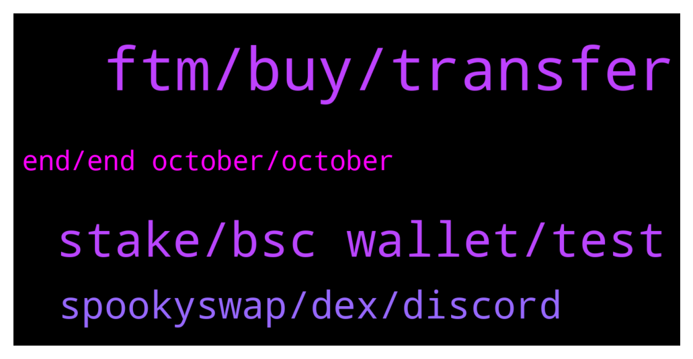

# **@Fantom_English**
 ## Analysis for **2021-12-21** - **2021-12-22**.

---

## 📊 **Basic Stats**

**n_messages_sent**: 94

---

---

## 🔝 **Top keywords and related messages**

1. **ftm, buy, transfer**

    @nitinsbalaji --- *I transfer my bnb via ftm blockchain To binance exchange  But i Haven't received till now I'll try to contact you in all possible way but I haven't received any kind of help It's my request to solve my queries asap* **--->** [TG Discussion](https://t.me/Fantom_English/614631)

    @F --- *What's the best way to buy ftm in the netherlands? Cause binance doesnt support sepa and creditcard from NL* **--->** [TG Discussion](https://t.me/Fantom_English/614214)

    @sundayoyediran --- *Please I small amount of FTM for my initial gas fee* **--->** [TG Discussion](https://t.me/Fantom_English/614319)

    @n_i_c00 --- *Did you had issue withdrawing from binance to revolut? As sepa transfer got disabled but still possible via Visa card. Unfortunately my revolut card doesn’t get accepted.* **--->** [TG Discussion](https://t.me/Fantom_English/614365)

    @Fares --- *Personally, I use Revolut to swap EUR to USD then use bank transfer Revolut => Binance. Took 15/20 minutes yesterday.* **--->** [TG Discussion](https://t.me/Fantom_English/614363)

    @necronoth --- *Hi anyone knows where to get native ftm on exchange? kucoin currently unavailable to withdraw* **--->** [TG Discussion](https://t.me/Fantom_English/614616)

2. **stake, bsc wallet, test**

    @slickrick6 --- *You’re issue is with binance not fantom* **--->** [TG Discussion](https://t.me/Fantom_English/614236)

    @Abhi1781 --- *When Binance will provide staking on Fantom @admin* **--->** [TG Discussion](https://t.me/Fantom_English/614482)

    @phatnguyen120892 --- *Thanks, i use my bsc wallet address to create fantom wallet, is it ok* **--->** [TG Discussion](https://t.me/Fantom_English/614350)

    @magik9999 --- *Hello, I have a problem with swaping fantom to tomb on spookyswap.. I see this sentences „Transaction decoding is not available for chainId 250” any idea ?* **--->** [TG Discussion](https://t.me/Fantom_English/614797)

    @Minesk1 --- *hello. Does fantom have any plan to implement zk rollup?* **--->** [TG Discussion](https://t.me/Fantom_English/614369)

    @chiquito82 --- *Hehehe, so what was it.. Really I don't remember hahaha was it a fantom exchange made by binance?* **--->** [TG Discussion](https://t.me/Fantom_English/614691)

3. **spookyswap, dex, discord**

    @Janevietani --- *Hey All! You can now use the following new faucet made by  @Mentasuave01🍃[Will never DM 1st] :  https://www.mentasuave01-tools.com/  Submit your address on the website, you will receive 0.2 FTM if: 1. Your wallet is new to Fantom Opera network 2. You have recently bridged using anyswap.exchange or our bridge on spookyswap.finance* **--->** [TG Discussion](https://t.me/Fantom_English/614323)

    @Janevietani --- *not sure what is that error. try ask it on spookyswap group  please be noted . admin will never dm user first https://t.me/SpookySwapCommunity* **--->** [TG Discussion](https://t.me/Fantom_English/614798)

    @slickrick6 --- *you can bridge it with https://anyswap.exchange/#/bridge then later you can swap UST on https://app.beets.fi/#/trade* **--->** [TG Discussion](https://t.me/Fantom_English/614558)

    @Alex --- *He messaged me right after i joined this telegram group* **--->** [TG Discussion](https://t.me/Fantom_English/614384)

    @Z --- *Wordddddd. That's legit. Worked as needed.  Thanks Jane 🙏* **--->** [TG Discussion](https://t.me/Fantom_English/614330)

    @Z --- *I figured inputting my phone number would be enough, but then it asks me for my discord password (which I dont remember). So I cant "confirm the changes"  I didnt expect to use discord as much as I have, and don't want to lose my communities and contacts trying to reset my pass to an email I probably dont have access to* **--->** [TG Discussion](https://t.me/Fantom_English/614317)

4. **end, end october, october**

    @chiquito82 --- *Wasn't it announced at the end of October?* **--->** [TG Discussion](https://t.me/Fantom_English/614686)

    @pajamasfreak --- *It should be this month but Harry is the one managed that* **--->** [TG Discussion](https://t.me/Fantom_English/614689)

    @WelshNik --- *Did you sleep at the end of October?* **--->** [TG Discussion](https://t.me/Fantom_English/614687)

    @Hsyn_Trkmn --- *hello when will the network open?* **--->** [TG Discussion](https://t.me/Fantom_English/614476)

    @AnthonyACNolasco --- *Do you know when it will be available?* **--->** [TG Discussion](https://t.me/Fantom_English/614379)

    @pajamasfreak --- *Too early to say since only few start to implement* **--->** [TG Discussion](https://t.me/Fantom_English/614370)

