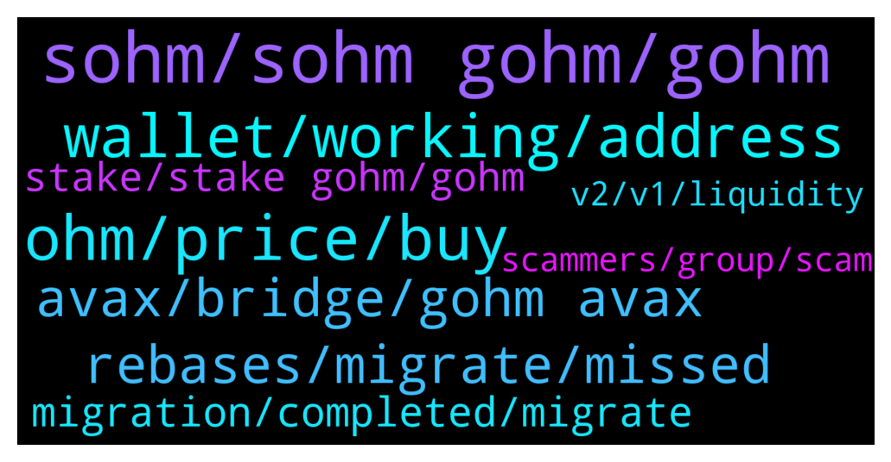

# **@OlympusTG**
 ## Analysis for **2021-12-21** - **2021-12-22**.

---

## 📊 **Basic Stats**

**n_messages_sent**: 904

---

---

## 🔝 **Top keywords and related messages**

1. **sohm, sohm gohm, gohm**

    @foodielov --- *or does everyone need to convert the sohm* **--->** [TG Discussion](https://t.me/OlympusTG/131526)

    @K. --- *NVM it looks like it's all there. however I thought I migrated to gOHM and it's still showing sOHM* **--->** [TG Discussion](https://t.me/OlympusTG/130522)

    @anonymous_sifu --- *is sohm to gohm and bridging working or currently only way out is migration from v1?* **--->** [TG Discussion](https://t.me/OlympusTG/132191)

    @maurofibonacci --- *Thank you mate, but do I have to transfer all of my sOHM gOHM or just some of them?* **--->** [TG Discussion](https://t.me/OlympusTG/130835)

    @Ap0l1o --- *and if you ask about migrating directly from sOhm V1 to sOhm V2, it is still not active* **--->** [TG Discussion](https://t.me/OlympusTG/130562)

    @CryptoDBoy --- *Question re migration - i am about to migrate sOhm to gOhm - as I haven’t been receiving my rebased sOhm for the past few weeks, I thought it would align with my new rebased value of sOhm when I migrate - but it is saying that I will migrate to the value of sOhm and not the increased value of rebases over past few weeks; does this mean that I have lost the rebase or will it automatically update once I convert to gOhm; I held off as it said you wont lose your rebase but looks like it will? Any advice, thanks* **--->** [TG Discussion](https://t.me/OlympusTG/131254)

2. **ohm, price, buy**

    @Swiss_Schwang --- *How much Ohm staked to get those average returns? I'm assuming 5 digits or so.* **--->** [TG Discussion](https://t.me/OlympusTG/132202)

    @Jonno --- *Question then I’ve check that thanks say I now move this to avax and decide to unstake how will that work does it transfer back into standard ohm on avax in my wallet and at same ratio ie I’ll receive more because 0.04 ohm would mean it’s worth less than before migration ?* **--->** [TG Discussion](https://t.me/OlympusTG/131984)

    @Ammaraljhni --- *I bought ohm with high price now I am down on my investment also now with gas fees I can buy one ohm with it* **--->** [TG Discussion](https://t.me/OlympusTG/130687)

    @Colonelgaddafi --- *Loving avax so far. I'm doing both ohm and time. Overall see ohm surviving long term* **--->** [TG Discussion](https://t.me/OlympusTG/132181)

    @Poopoo (never dm first & don't dm me) --- *bonding means you provide assets to the protocol in exchange for discounted OHM, then the OHM is given to you across the vesting period, which you can claim and stake across the vesting period* **--->** [TG Discussion](https://t.me/OlympusTG/131002)

    @K. --- *but showing $0 in OHM, I have purchased OHM before* **--->** [TG Discussion](https://t.me/OlympusTG/130488)

3. **wallet, working, address**

    @Poopoo (never dm first & don't dm me) --- *best to turn on and off, and try again later, not too sure what's the issue but the right support is probably metamask support, not the ones in your dm, contact them directly from their website if the issue persists later* **--->** [TG Discussion](https://t.me/OlympusTG/130668)

    @Dada --- *I checjed not showing on the Web* **--->** [TG Discussion](https://t.me/OlympusTG/131805)

    @cdp279 --- *You need to connect. Using eth network* **--->** [TG Discussion](https://t.me/OlympusTG/131660)

    @DeFiMaximalist --- *it suddenly worked for me now try refreshing* **--->** [TG Discussion](https://t.me/OlympusTG/131663)

    @Poopoo (never dm first & don't dm me) --- *not missing for me, maybe clear cache* **--->** [TG Discussion](https://t.me/OlympusTG/131391)

    @Samuel $BOSS 💎🙌 --- *When I visit the Account page the ASSETS section is stuck loading.* **--->** [TG Discussion](https://t.me/OlympusTG/131575)

4. **avax, bridge, gohm avax**

    @Poopoo (never dm first & don't dm me) --- *yes, you need to wrap to gOHM in order to bridge cross chain, but you don't really need all your OHM in the same chain, I have some on ETH and some on AVAX* **--->** [TG Discussion](https://t.me/OlympusTG/130604)

    @Filly6692 --- *If I want To farm gOHM. Do i have to bridge them first  to avalanche for gOHM Avax?* **--->** [TG Discussion](https://t.me/OlympusTG/130942)

    @stipeto1 --- *Hey guys, is there any reason not to bridge gOHM from ethereum to avalanche? Is there perhaps less liquidity on avax and hence I should wait to bridge?* **--->** [TG Discussion](https://t.me/OlympusTG/131738)

    @Ap0l1o --- *Also, you can bridge your gOhm to other chains.* **--->** [TG Discussion](https://t.me/OlympusTG/130391)

    @Colonelgaddafi --- *Loving the multichain ohm idea. Buying gohm on avax saves so much fees man.* **--->** [TG Discussion](https://t.me/OlympusTG/132179)

    @Poopoo (never dm first & don't dm me) --- *yes and you can also buy through avax, polygon, arbitrum and fantom* **--->** [TG Discussion](https://t.me/OlympusTG/130577)

5. **rebases, migrate, missed**

    @cdp279 --- *when you migrate you'll get all rebases that you missed* **--->** [TG Discussion](https://t.me/OlympusTG/130336)

    @Poopoo (never dm first & don't dm me) --- *correct, when you migrate it will be givne back to you, the missed rebases* **--->** [TG Discussion](https://t.me/OlympusTG/130479)

    @SMNFT7 --- *If that is the case then yeah bro, you won't see rebases untill you migrate. But you ain't losing them, they get backdated once you hop on to V2* **--->** [TG Discussion](https://t.me/OlympusTG/131931)

    @Martin --- *If I want to get my omh from v1 do I still get the rebase that I missed? From the v2 update* **--->** [TG Discussion](https://t.me/OlympusTG/130335)

    @Poopoo (never dm first & don't dm me) --- *missed rebases will be given to you all at once when you migrate, I saw somewhere that says people should complete the migration within 2 months to get missed rebases* **--->** [TG Discussion](https://t.me/OlympusTG/131020)

    @SMNFT7 --- *Na, they took the rebases off for V1* **--->** [TG Discussion](https://t.me/OlympusTG/131936)

6. **migration, completed, migrate**

    @jrobertshaw --- *What is the migration date? thanks* **--->** [TG Discussion](https://t.me/OlympusTG/130993)

    @Poopoo (never dm first & don't dm me) --- *the migration on your end? prolly around that time yes, but best to complete soon especially because gas has been low recently* **--->** [TG Discussion](https://t.me/OlympusTG/131025)

    @Stefan --- *Hello - is the conversion completed yet? I am unable to Zap.* **--->** [TG Discussion](https://t.me/OlympusTG/132042)

    @Poopoo (never dm first & don't dm me) --- *I think it should be fine, worst case you just migrate 😂* **--->** [TG Discussion](https://t.me/OlympusTG/130928)

    @Newson_wong --- *Hi May I know when Olympus v2 migration will be totally completed ? Thank you !* **--->** [TG Discussion](https://t.me/OlympusTG/131956)

    @SMNFT7 --- *Yeah it might, it might also be UI glitch on site but you got the actual amount. At this point, with all the migration glitches I'm not sure.* **--->** [TG Discussion](https://t.me/OlympusTG/131859)

7. **stake, stake gohm, gohm**

    @Eroni --- *So I should just stake the normal way now then wait for olyzaps to work?* **--->** [TG Discussion](https://t.me/OlympusTG/131576)

    @Poopoo (never dm first & don't dm me) --- *correct gOHM is already in staked form* **--->** [TG Discussion](https://t.me/OlympusTG/131218)

    @Poopoo (never dm first & don't dm me) --- *gOHM is always in staked form bro* **--->** [TG Discussion](https://t.me/OlympusTG/131906)

    @JimWelder --- *How do I stake the gohm* **--->** [TG Discussion](https://t.me/OlympusTG/130649)

    @Ammaraljhni --- *Now I have some sohm staked and gohm what that means* **--->** [TG Discussion](https://t.me/OlympusTG/130702)

    @Poopoo (never dm first & don't dm me) --- *stake to sOHM v2 then wrap to gOHM* **--->** [TG Discussion](https://t.me/OlympusTG/131441)

8. **scammers, group, scam**

    @chittyusername --- *Can we please send media...I need to show the community this message with a scammer* **--->** [TG Discussion](https://t.me/OlympusTG/131669)

    @chittyusername --- *Be careful of being added to identical groups that are scams* **--->** [TG Discussion](https://t.me/OlympusTG/131589)

    @mrmiyagi68 --- *Yea so many of them haha, very fun to mess around with them and then tell them you know they are scammers* **--->** [TG Discussion](https://t.me/OlympusTG/132239)

    @cdp279 --- *you ptobably looked like a scammer* **--->** [TG Discussion](https://t.me/OlympusTG/132285)

    @Ap0l1o --- *Hopefully they will not scam anyone anymore and they will stop* **--->** [TG Discussion](https://t.me/OlympusTG/130598)

    @Talal107 --- *We should hire these scammers. They are really fast at responding.* **--->** [TG Discussion](https://t.me/OlympusTG/131853)

