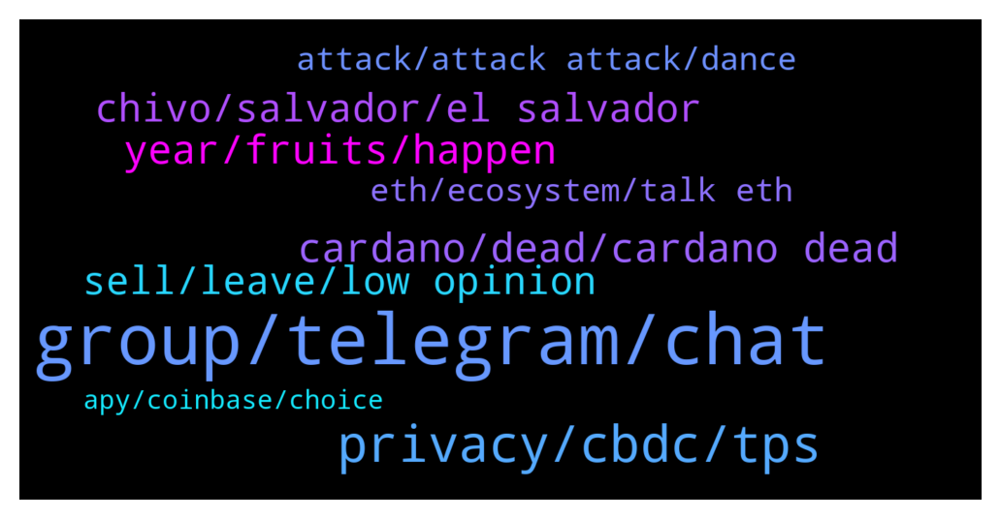

# **@algorand**
 ## Analysis for **2021-12-21** - **2021-12-22**.

---

## 📊 **Basic Stats**

**n_messages_sent**: 206

---

---

## 🔝 **Top keywords and related messages**

1. **group, telegram, chat**

    @daniel_falso --- *Hi admin... Who care abaut turkish telegram group... Lots of bullshit..   So many investor leaving.. I m also...* **--->** [TG Discussion](https://t.me/algorand/324530)

    @kenny920 --- *I'm also banned there. Never even said a word lol* **--->** [TG Discussion](https://t.me/algorand/324765)

    @MackDenver --- *You should join the trading chat: @algorand_price* **--->** [TG Discussion](https://t.me/algorand/324500)

    @MackDenver --- *We are aware of them. You can report the group to Telegram and help us shut it down.* **--->** [TG Discussion](https://t.me/algorand/324798)

    @Floffy --- *There is another telegram geoup named ALGORAND OFFICIAL. I guess that's the scam geoup right xD? They do some kind of sale if you send bnb to their wallets. But 1000% is to steal your cryptos haha* **--->** [TG Discussion](https://t.me/algorand/324797)

    @Chocoim --- *I was talking about that group* **--->** [TG Discussion](https://t.me/algorand/324694)

2. **privacy, cbdc, tps**

    @hope999999999 --- *If they allow privacy, gov wont support them.* **--->** [TG Discussion](https://t.me/algorand/324400)

    @LogicalLadder --- *Is there any link to videos or posts by Silvio about privacy in crypto and applications of ZK* **--->** [TG Discussion](https://t.me/algorand/324408)

    @peteblank --- *Can I get the tldw version of state proofs though? Im using 4g and don't want to use up all my data* **--->** [TG Discussion](https://t.me/algorand/324353)

    @LogicalLadder --- *I understand they are aiming for being cbdc infrastructure but unsure how this can exist without privacy* **--->** [TG Discussion](https://t.me/algorand/324399)

    @LogicalLadder --- *Does algorand have any plans for privacy* **--->** [TG Discussion](https://t.me/algorand/324398)

    @Nakibruce --- *Silvio invented zero knowleege proofs and many privacy features there will be privacy* **--->** [TG Discussion](https://t.me/algorand/324401)

3. **year, fruits, happen**

    @Chocoim --- *I pity myself wasted whole year* **--->** [TG Discussion](https://t.me/algorand/324661)

    @HL109 --- *Lol. Is there any evidence it will happen in 2022?* **--->** [TG Discussion](https://t.me/algorand/324430)

    @LeCreammm --- *Right after the corona variants are out the door,  we'll be living comfortably 😋* **--->** [TG Discussion](https://t.me/algorand/324802)

    @mcmaxims --- *That's why we need to build a bridge. To welcome the bsc moonboys.* **--->** [TG Discussion](https://t.me/algorand/324756)

    @Mimo --- *To the moon soon ???? 🚀🚀* **--->** [TG Discussion](https://t.me/algorand/324505)

    @hope999999999 --- *When we were at year 2018, we asked what would happen in 2019. Future is uncertainty 😒* **--->** [TG Discussion](https://t.me/algorand/324431)

4. **cardano, dead, cardano dead**

    @Crypt0Mania17 --- *Cardano is a dead duck 🦆* **--->** [TG Discussion](https://t.me/algorand/324308)

    @TheRealGiulio --- *So where is Cardano’s money going to go? Avalanche or Algorand?* **--->** [TG Discussion](https://t.me/algorand/324309)

    @Tiny_Philosopher_784 --- *And I quote "cardano will die."* **--->** [TG Discussion](https://t.me/algorand/324660)

    @patrick_crypto --- *wait - Cardano is still alive?  weird..  😉* **--->** [TG Discussion](https://t.me/algorand/324342)

    @Kajooteren --- *Only sheeps think cardano is dead* **--->** [TG Discussion](https://t.me/algorand/324338)

    @mcmaxims --- *My dialogues with cardano holders went 90% of time like this haha* **--->** [TG Discussion](https://t.me/algorand/324316)

5. **chivo, salvador, el salvador**

    @S --- *Can someone from the foundation set the record straight on this please? I can’t find any official sources that say Chivo runs on Algorand. Just a couple opinion pieces that don’t cite real evidence. The koibanx deal with El Salvador doesn’t mention Chivo from what I can see. There are no mainnet transactions that indicate Chivo is running on Algorand…if this is just a viral rumor, the foundation should clear things up sooner rather than later to stop the spread of misinformation.* **--->** [TG Discussion](https://t.me/algorand/324487)

    @Cornfarmerr --- *That's bullshit. They use real btc on lightning network* **--->** [TG Discussion](https://t.me/algorand/324383)

    @Sanchayan_bhunia --- *Is it true that El Salvador built their crypto wallet using Algorand technology?* **--->** [TG Discussion](https://t.me/algorand/324464)

    @Cook --- *The entire chivo app thing just sounds bigger because of how much attention El Salvador is getting with the btc thing* **--->** [TG Discussion](https://t.me/algorand/324482)

    @Cook --- *And it’s not just the chivo app. El Salvador is building their entire blockchain infrastructure using Algorand as rails* **--->** [TG Discussion](https://t.me/algorand/324471)

    @Sanchayan_bhunia --- *What is it called, yeah! the chivo wallet uses Algorand technology* **--->** [TG Discussion](https://t.me/algorand/324469)

6. **sell, leave, low opinion**

    @tunatime --- *Hey algo fam, my 6yo daughter is doing the algobots competition and needs votes. If you could like this tweet I would appreciate It so much! Thanks! 🙌🏻 https://twitter.com/neonglitch86/status/1470120459073056774?s=21* **--->** [TG Discussion](https://t.me/algorand/324527)

    @reslimed --- *You should probably sell your algo if you're this upset about price action* **--->** [TG Discussion](https://t.me/algorand/324680)

    @laura --- *God bless may he be future millionaire with algo* **--->** [TG Discussion](https://t.me/algorand/324460)

    @TheRealGiulio --- *I totally agree with you. I am all in on Algo.* **--->** [TG Discussion](https://t.me/algorand/324313)

    @Tiny_Philosopher_784 --- *@Chocoim Algo is the ethereum killer* **--->** [TG Discussion](https://t.me/algorand/324691)

    @Kmw81 --- *You have lot of algo ? Why you giving away ?* **--->** [TG Discussion](https://t.me/algorand/324446)

7. **eth, ecosystem, talk eth**

    @Tiny_Philosopher_784 --- *Like trash, yeah.  And I'll talk about eth all I want. Try me* **--->** [TG Discussion](https://t.me/algorand/324631)

    @Chocoim --- *Look how market valuing ada And don't talk about eth It's umcomparable to deadgorand* **--->** [TG Discussion](https://t.me/algorand/324627)

    @mcmaxims --- *Chances are it goes mostly to Algorand. You can do your own research and compare tech and ecosystem. Hit me up if you think I am wrong.* **--->** [TG Discussion](https://t.me/algorand/324312)

    @Chocoim --- *Nevwe dare to compare algo to eth and btc Algo is chain with billions of coins created out of thin air and slow development controlled by few people at top . Btc and eth having thousands of running on it.. r decentralied chain... had to put lof of effort and energy to create them...* **--->** [TG Discussion](https://t.me/algorand/324670)

    @MackDenver --- *We're excited to welcome @sea_token to the #Algorand ecosystem as our latest grant recipient. Sea Nexus, a citizen science project designed to save our seas, will develop a global network for environmental data on @Algorand! #GreenCrypto #ShapeTheFuture  👉https://algorand.foundation/news/sea-nexus-grant* **--->** [TG Discussion](https://t.me/algorand/324496)

    @Chocoim --- *If algo achieves 1% of eth ecosystem  I would be happy* **--->** [TG Discussion](https://t.me/algorand/324671)

8. **attack, attack attack, dance**

    @Tiny_Philosopher_784 --- *At least algorand doesn't have some blow hard paying people to pump it* **--->** [TG Discussion](https://t.me/algorand/324640)

    @Tiny_Philosopher_784 --- *You're grown, now act like it.  If you were saying algorand has flaws but has brought alot more online than they said they were, this would be civil. You can be disappointed but still be honest about what they have done. Instead, you attack attack attack. What were you expecting? A bunch of sheep?? Yeah, nice thinking.* **--->** [TG Discussion](https://t.me/algorand/324700)

    @Tiny_Philosopher_784 --- *You wanted to dance, you should dance. You can't tiptoe back and forth across the line of support and attack. If you despise algorand, that much, it's simple: sell* **--->** [TG Discussion](https://t.me/algorand/324697)

    @Tiny_Philosopher_784 --- *Have you even used algorand? You sound like a troll from another group* **--->** [TG Discussion](https://t.me/algorand/324650)

    @Cook --- *There’s a lot of big partnerships going around with Algorand as we speak but a lot of it just isn’t being shilled on youtube every minute* **--->** [TG Discussion](https://t.me/algorand/324483)

    @Todd --- *Algorand,  xrpl,  dot. Flare.* **--->** [TG Discussion](https://t.me/algorand/324344)

9. **apy, coinbase, choice**

    @Ziliqa_KID_PUMP_it --- *Why only 0.78 when coinbase is paying 4%* **--->** [TG Discussion](https://t.me/algorand/324791)

    @Ziliqa_KID_PUMP_it --- *Hi guys when keep my algo token on coinbase or algorand wallet where is more apy?* **--->** [TG Discussion](https://t.me/algorand/324785)

    @MackDenver --- *The APY was reduced recently due to as it was planned.* **--->** [TG Discussion](https://t.me/algorand/324792)

    @MackDenver --- *Not sure about coinbase APY, if you store on Algorand wallet current APY is about 0.78%* **--->** [TG Discussion](https://t.me/algorand/324790)

    @Tiny_Philosopher_784 --- *Then use some yieldly for the over 100% apy for choice, then stake the choice to make 15k% apy to make more choice.* **--->** [TG Discussion](https://t.me/algorand/324726)

