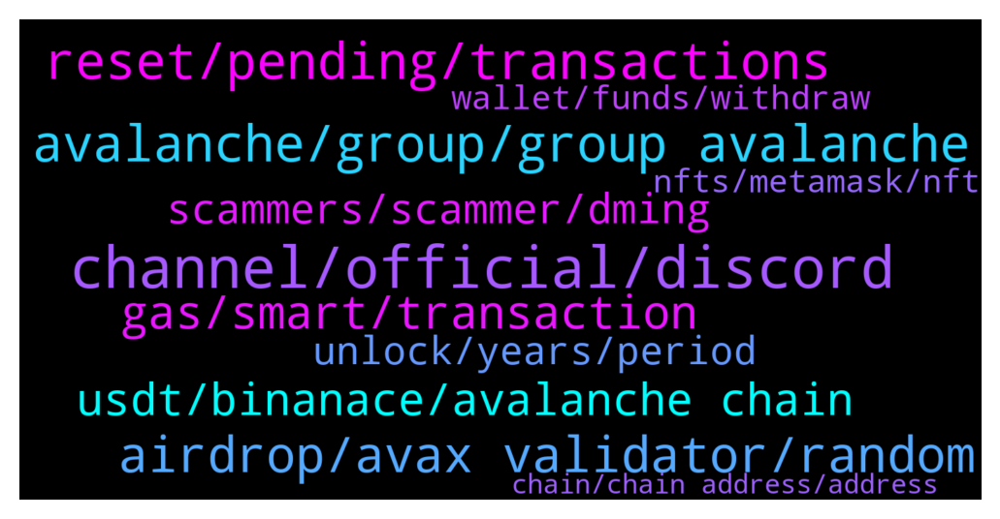

# **@avalancheavax**
 ## Analysis for **2021-12-21** - **2021-12-22**.

---

## 📊 **Basic Stats**

**n_messages_sent**: 290

---

---

## 🔝 **Top keywords and related messages**

1. **channel, official, discord**

    @defikeyser --- *Yeah I’m not sure what is the build guild on discord* **--->** [TG Discussion](https://t.me/avalancheavax/316419)

    @Taylordaman --- *ok.. cos the other channel has 55k members too..* **--->** [TG Discussion](https://t.me/avalancheavax/316106)

    @TheSEOdude --- *Lol, but not in any other ecosystem channel. As far as I am able to see.* **--->** [TG Discussion](https://t.me/avalancheavax/316128)

    @ramziakram --- *can go to avax official discord channel. got many dev there* **--->** [TG Discussion](https://t.me/avalancheavax/316253)

    @Aileen198801 --- *I think you look like a Korean* **--->** [TG Discussion](https://t.me/avalancheavax/316153)

    @TheSEOdude --- *One more weird thing is , that you are not there in any other group.  You have only joined only this channel 📜.* **--->** [TG Discussion](https://t.me/avalancheavax/316123)

2. **avalanche, group, group avalanche**

    @Nicolas_A --- *Yes but that’s with every crypto wallet not specific to Avalanche* **--->** [TG Discussion](https://t.me/avalancheavax/316506)

    @defikeyser --- *What’s the best place to look for people who look for a job in crypto and specifically Avalanche* **--->** [TG Discussion](https://t.me/avalancheavax/316410)

    @Chab --- *Will there be a Avalanche live on Ledger?* **--->** [TG Discussion](https://t.me/avalancheavax/316512)

    @algomator --- *Avalanche having issues or just me?* **--->** [TG Discussion](https://t.me/avalancheavax/315895)

    @Albert --- *So Avalanche is only suitable for sending transactions between users back and forth back and forth? Lol* **--->** [TG Discussion](https://t.me/avalancheavax/316044)

    @aabdygaziev --- *Hello guys. Is there any limit order dapps on avalanche?* **--->** [TG Discussion](https://t.me/avalancheavax/316311)

3. **reset, pending, transactions**

    @TheSEOdude --- *Are transactions going through right now ? Anyone who has just did one ?* **--->** [TG Discussion](https://t.me/avalancheavax/316436)

    @polpol99 --- *https://metamask.zendesk.com/hc/en-us/articles/360058961911-How-do-I-send-receive-or-cash-out-an-NFT-   "Currently, this functionality should only be attempted in MetaMask Mobile"* **--->** [TG Discussion](https://t.me/avalancheavax/316327)

    @algomator --- *Tx is still stuck as "pending" in metamask and not showing on explorer. When I go to cancel or "speed up" it says insufficient funds even though there is plenty.* **--->** [TG Discussion](https://t.me/avalancheavax/315916)

    @don_wonton --- *How long? If it’s been stuck for more than a few minutes it’s a Metamask issue and you might have to reset your profile. Settings > advanced > reset profile (it just clears the history and pending transactions)* **--->** [TG Discussion](https://t.me/avalancheavax/316408)

    @cryptojack6317 --- *anyone have any guide to stop/complete a transaction. My transaction is stuck and wont even speed up or cancel after increasing the gas several times.* **--->** [TG Discussion](https://t.me/avalancheavax/316586)

    @schultzjl88 --- *Is the network slow right now? I've been trying to approve a traderjoe contract for the last 20 minutes.* **--->** [TG Discussion](https://t.me/avalancheavax/316542)

4. **airdrop, avax validator, random**

    @Hlance --- *Hello, I registered for IME launch but because of special reasons i missed to buy my allocation on time. Also my avax deposite is gone. Is there anything i can do?* **--->** [TG Discussion](https://t.me/avalancheavax/316202)

    @berzctnky --- *https://twitter.com/coinmarketcap/status/1473286657759715328?s=21  vote for avax please* **--->** [TG Discussion](https://t.me/avalancheavax/316476)

    @algomator --- *I'm having tons of issues with AVAX today* **--->** [TG Discussion](https://t.me/avalancheavax/315911)

    @David --- *I am surprise Kraken took so long to list Avax!!* **--->** [TG Discussion](https://t.me/avalancheavax/316177)

    @TheSEOdude --- *I'm sure Avalaunch won't partner with anybody like that.* **--->** [TG Discussion](https://t.me/avalancheavax/316190)

    @a_b1c --- *whoever sends avax to this address, will get AUTOMATICALLY the avax they sent withdrawn to another address. This trick is a known scam where the "hacker" uses a sniping bot to track incoming transaction to their wallet (because victims send AVAX or ETH in order to withdraw the remaining tokens) and he/she withdraws those funds ON ARRIVAL using a simple python or js script.* **--->** [TG Discussion](https://t.me/avalancheavax/315969)

5. **gas, smart, transaction**

    @Bebeumaf --- *And the bank of America also thinks so 😂. Never paid more than 0.3$ for transactions. And complex protocols that imply multiple smart contracts (and I'm using one now) with 10 transactions inside charge me like 3$...* **--->** [TG Discussion](https://t.me/avalancheavax/316056)

    @Nicolas_A --- *https://stats.avax.network/dashboard/c-chain-activity/ please look at the usage graph before making saying nonsense such as network "bottlenecked" your gas price isn't high enough that's all* **--->** [TG Discussion](https://t.me/avalancheavax/316538)

    @Albert --- *Lower transaction cost only when compared to Ethereum though. Just Ethereum and no one else. So are we really trusting a traditional banking institution to evaluate a blocchain's suitability with defi/web 3. Let's not kid ourselves here.* **--->** [TG Discussion](https://t.me/avalancheavax/316057)

    @Albert --- *Atleast it's better than Ethereum in terms of gas fees. Lol* **--->** [TG Discussion](https://t.me/avalancheavax/316050)

    @Bebeumaf --- *You know you have paid way cheaper gas for other smart contracts... (cheaper than BSC...)  It's possible you got a spike in traffic or its the platform you're using. If you really need help you can check snowtrace and see how much traffic there is right now.* **--->** [TG Discussion](https://t.me/avalancheavax/316067)

    @Albert --- *Like $10 for a smart contract transaction? Cmon man! I might as well go back to Tradfi/Web2.* **--->** [TG Discussion](https://t.me/avalancheavax/316041)

6. **usdt, binanace, avalanche chain**

    @Albert --- *Is that an investment advice? 😂* **--->** [TG Discussion](https://t.me/avalancheavax/316077)

    @Aileen198801 --- *It’s not, but I only have this portfolio at the moment* **--->** [TG Discussion](https://t.me/avalancheavax/316078)

    @Aileen198801 --- *Reliable, I feel like I can’t do anything here. I’ll still use my own investment portfolio USDT to earn ETH rewards.* **--->** [TG Discussion](https://t.me/avalancheavax/316076)

    @Eric --- *I've noticed most coins tied to eth  are minted with a supply cap. I'm developing a new coin that I'd like to deploy in this network but I'd also like to implement tokenomics within the contract (for various reasons) and I'd like to know If it would be sustainable on this chain* **--->** [TG Discussion](https://t.me/avalancheavax/316262)

    @only3bood --- *Any plans for supporting avaxc usdt on binanace?* **--->** [TG Discussion](https://t.me/avalancheavax/316361)

    @helolleh --- *thanks! any use cases for having USDC at MM than?* **--->** [TG Discussion](https://t.me/avalancheavax/316242)

7. **scammers, scammer, dming**

    @harrykit --- *some scammer use your name and your profile pic and dm me* **--->** [TG Discussion](https://t.me/avalancheavax/316254)

    @ramziakram --- *they can maybe contact google regarding scammy ad on google promoting fake website* **--->** [TG Discussion](https://t.me/avalancheavax/316008)

    @muu_0O --- *Hello admin wo I must contact to show him a promoto offers* **--->** [TG Discussion](https://t.me/avalancheavax/316297)

    @THEREALTWENTEMINING --- *sure you can.  Don't pm people, they will scam you* **--->** [TG Discussion](https://t.me/avalancheavax/316318)

    @Akabo_Crypto --- *be on the watch out for scammer , they just pull out 70 $ out of my metamask address , u son of huge bitch£(excuse my language)  0xa4C7613BA21Ac4C62bBf740F34914CBD766b0691* **--->** [TG Discussion](https://t.me/avalancheavax/316488)

    @Hlance --- *4 different scammers dm me about this issue in 2 minutes. Be careful Thiefs.* **--->** [TG Discussion](https://t.me/avalancheavax/316203)

8. **unlock, years, period**

    @Bebeumaf --- *Nope. In 2021. Not joking. Just look at the chart. Maybe the first or second Jan...* **--->** [TG Discussion](https://t.me/avalancheavax/316019)

    @Alex --- *When the team agreed to lock up their tokens for an additional 4 years, is the schedule the same as option a2, extended for 2 years? Does 10 percent get unlocked 2 years from mainnet launch?* **--->** [TG Discussion](https://t.me/avalancheavax/316184)

    @eth2enthusiast --- *i think it autorenews till you exit, but im not sure, read the docs* **--->** [TG Discussion](https://t.me/avalancheavax/315904)

    @Investor --- *When does the next cool Down period ends ?* **--->** [TG Discussion](https://t.me/avalancheavax/316257)

    @mcored --- *Hi there, once my validation period ends, I’m planning to renew my validation however until I do that, do I lose my validator status temporarily?* **--->** [TG Discussion](https://t.me/avalancheavax/315900)

    @FUNDS --- *so it’s already unlocked then, strange it’s always been 21st of the month…i guess i’m confused idk* **--->** [TG Discussion](https://t.me/avalancheavax/316500)

9. **wallet, funds, withdraw**

    @Nicolas_A --- *Can simply use the web wallet  https://docs.avax.network/build/tutorials/nodes-and-staking/staking-avax-by-validating-or-delegating-with-the-avalanche-wallet/* **--->** [TG Discussion](https://t.me/avalancheavax/316260)

    @mcored --- *Agree mostly. I have seen some wallets requiring a password as well, in addition to the passphrase.* **--->** [TG Discussion](https://t.me/avalancheavax/316522)

    @ramziakram --- *i dont want to login to the suspicious wallet* **--->** [TG Discussion](https://t.me/avalancheavax/315994)

    @Aileen198801 --- *That’s right. If the wallet is fake, then the coinbase wallet cannot be the only listed wallet in the world* **--->** [TG Discussion](https://t.me/avalancheavax/315987)

    @ramziakram --- *look become more scammy to me if you more persistent for people to withdraw from that wallet* **--->** [TG Discussion](https://t.me/avalancheavax/315975)

    @ramziakram --- *sir. if you have the address of the wallet,you can trace the transaction* **--->** [TG Discussion](https://t.me/avalancheavax/315992)

10. **nfts, metamask, nft**

    @polpol99 --- *Is there some admin or person here that knows how to transfer NFTs on Avalanche from an Ethereum address. Can't do it via Metamask on desktop* **--->** [TG Discussion](https://t.me/avalancheavax/316315)

    @THEREALTWENTEMINING --- *metamask mobile is better suited for this though. the NFTs should appear under 'Collectibles' in MetaMask Mobile.* **--->** [TG Discussion](https://t.me/avalancheavax/316324)

    @Nicolas_A --- *Use a marketplace to interact with your NFT such as Nftrade* **--->** [TG Discussion](https://t.me/avalancheavax/316320)

    @harrykit --- *Hi guys. I have turned my home into an NFT on avalanche. The door lock is digital and it checks for the NFT owner. I need to sign a message with my private key to open it. I’m going to digitize my other assets like my car so it can live on the avalanche blockchain.* **--->** [TG Discussion](https://t.me/avalancheavax/316231)

    @polpol99 --- *Ok, well without DM help. How do I transfer my AVAX node NFTs do separate wallets? I can't do it via Metamask. I could sell them to myself via NFTTrade but rather just send them* **--->** [TG Discussion](https://t.me/avalancheavax/316319)

    @polpol99 --- *Ok, thanks. Didn't see that function on NFT Trade. But Kalao has it* **--->** [TG Discussion](https://t.me/avalancheavax/316331)

