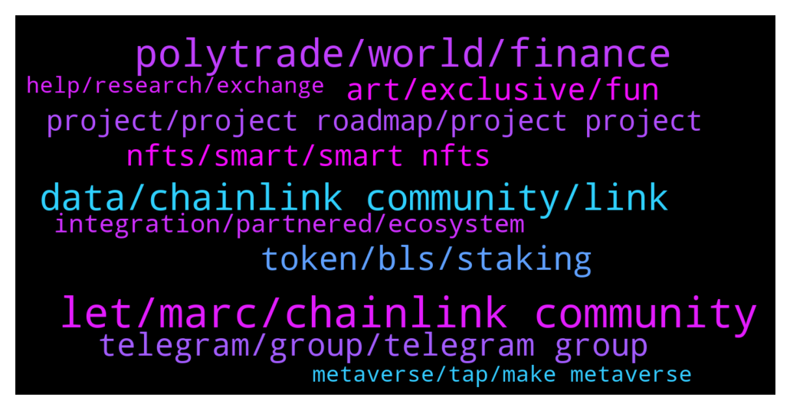

# **@chainlinkofficial**
 ## Analysis for **2021-12-21** - **2021-12-22**.

---

## 📊 **Basic Stats**

**n_messages_sent**: 208

---

---

## 🔝 **Top keywords and related messages**

1. **let, marc, chainlink community**

    @mrken123456789 --- *Any news today? It is nice* **--->** [TG Discussion](https://t.me/chainlinkofficial/356689)

    @marcromeron --- *Let's jump into our first question...* **--->** [TG Discussion](https://t.me/chainlinkofficial/356740)

    @marcromeron --- *Please, just give us a frinedly reminder!* **--->** [TG Discussion](https://t.me/chainlinkofficial/356561)

    @PolivodaTatiana --- *We’re here but it’s Christmas week, so please be aware of somewhat delayed replies)* **--->** [TG Discussion](https://t.me/chainlinkofficial/356441)

    @dejlin --- *Ok. This will be a bit longer answer. Ill touch on many points here. ☺️* **--->** [TG Discussion](https://t.me/chainlinkofficial/356743)

    @unertq --- *Also might want to update his profile here as he's no longer with Novi as per the article: https://chain.link/team* **--->** [TG Discussion](https://t.me/chainlinkofficial/356425)

2. **polytrade, world, finance**

    @piyush_gup1a --- *Polytrade is building a 100% on-chain trade financing and business finance solution specifically focused on the Metaverse.. As we progressed in developing the working capital solution for SMEs, there were 2 observations: 1. The world of trade finance is not entirely ready for decentralization - it will take a lot of time for the full transition to happen. 2. There are opportunities for similar products in the metaverse as well. With a 100% on chain solution.* **--->** [TG Discussion](https://t.me/chainlinkofficial/356539)

    @marcromeron --- *Arul Prakash: To understand Polytrade’s business model, watch the explainer video: https://youtu.be/daBIn6yd7WU Recent developments in the last newsletter edition: https://polytrade.finance/newsletter/oct21-vol-i.pdf Our MVP was unveiled at World Blockchain Summit, Dubai on 13 Oct. Do check out MVP demo: https://youtu.be/sW04yftWej4 $TRADE is currently listed on Kucoin, MEXC, GATE, Bitmart, uniswap, quickswap, pancakeswap.  Visit: https://polytrade.finance/why-buy-trade/ https://polytrade.finance/buy-trade-now/* **--->** [TG Discussion](https://t.me/chainlinkofficial/356530)

    @piyush_gup1a --- *In a 7 trillion USD trade finance industry, the unmet demand in trade finance is to the tune of $1.6 trillion. Polytrade aims to address this huge gap by harnessing the massive liquidity of the crypto world and use it to fund the working capital needs of SMEs in developing economies. We will seek funds from crypto native investors to use our platform to lend us stable coins. These stable coins are then converted to fiat or otherwise, and given to the suppliers, who then become our borrowers.* **--->** [TG Discussion](https://t.me/chainlinkofficial/356505)

    @aruLprak --- *Polytrade obviously is building the nuts and bolts of how commerce and finance would work in the metaverse* **--->** [TG Discussion](https://t.me/chainlinkofficial/356549)

    @piyush_gup1a --- *Polytrade is a crypto lending platform that connects borrowers (SMEs), their buyers, lenders and other stakeholders. In a simple example, a furniture manufacturer in Vietnam, might have a outstanding invoice against, IKEA retailer in USA. IKEA needs to pay money to the manufacturer in future after 45 days. Polytrade’s whole idea is to use liquidity from the crypto markets and fund these invoices. Which means instead of waiting for IKEA to pay after 30-45 days, now the manufacturer will request for money from Polytrade. Polytrade will collect that money from IKEA after 45 days. The discount or variance in these 2 amounts, is the margin that Polytrade will make.* **--->** [TG Discussion](https://t.me/chainlinkofficial/356506)

    @aruLprak --- *Through Polytrade,our investors and lenders will get exposure to insurance backed conventional real world asset i.e. the unpaid invoices, which is protected from the volatility of the crypto markets. These assets are protected under credit insurance.  So ability to invest in a real world asset class instrument via crypto, itself offers immense value.* **--->** [TG Discussion](https://t.me/chainlinkofficial/356515)

3. **data, chainlink community, link**

    @ManuelGGomes --- *Hi. When should we see stacking of LINK?* **--->** [TG Discussion](https://t.me/chainlinkofficial/356583)

    @DoctorMantisToboggan --- *Is there any in depth discussion groups for chainlink?* **--->** [TG Discussion](https://t.me/chainlinkofficial/356701)

    @mouse_stack --- *Is there a more critical piece of infra for 2022 than LINK?* **--->** [TG Discussion](https://t.me/chainlinkofficial/356436)

    @Roman --- *Hi Admin!  My team and I made the first version of blockchain bridge aggregator platform, where all the bridge technologies are collected together.You can find all information about Blockchain Bridges. I don't want to be like spam. I would like to share, maybe this information will be interesting and useful for mates. Is it possible?* **--->** [TG Discussion](https://t.me/chainlinkofficial/356452)

    @mouse_stack --- *Is there a chain link trading channel?* **--->** [TG Discussion](https://t.me/chainlinkofficial/356437)

    @Tybranha --- *New mention of chainlink with ngieu: https://ontochain.ngi.eu/content/desmo-ld* **--->** [TG Discussion](https://t.me/chainlinkofficial/356604)

4. **token, bls, staking**

    @marcromeron --- *The LINK token is used to pay node operators and in the future will be used as collateral by node operators to take on high value jobs   More context on staking here https://t.me/chainlinkofficial/342029* **--->** [TG Discussion](https://t.me/chainlinkofficial/356474)

    @juankaramoy --- *You can check out this twitter thread outlining the plan for the reserved tokens* **--->** [TG Discussion](https://t.me/chainlinkofficial/356445)

    @Sylvarantt --- *Staking is not yet live. This article provides an overview of explicit staking from the Chainlink 2.0 Whitepaper. This presentation by Sergey discusses staking and the difference between implicit and explicit staking.  As a rule the team doesn’t offer timelines for development targets.* **--->** [TG Discussion](https://t.me/chainlinkofficial/356584)

    @marcromeron --- *You've talked about BLS token, could you explain what it is used for?* **--->** [TG Discussion](https://t.me/chainlinkofficial/356762)

    @LogicalLadder --- *Is there any on chain analysis of LINK token distrubutions/whales etc* **--->** [TG Discussion](https://t.me/chainlinkofficial/356442)

    @AndrewB_UK --- *Just a quick question can the chainlink token be used for anything right now? Like what it's tokenomics?* **--->** [TG Discussion](https://t.me/chainlinkofficial/356473)

5. **telegram, group, telegram group**

    @Oneeyedoll --- *Hello, i need help. Is there a way to retrieve key name from a get request?* **--->** [TG Discussion](https://t.me/chainlinkofficial/356633)

    @Joypokkamol --- *China has a telegram group, It’s called @chainlinkfans (unofficial) and please also feel free to check out our Chinese communities (official) here:  https://blog.chain.link/chainlink-chinese-communities/* **--->** [TG Discussion](https://t.me/chainlinkofficial/356839)

    @dejlin --- *Join us on our journey and change how Digital Assets are being created!  Check the links below.  Website: https://1000blocks.space Twitter: https://twitter.com/1000Blocks Telegram: https://t.me/thousandblocks Discord: https://discord.gg/UsKu4Arba9* **--->** [TG Discussion](https://t.me/chainlinkofficial/356800)

    @marcromeron --- *Official website: https://polytrade.finance Twitter : https://twitter.com/Polytrade_fin Polytrade Global Telegram group: https://t.me/Polytrade_Finance Polytrade Global ann channel:  https://t.me/PolytradeFinance_News Discord : https://discord.com/invite/mQesu86zFQ Instagram: https://www.instagram.com/polytrade_finance/ Linkedin: https://www.linkedin.com/company/polytradefin Youtube :https://www.youtube.com/channel/UCAiCA5uBAiTcGd-PYaK1Cmw/featured Medium: https://medium.com/@Polytrade* **--->** [TG Discussion](https://t.me/chainlinkofficial/356564)

    @marcromeron --- *Chainlink – Telegram communities      Korea - @chainlink_korea   SE Asia - @chainlinkSEA   Indonesia - @ChainlinkID   Spain/LatAm - @chainlinkedesp   Turkey - @chainlinkTR   Italian –  @Chainlink_italian   Finnish – @chainlinksuomi   Sweden - @chainlinkSWEDEN   France – @chainlinkFRA   German - @Chainlinkgerman   Dutch - @chainlinkNL   Middle East - @chainlinkME   Vietnam - @chainlinkVIETNAM   Japan - @chainlinkJAPAN Russia - @ChainlinkRussia* **--->** [TG Discussion](https://t.me/chainlinkofficial/356593)

    @Adal --- *Can you please help with German cryto group* **--->** [TG Discussion](https://t.me/chainlinkofficial/356591)

6. **art, exclusive, fun**

    @marcromeron --- *Can you explain more in detail what are those Exclusive Spaces for?* **--->** [TG Discussion](https://t.me/chainlinkofficial/356811)

    @dejlin --- *We see this as a win-win for everybody. The community gets engaged, has fun and art is created in the process, allowing individuals to show off their talents.* **--->** [TG Discussion](https://t.me/chainlinkofficial/356820)

    @dejlin --- *Whole community will be invited to have fun, share their images or follow thematic concept that partner chooses. Not only they get to have fun, but everybody that uses platform will co-create amazing artwork!* **--->** [TG Discussion](https://t.me/chainlinkofficial/356815)

    @dejlin --- *We are first and only project out there that has such concept. By combining gamification, art creation through NFTs, advertisement, yield farming and play-to-earn model, we are leading by example.* **--->** [TG Discussion](https://t.me/chainlinkofficial/356771)

    @dejlin --- *Co-create art and get rewarded 🔥✌️🚀* **--->** [TG Discussion](https://t.me/chainlinkofficial/356760)

    @dejlin --- *We do this by interweaving gamification, art, and rewards yielding via Play-To-Earn interactions and bringing it closer to the general public.* **--->** [TG Discussion](https://t.me/chainlinkofficial/356746)

7. **nfts, smart, smart nfts**

    @dejlin --- *More details here:  https://1000blocks.medium.com/space-apes-by-1000blocks-22nd-december-2021-mint-details-1a7e5385e15  Space Apes smart NFTs “Extremely rare, extremely powerful!”* **--->** [TG Discussion](https://t.me/chainlinkofficial/356810)

    @dejlin --- *Today at 10 pm UTC | 5 pm EST | 2 pm PST, a full collection of ONLY 2100 Space Apes smart NFTs will be minted on Binance Smart Chain.* **--->** [TG Discussion](https://t.me/chainlinkofficial/356806)

    @dejlin --- *Today (in couple of hours!) we will release a full collection of Space Apes smart NFTs which will give owners special powers on the platform.* **--->** [TG Discussion](https://t.me/chainlinkofficial/356790)

    @dejlin --- *But we don’t stop here. We always add extra layers on top, as todays smart NFTs release will show.* **--->** [TG Discussion](https://t.me/chainlinkofficial/356773)

    @dejlin --- *After the complete canvas is filled and preset time is over an NFT is minted. That NFT is auctioned on one of the major auction sites (e.g., OpenSea, NFTrade) and proceeds from the sale go to investors.* **--->** [TG Discussion](https://t.me/chainlinkofficial/356752)

    @dejlin --- *1000Blocks main purpose is to unite crypto communities in the creation of unique NFTs and reward art co-creators.* **--->** [TG Discussion](https://t.me/chainlinkofficial/356744)

8. **project, project roadmap, project project**

    @N3L61N --- *Thank you for giving me the opportunity to express myself.what are the best benefits of the project? can you point out the main strength of the project that other projects do not have? How your team tries to attract users from other projects* **--->** [TG Discussion](https://t.me/chainlinkofficial/356579)

    @marcromeron --- *Thank you very much @dejlin for your precious time!! Amazing project.* **--->** [TG Discussion](https://t.me/chainlinkofficial/356824)

    @marcromeron --- *ANd now, for those who are very interested in your project...* **--->** [TG Discussion](https://t.me/chainlinkofficial/356798)

    @marcromeron --- *It will be very interesting to deep-dive into your great project.* **--->** [TG Discussion](https://t.me/chainlinkofficial/356566)

    @marcromeron --- *@dejlin what’s next on your project’s roadmap?* **--->** [TG Discussion](https://t.me/chainlinkofficial/356788)

    @marcromeron --- *As always, we’re interested on what makes your project special?* **--->** [TG Discussion](https://t.me/chainlinkofficial/356770)

9. **integration, partnered, ecosystem**

    @Crypt0sCryptic --- *they were "partnered with you guys"* **--->** [TG Discussion](https://t.me/chainlinkofficial/356848)

    @Crypt0sCryptic --- *are you guys partnered with megla doge gaming crypto?* **--->** [TG Discussion](https://t.me/chainlinkofficial/356842)

    @Linkederic --- *It sounds like they're using Chainlink VRF, but Chainlink typically calls these integrations and not partnerships, because its more reflective of the nature of the relationship.* **--->** [TG Discussion](https://t.me/chainlinkofficial/356851)

    @Sylvarantt --- *“Partnership” is an overused word in crypto.  Current integrations are announced through Twitter and later listed on Chainlink Ecosystem.  The nature of the integration will be included in the official announcement you can find through the above links.  If an integration has not been announced there are two possibilities: * A project is using Chainlink on it’s own accord since Chainlink is an open source project that anyone can use. * An announcement is forthcoming acknowledging the integration.  Please be aware that an announcement of an integration is not an endorsement of another project and that you should perform due diligence.* **--->** [TG Discussion](https://t.me/chainlinkofficial/356846)

    @juankaramoy --- *From past integrations with blockchain ecosystem, we’ve always seen a rise in DeFi in that specific ecosystem once chainlink is integrated.* **--->** [TG Discussion](https://t.me/chainlinkofficial/356440)

    @Kryptoheini --- *Hello i have a question. There is a new coin called Megladoge and they say they have a partnership with chainlink. Can someone from the Team confirm that ? This is no shill so pls don't kick me.* **--->** [TG Discussion](https://t.me/chainlinkofficial/356471)

10. **metaverse, tap, make metaverse**

    @Tybranha --- *mentioned alongside iexec and Origintrail: https://ontochain.ngi.eu/content/dkg* **--->** [TG Discussion](https://t.me/chainlinkofficial/356605)

    @dejlin --- *In the not-so-distant future, you can expect CEX listing, new major partnership announcements and integrating Spaces into metaverse.* **--->** [TG Discussion](https://t.me/chainlinkofficial/356791)

    @piyush_gup1a --- *We will keep expanding our Partnerships network to tap into newer communities. We are working on more staking programs and also geography focussed exchange listings to penetrate and access newer markets. We are going to be listed on an Indian exchange sooner to tap into the Indian market.  Very soon we will be launching our integrated roadmap which is renewed with our Metaverse product as well.* **--->** [TG Discussion](https://t.me/chainlinkofficial/356557)

    @aruLprak --- *Its the same way, VR is here, commerce is here, Web 3.0 elements are here… they will all merge over the next 5-8 years to make a metaverse for sure* **--->** [TG Discussion](https://t.me/chainlinkofficial/356548)

    @aruLprak --- *Our guesstimate is that it is already here…  people have started to use it and we are starting to see bits and pieces of what would make metaverse whole.* **--->** [TG Discussion](https://t.me/chainlinkofficial/356545)

    @marcromeron --- *When do you think Metaverse will be adopted massively?* **--->** [TG Discussion](https://t.me/chainlinkofficial/356544)

